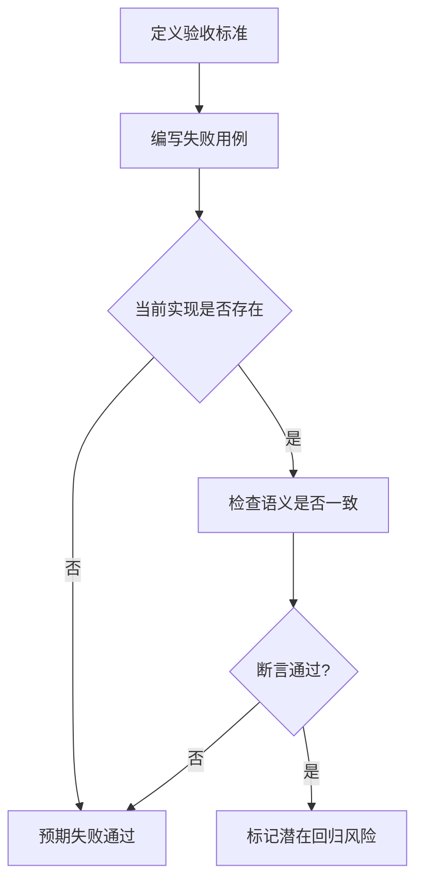
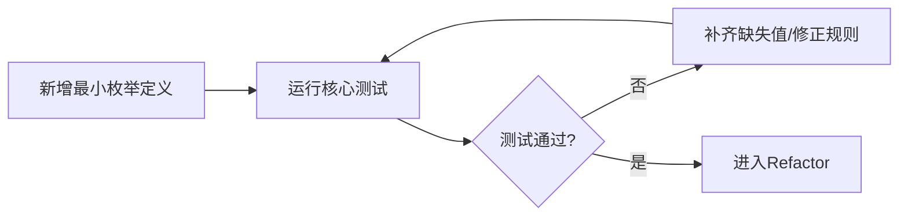
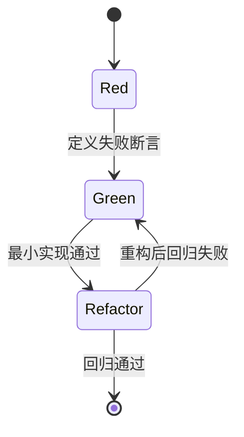
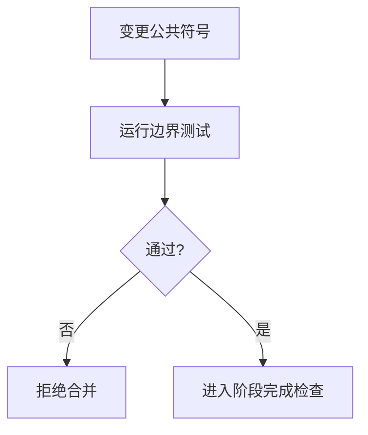

# Common库 TDD实施计划 - Phase 1: 领域枚举与错误码

## 概述

本阶段建立 Common 的语义底座，确保任务状态、任务类型、精度模式与错误码在全平台唯一且一致。Phase 1 是后续 Schema 校验、路径索引、DTO 契约的前置基础。

**阶段目标**:
- 统一领域枚举 - 保证跨层语义一致
- 标准化错误码 - 覆盖训练/评估/LLM/导出关键失败路径
- 固化测试门禁 - 为后续 Phase 提供可复用断言基线

**前置依赖**:
- `docs/TODO/1.Common库/1.TODO_PHASE1.md`
- `docs/init/2.系统架构.md`（状态机）
- `docs/init/5.附录.md`（错误码建议）

## Phase 1 包含的步骤

| 步骤 | 名称 | 状态 | 测试 | 完成日期 |
|------|------|------|------|----------|
| Step 1 | 状态与任务语义枚举 | ✅ | 4/4 | 2026-03-05 |
| Step 2 | 错误码体系与映射 | ✅ | 1/1 | 2026-03-05 |
| Step 3 | 导出边界与回归门禁 | ✅ | 1/1 | 2026-03-05 |

**步骤列表**:
- **Step 1**: 状态与任务语义枚举
- **Step 2**: 错误码体系与映射
- **Step 3**: 导出边界与回归门禁

---

## Step 1: 状态与任务语义枚举 (DomainEnumBaseline) ✅

**目标**: 建立 `JobStatus`、`TaskType`、`PrecisionMode` 的可验证语义集合，避免多处重复定义。

**上下文依赖**:
- 读取 `docs/init/2.系统架构.md` 了解状态机
- 读取 `docs/init/3.模块设计文档.md` 了解 JobSpec 语义

**交付物**:
- ✅ `src/common/domain_types.py` - 枚举定义
- ✅ `tests/common/test_enums_and_error_codes.py` - 枚举行为测试

**验收标准**:
- [x] 状态枚举覆盖 CREATED/QUEUED/RUNNING/SUCCEEDED/FAILED/CANCELED/EVALUATING/EVAL_SUCCEEDED/EVAL_FAILED/EVIDENCE_READY/LLM_ANALYZING/LLM_DONE/LLM_FAILED
- [x] 任务类型与精度模式字段具备可序列化稳定值
- [x] 非法值输入能被一致拒绝

### Red Phase - 失败的测试定义

**测试文件**: `tests/common/test_enums_and_error_codes.py`

**核心测试用例**:
- ❌ `test_job_status_unique_values`
- ❌ `test_task_type_coverage`
- ❌ `test_precision_mode_supported_set`
- ❌ `test_invalid_enum_value_rejected`

**流程图（测试先行）**:

### Green Phase - 实现最小化功能

**实现要点**:
- 枚举值去重与命名统一
- 对外暴露稳定导出接口
- 保证序列化值可审计、可追踪

**流程图（最小实现）**:

### Refactor Phase - 优化和扩展

**重构目标**:
1. 统一命名风格与导出边界
2. 补齐文档注释与类型约束
3. 提炼可复用断言辅助逻辑

**验收标准**:
- [x] 枚举命名无歧义、无重复
- [x] 测试断言语义清晰且可复用

---

## Step 2: 错误码体系与映射 (ErrorCodeBaseline) ✅

**目标**: 建立错误码主集合与语义映射，覆盖附录推荐失败原因。

**上下文依赖**:
- 读取 `docs/init/5.附录.md` 了解错误码分类
- 依赖 Step 1 的基础枚举

**交付物**:
- ✅ `src/common/domain_types.py` - `ErrorCode` 定义
- ✅ `tests/common/test_enums_and_error_codes.py` - 错误码测试

**验收标准**:
- [x] 至少覆盖 TRAIN_OOM/TRAIN_NAN/DATA_INVALID/EVAL_FAILED/LLM_FAILED/EXPORT_FAILED
- [x] 错误码值稳定且唯一
- [x] 预留新增错误码向后兼容策略

### Red / Green / Refactor 流程图

**关键验证点**:
- 功能正确性：错误码覆盖率
- 可靠性：未知错误输入的统一处理
- 可扩展性：新增错误码不破坏历史值

---

## Step 3: 导出边界与回归门禁 (PublicBoundaryGate) ✅

**目标**: 统一 `__all__` 与导入边界，建立 Phase 级回归门禁。

**交付物**:
- ✅ `src/common/domain_types.py` - 导出边界
- ✅ `tests/common/test_enums_and_error_codes.py` - 导入可见性测试

**验收标准**:
- [x] 星号导入仅暴露约定符号
- [x] 破坏性导出变更会触发测试失败

**流程图（门禁）**:

---

## Phase 1 完成总结

### 完成状态

| 步骤 | 名称 | 状态 | 测试 | 完成日期 |
|------|------|------|------|----------|
| Step 1 | 状态与任务语义枚举 | ✅ | 4/4 | 2026-03-05 |
| Step 2 | 错误码体系与映射 | ✅ | 1/1 | 2026-03-05 |
| Step 3 | 导出边界与回归门禁 | ✅ | 1/1 | 2026-03-05 |

### 实现检查清单
- [x] Red：失败用例已先行且覆盖全部验收项
- [x] Green：最小实现通过所有核心用例
- [x] Refactor：无行为变化且通过全量回归

### 质量标准
- [x] 阶段覆盖率 > 90%
- [x] 公共符号有文档注释
- [x] 无重复定义与命名冲突
