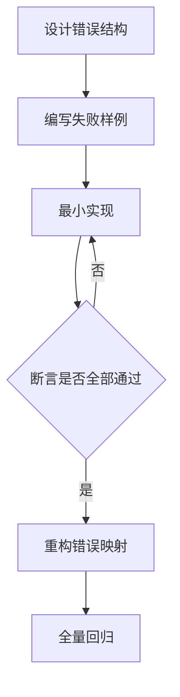
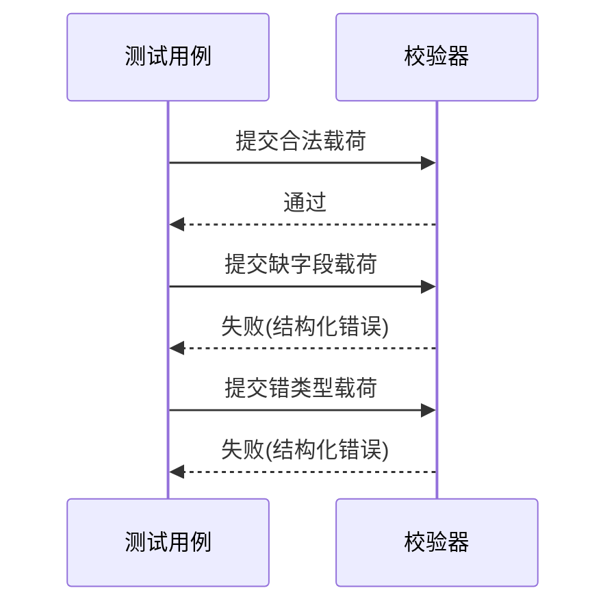
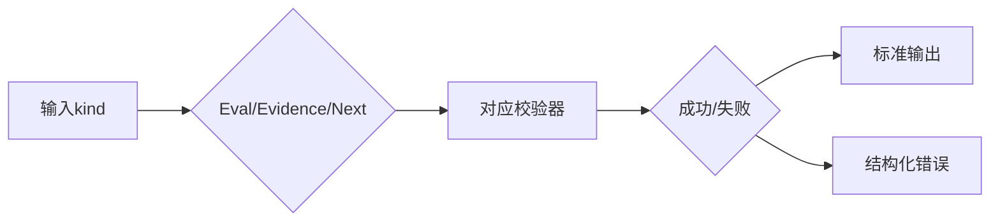

# Common库 TDD实施计划 - Phase 2: 核心 JSON Schema 校验器

## 概述

本阶段建立 `EvalReport`、`EvidencePack`、`NextExperiments` 的统一校验入口与统一错误结构，确保数据契约可审计、可执行、可回放。

**阶段目标**:
- 建立统一校验错误结构
- 覆盖三类核心对象的关键字段校验
- 建立统一分发入口与回归测试矩阵

**前置依赖**:
- `docs/TODO/1.Common库/2.TODO_PHASE2.md`
- `docs/TDD/1.Common库/TDD_PLAN_PHASE1.md`
- `docs/init/5.附录.md`

## Phase 2 包含的步骤

| 步骤 | 名称 | 状态 | 测试 | 完成日期 |
|------|------|------|------|----------|
| Step 1 | 统一错误结构与规则 | ⏳ | -/- | - |
| Step 2 | 三类对象独立校验入口 | ⏳ | -/- | - |
| Step 3 | 统一分发与回归矩阵 | ⏳ | -/- | - |

---

## Step 1: 统一错误结构与规则 (ValidationErrorContract) ⏳

**目标**: 定义稳定错误格式，保证 API 层可直接消费。

**上下文依赖**:
- 读取 `docs/init/5.附录.md` 了解 EVAL_FAILED 语义
- 依赖 Phase 1 错误码基线

**交付物**:
- ⏳ `src/common/schema_validators.py`
- ⏳ `tests/common/test_schema_validators.py`

**验收标准**:
- [ ] 缺字段/类型错误/非法枚举值返回统一结构
- [ ] 错误结构包含路径、错误类型、可读消息

### Red/Green/Refactor 流程图

---

## Step 2: 三类对象独立校验入口 (ValidatorTriplet) ⏳

**目标**: 分别实现 `validate_eval_report`、`validate_evidence_pack`、`validate_next_experiments`。

**交付物**:
- ⏳ `src/common/schema_validators.py`
- ⏳ `tests/common/test_schema_validators.py`

**验收标准**:
- [ ] EvalReport：`overall.business_kpi`、`kpi_components`、`by_scene` 等关键字段校验完整
- [ ] EvidencePack：KPI 配置与索引路径字段校验完整
- [ ] NextExperiments：`name/changes/expected/evidence_refs` 最小闭包校验完整

**测试流（对象级）**:

**关键验证点**:
- 功能正确性：字段完整性与类型约束
- 审计性：错误路径可定位
- 稳定性：同类错误返回同构输出

---

## Step 3: 统一分发与回归矩阵 (DispatchAndRegression) ⏳

**目标**: 提供 `validate_payload(kind, data)` 统一入口，并建立场景矩阵回归。

**交付物**:
- ⏳ `src/common/schema_validators.py`
- ⏳ `tests/common/test_schema_validators.py`

**验收标准**:
- [ ] `kind` 分发准确
- [ ] 错误码映射稳定
- [ ] 对大对象输入具备明确失败策略

**回归矩阵图**:

---

## Phase 2 完成总结

### 完成状态

| 步骤 | 名称 | 状态 | 测试 | 完成日期 |
|------|------|------|------|----------|
| Step 1 | 统一错误结构与规则 | ⏳ | 0/0 | - |
| Step 2 | 三类对象独立校验入口 | ⏳ | 0/0 | - |
| Step 3 | 统一分发与回归矩阵 | ⏳ | 0/0 | - |

### 实现检查清单
- [ ] Red：每个必填字段至少有 1 个失败样例
- [ ] Green：三类对象正向样例全部通过
- [ ] Refactor：分发逻辑简化且不改变外部行为

### 质量标准
- [ ] 阶段覆盖率 > 90%
- [ ] 错误结构稳定并可透传
- [ ] 回归矩阵覆盖关键边界场景
