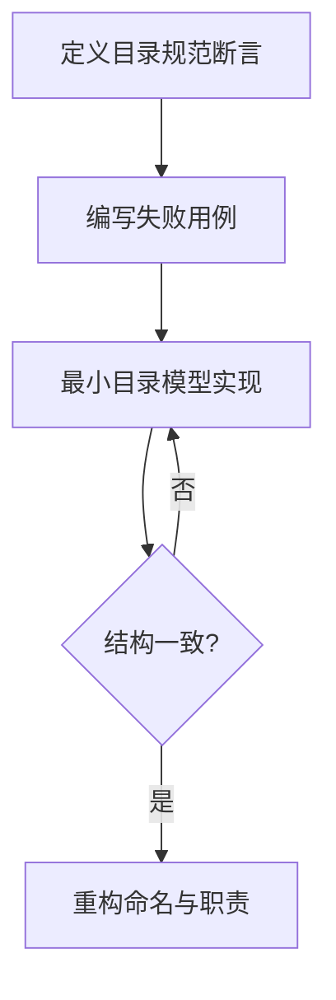
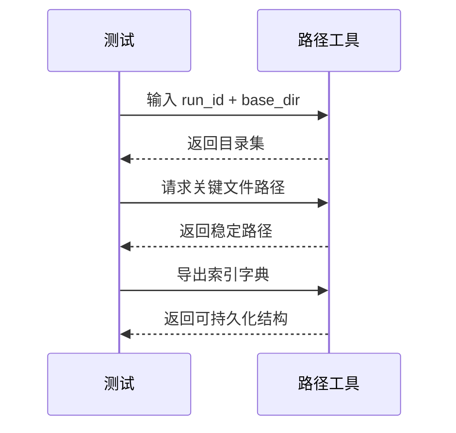
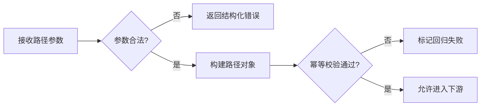

# Common库 TDD实施计划 - Phase 3: 路径规范与产物索引工具

## 概述

本阶段建立统一 `run_dir` 路径规范与产物索引输出，保证训练、评估、证据、LLM、导出路径在跨服务链路中一致、可定位、可审计。

**阶段目标**:
- 固化核心目录结构（weights/eval/evidence/llm/export）
- 建立关键产物路径 getter 与索引导出格式
- 建立路径安全校验与幂等回归门禁

**前置依赖**:
- `docs/TODO/1.Common库/3.TODO_PHASE3.md`
- `docs/init/2.系统架构.md`
- `docs/init/3.模块设计文档.md`

## Phase 3 包含的步骤

| 步骤 | 名称 | 状态 | 测试 | 完成日期 |
|------|------|------|------|----------|
| Step 1 | run_dir 目录规范建模 | ⏳ | -/- | - |
| Step 2 | 关键产物路径与索引导出 | ⏳ | -/- | - |
| Step 3 | 路径安全校验与幂等回归 | ⏳ | -/- | - |

---

## Step 1: run_dir 目录规范建模 (RunDirModeling) ⏳

**目标**: 建立目录常量与路径对象，确保目录语义单一且可复用。

**上下文依赖**:
- 读取 `docs/init/2.系统架构.md` 了解产物流
- 读取 `docs/TODO/1.Common库/3.TODO_PHASE3.md` 对齐验收口径

**交付物**:
- ⏳ `src/common/artifact_paths.py`
- ⏳ `tests/common/test_artifact_paths.py`

**验收标准**:
- [ ] 五类核心目录命名稳定
- [ ] 同一 `run_id` 生成路径结果一致

### Red/Green/Refactor 流程图

---

## Step 2: 关键产物路径与索引导出 (ArtifactIndexing) ⏳

**目标**: 提供关键文件路径 getter 与统一索引导出结构，支持 API/DB 直接消费。

**交付物**:
- ⏳ `src/common/artifact_paths.py`
- ⏳ `tests/common/test_artifact_paths.py`

**验收标准**:
- [ ] `eval_report.json`、`evidence_pack.json`、`analysis_report.md` 等关键路径可稳定获取
- [ ] 索引结构字段命名一致、可序列化

**测试流（索引导出）**:

**关键验证点**:
- 功能正确性：目录归属与文件后缀
- 一致性：多次调用结果不漂移
- 兼容性：索引字段适配下游存储接口

---

## Step 3: 路径安全校验与幂等回归 (PathSafetyGate) ⏳

**目标**: 拦截非法路径输入，建立路径层安全门禁。

**交付物**:
- ⏳ `src/common/artifact_paths.py`
- ⏳ `tests/common/test_artifact_paths.py`

**验收标准**:
- [ ] 空 `run_id`、路径穿越（`../`）与非法字符输入被拒绝
- [ ] 幂等测试可稳定通过

**决策流图（安全门禁）**:

---

## Phase 3 完成总结

### 完成状态

| 步骤 | 名称 | 状态 | 测试 | 完成日期 |
|------|------|------|------|----------|
| Step 1 | run_dir 目录规范建模 | ⏳ | 0/0 | - |
| Step 2 | 关键产物路径与索引导出 | ⏳ | 0/0 | - |
| Step 3 | 路径安全校验与幂等回归 | ⏳ | 0/0 | - |

### 实现检查清单
- [ ] Red：目录、路径、安全三类失败用例齐备
- [ ] Green：核心路径生成与索引导出全部通过
- [ ] Refactor：消除硬编码与重复拼装逻辑

### 质量标准
- [ ] 阶段覆盖率 > 90%
- [ ] 路径输入安全拦截完整
- [ ] 索引结构稳定可回放
