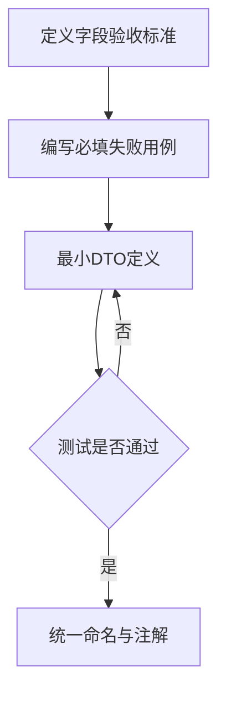
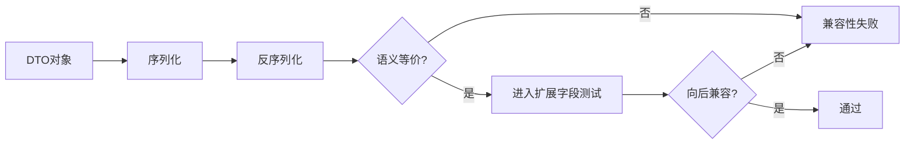
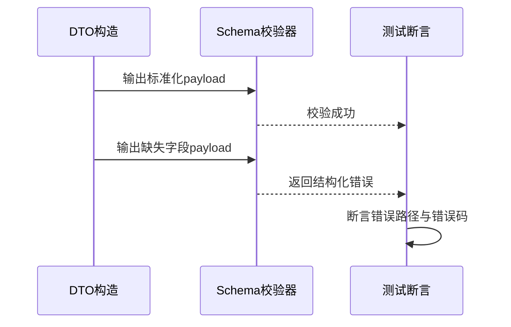

# Common库 TDD实施计划 - Phase 4: 跨服务 DTO 与契约对象

## 概述

本阶段沉淀 `JobSpec`、`ProjectKpiConfig`、`EvalSummary`、`ExportSpec` 等共享 DTO，构建 Core API、Runner、Eval、Agent 间稳定的数据契约层。

**阶段目标**:
- 完成核心 DTO 契约定义与字段一致性约束
- 建立序列化稳定性与兼容性测试基线
- 建立 DTO 与校验器（Phase 2）组合验证路径

**前置依赖**:
- `docs/TODO/1.Common库/4.TODO_PHASE4.md`
- `docs/TDD/1.Common库/TDD_PLAN_PHASE2.md`
- `docs/init/3.模块设计文档.md`
- `docs/init/5.附录.md`

## Phase 4 包含的步骤

| 步骤 | 名称 | 状态 | 测试 | 完成日期 |
|------|------|------|------|----------|
| Step 1 | 核心 DTO 字段契约定义 | ⏳ | -/- | - |
| Step 2 | 序列化稳定性与兼容策略 | ⏳ | -/- | - |
| Step 3 | DTO 与校验器组合回归 | ⏳ | -/- | - |

---

## Step 1: 核心 DTO 字段契约定义 (DtoContractCore) ⏳

**目标**: 定义 `JobSpec`、`ProjectKpiConfig`、`EvalSummary`、`ExportSpec` 最小必填字段与类型约束。

**上下文依赖**:
- 读取 `docs/init/3.模块设计文档.md` 对齐 JobSpec 字段
- 读取 `docs/init/5.附录.md` 对齐 KPI 配置

**交付物**:
- ⏳ `src/common/contracts.py`
- ⏳ `tests/common/test_contract_dtos.py`

**验收标准**:
- [ ] DTO 字段覆盖 TODO 约定核心语义
- [ ] 字段命名统一且无歧义
- [ ] 必填字段缺失时可稳定失败

### Red/Green/Refactor 流程图

---

## Step 2: 序列化稳定性与兼容策略 (SerializationCompatibility) ⏳

**目标**: 确保 DTO 在序列化/反序列化流程中稳定，支持向后兼容扩展。

**交付物**:
- ⏳ `src/common/contracts.py`
- ⏳ `tests/common/test_contract_dtos.py`

**验收标准**:
- [ ] 序列化后字段顺序与名称稳定（可比较）
- [ ] 新增可选字段不破坏历史读取
- [ ] 非法值输入可被识别并拒绝

**流程图（兼容性验证）**:

---

## Step 3: DTO 与校验器组合回归 (DtoValidatorIntegration) ⏳

**目标**: 验证 DTO 输出与 Phase 2 校验器输入边界一致，避免接口层重复修补。

**交付物**:
- ⏳ `tests/common/test_contract_dtos.py`
- ⏳ `tests/common/test_schema_validators.py`（组合场景补充）

**验收标准**:
- [ ] DTO 产出可直接进入 `validate_payload` 流程
- [ ] 组合场景错误可定位到 DTO 字段路径
- [ ] 回归测试覆盖 create_training_job / validate_proposals 关键参数边界

**组合测试时序图**:

---

## Phase 4 完成总结

### 完成状态

| 步骤 | 名称 | 状态 | 测试 | 完成日期 |
|------|------|------|------|----------|
| Step 1 | 核心 DTO 字段契约定义 | ⏳ | 0/0 | - |
| Step 2 | 序列化稳定性与兼容策略 | ⏳ | 0/0 | - |
| Step 3 | DTO 与校验器组合回归 | ⏳ | 0/0 | - |

### 实现检查清单
- [ ] Red：必填缺失、类型错误、边界值失败用例完备
- [ ] Green：核心 DTO 路径全部通过
- [ ] Refactor：字段命名统一且兼容策略明确

### 质量标准
- [ ] 阶段覆盖率 > 90%
- [ ] DTO 序列化行为稳定可追踪
- [ ] 组合回归可直接支撑接口层调用
