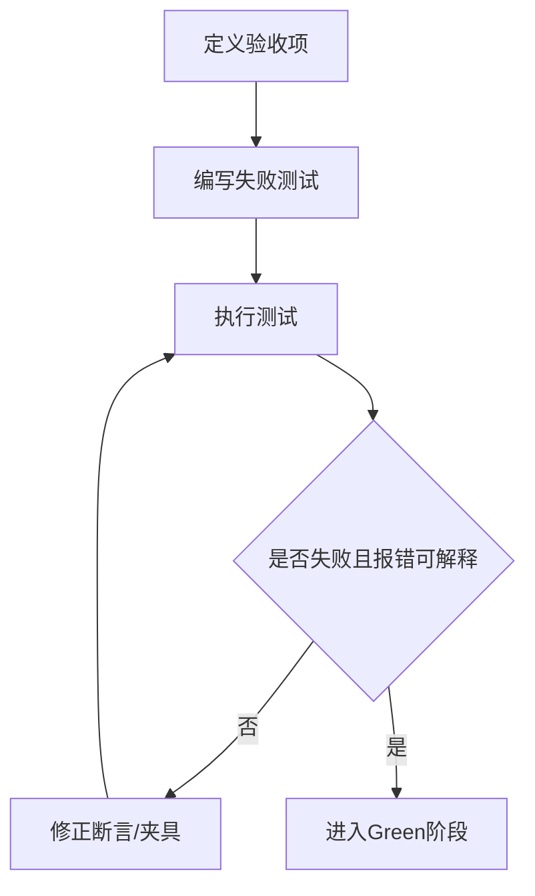
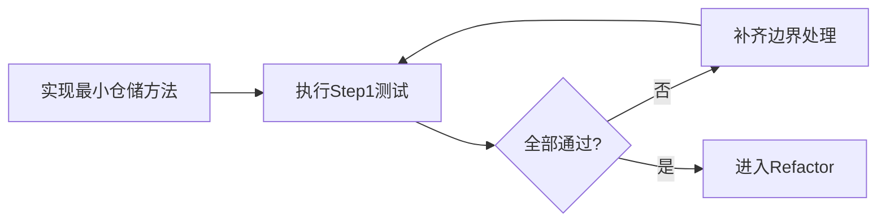
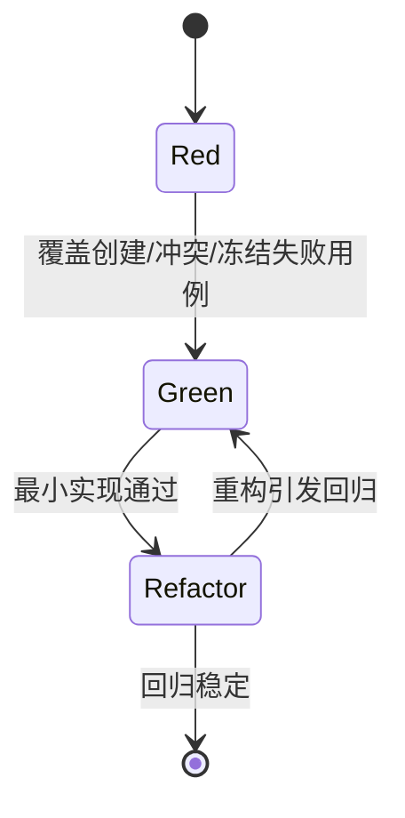
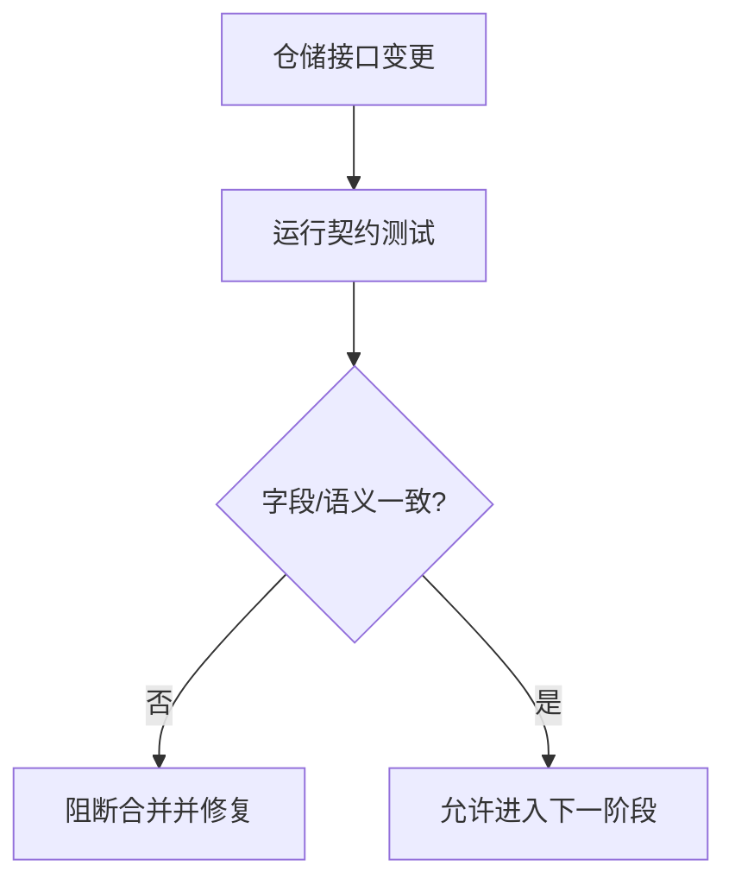

# 数据层 TDD实施计划 - Phase 1: 项目/KPI 与数据集版本仓储

## 概述

本阶段建立数据层元数据基线测试体系，覆盖 `Project`、`ProjectKpiConfig`、`Dataset`、`DatasetVersion` 四类核心实体，确保版本冻结与版本化读取在仓储层可验证、可追溯。该阶段是任务创建、评估与审计链路的前置质量门。

**阶段目标**:
- 仓储契约稳定化 - 固化统一返回模型与错误语义
- 版本约束可验证 - 冻结后不可破坏更新
- 追溯能力可回归 - KPI 配置与数据版本均可按版本查询

**前置依赖**:
- `docs/TODO/2.数据层/1.TODO_PHASE1.md`
- `docs/TODO/1.Common库/1.TODO_PHASE1.md`
- `docs/init/1.产品PRD.md`、`docs/init/3.模块设计文档.md`、`docs/init/5.附录.md`

## Phase 1 包含的步骤

| 步骤 | 名称 | 状态 | 测试 | 完成日期 |
|------|------|------|------|----------|
| Step 1 | Project 与 KPI 版本读写测试基线 | ⏳ | -/- | - |
| Step 2 | DatasetVersion 冻结与冲突测试基线 | ⏳ | -/- | - |
| Step 3 | 统一返回模型与回归门禁 | ⏳ | -/- | - |

**步骤列表**:
- **Step 1**: Project 与 KPI 版本读写测试基线
- **Step 2**: DatasetVersion 冻结与冲突测试基线
- **Step 3**: 统一返回模型与回归门禁

---

## Step 1: Project 与 KPI 版本读写测试基线 (ProjectKpiRepoBaseline) ⏳

**目标**: 建立项目与 KPI 配置仓储的 Red 测试集合，覆盖 CRUD、版本化读取、默认版本回退。

**上下文依赖**:
- 读取 `docs/TODO/2.数据层/1.TODO_PHASE1.md` 对齐阶段目标
- 读取 `docs/init/5.附录.md` 对齐 KPI 配置结构

**交付物**:
- ⏳ `tests/repositories/test_project_repository.py` - 项目/KPI 测试套件
- ⏳ `src/repositories/project_repository.py` - 最小可通过实现

**验收标准**:
- [ ] 项目创建、更新、查询全链路可测
- [ ] KPI 配置支持同项目多版本读取
- [ ] 不存在项目返回统一错误语义

### Red Phase - 失败的测试定义

**测试文件**: `tests/repositories/test_project_repository.py`

**核心测试用例**:
- ❌ `test_project_create_and_get_success`
- ❌ `test_project_update_keeps_identity`
- ❌ `test_kpi_config_multi_version_read`
- ❌ `test_kpi_config_default_version_fallback`
- ❌ `test_project_not_found_error_semantics`

**流程图（Red 先行）**:

### Green Phase - 实现最小化功能

**主要API/功能**:

| 功能 | 类型 | 功能描述 | 验收标准 |
|------|------|----------|----------|
| create_project | repository method | 创建项目元数据 | 创建后可按 ID 查询 |
| update_project | repository method | 更新项目信息 | 非关键标识可更新 |
| save_kpi_config | repository method | 写入 KPI 配置版本 | 同项目多版本并存 |
| get_kpi_config | repository method | 读取指定/默认版本 | 回退策略一致 |

**流程图（Green 最小实现）**:

### Refactor Phase - 优化和扩展

**重构目标**:
1. 抽取版本选择策略，减少重复分支
2. 统一错误映射（不存在/参数非法/版本冲突）
3. 强化类型注解与测试夹具复用

**验收标准**:
- [ ] Step 1 测试保持全绿
- [ ] 关键分支具备明确错误语义

---

## Step 2: DatasetVersion 冻结与冲突测试基线 (DatasetVersionFreezeGuard) ⏳

**目标**: 建立数据集版本创建、重复冲突、冻结后只读约束的可回归测试体系。

**上下文依赖**:
- 需要 Step 1 的统一错误语义
- 读取 `docs/init/1.产品PRD.md` 对齐可复现要求

**交付物**:
- ⏳ `tests/repositories/test_dataset_repository.py` - 数据集版本测试
- ⏳ `src/repositories/dataset_repository.py` - 最小可通过实现

**验收标准**:
- [ ] 数据集与版本创建路径可测
- [ ] 重复版本号冲突可稳定触发
- [ ] 冻结后关键字段更新被阻断

### Red / Green / Refactor 流程图

**关键验证点**:
- 版本不可变性：冻结后破坏更新拒绝
- 一致性：冻结状态读写一致
- 可追溯性：通过 `dataset_version_id` 唯一定位

---

## Step 3: 统一返回模型与回归门禁 (RepositoryContractGate) ⏳

**目标**: 建立仓储返回模型一致性门禁，防止结构漂移影响业务层/接口层。

**交付物**:
- ⏳ `tests/repositories/test_project_repository.py` - 返回模型一致性断言
- ⏳ `tests/repositories/test_dataset_repository.py` - 结构字段回归断言

**验收标准**:
- [ ] 查询返回字段集合稳定
- [ ] 结构变化可触发测试预警
- [ ] 序列化输出满足上层消费约定

**流程图（契约门禁）**:

---

## Phase 1 完成总结

### 完成状态

| 步骤 | 名称 | 状态 | 测试 | 完成日期 |
|------|------|------|------|----------|
| Step 1 | Project 与 KPI 版本读写测试基线 | ⏳ | 0/0 | - |
| Step 2 | DatasetVersion 冻结与冲突测试基线 | ⏳ | 0/0 | - |
| Step 3 | 统一返回模型与回归门禁 | ⏳ | 0/0 | - |

### 实现检查清单
- [ ] Red：失败测试先行并覆盖验收项
- [ ] Green：最小实现通过核心路径
- [ ] Refactor：无行为变化且回归全绿

### 质量标准
- [ ] Phase 1 覆盖率目标：仓储层相关测试 ≥ 85%
- [ ] 冻结约束与版本读取规则可复测
- [ ] 关键错误语义与 Common 错误码对齐
