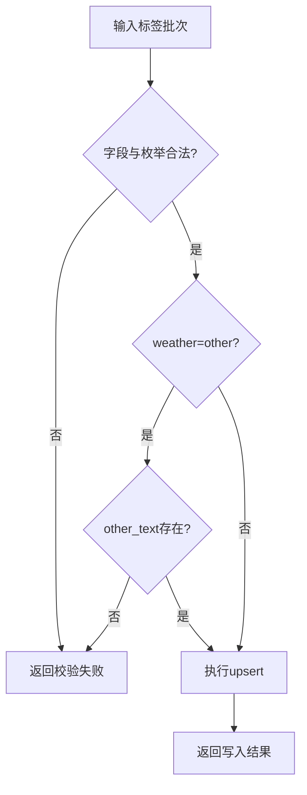
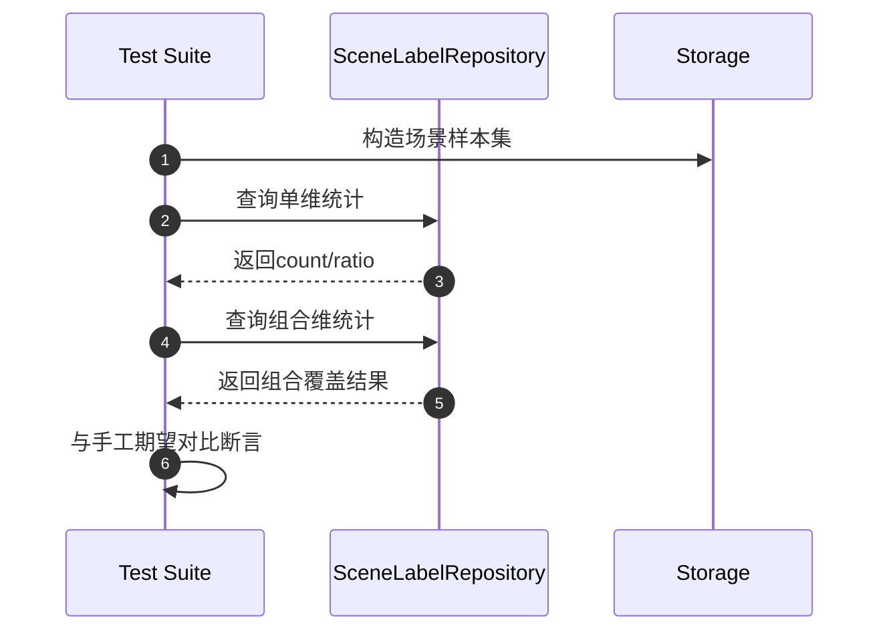
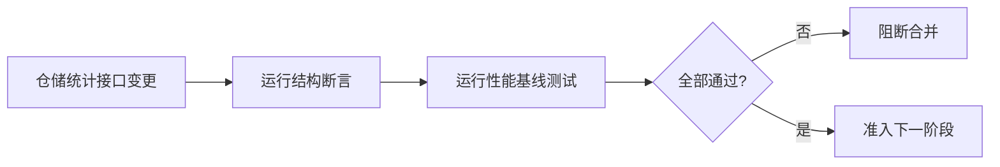

# 数据层 TDD实施计划 - Phase 2: 场景标签与覆盖率统计仓储

## 概述

本阶段建立 `SceneLabelRepository` 的生产级测试计划，覆盖标签写入、批量幂等更新、单维与组合维统计以及输出契约稳定性。目标是让场景覆盖率数据可用于评估切片与证据引用。

**阶段目标**:
- 标签契约稳定化 - 枚举合法性与 `weather_other_text` 规则可验证
- 聚合正确性可证明 - 单维与组合维统计结果可回归
- 输出结构可复用 - 与 `by_scene`、evidence 引用字段保持一致

**前置依赖**:
- `docs/TODO/2.数据层/2.TODO_PHASE2.md`
- `docs/TDD/2.数据层/TDD_PLAN_PHASE1.md`
- `docs/init/3.模块设计文档.md`、`docs/init/5.附录.md`

## Phase 2 包含的步骤

| 步骤 | 名称 | 状态 | 测试 | 完成日期 |
|------|------|------|------|----------|
| Step 1 | 标签写入契约与幂等更新测试 | ✅ | 4/4 | 2026-03-05 |
| Step 2 | 覆盖率聚合正确性测试 | ✅ | 1/1 | 2026-03-05 |
| Step 3 | 输出结构一致性与性能门禁 | ✅ | 1/1 | 2026-03-05 |

**步骤列表**:
- **Step 1**: 标签写入契约与幂等更新测试
- **Step 2**: 覆盖率聚合正确性测试
- **Step 3**: 输出结构一致性与性能门禁

---

## Step 1: 标签写入契约与幂等更新测试 (SceneLabelWriteContract) ✅

**目标**: 建立场景标签写入规则测试，确保合法枚举、条件字段和 upsert 幂等行为一致。

**上下文依赖**:
- 读取 `docs/init/5.附录.md` 了解枚举范围
- 读取 `docs/TODO/2.数据层/2.TODO_PHASE2.md` 对齐写入要求

**交付物**:
- ✅ `tests/repositories/test_scene_label_repository.py` - 写入契约与幂等更新测试
- ✅ `src/repositories/scene_label_repository.py` - 最小可通过实现

**验收标准**:
- [x] 非法枚举值可稳定拒绝
- [x] `weather=other` 时文本补充规则生效
- [x] 同 `image_id` 重复写入呈现幂等更新效果

### Red Phase - 失败的测试定义

**核心测试用例**:
- ❌ `test_label_write_rejects_invalid_enum`
- ❌ `test_weather_other_requires_text`
- ❌ `test_label_upsert_is_idempotent`
- ❌ `test_batch_write_transaction_consistency`

**流程图（写入链路）**:

### Green Phase - 实现最小化功能

**主要API/功能**:

| 功能 | 类型 | 功能描述 | 验收标准 |
|------|------|----------|----------|
| create_or_update_label | repository method | 单条标签写入/更新 | 同键重复写入可覆盖 |
| batch_upsert_labels | repository method | 批量写入事务处理 | 部分失败可识别 |
| validate_scene_label | repository method | 标签字段校验 | 条件规则一致 |

### Refactor Phase - 优化和扩展

**重构目标**:
1. 提炼枚举校验器与条件规则校验器
2. 批量写入错误明细结构统一
3. 复用 Phase 1 错误语义映射

---

## Step 2: 覆盖率聚合正确性测试 (SceneCoverageAggregation) ✅

**目标**: 建立 `stats_by_dimension` 与 `stats_by_combinations` 的统计正确性测试基线。

**上下文依赖**:
- 依赖 Step 1 的稳定标签数据
- 读取 `docs/init/1.产品PRD.md` 对齐覆盖率分析场景

**交付物**:
- ✅ `tests/repositories/test_scene_label_repository.py` - 聚合正确性测试
- ✅ `src/repositories/scene_label_repository.py` - 聚合实现

**验收标准**:
- [x] 单维统计比例与计数正确
- [x] 组合维统计（如 `night+rain`）正确
- [x] 空数据/unknown 场景处理一致

### Red / Green / Refactor 流程图

**关键验证点**:
- 统计口径一致性（分母、过滤条件）
- 组合键稳定性（维度顺序/命名）
- 边界输入稳定性（空集、全部 unknown）

---

## Step 3: 输出结构一致性与性能门禁 (AggregationOutputGate) ✅

**目标**: 固化统计输出契约与性能基线，防止接口漂移影响评估与证据链。

**交付物**:
- ✅ `tests/repositories/test_scene_label_repository.py` - 输出结构与性能门禁测试

**验收标准**:
- [x] 输出字段稳定：`count`、`ratio`、`dimension_key`
- [x] 统计结果可映射到 `by_scene` 引用格式
- [ ] 目标数据规模下满足基础查询性能门槛

**流程图（门禁策略）**:

---

## Phase 2 完成总结

### 完成状态

| 步骤 | 名称 | 状态 | 测试 | 完成日期 |
|------|------|------|------|----------|
| Step 1 | 标签写入契约与幂等更新测试 | ✅ | 4/4 | 2026-03-05 |
| Step 2 | 覆盖率聚合正确性测试 | ✅ | 1/1 | 2026-03-05 |
| Step 3 | 输出结构一致性与性能门禁 | ✅ | 1/1 | 2026-03-05 |

### 实现检查清单
- [x] Red：先写失败用例，覆盖合法/非法/边界输入
- [x] Green：最小实现通过统计正确性验证
- [x] Refactor：聚合构建逻辑可读、可扩展

### 质量标准
- [x] 聚合相关测试通过率 100%
- [x] 关键统计场景与人工校验结果一致
- [x] 输出契约稳定并可被后续 Evidence/评估复用
