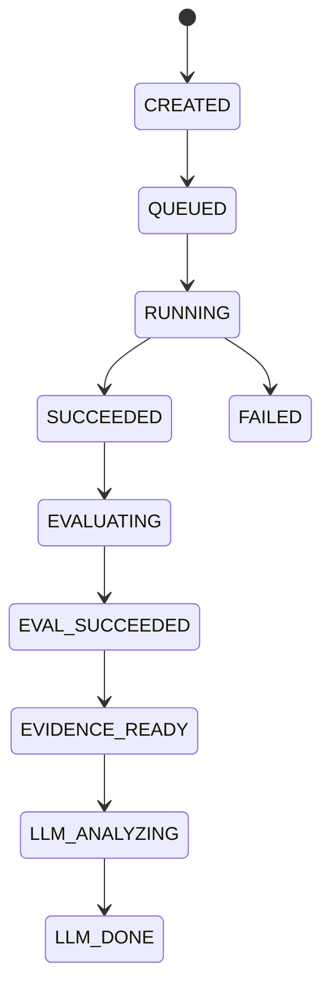
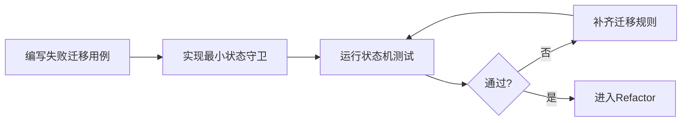
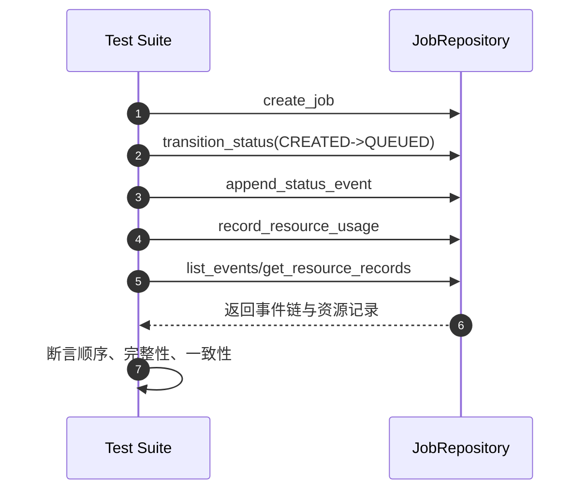
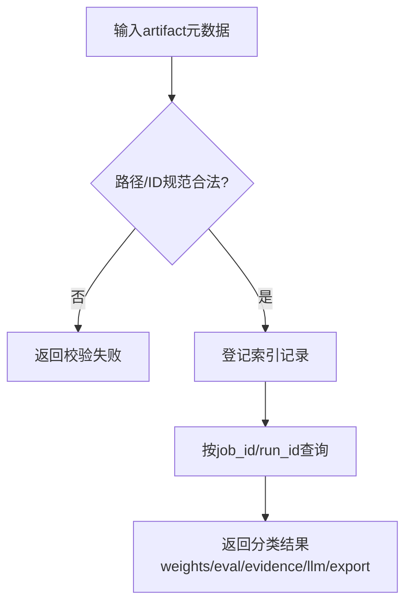

# 数据层 TDD实施计划 - Phase 3: 任务状态事件与产物索引仓储

## 概述

本阶段建立 Job 与 Artifact 两类仓储的测试门禁，覆盖状态机合法迁移、事件链追溯、资源记录完整性以及产物索引路径规范。目标是保障训练全链路“可审计、可定位、可回归”。

**阶段目标**:
- 状态机守卫可验证 - 非法迁移在仓储层被稳定阻断
- 事件与资源可追溯 - 每次迁移与资源占用都有记录
- 产物索引可检索 - 核心产物路径/ID 可按 job 维度查询

**前置依赖**:
- `docs/TODO/2.数据层/3.TODO_PHASE3.md`
- `docs/TDD/2.数据层/TDD_PLAN_PHASE1.md`
- `docs/init/2.系统架构.md`（状态机与产物流）
- `docs/init/5.附录.md`（错误码建议）

## Phase 3 包含的步骤

| 步骤 | 名称 | 状态 | 测试 | 完成日期 |
|------|------|------|------|----------|
| Step 1 | Job 创建与状态机迁移测试 | ✅ | 4/4 | 2026-03-05 |
| Step 2 | 事件链与资源记录完整性测试 | ✅ | 1/1 | 2026-03-05 |
| Step 3 | 产物索引规范与检索门禁 | ✅ | 4/4 | 2026-03-05 |

**步骤列表**:
- **Step 1**: Job 创建与状态机迁移测试
- **Step 2**: 事件链与资源记录完整性测试
- **Step 3**: 产物索引规范与检索门禁

---

## Step 1: Job 创建与状态机迁移测试 (JobStateMachineGuard) ✅

**目标**: 用测试固化状态机迁移路径，确保合法迁移通过、非法迁移阻断并返回统一错误语义。

**上下文依赖**:
- 读取 `docs/init/2.系统架构.md` 了解状态机定义
- 读取 `docs/TODO/2.数据层/3.TODO_PHASE3.md` 对齐验收标准

**交付物**:
- ✅ `tests/repositories/test_job_repository.py` - 状态机测试套件
- ✅ `src/repositories/job_repository.py` - 最小可通过实现

**验收标准**:
- [x] Job 创建必填字段校验可测
- [x] 合法迁移路径可通过
- [x] 非法状态跃迁被阻断并返回统一错误码

### Red Phase - 失败的测试定义

**核心测试用例**:
- ❌ `test_create_job_requires_mandatory_fields`
- ❌ `test_valid_state_transition_sequence`
- ❌ `test_invalid_state_transition_blocked`
- ❌ `test_terminal_state_rejects_further_transition`

**流程图（状态机门禁）**:

### Green Phase - 实现最小化功能

**主要API/功能**:

| 功能 | 类型 | 功能描述 | 验收标准 |
|------|------|----------|----------|
| create_job | repository method | 写入 Job 元数据 | 必填约束通过 |
| transition_status | repository method | 执行状态迁移 | 非法迁移阻断 |
| get_job | repository method | 查询当前状态快照 | 状态可读取 |

**流程图（Red→Green）**:

### Refactor Phase - 优化和扩展

**重构目标**:
1. 抽离状态迁移矩阵，避免分支散落
2. 对齐 Common 错误码映射
3. 提升状态机测试可读性（表驱动）

---

## Step 2: 事件链与资源记录完整性测试 (EventResourceTraceability) ✅

**目标**: 验证状态事件追加顺序、资源占用记录完整性与并发场景下的数据不丢失。

**上下文依赖**:
- 依赖 Step 1 的稳定状态迁移
- 读取 `docs/init/3.模块设计文档.md` 了解资源记录语义

**交付物**:
- ✅ `tests/repositories/test_job_repository.py` - 事件与资源测试用例
- ✅ `src/repositories/job_repository.py` - 事件/资源实现

**验收标准**:
- [x] 每次迁移都可追溯到事件记录
- [x] 资源字段（GPU/CPU/Mem）记录完整
- [ ] 并发记录场景不丢事件、不乱序

### Red / Green / Refactor 流程图

**关键验证点**:
- 时间序与版本序一致
- 资源记录字段完整且可解析
- 异常写入时返回明确错误语义

---

## Step 3: 产物索引规范与检索门禁 (ArtifactIndexContractGate) ✅

**目标**: 验证权重、评估、证据包、LLM 输出、导出产物索引的登记与检索契约。

**上下文依赖**:
- 读取 `docs/init/2.系统架构.md` 了解 run_dir 产物流
- 读取 `docs/TODO/2.数据层/3.TODO_PHASE3.md` 对齐索引要求

**交付物**:
- ✅ `tests/repositories/test_artifact_repository.py` - 产物索引测试套件
- ✅ `src/repositories/artifact_repository.py` - 索引登记与查询实现

**验收标准**:
- [x] 核心产物类型都可登记与查询
- [x] 路径规范不合法输入可拒绝
- [x] 支持相对路径或对象存储 ID 的统一检索

### 流程图（索引登记与查询）

**主要API/功能**:

| 功能 | 类型 | 功能描述 | 验收标准 |
|------|------|----------|----------|
| register_artifact | repository method | 登记产物索引 | 分类与路径有效 |
| list_artifacts | repository method | 查询任务下产物 | 结果完整且可过滤 |
| validate_artifact_path | repository method | 路径规范校验 | 非法路径拒绝 |

---

## Phase 3 完成总结

### 完成状态

| 步骤 | 名称 | 状态 | 测试 | 完成日期 |
|------|------|------|------|----------|
| Step 1 | Job 创建与状态机迁移测试 | ✅ | 4/4 | 2026-03-05 |
| Step 2 | 事件链与资源记录完整性测试 | ✅ | 1/1 | 2026-03-05 |
| Step 3 | 产物索引规范与检索门禁 | ✅ | 4/4 | 2026-03-05 |

### 实现检查清单
- [x] Red：状态机非法路径、索引非法输入等失败用例先行
- [x] Green：最小实现覆盖创建/迁移/登记/查询主路径
- [x] Refactor：状态矩阵与路径校验器可维护、可扩展

### 质量标准
- [x] 状态机与索引相关测试全部通过
- [x] 关键实体（Job、ArtifactIndex）CRUD 行为可回归
- [x] 非法迁移/非法路径均返回统一错误语义
