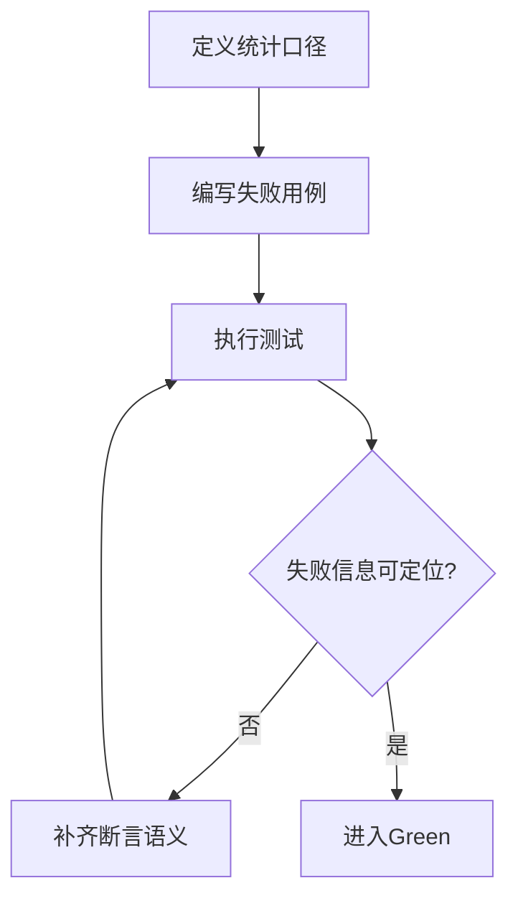
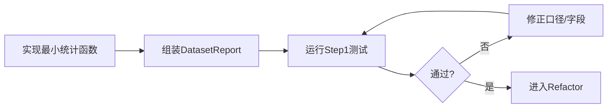
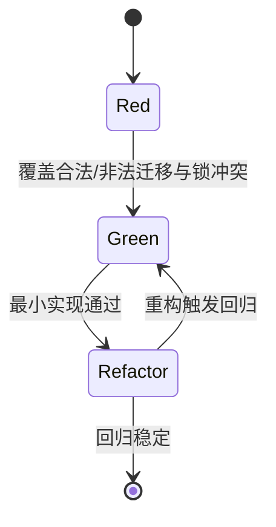
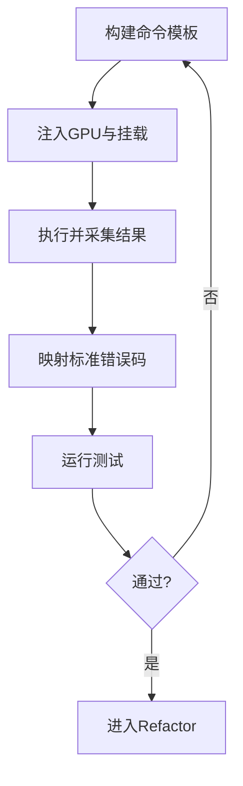

# 业务逻辑层 TDD实施计划 - Phase 1: 训练执行主链路（DatasetService + JobService + RunnerAdapter）

## 概述

本阶段建立业务逻辑层首个可运行闭环，覆盖数据统计、任务状态机与本地执行适配。目标是在服务层完成“可调度、可执行、可诊断”的训练主链路测试门禁，为后续评估与证据链提供稳定输入。

**阶段目标**:
- 统计能力可验证 - 数据集质量与场景覆盖统计结果可回归
- 调度能力可验证 - Job 状态迁移与 GPU 资源锁行为可回归
- 执行能力可验证 - LocalRunner 参数构建与错误映射可回归

**前置依赖**:
- `docs/TODO/3.业务逻辑层/1.TODO_PHASE1.md`
- `docs/init/2.系统架构.md`（状态机与产物流）
- `docs/init/3.模块设计文档.md`（Dataset/Job/Runner 设计）
- `docs/TODO/2.数据层/1.TODO_PHASE1.md`、`docs/TODO/2.数据层/3.TODO_PHASE3.md`

## Phase 1 包含的步骤

| 步骤 | 名称 | 状态 | 测试 | 完成日期 |
|------|------|------|------|----------|
| Step 1 | DatasetService 统计与质量检查 | ✅ | 5/5 | 2026-03-05 |
| Step 2 | JobService 状态机与资源锁 | ✅ | 5/5 | 2026-03-05 |
| Step 3 | LocalRunnerAdapter 执行与错误映射 | ✅ | 5/5 | 2026-03-05 |

**步骤列表**:
- **Step 1**: DatasetService 统计与质量检查
- **Step 2**: JobService 状态机与资源锁
- **Step 3**: LocalRunnerAdapter 执行与错误映射

---

## Step 1: DatasetService 统计与质量检查 (DatasetStatsGate) ✅

**目标**: 建立数据集统计与质量检查测试基线，确保类别分布、空图比例、目标尺寸分布与场景覆盖率输出稳定。

**上下文依赖**:
- 读取 `docs/dev_step/3.业务逻辑层.md` 了解 Step 3.1 目标
- 读取 `docs/init/1.产品PRD.md` 对齐数据统计需求
- 读取 `docs/init/5.附录.md` 对齐场景维度枚举

**交付物**:
- ✅ `src/services/dataset_service.py` - 统计聚合服务
- ✅ `tests/services/test_dataset_service.py` - 统计回归测试

**验收标准**:
- [x] 类别分布与样本总量一致
- [x] 空图比例计算规则在边界样本下稳定
- [x] 场景单维/组合覆盖率输出结构一致

### Red Phase - 失败的测试定义

**测试文件**: `tests/services/test_dataset_service.py`

**核心测试用例**:
- ❌ `test_class_distribution_consistent_with_total`
- ❌ `test_empty_image_ratio_with_mixed_dataset`
- ❌ `test_bbox_size_distribution_bucketed`
- ❌ `test_scene_coverage_single_dimension`
- ❌ `test_scene_coverage_combination_dimension`

**流程图（Red）**:

### Green Phase - 实现最小化功能

**主要功能**:

| 功能 | 类型 | 功能描述 | 验收标准 |
|------|------|----------|----------|
| `get_dataset_report` | service method | 汇总统计与质量指标 | 返回字段完整、可序列化 |
| `compute_class_distribution` | helper | 统计类别分布 | 总和与样本一致 |
| `compute_scene_coverage` | helper | 统计场景覆盖率 | 单维/组合结果一致 |

**流程图（Green）**:

### Refactor Phase - 优化和扩展

**重构目标**:
1. 抽取通用统计聚合器，减少重复逻辑
2. 统一统计字段命名与维度键格式
3. 固化异常输入处理（空数据、未知维度）

**验收标准**:
- [x] 统计函数复用率提升且无行为变化
- [x] 异常输入路径均有稳定返回语义

---

## Step 2: JobService 状态机与资源锁 (JobStateMachineGate) ✅

**目标**: 建立任务创建、排队、运行与结束状态迁移测试门禁，验证 GPU 资源锁分配/回收与并发冲突处理。

**上下文依赖**:
- 读取 `docs/init/2.系统架构.md` 了解状态机
- 读取 `docs/TODO/2.数据层/3.TODO_PHASE3.md` 了解 Job/Artifact 仓储契约

**交付物**:
- ✅ `src/services/job_service.py` - 调度编排服务
- ✅ `tests/services/test_job_service.py` - 状态机与资源锁测试

**验收标准**:
- [x] 合法迁移（CREATED→QUEUED→RUNNING→SUCCEEDED/FAILED）可通过
- [x] 非法迁移被阻断并返回统一错误语义
- [x] GPU 资源锁在并发场景下不重复分配

### Red / Green / Refactor 流程图

**关键验证点**:
- 功能正确性：状态迁移路径一致
- 并发正确性：资源锁冲突可重复复现
- 可靠性：失败后资源释放幂等

---

## Step 3: LocalRunnerAdapter 执行与错误映射 (LocalRunnerContractGate) ✅

**目标**: 建立容器参数构建、运行结果标准化与错误码映射测试基线，确保 Runner 行为可预测、可审计。

**上下文依赖**:
- 读取 `docs/init/3.模块设计文档.md` 了解 Runner 注入与采集要求
- 读取 `docs/init/5.附录.md` 了解错误码分类

**交付物**:
- ✅ `src/services/local_runner_adapter.py` - 运行适配器
- ✅ `tests/services/test_local_runner_adapter.py` - 参数与结果测试

**验收标准**:
- [x] 启动参数包含挂载、环境变量与训练参数透传
- [x] OOM/NaN/退出码异常可映射到标准错误码
- [x] stdout/stderr 与关键摘要可追溯

### Red Phase - 失败的测试定义

**核心测试用例**:
- ❌ `test_build_run_command_includes_mounts_and_envs`
- ❌ `test_error_mapping_for_train_oom`
- ❌ `test_error_mapping_for_train_nan`
- ❌ `test_non_zero_exit_code_standardized`
- ❌ `test_runner_result_contains_trace_fields`

### Green Phase - 最小实现流程图

### Refactor Phase - 优化和扩展

**重构目标**:
1. 抽离命令构建器与错误映射器
2. 统一 RunnerResult 字段结构
3. 减少执行路径分支复杂度

**验收标准**:
- [x] 命令构建/错误映射逻辑可独立测试
- [x] 回归测试稳定通过

---

## Phase 1 完成总结

### 完成状态

| 步骤 | 名称 | 状态 | 测试 | 完成日期 |
|------|------|------|------|----------|
| Step 1 | DatasetService 统计与质量检查 | ✅ | 5/5 | 2026-03-05 |
| Step 2 | JobService 状态机与资源锁 | ✅ | 5/5 | 2026-03-05 |
| Step 3 | LocalRunnerAdapter 执行与错误映射 | ✅ | 5/5 | 2026-03-05 |

### 实现检查清单
- [x] Red：失败测试先行且覆盖全部验收项
- [x] Green：最小实现通过核心路径
- [x] Refactor：重构后无行为漂移

### 质量标准
- [x] Phase 1 服务测试覆盖率达到阶段目标
- [x] 训练主链路关键异常具备可诊断断言
- [x] 输出契约可被 Phase 2 直接复用
