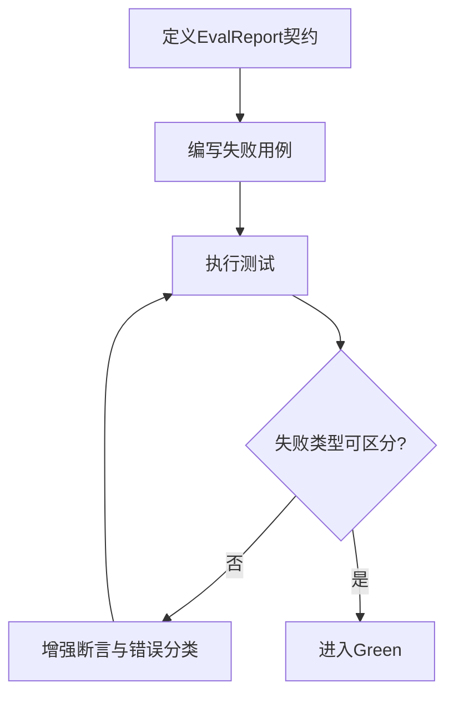
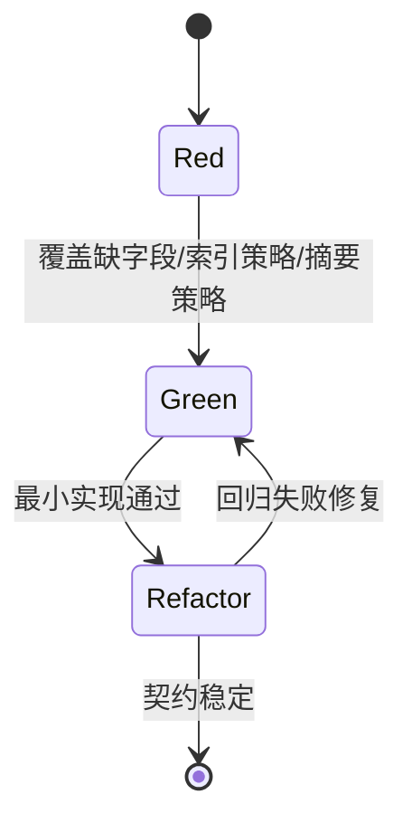
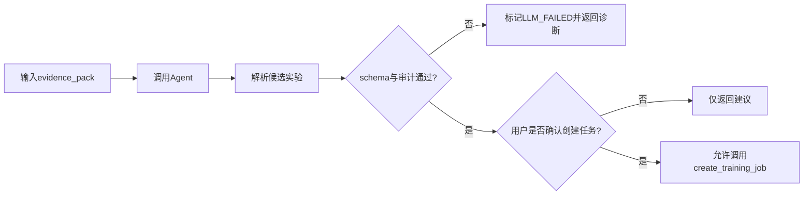

# 业务逻辑层 TDD实施计划 - Phase 2: 评估与证据闭环（EvalService + EvidencePackBuilder + AgentService）

## 概述

本阶段构建训练后智能分析闭环的测试体系，覆盖评估执行与 JSON 校验、证据包聚合、Agent 输出校验与审计约束。目标是确保“结果可信、建议可追溯、策略默认安全”。

**阶段目标**:
- 评估契约可验证 - EvalReport 结构与失败处理可回归
- 证据组装可验证 - EvidencePack 字段与索引策略可回归
- Agent 输出可验证 - A/B/C 候选实验与 evidence 引用可回归

**前置依赖**:
- `docs/TODO/3.业务逻辑层/2.TODO_PHASE2.md`
- `docs/TODO/1.Common库/2.TODO_PHASE2.md`（schema 校验器）
- `docs/TDD/3.业务逻辑层/TDD_PLAN_PHASE1.md`（训练摘要输入稳定）

## Phase 2 包含的步骤

| 步骤 | 名称 | 状态 | 测试 | 完成日期 |
|------|------|------|------|----------|
| Step 1 | EvalService 执行与契约校验 | ✅ | 4/4 | 2026-03-05 |
| Step 2 | EvidencePackBuilder 聚合与索引化 | ✅ | 3/3 | 2026-03-05 |
| Step 3 | AgentService 审计与安全策略 | ✅ | 4/4 | 2026-03-05 |

**步骤列表**:
- **Step 1**: EvalService 执行与契约校验
- **Step 2**: EvidencePackBuilder 聚合与索引化
- **Step 3**: AgentService 审计与安全策略

---

## Step 1: EvalService 执行与契约校验 (EvalContractGate) ✅

**目标**: 验证评估脚本执行、输出解析、Schema 校验与失败日志落盘的完整行为。

**上下文依赖**:
- 读取 `docs/dev_step/3.业务逻辑层.md` 了解 Step 3.4
- 读取 `docs/init/5.附录.md` 了解 EvalReport 必填项
- 参考 `docs/TODO/1.Common库/2.TODO_PHASE2.md` 对齐校验错误结构

**交付物**:
- ✅ `src/services/eval_service.py`
- ✅ `tests/services/test_eval_service.py`

**验收标准**:
- [x] 评估脚本成功执行并产生结构化输出
- [x] 缺失必填字段时返回可诊断失败
- [x] 失败场景 stdout/stderr 可落盘并索引

### Red Phase - 测试先行流程图

**核心测试用例**:
- ❌ `test_eval_script_success_with_valid_report`
- ❌ `test_eval_report_missing_required_field_fails`
- ❌ `test_eval_script_non_zero_exit_maps_eval_failed`
- ❌ `test_eval_failure_logs_persisted`

### Green / Refactor 验收要点
- Green：最小实现覆盖执行、校验、落盘三路径
- Refactor：抽离脚本执行器接口，降低外部依赖耦合

---

## Step 2: EvidencePackBuilder 聚合与索引化 (EvidenceAssemblyGate) ✅

**目标**: 验证证据包对多源输入的聚合稳定性，确保 KPI 配置合并正确且大文件不直接内嵌。

**上下文依赖**:
- 读取 `docs/init/2.系统架构.md` 了解 evidence 产物路径
- 读取 `docs/init/5.附录.md` 了解 Evidence Pack 规则

**交付物**:
- ✅ `src/services/evidence_pack_builder.py`
- ✅ `tests/services/test_evidence_pack_builder.py`

**验收标准**:
- [x] 数据集报告、任务摘要、评估结果、KPI 配置四类输入完整入包
- [x] 曲线字段为摘要/降采样结果
- [x] 大文件字段采用路径/ID 索引

### Red / Green / Refactor 流程图

**关键验证点**:
- 契约完整性：字段齐全且命名稳定
- 可审计性：关键字段可被 Agent 引用
- 可扩展性：新增证据块不破坏既有结构

---

## Step 3: AgentService 审计与安全策略 (AgentAuditGate) ✅

**目标**: 验证 Agent 输出 `analysis_report.md` 与 `next_experiments.json` 的合规性，确保每个候选实验具备 evidence 引用且默认不自动建任务。

**上下文依赖**:
- 读取 `docs/init/1.产品PRD.md` 对齐 A/B/C 目标
- 读取 `docs/init/5.附录.md` 对齐 NextExperiments 规范

**交付物**:
- ✅ `src/services/agent_service.py`
- ✅ `tests/services/test_agent_service.py`

**验收标准**:
- [x] 候选实验缺失 `evidence_refs` 会被拒绝
- [x] `changes` 相对 baseline 可解析并可验证
- [x] 无用户确认不触发任务创建动作

### 行为门禁流程图

**核心测试用例**:
- ❌ `test_agent_output_requires_evidence_refs`
- ❌ `test_agent_output_schema_validation_failure`
- ❌ `test_default_policy_no_auto_job_creation`
- ❌ `test_candidate_changes_are_baseline_relative`

---

## Phase 2 完成总结

### 完成状态

| 步骤 | 名称 | 状态 | 测试 | 完成日期 |
|------|------|------|------|----------|
| Step 1 | EvalService 执行与契约校验 | ✅ | 4/4 | 2026-03-05 |
| Step 2 | EvidencePackBuilder 聚合与索引化 | ✅ | 3/3 | 2026-03-05 |
| Step 3 | AgentService 审计与安全策略 | ✅ | 4/4 | 2026-03-05 |

### 实现检查清单
- [x] Red：失败测试覆盖脚本失败、契约失败、审计失败
- [x] Green：主路径与失败路径均可通过
- [x] Refactor：接口解耦后回归全绿

### 质量标准
- [x] Phase 2 服务测试覆盖率达到阶段目标
- [x] 所有建议具备 evidence 可追溯性
- [x] 默认安全策略在集成链路可验证
