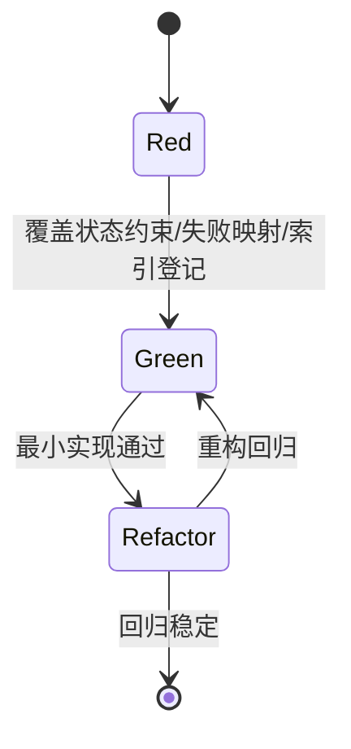
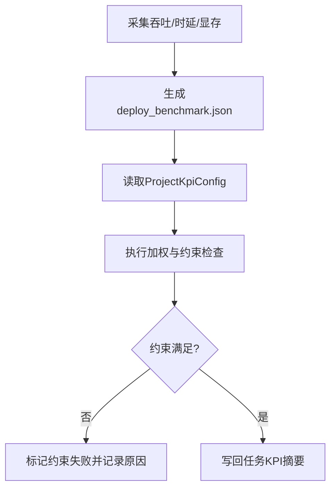
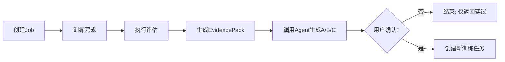
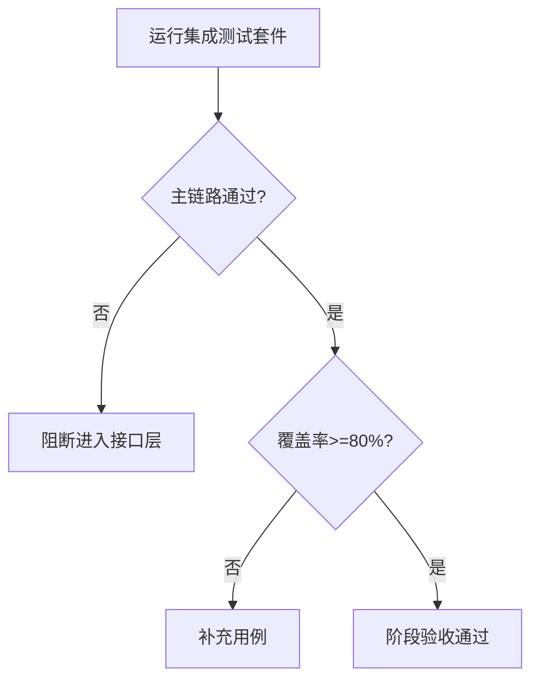

# 业务逻辑层 TDD实施计划 - Phase 3: 导出服务与服务级集成验收（ExportService + E2E Flow）

## 概述

本阶段建立业务逻辑层收官测试门禁，覆盖导出任务编排、部署基准聚合、KPI 联动计算与服务级端到端流程验证。目标是确保导出能力可扩展、指标闭环可信、主流程交付可验收。

**阶段目标**:
- 导出链路可验证 - TensorRT 导出任务与失败映射可回归
- KPI 联动可验证 - 部署指标参与加权与阈值校验可回归
- 集成链路可验证 - 训练→评估→证据包主流程服务级测试通过

**前置依赖**:
- `docs/TODO/3.业务逻辑层/3.TODO_PHASE3.md`
- `docs/TDD/3.业务逻辑层/TDD_PLAN_PHASE1.md`
- `docs/TDD/3.业务逻辑层/TDD_PLAN_PHASE2.md`
- `docs/init/2.系统架构.md`（Export Runner）

## Phase 3 包含的步骤

| 步骤 | 名称 | 状态 | 测试 | 完成日期 |
|------|------|------|------|----------|
| Step 1 | ExportService 导出编排与结果采集 | ⏳ | -/- | - |
| Step 2 | 部署基准与 KPI 联动验证 | ⏳ | -/- | - |
| Step 3 | 服务级集成链路验收门禁 | ⏳ | -/- | - |

**步骤列表**:
- **Step 1**: ExportService 导出编排与结果采集
- **Step 2**: 部署基准与 KPI 联动验证
- **Step 3**: 服务级集成链路验收门禁

---

## Step 1: ExportService 导出编排与结果采集 (ExportOrchestrationGate) ⏳

**目标**: 建立导出任务状态约束、执行结果采集与错误码映射测试基线。

**上下文依赖**:
- 读取 `docs/dev_step/3.业务逻辑层.md` 了解 Step 3.7
- 读取 `docs/init/3.模块设计文档.md` 了解 ExportService 约束
- 读取 `docs/init/5.附录.md` 对齐 `EXPORT_FAILED`

**交付物**:
- ⏳ `src/services/export_service.py`
- ⏳ `tests/services/test_export_service.py`

**验收标准**:
- [ ] 非法任务状态禁止发起导出
- [ ] 导出成功后产物索引可查询
- [ ] 导出失败可映射标准错误码并保留诊断信息

### Red / Green / Refactor 流程图

**核心测试用例**:
- ❌ `test_only_succeeded_or_eval_succeeded_can_export`
- ❌ `test_export_success_registers_engine_artifact`
- ❌ `test_export_failure_maps_export_failed`
- ❌ `test_unknown_backend_rejected_with_clear_error`

---

## Step 2: 部署基准与 KPI 联动验证 (DeployKpiMergeGate) ⏳

**目标**: 验证 `deploy_benchmark.json` 字段完整性与 KPI 约束/加权逻辑一致性。

**上下文依赖**:
- 读取 `docs/init/1.产品PRD.md` 了解部署评估目标
- 读取 `docs/init/5.附录.md` 了解 KPI 权重与阈值约束

**交付物**:
- ⏳ `src/services/export_service.py`（基准与联动逻辑）
- ⏳ `tests/services/test_export_service.py`（KPI 联动测试）

**验收标准**:
- [ ] 基准 JSON 字段完整且单位一致
- [ ] 包含时延约束时触发正确阈值判断
- [ ] KPI 联动结果可回写任务摘要

### 流程图（指标闭环）

**关键验证点**:
- 功能正确性：加权计算结果一致
- 合规性：阈值约束严格执行
- 可追溯性：可定位到基准来源与计算过程

---

## Step 3: 服务级集成链路验收门禁 (TrainingFlowIntegrationGate) ⏳

**目标**: 以服务边界完成端到端集成验证，覆盖“创建任务 → 训练完成 → 评估完成 → 证据包生成”，并验证 Agent 默认不自动建任务。

**上下文依赖**:
- 依赖 Phase 1/2 服务能力稳定
- 读取 `docs/dev_step/3.业务逻辑层.md` Verification 要求

**交付物**:
- ⏳ `tests/services/test_training_flow_integration.py`

**验收标准**:
- [ ] 主流程关键状态与关键产物都可断言
- [ ] Agent 建议输出可通过 schema 与 evidence 引用校验
- [ ] 默认策略“不自动创建任务”在集成场景成立

### 集成流程图（服务级）

### 测试门禁流程图

---

## Phase 3 完成总结

### 完成状态

| 步骤 | 名称 | 状态 | 测试 | 完成日期 |
|------|------|------|------|----------|
| Step 1 | ExportService 导出编排与结果采集 | ⏳ | 0/0 | - |
| Step 2 | 部署基准与 KPI 联动验证 | ⏳ | 0/0 | - |
| Step 3 | 服务级集成链路验收门禁 | ⏳ | 0/0 | - |

### 实现检查清单
- [ ] Red：失败测试先行，覆盖非法状态/导出失败/阈值失败
- [ ] Green：导出与集成主路径全绿
- [ ] Refactor：导出后端扩展结构稳定且不破坏行为

### 质量标准
- [ ] 业务层测试覆盖率保持 ≥ 80%
- [ ] 导出与评估指标可追溯、可复核
- [ ] 服务级主流程满足进入接口层的交付门禁
