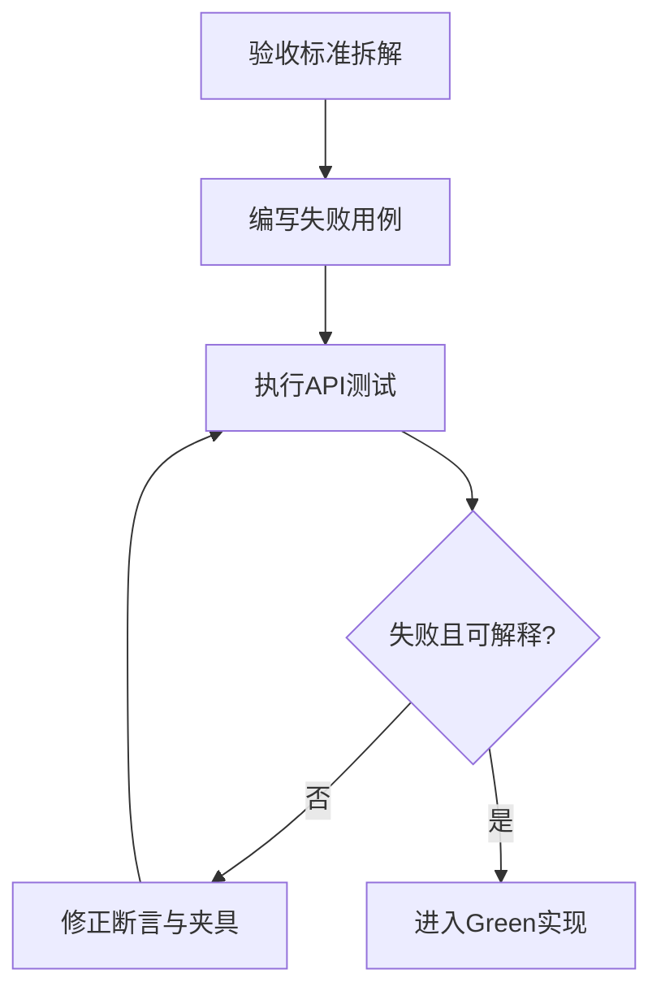
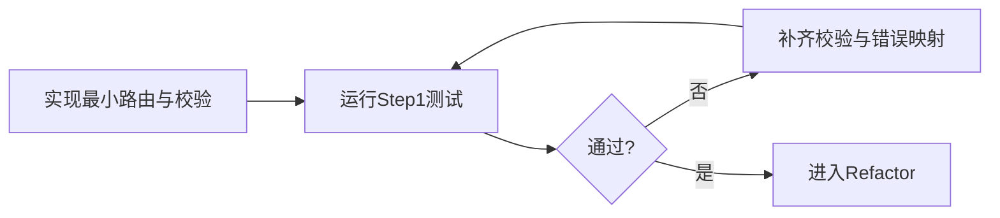
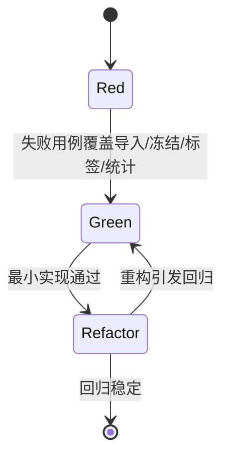
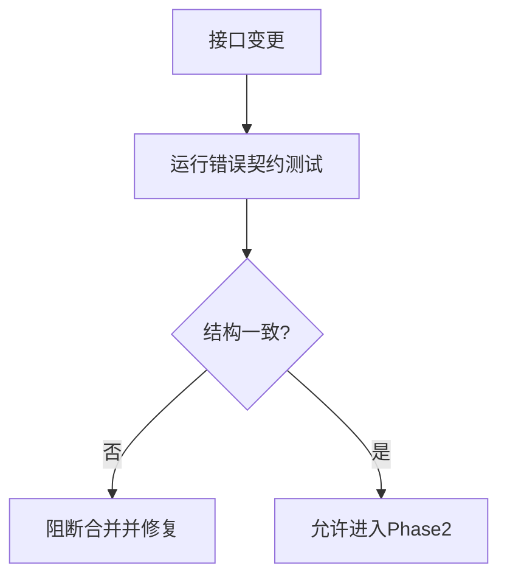

# 接口层 TDD实施计划 - Phase 1: 项目/KPI 配置 + 数据集与场景标签 API

## 概述

本阶段建立接口层基础质量门禁，覆盖项目 KPI 配置、数据集导入与版本冻结、场景标签写入与覆盖率统计。目标是先固化 API 契约与错误响应一致性，再推进最小实现通过测试。

**阶段目标**:
- 配置契约可验证 - 项目 KPI 权重/阈值校验稳定
- 数据接口可回归 - 导入、冻结、标签、统计具备失败与边界用例
- 错误结构统一 - 参数错误、业务错误、系统错误统一响应语义

**前置依赖**:
- `docs/TODO/4.接口层/1.TODO_PHASE1.md`
- `docs/init/1.产品PRD.md`、`docs/init/3.模块设计文档.md`、`docs/init/5.附录.md`
- Common 错误码与 schema 校验器、数据层与业务层基础能力

## Phase 1 包含的步骤

| 步骤 | 名称 | 状态 | 测试 | 完成日期 |
|------|------|------|------|----------|
| Step 1 | 项目 KPI 配置 API 测试基线 | ✅ | 5/5 | 2026-03-06 |
| Step 2 | 数据集导入/冻结与场景标签 API 测试基线 | ✅ | 5/5 | 2026-03-06 |
| Step 3 | 错误响应统一化与回归门禁 | ✅ | 4/4 | 2026-03-06 |

**步骤列表**:
- **Step 1**: 项目 KPI 配置 API 测试基线
- **Step 2**: 数据集导入/冻结与场景标签 API 测试基线
- **Step 3**: 错误响应统一化与回归门禁

---

## Step 1: 项目 KPI 配置 API 测试基线 (ProjectKpiApiBaseline) ⏳

**目标**: 定义 `GET/PUT project kpi config` 的 Red 用例，覆盖合法更新、权重规则、阈值规则与不存在项目语义。

**上下文依赖**:
- 读取 `docs/TODO/4.接口层/1.TODO_PHASE1.md` 对齐验收标准
- 读取 `docs/init/5.附录.md` 对齐 KPI 配置结构

**交付物**:
- ⏳ `tests/api/test_project_api.py` - 项目配置 API 测试套件
- ⏳ `src/api/project_routes.py` - 最小可通过实现

**验收标准**:
- [x] 权重和规则可验证（非法权重组合拒绝）
- [x] 阈值规则与比较符校验一致
- [x] 不存在项目返回统一错误结构

### Red Phase - 失败的测试定义

**测试文件**: `tests/api/test_project_api.py`

**核心测试用例**:
- ❌ `test_get_project_kpi_config_success`
- ❌ `test_put_project_kpi_config_success_and_readback`
- ❌ `test_put_project_kpi_config_invalid_weights_rejected`
- ❌ `test_put_project_kpi_config_invalid_constraint_operator_rejected`
- ❌ `test_get_project_kpi_config_project_not_found`

**流程图（测试先行）**:

### Green Phase - 实现最小化功能

**主要API/功能**:

| 功能/端点 | 方法 | 功能描述 | 验收标准 |
|-----------|------|----------|----------|
| `/projects/{id}/kpi-config` | GET | 查询项目 KPI 配置 | 已配置可读取，未配置返回明确语义 |
| `/projects/{id}/kpi-config` | PUT | 更新项目 KPI 配置 | 权重/阈值通过校验后可持久化 |

**流程图（最小实现）**:

### Refactor Phase - 优化和扩展

**重构目标**:
1. 抽取 KPI 校验器，避免路由层重复逻辑
2. 统一错误响应构建器（code/message/details）
3. 稳定响应字段顺序与语义，减少上层适配成本

**验收标准**:
- [x] Step 1 全部测试保持通过
- [x] 响应结构在异常路径保持一致

---

## Step 2: 数据集导入/冻结与场景标签 API 测试基线 (DatasetSceneApiBaseline) ⏳

**目标**: 建立数据集导入、版本冻结、标签写入、覆盖率统计的可回归测试集合。

**上下文依赖**:
- 依赖 Step 1 的统一错误结构
- 读取 `docs/init/1.产品PRD.md` 与 `docs/init/5.附录.md` 对齐场景维度与规则

**交付物**:
- ⏳ `tests/api/test_dataset_api.py` - 数据集 API 测试套件
- ⏳ `src/api/dataset_routes.py` - 最小可通过实现

**验收标准**:
- [x] 导入成功返回版本标识
- [x] 冻结逻辑可验证（重复冻结行为可诊断）
- [x] 场景标签规则完整（`weather=other` 时文本必填）
- [x] 覆盖率统计结果结构稳定

### Red / Green / Refactor 流程图

**关键验证点**:
- 规则正确性：枚举值、组合维度、必填项
- 边界处理：空数据、重复导入、重复冻结
- 可观测性：失败时返回可诊断错误详情

---

## Step 3: 错误响应统一化与回归门禁 (ApiErrorContractGate) ⏳

**目标**: 固化 Phase 1 全部接口的错误契约，防止后续迭代导致响应结构漂移。

**交付物**:
- ⏳ `tests/api/test_project_api.py` - 错误结构断言扩展
- ⏳ `tests/api/test_dataset_api.py` - 错误结构断言扩展
- ⏳ `src/api/project_routes.py`、`src/api/dataset_routes.py` - 统一响应实现

**验收标准**:
- [x] 参数/业务/系统错误均返回统一结构
- [x] 错误码可映射 Common 错误码体系
- [x] 结构变化可触发测试失败

**流程图（契约门禁）**:

---

## Phase 1 完成总结

### 完成状态

| 步骤 | 名称 | 状态 | 测试 | 完成日期 |
|------|------|------|------|----------|
| Step 1 | 项目 KPI 配置 API 测试基线 | ✅ | 5/5 | 2026-03-06 |
| Step 2 | 数据集导入/冻结与场景标签 API 测试基线 | ✅ | 5/5 | 2026-03-06 |
| Step 3 | 错误响应统一化与回归门禁 | ✅ | 4/4 | 2026-03-06 |

### 实现检查清单
- [x] Red：失败测试先行并覆盖全部验收项
- [x] Green：最小实现通过核心路径
- [x] Refactor：无行为变化且回归全绿

### 质量标准
- [x] API 层关键路径测试覆盖率达到阶段目标（建议 ≥ 80%）
- [x] 异常路径断言完整（参数/业务/系统三类）
- [x] 接口契约变更需同步更新测试与文档
