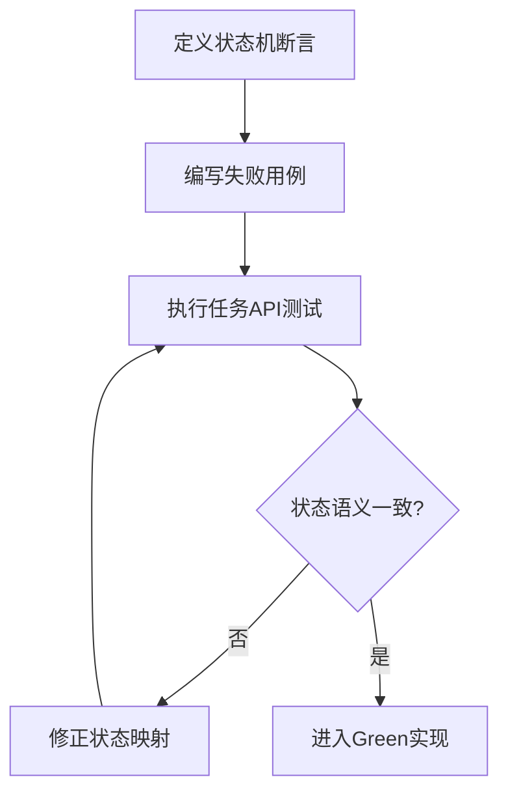
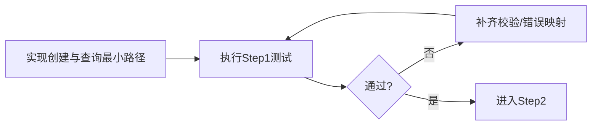
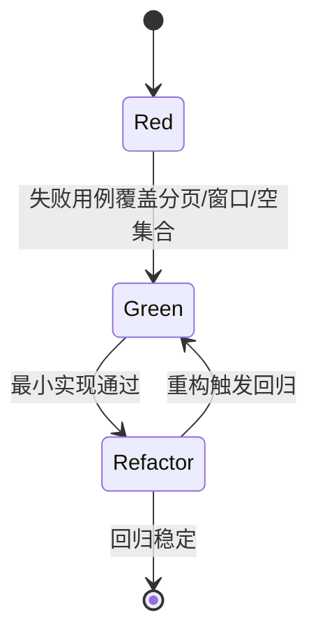
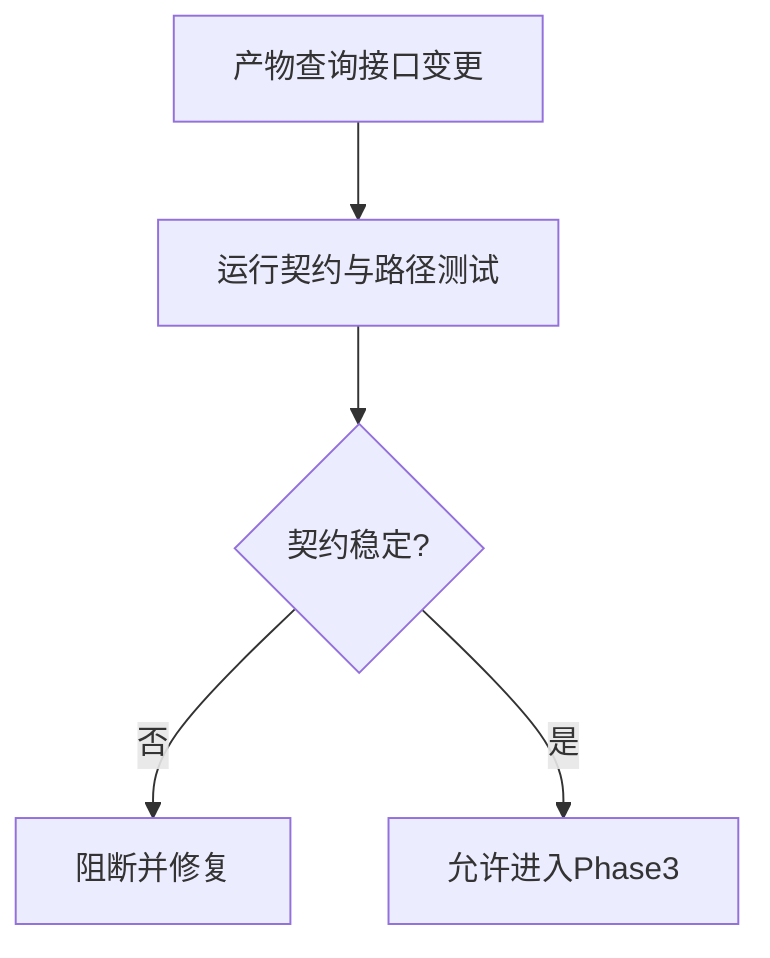

# 接口层 TDD实施计划 - Phase 2: 任务编排 + 评估/证据包/LLM 产物查询 API

## 概述

本阶段验证接口层核心链路中段：任务创建与状态查询、日志与指标摘要查询，以及评估与证据包、LLM 分析产物读取。目标是确保状态机语义、产物读取契约与错误映射在 API 层稳定可回归。

**阶段目标**:
- 状态机一致性 - 任务状态查询与错误码映射可验证
- 观测链路可用性 - 日志与指标查询具备边界与异常覆盖
- 产物契约稳定性 - `eval_report`、`evidence_pack`、`analysis_report`、`next_experiments` 查询一致

**前置依赖**:
- `docs/TODO/4.接口层/2.TODO_PHASE2.md`
- `docs/init/2.系统架构.md`（任务状态机、产物流）
- `docs/init/3.模块设计文档.md`、`docs/init/5.附录.md`
- Phase 1 统一错误响应与 DTO 基线

## Phase 2 包含的步骤

| 步骤 | 名称 | 状态 | 测试 | 完成日期 |
|------|------|------|------|----------|
| Step 1 | 任务编排 API 测试基线 | ⏳ | -/- | - |
| Step 2 | 日志/指标摘要 API 测试基线 | ⏳ | -/- | - |
| Step 3 | 分析产物查询契约与路径格式门禁 | ⏳ | -/- | - |

**步骤列表**:
- **Step 1**: 任务编排 API 测试基线
- **Step 2**: 日志/指标摘要 API 测试基线
- **Step 3**: 分析产物查询契约与路径格式门禁

---

## Step 1: 任务编排 API 测试基线 (JobOrchestrationApiBaseline) ⏳

**目标**: 固化 `POST /jobs`、`GET /jobs/{id}` 的测试基线，覆盖参数校验、状态映射、不存在任务与状态冲突语义。

**上下文依赖**:
- 读取 `docs/init/2.系统架构.md` 对齐状态机
- 读取 `docs/TODO/4.接口层/2.TODO_PHASE2.md` 对齐验收项

**交付物**:
- ⏳ `tests/api/test_job_api.py` - 任务编排测试
- ⏳ `src/api/job_routes.py` - 最小可通过实现

**验收标准**:
- [ ] 创建任务参数校验覆盖关键字段
- [ ] 状态映射对齐系统状态机语义
- [ ] 非法资源规格与不存在任务返回统一错误结构

### Red Phase - 失败的测试定义

**测试文件**: `tests/api/test_job_api.py`

**核心测试用例**:
- ❌ `test_create_job_success_and_initial_state`
- ❌ `test_create_job_invalid_resource_rejected`
- ❌ `test_get_job_status_success`
- ❌ `test_get_job_status_not_found`
- ❌ `test_job_state_conflict_error_mapping`

**流程图（状态机校验）**:

### Green Phase - 实现最小化功能

**主要API/功能**:

| 功能/端点 | 方法 | 功能描述 | 验收标准 |
|-----------|------|----------|----------|
| `/jobs` | POST | 创建训练任务 | 成功后返回 job_id 与初始状态 |
| `/jobs/{job_id}` | GET | 查询任务状态与摘要 | 状态与错误码映射一致 |

**流程图（最小实现）**:

### Refactor Phase - 优化和扩展

**重构目标**:
1. 抽取状态机错误映射表，避免散落分支
2. 收敛任务响应 DTO，稳定字段语义
3. 对接统一异常处理中间件，减少重复返回代码

**验收标准**:
- [ ] 状态冲突类错误映射稳定
- [ ] Step 1 回归测试全绿

---

## Step 2: 日志/指标摘要 API 测试基线 (ObservabilityApiBaseline) ⏳

**目标**: 验证日志分页与指标时间窗口查询在正常与边界场景下稳定可用。

**上下文依赖**:
- 依赖 Step 1 的任务可查询能力
- 读取系统架构文档中的可观测性要求

**交付物**:
- ⏳ `tests/api/test_job_api.py` - 日志/指标相关测试
- ⏳ `src/api/job_routes.py` - 日志/指标接口实现

**验收标准**:
- [ ] 日志分页参数生效且边界可诊断
- [ ] 指标时间窗口过滤正确
- [ ] 无日志/无指标时返回空集合而非异常

### Red / Green / Refactor 流程图

**关键验证点**:
- 功能正确性：分页、窗口、排序
- 稳定性：大窗口请求处理策略一致
- 错误可诊断：非法参数返回结构化错误

---

## Step 3: 分析产物查询契约与路径格式门禁 (AnalysisArtifactContractGate) ⏳

**目标**: 固化四类产物查询接口契约与路径格式输出，防止上层解析逻辑受破坏。

**上下文依赖**:
- 读取 `docs/init/2.系统架构.md`（产物流）
- 读取 `docs/init/5.附录.md`（Eval/Evidence/NextExperiments 规则）

**交付物**:
- ⏳ `tests/api/test_analysis_artifacts_api.py` - 产物查询测试
- ⏳ `src/api/analysis_routes.py` - 产物查询最小实现

**验收标准**:
- [ ] `eval_report`、`evidence_pack`、`analysis_report`、`next_experiments` 查询契约一致
- [ ] 任务未到阶段、产物缺失、产物不合规均返回稳定错误结构
- [ ] 路径/索引字段格式统一

**流程图（产物查询门禁）**:

---

## Phase 2 完成总结

### 完成状态

| 步骤 | 名称 | 状态 | 测试 | 完成日期 |
|------|------|------|------|----------|
| Step 1 | 任务编排 API 测试基线 | ⏳ | 0/0 | - |
| Step 2 | 日志/指标摘要 API 测试基线 | ⏳ | 0/0 | - |
| Step 3 | 分析产物查询契约与路径格式门禁 | ⏳ | 0/0 | - |

### 实现检查清单
- [ ] Red：状态机、观测、产物三类失败用例先行
- [ ] Green：最小实现通过核心路径
- [ ] Refactor：契约不变且回归全绿

### 质量标准
- [ ] 任务与产物查询关键路径测试覆盖率达到阶段目标（建议 ≥ 80%）
- [ ] 状态机错误映射与产物错误语义可复测
- [ ] 路径格式输出保持稳定并有测试门禁
