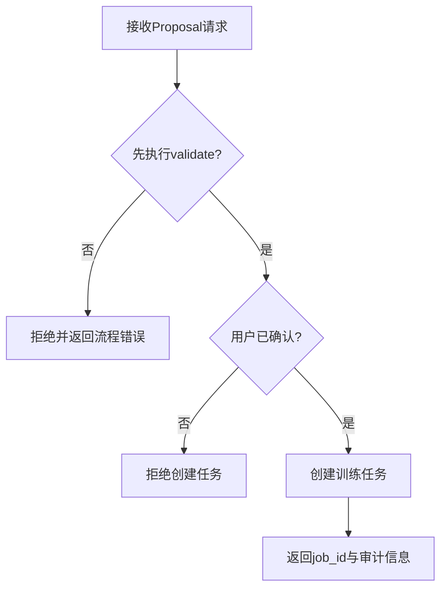
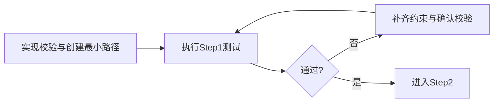
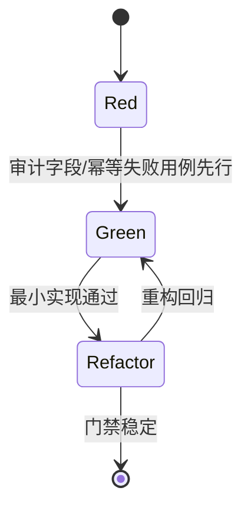
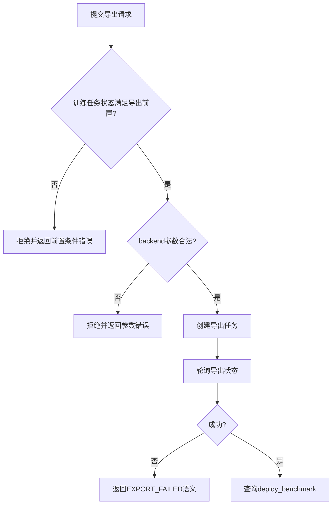

# 接口层 TDD实施计划 - Phase 3: 候选实验校验与一键建任务 + 导出/部署基准 API

## 概述

本阶段完成接口层高价值闭环测试：候选实验校验、用户确认后一键建任务、导出任务与部署基准查询。测试计划聚焦“人在回路”约束、审计字段一致性、导出参数校验可扩展性。

**阶段目标**:
- Proposal 工作流可验证 - `validate_proposals` 与确认创建链路完整
- 审计一致性可回归 - `who/when/baseline_job_id` 在全链路一致
- 导出能力可扩展 - 后端参数校验器与导出状态查询稳定

**前置依赖**:
- `docs/TODO/4.接口层/3.TODO_PHASE3.md`
- `docs/init/1.产品PRD.md`、`docs/init/3.模块设计文档.md`、`docs/init/5.附录.md`
- Phase 2 的任务与分析产物查询能力

## Phase 3 包含的步骤

| 步骤 | 名称 | 状态 | 测试 | 完成日期 |
|------|------|------|------|----------|
| Step 1 | Proposal 校验与确认创建工作流测试基线 | ⏳ | -/- | - |
| Step 2 | 审计字段一致性与幂等门禁 | ⏳ | -/- | - |
| Step 3 | 导出任务与部署基准 API 测试基线 | ⏳ | -/- | - |

**步骤列表**:
- **Step 1**: Proposal 校验与确认创建工作流测试基线
- **Step 2**: 审计字段一致性与幂等门禁
- **Step 3**: 导出任务与部署基准 API 测试基线

---

## Step 1: Proposal 校验与确认创建工作流测试基线 (ProposalWorkflowBaseline) ⏳

**目标**: 固化 `validate_proposals` 与 `create_from_proposal` 流程测试，确保“未确认不可创建、确认后可创建、校验失败可诊断”。

**上下文依赖**:
- 读取 `docs/init/5.附录.md` 对齐 `NextExperiments` 规则
- 读取 `docs/init/3.模块设计文档.md` 对齐 Core API 函数职责

**交付物**:
- ⏳ `tests/api/test_proposal_workflow_api.py` - Proposal 工作流测试
- ⏳ `src/api/proposal_routes.py` - 最小可通过实现

**验收标准**:
- [ ] 缺失 `evidence_refs`、缺失 `baseline_job_id` 等错误可被稳定拒绝
- [ ] 未确认请求不会触发任务创建
- [ ] 确认后可创建任务并返回可追踪标识

### Red Phase - 失败的测试定义

**测试文件**: `tests/api/test_proposal_workflow_api.py`

**核心测试用例**:
- ❌ `test_validate_proposals_success`
- ❌ `test_validate_proposals_missing_evidence_refs_rejected`
- ❌ `test_create_from_proposal_without_confirmation_rejected`
- ❌ `test_create_from_proposal_success_after_confirmation`
- ❌ `test_create_from_proposal_missing_baseline_job_id_rejected`

**流程图（人在回路门禁）**:

### Green Phase - 实现最小化功能

**主要API/功能**:

| 功能/端点 | 方法 | 功能描述 | 验收标准 |
|-----------|------|----------|----------|
| `/proposals/validate` | POST | 校验候选实验参数与约束 | 非法 proposal 返回结构化错误 |
| `/proposals/create-from-candidate` | POST | 用户确认后创建训练任务 | 未确认拒绝，确认后成功创建 |

**流程图（最小实现）**:

### Refactor Phase - 优化和扩展

**重构目标**:
1. 抽取 proposal 校验链（schema/资源/KPI 约束）
2. 统一工作流错误映射，减少重复分支
3. 对齐响应模型，稳定上层消费字段

**验收标准**:
- [ ] Step 1 全部用例保持通过
- [ ] 失败路径可稳定定位到约束类型

---

## Step 2: 审计字段一致性与幂等门禁 (AuditConsistencyGate) ⏳

**目标**: 建立 Proposal→Job 链路审计字段一致性与重复提交幂等性测试门禁。

**上下文依赖**:
- 依赖 Step 1 的创建流程
- 对齐 TODO 中审计一致性要求（who/when/baseline_job_id）

**交付物**:
- ⏳ `tests/api/test_proposal_workflow_api.py` - 审计与幂等测试扩展
- ⏳ `src/api/proposal_routes.py` - 审计字段与幂等实现

**验收标准**:
- [ ] 响应体、日志、存储模型中的审计字段同名同义
- [ ] 重复提交不会产生不可控重复任务
- [ ] 幂等冲突返回稳定错误结构或复用既有结果

### Red / Green / Refactor 流程图

**关键验证点**:
- 审计完整性：字段齐全、值可追溯
- 幂等稳定性：重复请求行为可预测
- 错误一致性：冲突与非法请求语义清晰

---

## Step 3: 导出任务与部署基准 API 测试基线 (ExportApiBaseline) ⏳

**目标**: 固化导出任务创建、状态查询、部署基准查询与后端参数校验测试。

**上下文依赖**:
- 读取 `docs/init/1.产品PRD.md` 对齐导出与部署评估目标
- 读取 `docs/init/5.附录.md` 对齐 `EXPORT_FAILED` 等错误语义

**交付物**:
- ⏳ `tests/api/test_export_api.py` - 导出 API 测试套件
- ⏳ `src/api/export_routes.py` - 最小可通过实现

**验收标准**:
- [ ] 不支持 backend 与参数缺失可稳定拒绝
- [ ] 导出状态查询可轮询并有一致返回结构
- [ ] 部署基准查询契约稳定，失败映射 `EXPORT_FAILED`

**流程图（导出链路）**:

---

## Phase 3 完成总结

### 完成状态

| 步骤 | 名称 | 状态 | 测试 | 完成日期 |
|------|------|------|------|----------|
| Step 1 | Proposal 校验与确认创建工作流测试基线 | ⏳ | 0/0 | - |
| Step 2 | 审计字段一致性与幂等门禁 | ⏳ | 0/0 | - |
| Step 3 | 导出任务与部署基准 API 测试基线 | ⏳ | 0/0 | - |

### 实现检查清单
- [ ] Red：工作流、审计、导出三类失败用例先行
- [ ] Green：最小实现通过核心路径
- [ ] Refactor：审计与参数校验抽象后回归全绿

### 质量标准
- [ ] Proposal 与 Export 关键路径测试覆盖率达到阶段目标（建议 ≥ 80%）
- [ ] 审计字段一致性与幂等行为可复测
- [ ] 导出后端参数校验具备扩展性门禁
