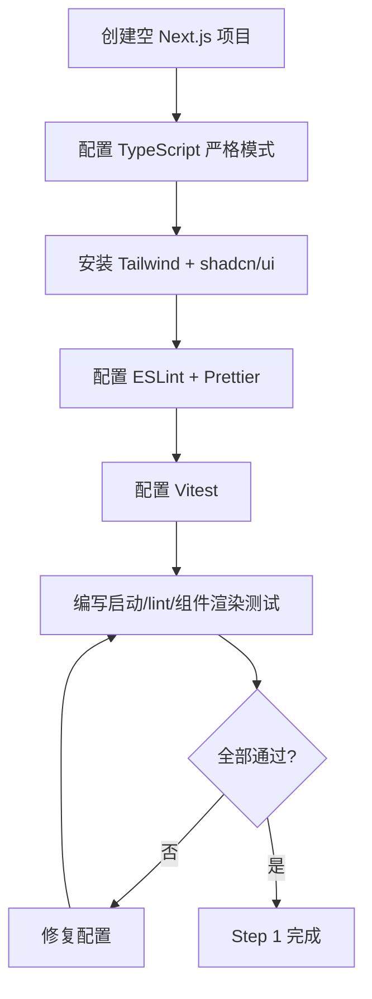
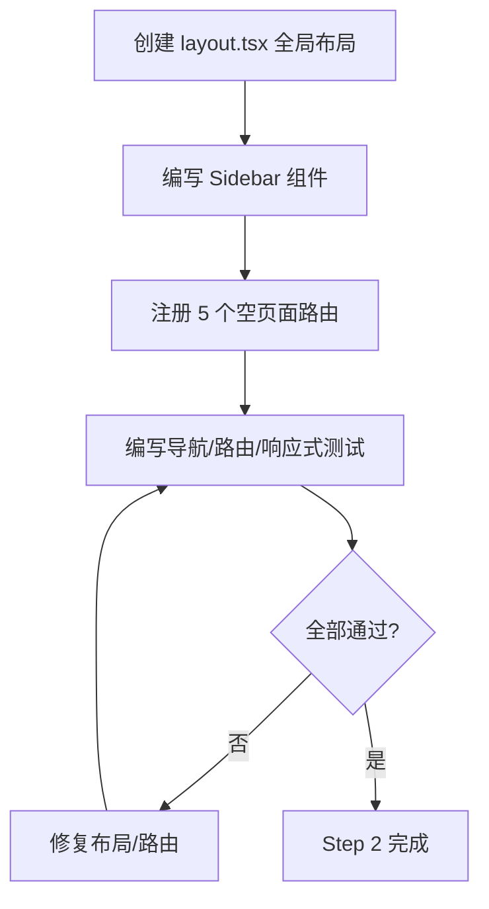
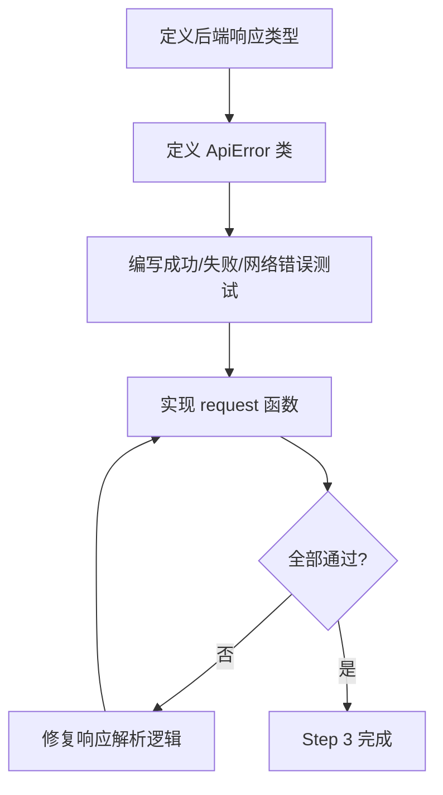
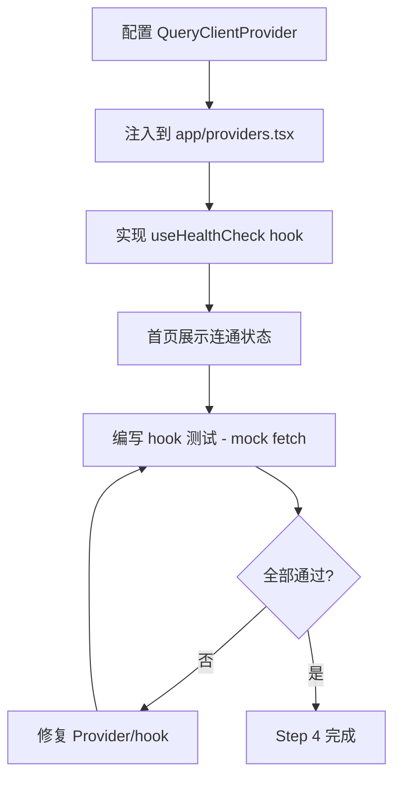

# 前端层 TDD实施计划 - Phase 1: 工程初始化与基础框架

## 概述

本阶段搭建前端工程骨架，建立可持续开发的基础设施。核心目标是完成 Next.js 14 + TypeScript + Tailwind + shadcn/ui 项目初始化、全局布局、API 基础客户端与统一错误处理，确保"工程可启动、路由可访问、请求可发出"。本阶段是整个前端开发的地基，后续所有 Phase 均依赖本阶段交付。

**阶段目标**:
- 工程可启动 - `pnpm dev` 启动后首页可访问，不白屏
- 路由可访问 - 5 个 MVP 空页面路由均可导航
- 请求可发出 - API 客户端可正确发出请求并解析后端统一响应结构

**前置依赖**:
- 后端 FastAPI 服务可运行（`/health` 返回 `{ok: true}`）
- Node.js 20 LTS + pnpm 9+ 已安装
- `docs/dev_step/5.1前端技术栈选型.md`（技术栈与目录规范）
- `docs/dev_step/4.接口层_API路由清单.md`（统一响应结构）

## Phase 1 包含的步骤

| 步骤 | 名称 | 状态 | 测试 | 完成日期 |
|------|------|------|------|----------|
| Step 1 | 工程初始化与开发工具链 | ⏳ | -/- | - |
| Step 2 | 全局布局与路由骨架 | ⏳ | -/- | - |
| Step 3 | API 基础客户端与错误处理 | ⏳ | -/- | - |
| Step 4 | TanStack Query 集成与健康检查联调 | ⏳ | -/- | - |

**步骤列表**:
- **Step 1**: 工程初始化与开发工具链
- **Step 2**: 全局布局与路由骨架
- **Step 3**: API 基础客户端与错误处理
- **Step 4**: TanStack Query 集成与健康检查联调

---

## Step 1: 工程初始化与开发工具链 (ProjectBootstrap) ⏳

**目标**: 完成 Next.js 14 + TypeScript 严格模式 + Tailwind + shadcn/ui 项目初始化，配置 ESLint + Prettier + Vitest，确保工程可启动、lint 通过。

**上下文依赖**:
- 读取 `docs/dev_step/5.1前端技术栈选型.md` 了解技术栈决策与版本要求
- 读取 `docs/dev_step/5.2零基础AI前端开发指南.md` 了解初始化规范

**交付物**:
- ⏳ `frontend/package.json` - 项目依赖声明
- ⏳ `frontend/tsconfig.json` - TypeScript 严格模式配置
- ⏳ `frontend/tailwind.config.ts` - Tailwind 配置
- ⏳ `frontend/.eslintrc.json` - ESLint 规则
- ⏳ `frontend/.prettierrc` - 格式化规则
- ⏳ `frontend/vitest.config.ts` - 测试框架配置
- ⏳ `frontend/.env.example` - 环境变量模板

**验收标准**:
- [ ] `pnpm dev` 可启动，首页无白屏
- [ ] `pnpm lint` 零报错
- [ ] `pnpm build` 构建成功
- [ ] TypeScript 严格模式开启（`strict: true`）
- [ ] 至少 1 个 shadcn/ui 组件可渲染（如 Button）

**实现状态**: ⏳ 待开始
**测试结果**: 0/0 测试通过
**计划实现日期**: YYYY-MM-DD

---

### Red Phase - 失败的测试定义

**测试文件**: `frontend/__tests__/setup.test.ts`

**核心测试用例**:
- ❌ `test_pnpm_dev_starts_without_error` - 开发服务器可正常启动
- ❌ `test_typescript_strict_mode_enabled` - tsconfig 严格模式验证
- ❌ `test_eslint_passes_without_errors` - ESLint 规则执行无报错
- ❌ `test_shadcn_button_renders` - shadcn Button 组件可渲染
- ❌ `test_env_example_contains_api_base_url` - 环境变量模板包含必要变量

**关键验证点**:
- **工程健康** - 所有核心命令（`dev`/`build`/`lint`/`test`）可正常执行
- **类型安全** - TypeScript 严格模式开启，无 `any` 逃逸
- **UI 基础** - shadcn/ui 组件系统工作正常

**验证流程图**:

---

### Green Phase - 实现最小化功能

**实现文件**:
- `frontend/package.json` - 依赖声明
- `frontend/tsconfig.json` - TS 配置
- `frontend/tailwind.config.ts` - Tailwind 配置
- `frontend/src/app/page.tsx` - 首页入口

**核心组件**:
- `next.config.js` - Next.js 框架配置
- `components.json` - shadcn/ui 组件配置
- `vitest.config.ts` - 测试框架配置

**主要功能**:

| 功能 | 类型 | 功能描述 | 验收标准 |
|------|------|----------|----------|
| 项目初始化 | 工程配置 | Next.js 14 + TS + Tailwind | `pnpm dev` 启动无错误 |
| shadcn/ui 集成 | UI 框架 | 组件库安装与配置 | Button 可渲染 |
| ESLint + Prettier | 质量工具 | 代码规范检查 | `pnpm lint` 零报错 |
| Vitest 配置 | 测试框架 | 单元测试基础设施 | `pnpm test` 可执行 |
| 环境变量 | 工程配置 | `.env.example` 模板 | `NEXT_PUBLIC_API_BASE_URL` 可配置 |

---

### Refactor Phase - 优化和扩展

**重构目标**:
1. 确认目录结构符合 `5.1前端技术栈选型.md` 建议（app/components/features/lib/schemas）
2. 统一路径别名配置（`@/` 指向 `src/`）
3. 确保 `.gitignore` 完整覆盖 `node_modules`/`.next`/`.env.local`

**验收标准**:
- [ ] 目录结构符合规范
- [ ] 路径别名可正常工作
- [ ] 构建产物与敏感文件不被提交

---

## Step 2: 全局布局与路由骨架 (LayoutAndRoutes) ⏳

**目标**: 创建全局布局（左侧导航栏 + 顶栏 + 内容区），注册 5 个 MVP 空页面路由，支持侧栏点击切换路由。

**上下文依赖**:
- 需要 Step 1 完成的工程骨架与 shadcn/ui
- 读取 `docs/dev_step/5.前端层.md` 了解页面清单
- 读取 `docs/init/1.产品PRD.md` 了解页面结构需求

**交付物**:
- ⏳ `frontend/src/app/layout.tsx` - 全局布局
- ⏳ `frontend/src/components/Sidebar.tsx` - 侧栏导航组件
- ⏳ `frontend/src/app/(dashboard)/projects/page.tsx` - 项目列表占位页
- ⏳ `frontend/src/app/(dashboard)/datasets/page.tsx` - 数据集列表占位页
- ⏳ `frontend/src/app/(dashboard)/jobs/page.tsx` - 任务列表占位页
- ⏳ `frontend/src/app/(dashboard)/proposals/page.tsx` - Proposal 占位页
- ⏳ `frontend/src/app/(dashboard)/exports/page.tsx` - 导出占位页

**验收标准**:
- [ ] 侧栏导航包含 5 个入口：Projects/Datasets/Jobs/Proposals/Exports
- [ ] 点击侧栏导航可切换到对应页面
- [ ] 每个页面显示正确标题，不显示 404
- [ ] 内容区支持响应式布局，移动端不崩溃

**实现状态**: ⏳ 待开始
**测试结果**: 0/0 测试通过
**计划实现日期**: YYYY-MM-DD

---

### Red Phase - 失败的测试定义

**测试文件**: `frontend/__tests__/layout.test.tsx`

**核心测试用例**:
- ❌ `test_sidebar_renders_five_nav_items` - 侧栏包含 5 个导航入口
- ❌ `test_each_route_accessible_without_404` - 每个路由可访问不报 404
- ❌ `test_active_nav_item_highlighted` - 当前路由对应导航项高亮
- ❌ `test_layout_responsive_no_crash` - 移动端布局不崩溃
- ❌ `test_page_title_matches_route` - 页面标题与路由名称一致

**关键验证点**:
- **导航完整性** - 5 个 MVP 页面入口均可见
- **路由正确性** - URL 与页面内容一致
- **响应式** - 不同视口下布局不崩溃

**验证流程图**:

---

### Green Phase - 实现最小化功能

**实现文件**:
- `frontend/src/app/layout.tsx` - 根布局（引入 Sidebar + 内容区）
- `frontend/src/components/Sidebar.tsx` - 导航组件
- `frontend/src/app/(dashboard)/*/page.tsx` - 5 个占位页面

**核心组件**:
- `Sidebar` - 左侧导航栏，包含 5 个 `Link` 入口
- `TopBar` - 顶栏，预留项目名称与全局状态
- `DashboardLayout` - Dashboard 路由组布局

**主要功能**:

| 功能 | 类型 | 功能描述 | 验收标准 |
|------|------|----------|----------|
| 侧栏导航 | 组件 | 5 个页面入口 + 高亮当前路由 | 点击可切换，当前项高亮 |
| 顶栏预留 | 组件 | 项目名称与状态展示区域 | 区域可见 |
| 空页面路由 | 页面 | 5 个占位页面含标题 | 访问不 404 |
| 响应式布局 | 样式 | Tailwind 响应式断点 | 移动端不崩溃 |

---

### Refactor Phase - 优化和扩展

**重构目标**:
1. 抽取导航配置为数组常量，便于后续维护
2. 添加导航图标（shadcn/ui Icons）提升可识别性
3. 移动端适配侧栏折叠行为

**验收标准**:
- [ ] 导航项配置集中管理
- [ ] 导航具有图标标识
- [ ] 回归测试不受影响

---

## Step 3: API 基础客户端与错误处理 (ApiClientFoundation) ⏳

**目标**: 实现统一 API 请求客户端，适配后端 `{ok, data/error}` 响应结构，建立前端错误类型体系，确保成功响应正确解包、失败响应正确抛出可读错误。

**上下文依赖**:
- 读取 `docs/dev_step/4.接口层_API路由清单.md` 了解统一响应结构与状态码映射
- 读取 `docs/dev_step/4.接口层_API联调用例.md` 了解请求/响应示例
- 读取 `docs/dev_step/5.1前端技术栈选型.md` 了解错误处理策略

**交付物**:
- ⏳ `frontend/src/lib/api/request.ts` - 统一请求客户端
- ⏳ `frontend/src/lib/api/types.ts` - 后端响应类型定义
- ⏳ `frontend/src/lib/api/errors.ts` - 前端错误类型
- ⏳ `frontend/__tests__/lib/api/request.test.ts` - API 客户端测试

**验收标准**:
- [ ] 成功响应正确解包 `data` 字段
- [ ] 失败响应正确抛出含 `code`/`message` 的 `ApiError`
- [ ] 网络错误（超时、连接拒绝）有明确错误类型
- [ ] `NEXT_PUBLIC_API_BASE_URL` 可配置基础路径
- [ ] 无页面内裸 `fetch`

**实现状态**: ⏳ 待开始
**测试结果**: 0/0 测试通过
**计划实现日期**: YYYY-MM-DD

---

### Red Phase - 失败的测试定义

**测试文件**: `frontend/__tests__/lib/api/request.test.ts`

**核心测试用例**:
- ❌ `test_successful_response_unwraps_data` - 成功响应解包 data
- ❌ `test_error_response_throws_api_error_with_code_and_message` - 失败响应抛出 ApiError
- ❌ `test_network_error_throws_network_error` - 网络异常有明确错误类型
- ❌ `test_base_url_configurable_via_env` - 基础 URL 可配置
- ❌ `test_request_includes_json_content_type` - 请求头包含 JSON Content-Type

**关键验证点**:
- **响应解析** - `ok: true` 时返回 `data`，`ok: false` 时抛出包含 `code`/`message`/`details`/`type` 的错误
- **错误分类** - 区分业务错误（后端返回）与网络错误（连接失败/超时）
- **类型安全** - 请求与响应有完整 TypeScript 类型约束

**验证流程图**:

---

### Green Phase - 实现最小化功能

**实现文件**:
- `frontend/src/lib/api/types.ts` - 响应类型定义
- `frontend/src/lib/api/errors.ts` - ApiError 类
- `frontend/src/lib/api/request.ts` - 封装 fetch 的请求函数

**核心组件**:
- `ApiSuccessResponse<T>` - 成功响应类型 `{ok: true, data: T}`
- `ApiErrorResponse` - 失败响应类型 `{ok: false, error: {code, message, details, type}}`
- `ApiError` - 前端错误类，承载后端错误信息
- `request<T>(method, path, options)` - 统一请求函数

**主要功能**:

| 功能 | 类型 | 功能描述 | 验收标准 |
|------|------|----------|----------|
| 响应类型定义 | 类型 | 对齐后端 `{ok, data/error}` | 类型与后端路由清单一致 |
| ApiError 类 | 错误 | 承载 code/message/details/type | 可从 catch 块获取完整错误信息 |
| request 函数 | 工具 | 封装 fetch + 响应解析 | 成功解包/失败抛出/网络错误处理 |
| 环境变量 | 配置 | `NEXT_PUBLIC_API_BASE_URL` | 可切换后端地址 |

---

### Refactor Phase - 优化和扩展

**重构目标**:
1. 添加请求拦截器扩展点（预留 token 注入）
2. 统一超时控制（AbortController）
3. 泛型约束优化，减少类型断言

**验收标准**:
- [ ] 请求函数可扩展但当前保持简单
- [ ] 超时场景有测试覆盖
- [ ] 回归测试全部通过

---

## Step 4: TanStack Query 集成与健康检查联调 (QueryIntegration) ⏳

**目标**: 全局注入 TanStack Query Provider，实现健康检查 Query hook，首页展示后端连通状态，验证请求链路端到端畅通。

**上下文依赖**:
- 需要 Step 1 完成的工程骨架
- 需要 Step 3 完成的 API 客户端
- 后端 `/health` 端点可访问

**交付物**:
- ⏳ `frontend/src/app/providers.tsx` - QueryClientProvider 全局注入
- ⏳ `frontend/src/lib/query/useHealthCheck.ts` - 健康检查 hook
- ⏳ `frontend/__tests__/lib/query/useHealthCheck.test.ts` - hook 测试

**验收标准**:
- [ ] QueryClientProvider 在应用根部注入
- [ ] TanStack Query DevTools 在开发环境可打开
- [ ] 后端启动时首页显示"已连接"状态
- [ ] 后端未启动时显示错误状态
- [ ] `pnpm build` 构建成功

**实现状态**: ⏳ 待开始
**测试结果**: 0/0 测试通过
**计划实现日期**: YYYY-MM-DD

---

### Red Phase - 失败的测试定义

**测试文件**: `frontend/__tests__/lib/query/useHealthCheck.test.ts`

**核心测试用例**:
- ❌ `test_health_check_returns_connected_when_backend_up` - 后端正常返回"已连接"
- ❌ `test_health_check_returns_error_when_backend_down` - 后端离线返回错误态
- ❌ `test_query_client_provider_wraps_app` - Provider 正确包裹应用
- ❌ `test_query_devtools_available_in_dev` - 开发环境 DevTools 可用
- ❌ `test_health_check_auto_refetch` - 健康检查自动定时刷新

**关键验证点**:
- **Provider 注入** - QueryClient 全局可用
- **请求链路** - API 客户端 → fetch → 后端 → 响应解析 → Query 缓存
- **状态映射** - 后端可达/不可达均有明确 UI 反馈

**验证流程图**:

---

### Green Phase - 实现最小化功能

**实现文件**:
- `frontend/src/app/providers.tsx` - 客户端组件，包裹 QueryClientProvider
- `frontend/src/lib/query/useHealthCheck.ts` - 封装 `useQuery` 调用 `/health`
- `frontend/src/app/layout.tsx` - 引入 Providers

**核心组件**:
- `Providers` - 客户端组件，注入 QueryClientProvider + ReactQueryDevtools
- `useHealthCheck` - 健康检查 hook，返回 `{isConnected, error, isLoading}`

**主要功能**:

| 功能 | 类型 | 功能描述 | 验收标准 |
|------|------|----------|----------|
| QueryClientProvider | Provider | 全局注入 | 子组件可使用 useQuery |
| DevTools | 开发工具 | 查询状态调试 | 开发环境可打开 |
| useHealthCheck | Hook | 健康检查请求 | 返回连接/错误/加载状态 |
| 首页状态展示 | UI | 连通状态展示 | 后端状态实时可见 |

---

### Refactor Phase - 优化和扩展

**重构目标**:
1. 统一 Query 默认配置（staleTime、retry、refetchOnWindowFocus）
2. 建立 Query key 命名规范
3. 预留 QueryErrorResetBoundary 集成点

**验收标准**:
- [ ] Query 配置集中管理
- [ ] 命名规范文档化
- [ ] 回归测试全部通过

---

## Phase 1 完成总结

### 完成状态

| 步骤 | 名称 | 状态 | 测试 | 完成日期 |
|------|------|------|------|----------|
| Step 1 | 工程初始化与开发工具链 | ⏳ | -/- | - |
| Step 2 | 全局布局与路由骨架 | ⏳ | -/- | - |
| Step 3 | API 基础客户端与错误处理 | ⏳ | -/- | - |
| Step 4 | TanStack Query 集成与健康检查联调 | ⏳ | -/- | - |

### 实现检查清单
- [ ] Red：失败测试先行且覆盖全部验收项
- [ ] Green：最小实现通过核心路径
- [ ] Refactor：重构后无行为漂移

### 质量标准
- [ ] `pnpm dev` 可启动无白屏
- [ ] `pnpm lint` 零报错
- [ ] `pnpm build` 构建成功
- [ ] TypeScript 严格模式开启，无 `any` 逃逸
- [ ] API 客户端有 Vitest 测试覆盖
- [ ] 健康检查联调通过
