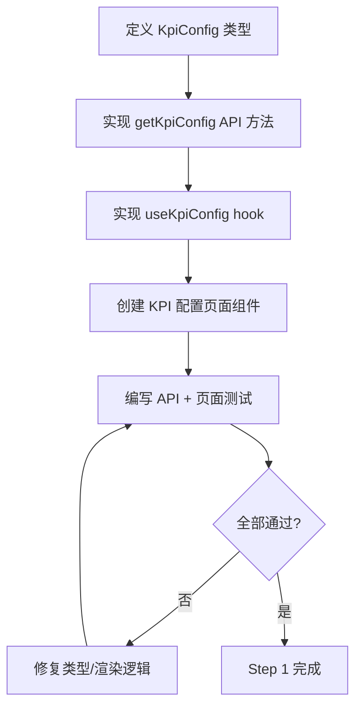
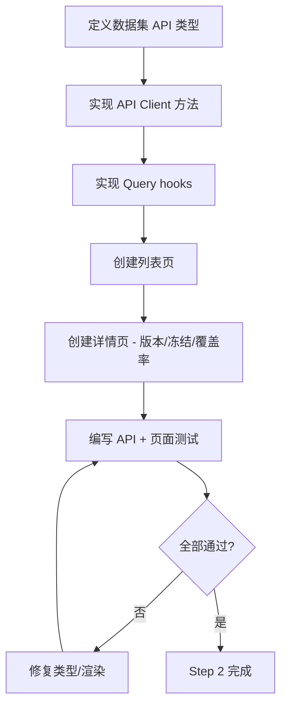
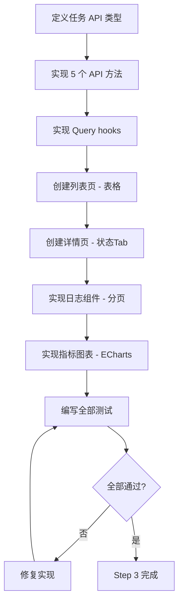
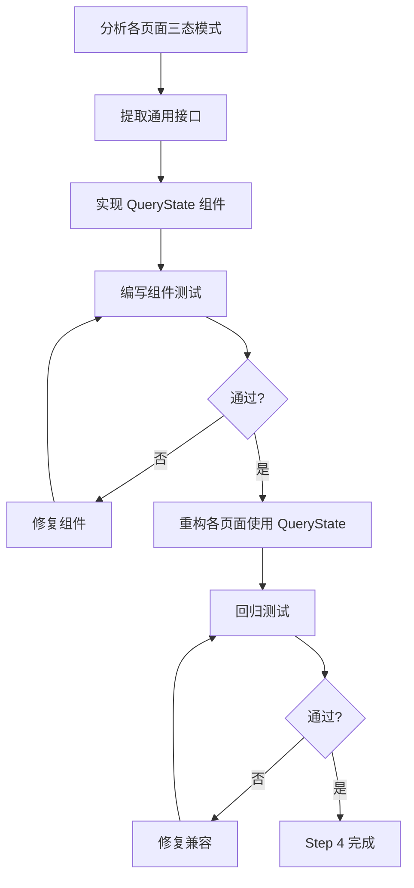

# 前端层 TDD实施计划 - Phase 2: 核心读操作页面

## 概述

本阶段打通前端"可查看"链路：实现项目 KPI 配置查看、数据集版本与场景覆盖率查看、任务列表与任务详情（状态/日志/指标）页面。所有页面具备 loading/empty/error 三态，完成列表到详情的导航闭环。本阶段奠定数据展示层模式，后续写操作和报告页面均复用此处的 API Client 方法与 Query hooks。

**阶段目标**:
- 数据可查看 - 项目/数据集/任务三大业务域均有可用的展示页面
- 三态完备 - 每个数据页面处理 loading、empty、error 三种状态
- 模式可复用 - 建立标准化的 TanStack Query hooks + API Client 模式

**前置依赖**:
- Phase 1 全局布局与 API 客户端
- 后端项目/数据集/任务查询接口可用
- `docs/dev_step/4.接口层_API路由清单.md`（各接口字段与响应结构）
- `docs/dev_step/4.接口层_API联调用例.md`（请求示例与预期响应）

## Phase 2 包含的步骤

| 步骤 | 名称 | 状态 | 测试 | 完成日期 |
|------|------|------|------|----------|
| Step 1 | 项目 API Client 与 KPI 配置页面 | ⏳ | -/- | - |
| Step 2 | 数据集 API Client 与列表/详情页面 | ⏳ | -/- | - |
| Step 3 | 任务 API Client 与列表/详情页面 | ⏳ | -/- | - |
| Step 4 | 通用三态组件封装 | ⏳ | -/- | - |

**步骤列表**:
- **Step 1**: 项目 API Client 与 KPI 配置页面
- **Step 2**: 数据集 API Client 与列表/详情页面
- **Step 3**: 任务 API Client 与列表/详情页面
- **Step 4**: 通用三态组件封装

---

## Step 1: 项目 API Client 与 KPI 配置页面 (ProjectReadView) ⏳

**目标**: 实现项目 API Client 方法，完成 KPI 配置查看页面，展示权重、阈值、约束条件，具备 loading/empty/error 三态。

**上下文依赖**:
- 读取 `docs/dev_step/4.接口层_API路由清单.md` 了解 `GET /projects/{project_id}/kpi-config` 响应结构
- 读取 `docs/init/5.附录.md` 了解 KPI 配置示例
- Phase 1 `request.ts` API 客户端基础

**交付物**:
- ⏳ `frontend/src/lib/api/project.ts` - 项目 API 方法
- ⏳ `frontend/src/features/project/hooks/useKpiConfig.ts` - KPI 配置 Query hook
- ⏳ `frontend/src/app/(dashboard)/projects/[id]/kpi-config/page.tsx` - KPI 配置页面
- ⏳ `frontend/__tests__/lib/api/project.test.ts` - API Client 测试

**验收标准**:
- [ ] `getKpiConfig(projectId)` 返回完整 KPI 配置对象
- [ ] 项目不存在时返回 `NOT_FOUND` 错误结构
- [ ] 页面 loading 态可见（骨架屏或加载指示器）
- [ ] 数据正确展示：primary_kpi、权重（eval/deploy）、阈值、约束条件
- [ ] 项目不存在时显示错误态

**实现状态**: ⏳ 待开始
**测试结果**: 0/0 测试通过
**计划实现日期**: YYYY-MM-DD

---

### Red Phase - 失败的测试定义

**测试文件**: `frontend/__tests__/lib/api/project.test.ts`

**核心测试用例**:
- ❌ `test_get_kpi_config_returns_valid_structure` - 返回包含权重/阈值/约束的完整结构
- ❌ `test_get_kpi_config_not_found_throws_api_error` - 项目不存在抛出 NOT_FOUND 错误
- ❌ `test_kpi_config_query_key_includes_project_id` - Query key 包含 projectId
- ❌ `test_kpi_page_shows_loading_state` - 页面渲染加载态
- ❌ `test_kpi_page_displays_weights_and_threshold` - 页面展示权重与阈值

**关键验证点**:
- **类型完整性** - API 返回类型覆盖所有 KPI 配置字段
- **错误处理** - NOT_FOUND 错误正确传播到 UI
- **数据绑定** - 页面字段与后端响应一一对应

**验证流程图**:

---

### Green Phase - 实现最小化功能

**实现文件**:
- `frontend/src/lib/api/project.ts` - `getKpiConfig` 方法
- `frontend/src/features/project/hooks/useKpiConfig.ts` - Query hook
- `frontend/src/app/(dashboard)/projects/[id]/kpi-config/page.tsx` - 页面组件

**核心组件**:
- `getKpiConfig(projectId)` - 调用 `GET /projects/{id}/kpi-config`
- `useKpiConfig(projectId)` - 封装 `useQuery`，返回 data/isLoading/error
- `KpiConfigPage` - 展示 primary_kpi/权重/阈值/约束列表

**主要功能**:

| 功能 | 类型 | 功能描述 | 验收标准 |
|------|------|----------|----------|
| getKpiConfig | API | 查询 KPI 配置 | 类型与后端一致 |
| useKpiConfig | Hook | TanStack Query 封装 | loading/error/data 三态 |
| KPI 展示 | 页面 | 权重/阈值/约束展示 | 字段正确渲染 |

---

### Refactor Phase - 优化和扩展

**重构目标**:
1. 抽取 API Client 方法生成模式（为后续 dataset/job 模块复用）
2. 优化 KPI 数据展示样式（卡片式布局）
3. 错误态展示统一化

**验收标准**:
- [ ] API Client 方法模式可复用
- [ ] KPI 页面视觉结构清晰
- [ ] 回归测试全部通过

---

## Step 2: 数据集 API Client 与列表/详情页面 (DatasetReadView) ⏳

**目标**: 实现数据集 API Client 方法，完成数据集列表页面与详情页面（版本信息、冻结状态、场景覆盖率维度统计），具备三态展示。

**上下文依赖**:
- 读取 `docs/dev_step/4.接口层_API路由清单.md` 了解数据集相关接口
- Phase 1 `request.ts` API 客户端基础
- Step 1 中建立的 API Client 模式

**交付物**:
- ⏳ `frontend/src/lib/api/dataset.ts` - 数据集 API 方法
- ⏳ `frontend/src/features/dataset/hooks/` - 数据集 Query hooks
- ⏳ `frontend/src/app/(dashboard)/datasets/page.tsx` - 列表页（替换占位）
- ⏳ `frontend/src/app/(dashboard)/datasets/[id]/page.tsx` - 详情页
- ⏳ `frontend/__tests__/lib/api/dataset.test.ts` - API Client 测试

**验收标准**:
- [ ] 导入/冻结/标签/覆盖率接口类型完整
- [ ] 列表页渲染正确，空列表显示提示
- [ ] 详情页展示版本信息与冻结状态标识
- [ ] 覆盖率按维度统计展示
- [ ] loading/empty/error 三态完备

**实现状态**: ⏳ 待开始
**测试结果**: 0/0 测试通过
**计划实现日期**: YYYY-MM-DD

---

### Red Phase - 失败的测试定义

**测试文件**: `frontend/__tests__/lib/api/dataset.test.ts`

**核心测试用例**:
- ❌ `test_get_scene_coverage_returns_dimension_stats` - 覆盖率按维度返回统计
- ❌ `test_dataset_list_renders_items` - 列表页渲染数据集条目
- ❌ `test_dataset_list_empty_state` - 空列表显示提示信息
- ❌ `test_dataset_detail_shows_freeze_status` - 详情页显示冻结状态
- ❌ `test_dataset_detail_shows_coverage_by_dimension` - 详情页展示覆盖率维度

**关键验证点**:
- **类型完整性** - import/freeze/labels/coverage 四个接口类型齐全
- **列表与详情** - 列表可点击跳转详情，详情参数从 URL 获取
- **覆盖率展示** - 维度统计结构正确渲染

**验证流程图**:

---

### Green Phase - 实现最小化功能

**实现文件**:
- `frontend/src/lib/api/dataset.ts` - 数据集 API 方法集合
- `frontend/src/features/dataset/hooks/` - useDatasetList, useDatasetDetail, useSceneCoverage
- `frontend/src/app/(dashboard)/datasets/page.tsx` - 列表页
- `frontend/src/app/(dashboard)/datasets/[id]/page.tsx` - 详情页

**核心组件**:
- `getSceneCoverage(dvId, dimensions)` - 获取场景覆盖率
- `useDatasetList()` - 数据集列表 hook
- `useDatasetDetail(id)` - 数据集详情 hook
- `useSceneCoverage(dvId, dimensions)` - 覆盖率 hook

**主要功能**:

| 功能 | 类型 | 功能描述 | 验收标准 |
|------|------|----------|----------|
| 数据集列表 | 页面 | 展示所有数据集 | 有数据渲染、空态提示 |
| 数据集详情 | 页面 | 版本/冻结/覆盖率 | 字段正确展示 |
| 场景覆盖率 | 展示 | 按维度统计 | 维度数据表格渲染 |
| 列表→详情导航 | 路由 | 点击列表行跳转 | 路由参数正确传递 |

---

### Refactor Phase - 优化和扩展

**重构目标**:
1. 统一数据集状态标识（冻结/未冻结）样式
2. 覆盖率展示支持多种视图（表格/简单图表）
3. 抽取列表页通用骨架

**验收标准**:
- [ ] 状态标识视觉一致
- [ ] 覆盖率数据可读性良好
- [ ] 回归测试全部通过

---

## Step 3: 任务 API Client 与列表/详情页面 (JobReadView) ⏳

**目标**: 实现任务 API Client 方法，完成任务列表页（关键字段 + 跳转详情）与详情页（状态/日志分页/指标图表），具备三态展示。

**上下文依赖**:
- 读取 `docs/dev_step/4.接口层_API路由清单.md` 了解任务相关 5 个接口
- 读取 `docs/init/5.附录.md` 了解指标类型
- Phase 1 API 客户端 + Step 1/2 中建立的模式

**交付物**:
- ⏳ `frontend/src/lib/api/job.ts` - 任务 API 方法
- ⏳ `frontend/src/features/job/hooks/` - 任务 Query hooks
- ⏳ `frontend/src/app/(dashboard)/jobs/page.tsx` - 任务列表页（替换占位）
- ⏳ `frontend/src/app/(dashboard)/jobs/[id]/page.tsx` - 任务详情页
- ⏳ `frontend/src/features/job/components/LogViewer.tsx` - 日志查看组件
- ⏳ `frontend/src/features/job/components/MetricsChart.tsx` - 指标图表组件
- ⏳ `frontend/__tests__/lib/api/job.test.ts` - API Client 测试

**验收标准**:
- [ ] 任务创建/查询/启动/日志/指标接口类型完整
- [ ] 列表页表格列含 job_id/status/task_type/updated_at
- [ ] 点击列表行跳转任务详情页
- [ ] 详情页状态正确展示并有颜色标识
- [ ] 日志 Tab 支持分页加载，无日志显示空态
- [ ] 指标 Tab 图表渲染（loss/mAP 等），无指标显示空态
- [ ] 不存在的任务显示 404

**实现状态**: ⏳ 待开始
**测试结果**: 0/0 测试通过
**计划实现日期**: YYYY-MM-DD

---

### Red Phase - 失败的测试定义

**测试文件**: `frontend/__tests__/lib/api/job.test.ts`

**核心测试用例**:
- ❌ `test_get_job_returns_status_and_type` - 任务查询返回状态与类型
- ❌ `test_get_logs_supports_pagination` - 日志分页参数正确传递
- ❌ `test_get_metrics_supports_time_window` - 指标时间窗口参数正确
- ❌ `test_job_list_table_columns` - 列表页表格列正确
- ❌ `test_job_detail_status_color_mapping` - 状态颜色映射正确
- ❌ `test_log_viewer_pagination` - 日志分页加载正确
- ❌ `test_metrics_chart_renders` - 指标图表渲染

**关键验证点**:
- **日志分页** - `page`/`page_size` 参数正确传递，分页数据正确拼接
- **指标时间窗口** - `start_ts`/`end_ts` 参数正确传递
- **状态映射** - CREATED/QUEUED/RUNNING/SUCCEEDED/FAILED 各有视觉标识
- **图表渲染** - ECharts 组件正确渲染指标数据

**验证流程图**:

---

### Green Phase - 实现最小化功能

**实现文件**:
- `frontend/src/lib/api/job.ts` - 任务 API 方法集合
- `frontend/src/features/job/hooks/` - useJobList, useJob, useJobLogs, useJobMetrics
- `frontend/src/features/job/components/LogViewer.tsx` - 日志分页展示
- `frontend/src/features/job/components/MetricsChart.tsx` - 指标图表

**核心组件**:
- `getJob(jobId)` / `getJobLogs(jobId, page, pageSize)` / `getJobMetrics(jobId, startTs, endTs)` - 任务 API
- `useJobList()` - 任务列表 hook
- `useJob(jobId)` - 任务详情 hook
- `LogViewer` - 日志分页查看组件
- `MetricsChart` - ECharts 指标图表组件

**主要功能**:

| 功能 | 类型 | 功能描述 | 验收标准 |
|------|------|----------|----------|
| 任务列表 | 页面 | 表格展示 + 行跳转 | 列含 id/status/type/time |
| 任务详情 | 页面 | 状态/日志/指标 Tab | Tab 切换正确 |
| 日志查看 | 组件 | 分页加载日志 | 分页参数正确 |
| 指标图表 | 组件 | ECharts 渲染 | 图表可见 |
| 状态颜色 | 样式 | 5 种状态颜色映射 | 颜色可区分 |

---

### Refactor Phase - 优化和扩展

**重构目标**:
1. 抽取任务状态颜色映射为共享常量
2. 日志分页支持无限滚动（可选）
3. 指标图表支持时间范围选择器

**验收标准**:
- [ ] 状态映射集中管理
- [ ] 日志/指标组件可独立复用
- [ ] 回归测试全部通过

---

## Step 4: 通用三态组件封装 (QueryStateComponent) ⏳

**目标**: 从 Step 1-3 各页面中抽取通用的 loading/empty/error 展示组件，消除页面间重复代码，统一三态 UI 表现。

**上下文依赖**:
- Step 1-3 各页面中已实现的三态逻辑
- shadcn/ui 组件库

**交付物**:
- ⏳ `frontend/src/components/QueryState.tsx` - 通用三态组件
- ⏳ `frontend/__tests__/components/QueryState.test.tsx` - 组件测试

**验收标准**:
- [ ] `QueryState` 组件支持 loading/empty/error 三种状态渲染
- [ ] loading 态展示加载指示器
- [ ] empty 态展示自定义空态提示
- [ ] error 态展示错误码与可读消息
- [ ] 已有页面重构为使用 `QueryState` 组件

**实现状态**: ⏳ 待开始
**测试结果**: 0/0 测试通过
**计划实现日期**: YYYY-MM-DD

---

### Red Phase - 失败的测试定义

**测试文件**: `frontend/__tests__/components/QueryState.test.tsx`

**核心测试用例**:
- ❌ `test_loading_state_shows_spinner` - loading 态展示加载器
- ❌ `test_empty_state_shows_custom_message` - empty 态展示自定义消息
- ❌ `test_error_state_shows_code_and_message` - error 态展示错误码与消息
- ❌ `test_success_state_renders_children` - 成功态渲染子内容
- ❌ `test_error_state_supports_retry` - 错误态支持重试按钮

**关键验证点**:
- **组件独立性** - 三态组件可脱离业务独立渲染
- **错误信息展示** - 错误码与消息均可见
- **重试能力** - 错误态可触发数据重新请求

**验证流程图**:

---

### Green Phase - 实现最小化功能

**实现文件**:
- `frontend/src/components/QueryState.tsx` - 通用三态组件

**核心组件**:
- `QueryState` - 接收 `isLoading`/`error`/`isEmpty`/`children` 的展示组件

**主要功能**:

| 功能 | 类型 | 功能描述 | 验收标准 |
|------|------|----------|----------|
| Loading 态 | UI | 加载指示器 | 可见且无闪烁 |
| Empty 态 | UI | 自定义空态消息 | 消息可配置 |
| Error 态 | UI | 错误码 + 消息 + 重试 | 信息完整可读 |
| Success 态 | UI | 透传子组件渲染 | 子内容正确展示 |

---

### Refactor Phase - 优化和扩展

**重构目标**:
1. 将 Step 1-3 所有页面的三态逻辑替换为 `QueryState`
2. 统一 loading 骨架屏样式
3. 错误态支持不同级别展示（toast vs 全页面）

**验收标准**:
- [ ] 所有读操作页面使用 `QueryState`
- [ ] 三态视觉一致
- [ ] 回归测试全部通过

---

## Phase 2 完成总结

### 完成状态

| 步骤 | 名称 | 状态 | 测试 | 完成日期 |
|------|------|------|------|----------|
| Step 1 | 项目 API Client 与 KPI 配置页面 | ⏳ | -/- | - |
| Step 2 | 数据集 API Client 与列表/详情页面 | ⏳ | -/- | - |
| Step 3 | 任务 API Client 与列表/详情页面 | ⏳ | -/- | - |
| Step 4 | 通用三态组件封装 | ⏳ | -/- | - |

### 实现检查清单
- [ ] Red：失败测试先行且覆盖全部验收项
- [ ] Green：最小实现通过核心路径
- [ ] Refactor：重构后无行为漂移

### 质量标准
- [ ] 所有 API Client 方法有明确 TypeScript 类型定义
- [ ] 所有 Query hooks 使用 TanStack Query 标准模式
- [ ] 页面组件使用 shadcn/ui，无裸 HTML 样式
- [ ] Vitest 测试覆盖 API Client 层
- [ ] 满足 Phase F2 交付要求：核心"可查看"链路完整
