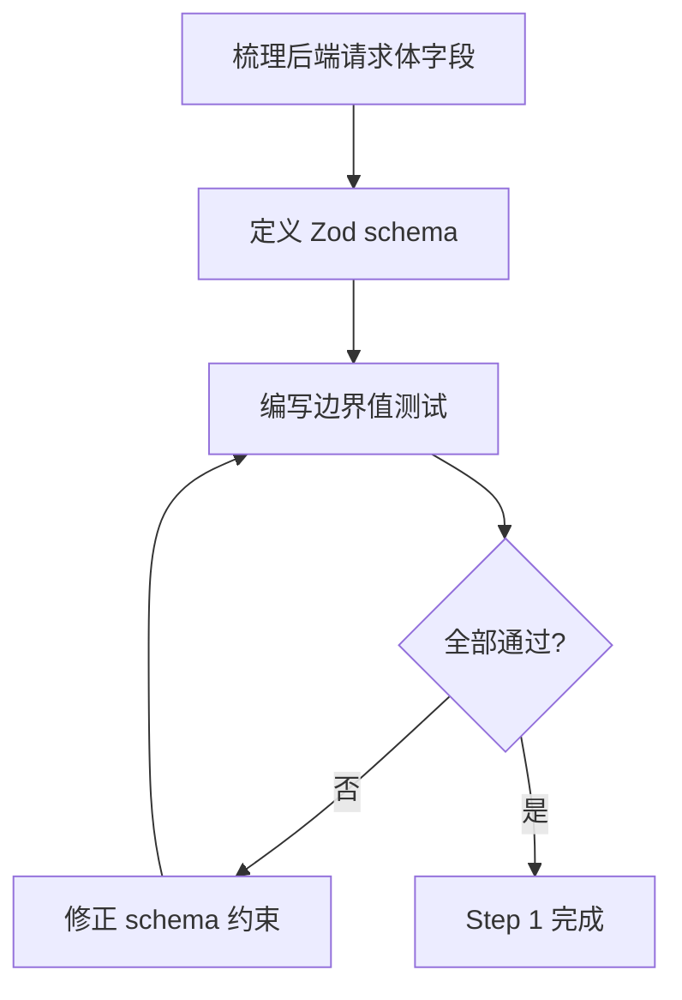
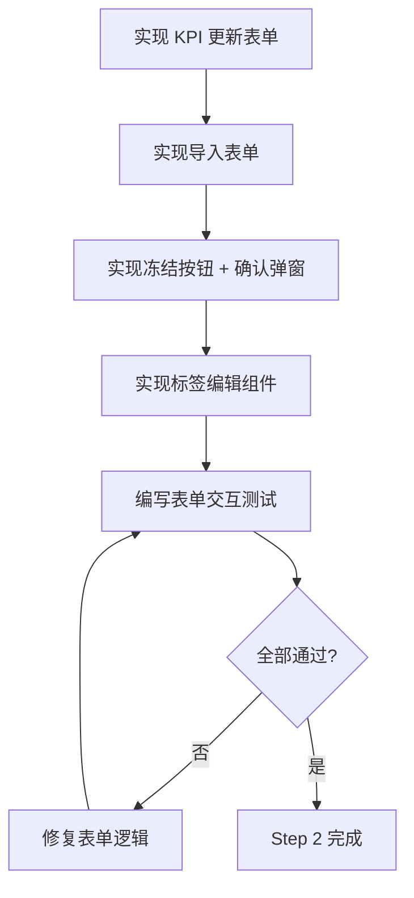
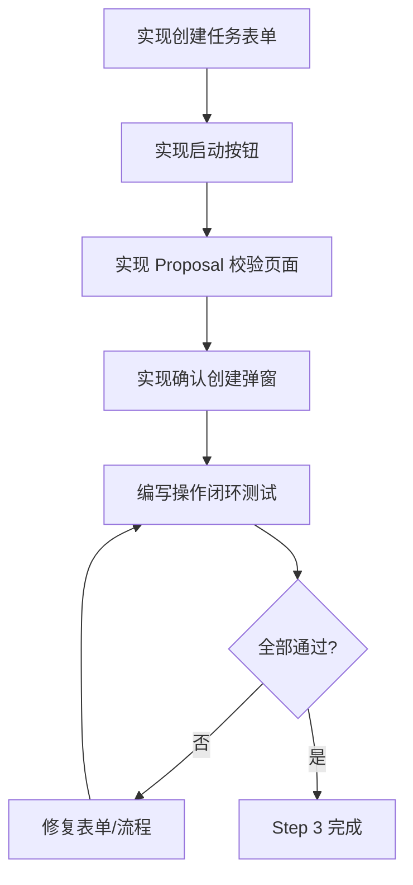
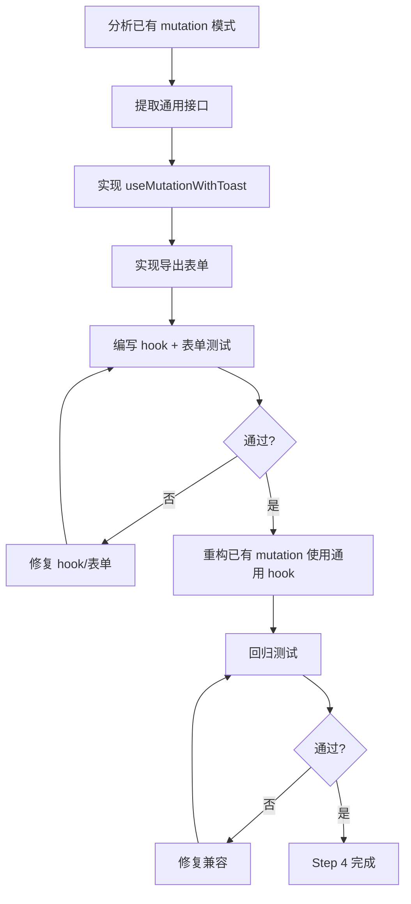

# 前端层 TDD实施计划 - Phase 3: 核心写操作页面

## 概述

本阶段打通前端"可发起动作"链路：实现 KPI 配置更新、数据集导入/冻结、创建训练任务/启动任务、Proposal 校验与确认创建、创建导出任务的表单页面。所有表单具备校验反馈与成功/失败提示，完成"查 → 提 → 看"交互闭环。本阶段核心是建立前端表单开发范式：React Hook Form + Zod schema + useMutation + toast 反馈。

**阶段目标**:
- 动作可发起 - 5 大业务域的核心写操作表单均可提交
- 校验可预防 - 前端 Zod schema 前置校验，减少无效请求
- 反馈可感知 - 成功操作有 toast/跳转，失败操作展示后端错误消息

**前置依赖**:
- Phase 2 API Client 方法与 Query hooks
- Phase 2 列表页面（成功后跳转目标）
- 后端写操作接口可用
- `docs/dev_step/4.接口层_API路由清单.md`（PUT/POST 请求体字段）
- `docs/init/5.附录.md`（KPI 配置示例、场景枚举）

## Phase 3 包含的步骤

| 步骤 | 名称 | 状态 | 测试 | 完成日期 |
|------|------|------|------|----------|
| Step 1 | 表单 Zod Schema 定义 | ⏳ | -/- | - |
| Step 2 | KPI 配置更新与数据集写操作 | ⏳ | -/- | - |
| Step 3 | 任务创建/启动与 Proposal 流程 | ⏳ | -/- | - |
| Step 4 | 导出创建与通用 Mutation Hook | ⏳ | -/- | - |

**步骤列表**:
- **Step 1**: 表单 Zod Schema 定义
- **Step 2**: KPI 配置更新与数据集写操作
- **Step 3**: 任务创建/启动与 Proposal 流程
- **Step 4**: 导出创建与通用 Mutation Hook

---

## Step 1: 表单 Zod Schema 定义 (FormSchemas) ⏳

**目标**: 为所有写操作表单定义 Zod 校验 schema，确保前端校验约束不弱于后端，边界值处理正确。

**上下文依赖**:
- 读取 `docs/dev_step/4.接口层_API路由清单.md` 了解各接口 PUT/POST 请求体字段
- 读取 `docs/init/5.附录.md` 了解场景枚举、KPI 配置约束
- Phase 1 `types.ts` 基础类型

**交付物**:
- ⏳ `frontend/src/schemas/kpi-config.ts` - KPI 配置 schema
- ⏳ `frontend/src/schemas/dataset.ts` - 数据集导入/标签 schema
- ⏳ `frontend/src/schemas/job.ts` - 任务创建 schema
- ⏳ `frontend/src/schemas/proposal.ts` - Proposal 校验/确认 schema
- ⏳ `frontend/src/schemas/export.ts` - 导出任务 schema
- ⏳ `frontend/__tests__/schemas/` - schema 边界值测试

**验收标准**:
- [ ] KPI schema：eval + deploy 权重之和校验、阈值范围校验
- [ ] 数据集 schema：version 必填正整数、manifest_uri 格式校验
- [ ] 任务 schema：job_id/task_type/dataset_version_id 必填、gpu_count > 0
- [ ] Proposal schema：candidate/baseline_job_id/who/when/confirmed 必填
- [ ] 导出 schema：job_id/run_id/backend 必填、backend 枚举限制
- [ ] 所有 schema 拒绝非法输入、通过合法输入

**实现状态**: ⏳ 待开始
**测试结果**: 0/0 测试通过
**计划实现日期**: YYYY-MM-DD

---

### Red Phase - 失败的测试定义

**测试文件**: `frontend/__tests__/schemas/*.test.ts`

**核心测试用例**:
- ❌ `test_kpi_schema_rejects_invalid_weight_sum` - 权重之和超出范围拒绝
- ❌ `test_kpi_schema_accepts_valid_config` - 合法配置通过
- ❌ `test_dataset_import_schema_requires_version_positive_int` - version 必须为正整数
- ❌ `test_scene_label_schema_requires_other_text_when_weather_other` - weather=other 时 other_text 必填
- ❌ `test_job_schema_requires_gpu_count_positive` - gpu_count > 0
- ❌ `test_proposal_confirm_schema_requires_all_fields` - 确认创建必填字段齐全
- ❌ `test_export_schema_limits_backend_enum` - backend 仅允许枚举值

**关键验证点**:
- **边界值** - 零值、负值、空字符串、超长输入
- **条件校验** - 字段间联动校验（如 weather=other → other_text 必填）
- **枚举约束** - 枚举外值被拒绝

**验证流程图**:

---

### Green Phase - 实现最小化功能

**实现文件**:
- `frontend/src/schemas/*.ts` - 5 个业务域的 Zod schema

**核心组件**:
- `kpiConfigSchema` - KPI 配置校验（权重/阈值/约束）
- `datasetImportSchema` - 数据集导入校验（version/manifest_uri）
- `sceneLabelSchema` - 场景标签校验（枚举 + 条件必填）
- `createJobSchema` - 任务创建校验（必填 + gpu_count）
- `proposalConfirmSchema` - Proposal 确认校验（全部必填 + confirmed=true）
- `createExportSchema` - 导出创建校验（必填 + backend 枚举）

**主要功能**:

| Schema | 关键校验 | 验收标准 |
|--------|----------|----------|
| kpiConfigSchema | 权重范围、阈值范围 | 非法权重拒绝 |
| datasetImportSchema | version 正整数、URI 格式 | 零/负值拒绝 |
| sceneLabelSchema | 枚举 + 条件必填 | other 无 text 拒绝 |
| createJobSchema | 必填 + gpu_count > 0 | 缺字段拒绝 |
| proposalConfirmSchema | 全必填 + confirmed | 未确认拒绝 |
| createExportSchema | backend 枚举 | 非法 backend 拒绝 |

---

### Refactor Phase - 优化和扩展

**重构目标**:
1. 抽取共享校验规则（如 positiveInt、nonEmptyString）
2. 统一校验错误消息为中文
3. 确保 schema 与后端契约文档同步

**验收标准**:
- [ ] 共享校验规则可复用
- [ ] 错误消息中文可读
- [ ] 回归测试全部通过

---

## Step 2: KPI 配置更新与数据集写操作 (ProjectDatasetMutations) ⏳

**目标**: 实现 KPI 配置更新表单、数据集导入表单、版本冻结操作、场景标签编辑，所有表单使用 React Hook Form + Zod，写操作成功后刷新关联数据。

**上下文依赖**:
- Step 1 完成的 Zod schemas
- Phase 2 项目/数据集页面与 Query hooks
- `docs/dev_step/4.接口层_API路由清单.md` PUT/POST 接口

**交付物**:
- ⏳ `frontend/src/features/project/components/KpiConfigForm.tsx` - KPI 更新表单
- ⏳ `frontend/src/features/dataset/components/ImportForm.tsx` - 数据集导入表单
- ⏳ `frontend/src/features/dataset/components/FreezeButton.tsx` - 版本冻结按钮
- ⏳ `frontend/src/features/dataset/components/SceneLabelEditor.tsx` - 场景标签编辑
- ⏳ `frontend/__tests__/features/project/KpiConfigForm.test.tsx` - 表单测试

**验收标准**:
- [ ] KPI 表单：权重之和校验反馈、阈值范围校验、提交成功后页面刷新
- [ ] 导入表单：version/manifest_uri 校验、导入成功后列表可见新版本
- [ ] 冻结操作：确认弹窗、冻结成功后按钮禁用并显示"已冻结"、重复冻结显示 CONFLICT
- [ ] 标签编辑：批量写入、weather=other 条件校验、枚举外值拒绝
- [ ] 所有操作失败时展示后端 error.message

**实现状态**: ⏳ 待开始
**测试结果**: 0/0 测试通过
**计划实现日期**: YYYY-MM-DD

---

### Red Phase - 失败的测试定义

**测试文件**: `frontend/__tests__/features/project/KpiConfigForm.test.tsx`, `frontend/__tests__/features/dataset/*.test.tsx`

**核心测试用例**:
- ❌ `test_kpi_form_validates_weight_sum` - 权重之和校验反馈
- ❌ `test_kpi_form_submits_and_refreshes` - 提交成功后刷新 Query 缓存
- ❌ `test_import_form_validates_version` - version 必须为正整数
- ❌ `test_freeze_button_shows_confirm_dialog` - 冻结前弹出确认
- ❌ `test_freeze_success_disables_button` - 冻结成功后按钮禁用
- ❌ `test_scene_label_conditional_validation` - weather=other 条件校验
- ❌ `test_mutation_failure_shows_error_toast` - 写操作失败显示错误 toast

**关键验证点**:
- **表单校验** - Zod schema 与 React Hook Form 联动
- **缓存刷新** - 写操作成功后 `invalidateQueries` 刷新关联列表
- **不可逆保护** - 冻结操作有确认弹窗

**验证流程图**:

---

### Green Phase - 实现最小化功能

**核心组件**:
- `KpiConfigForm` - React Hook Form + kpiConfigSchema + PUT 提交
- `ImportForm` - 导入表单 + POST 提交
- `FreezeButton` - 冻结按钮 + AlertDialog 确认
- `SceneLabelEditor` - 标签批量编辑 + 条件校验

**主要功能**:

| 组件 | 操作 | 成功反馈 | 失败反馈 |
|------|------|----------|----------|
| KpiConfigForm | PUT kpi-config | 页面刷新展示新值 | toast 显示错误 |
| ImportForm | POST import | 列表可见新版本 | toast 显示错误 |
| FreezeButton | POST freeze | 按钮禁用 + "已冻结" | CONFLICT toast |
| SceneLabelEditor | PUT scene-labels | 标签更新可见 | toast 显示错误 |

---

### Refactor Phase - 优化和扩展

**重构目标**:
1. 统一表单提交 loading 状态（按钮 disabled + spinner）
2. 抽取确认弹窗通用模式
3. 表单默认值从 Query 数据预填

**验收标准**:
- [ ] 表单提交状态一致
- [ ] 确认弹窗模式可复用
- [ ] 回归测试全部通过

---

## Step 3: 任务创建/启动与 Proposal 流程 (JobProposalMutations) ⏳

**目标**: 实现创建训练任务表单、任务启动操作、Proposal 校验页面与确认创建弹窗，完成训练 → 评估 → 候选 → 确认的操作闭环。

**上下文依赖**:
- Step 1 完成的 job/proposal Zod schemas
- Phase 2 任务列表/详情页面
- `docs/dev_step/4.接口层_API路由清单.md` 任务/Proposal 接口

**交付物**:
- ⏳ `frontend/src/features/job/components/CreateJobForm.tsx` - 创建任务表单
- ⏳ `frontend/src/features/job/components/StartJobButton.tsx` - 启动任务按钮
- ⏳ `frontend/src/features/proposal/components/ValidateForm.tsx` - Proposal 校验表单
- ⏳ `frontend/src/features/proposal/components/ConfirmCreateDialog.tsx` - 确认创建弹窗
- ⏳ `frontend/__tests__/features/job/*.test.tsx` - 测试
- ⏳ `frontend/__tests__/features/proposal/*.test.tsx` - 测试

**验收标准**:
- [ ] 创建任务：job_id/task_type/dataset_version_id 必填、gpu_count > 0、提交成功跳转详情
- [ ] 启动任务：gpu_id 必填、启动成功状态变更为 RUNNING、非法状态报错提示
- [ ] Proposal 校验：提交后展示 accepted 数量、失败展示错误详情
- [ ] 确认创建：必填字段 + confirmed=true、确认后创建新任务并跳转
- [ ] 幂等 key 复用不报错

**实现状态**: ⏳ 待开始
**测试结果**: 0/0 测试通过
**计划实现日期**: YYYY-MM-DD

---

### Red Phase - 失败的测试定义

**测试文件**: `frontend/__tests__/features/job/*.test.tsx`, `frontend/__tests__/features/proposal/*.test.tsx`

**核心测试用例**:
- ❌ `test_create_job_form_validates_required_fields` - 必填字段校验
- ❌ `test_create_job_success_navigates_to_detail` - 成功跳转详情
- ❌ `test_start_job_requires_gpu_id` - gpu_id 必填
- ❌ `test_start_job_invalid_state_shows_error` - 非法状态启动报错
- ❌ `test_proposal_validate_shows_accepted_count` - 显示通过数量
- ❌ `test_proposal_confirm_creates_job_and_navigates` - 确认后创建并跳转
- ❌ `test_proposal_confirm_requires_all_fields` - 确认必填字段完整

**关键验证点**:
- **操作闭环** - 创建 → 启动 → 评估 → 候选 → 确认的链路可走通
- **状态约束** - 非法状态操作被拦截
- **幂等性** - 重复提交使用幂等 key 不报错

**验证流程图**:

---

### Green Phase - 实现最小化功能

**核心组件**:
- `CreateJobForm` - 任务创建表单（RHF + createJobSchema）
- `StartJobButton` - 启动按钮（gpu_id 输入 + 状态检查）
- `ValidateForm` - Proposal 校验表单（展示 accepted 结果）
- `ConfirmCreateDialog` - 确认弹窗（预填 candidate + 必填字段）

**主要功能**:

| 组件 | 操作 | 成功反馈 | 失败反馈 |
|------|------|----------|----------|
| CreateJobForm | POST /jobs | 跳转详情页 | toast 必填提示 |
| StartJobButton | POST /jobs/{id}/start | 状态变更 RUNNING | toast 状态错误 |
| ValidateForm | POST /proposals/validate | 展示 accepted 数量 | 展示错误详情 |
| ConfirmCreateDialog | POST /proposals/create-from-candidate | 跳转新任务 | toast 错误 |

---

### Refactor Phase - 优化和扩展

**重构目标**:
1. 统一表单提交与跳转模式
2. Proposal 确认弹窗支持从候选实验卡片预填（Phase 4 对接）
3. 表单重置与缓存清理标准化

**验收标准**:
- [ ] 操作模式一致可预期
- [ ] 预填机制预留扩展点
- [ ] 回归测试全部通过

---

## Step 4: 导出创建与通用 Mutation Hook (ExportAndMutationPattern) ⏳

**目标**: 实现创建导出任务表单，抽取通用 `useMutationWithToast` hook 统一所有写操作的 loading/toast/错误处理模式。

**上下文依赖**:
- Step 1 完成的 export Zod schema
- Step 2-3 中已实现的多个 mutation 模式
- Phase 2 API Client

**交付物**:
- ⏳ `frontend/src/features/export/components/CreateExportForm.tsx` - 创建导出表单
- ⏳ `frontend/src/lib/query/useMutationWithToast.ts` - 通用 Mutation hook
- ⏳ `frontend/__tests__/lib/query/useMutationWithToast.test.ts` - hook 测试

**验收标准**:
- [ ] 导出表单：job_id/run_id/backend 必填、backend 当前仅支持 tensorrt
- [ ] 提交成功跳转导出列表
- [ ] `useMutationWithToast` 统一成功 toast、失败错误 toast、loading 按钮 disabled
- [ ] 已有写操作组件重构为使用 `useMutationWithToast`

**实现状态**: ⏳ 待开始
**测试结果**: 0/0 测试通过
**计划实现日期**: YYYY-MM-DD

---

### Red Phase - 失败的测试定义

**测试文件**: `frontend/__tests__/lib/query/useMutationWithToast.test.ts`

**核心测试用例**:
- ❌ `test_mutation_success_shows_success_toast` - 成功显示成功 toast
- ❌ `test_mutation_failure_shows_error_toast_with_message` - 失败显示后端错误消息
- ❌ `test_mutation_loading_returns_is_pending` - loading 时 isPending=true
- ❌ `test_export_form_validates_backend_enum` - backend 仅允许枚举值
- ❌ `test_export_form_success_navigates_to_list` - 导出成功跳转列表

**关键验证点**:
- **通用性** - hook 可适配不同业务域的 mutation
- **反馈一致性** - 成功/失败/loading 行为统一
- **类型安全** - 泛型支持不同请求/响应类型

**验证流程图**:

---

### Green Phase - 实现最小化功能

**核心组件**:
- `useMutationWithToast<TData, TVariables>` - 封装 `useMutation` + toast 反馈
- `CreateExportForm` - 导出创建表单（RHF + createExportSchema）

**主要功能**:

| 功能 | 类型 | 功能描述 | 验收标准 |
|------|------|----------|----------|
| useMutationWithToast | Hook | 通用 mutation + toast | 成功/失败/loading 统一 |
| CreateExportForm | 表单 | 导出任务创建 | 校验通过可提交 |
| 成功 toast | 反馈 | 操作成功提示 | toast 可见 |
| 错误 toast | 反馈 | 后端错误消息展示 | 含 code + message |

---

### Refactor Phase - 优化和扩展

**重构目标**:
1. 将 Step 2-3 所有 mutation 替换为 `useMutationWithToast`
2. 统一 toast 样式与持续时间
3. 添加 mutation 缓存失效策略配置

**验收标准**:
- [ ] 所有写操作使用统一 hook
- [ ] toast 行为一致
- [ ] 回归测试全部通过

---

## Phase 3 完成总结

### 完成状态

| 步骤 | 名称 | 状态 | 测试 | 完成日期 |
|------|------|------|------|----------|
| Step 1 | 表单 Zod Schema 定义 | ⏳ | -/- | - |
| Step 2 | KPI 配置更新与数据集写操作 | ⏳ | -/- | - |
| Step 3 | 任务创建/启动与 Proposal 流程 | ⏳ | -/- | - |
| Step 4 | 导出创建与通用 Mutation Hook | ⏳ | -/- | - |

### 实现检查清单
- [ ] Red：失败测试先行且覆盖全部验收项
- [ ] Green：最小实现通过核心路径
- [ ] Refactor：重构后无行为漂移

### 质量标准
- [ ] 所有 Zod schema 有 Vitest 测试覆盖
- [ ] 写操作均有 loading 状态防重复提交
- [ ] 关键不可逆操作有确认弹窗
- [ ] 成功/失败反馈明确（toast/跳转/错误信息）
- [ ] 满足 Phase F3 交付要求：核心"可发起动作"链路完整
- [ ] "查 → 提 → 看"基础交互闭环完成
