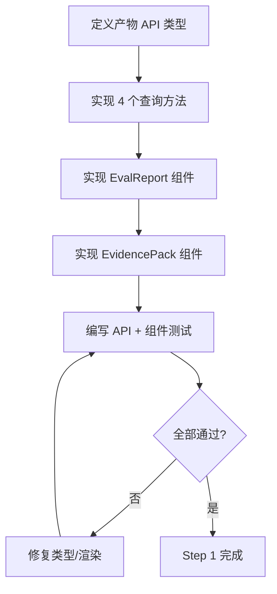
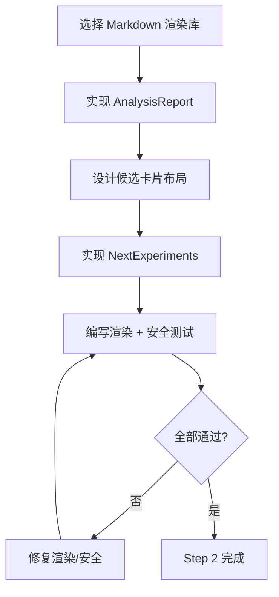
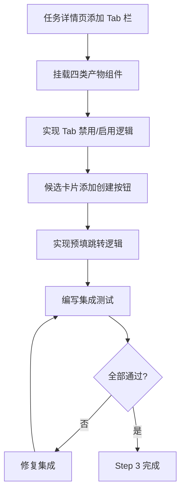
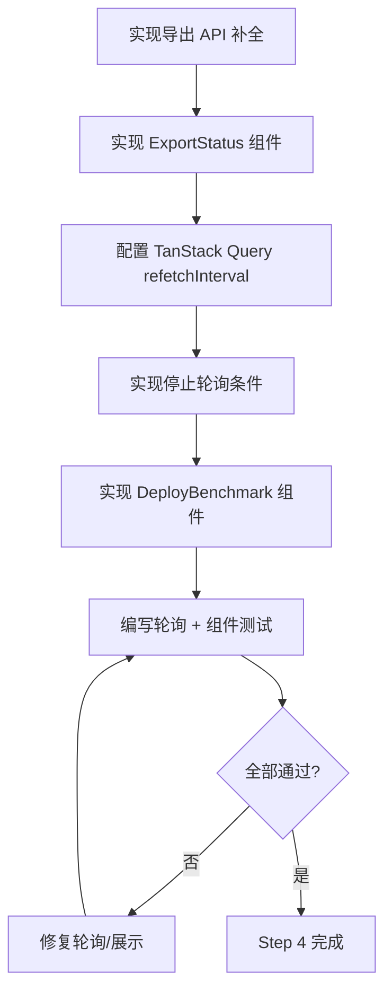

# 前端层 TDD实施计划 - Phase 4: 报告与联调增强

## 概述

本阶段完成决策支持页面：实现 Eval Report / Evidence Pack / Analysis Report / Next Experiments 四类产物展示，完成导出状态轮询与 Deploy Benchmark 查看，将产物 Tab 集成到任务详情页，并与 Phase 3 的 Proposal 确认流程对接，实现候选实验到新任务创建的一键操作。本阶段是前端展示能力的最后拼图，完成后核心业务流程端到端可操作。

**阶段目标**:
- 产物可查看 - 四类分析产物均有可读的展示页面
- 候选可操作 - A/B/C 候选实验卡片可直接跳转创建新任务
- 联调可验证 - 页面数据流与联调用例文档口径一致

**前置依赖**:
- Phase 2 任务详情页框架（产物展示嵌入 Tab）
- Phase 3 Proposal 确认创建流程（候选实验跳转创建）
- 后端产物查询与导出接口可用
- `docs/dev_step/4.接口层_API路由清单.md`（分析产物与导出接口）
- `docs/init/5.附录.md`（EvalReport Schema、Evidence Pack 规则、NextExperiments 规范）

## Phase 4 包含的步骤

| 步骤 | 名称 | 状态 | 测试 | 完成日期 |
|------|------|------|------|----------|
| Step 1 | 产物 API Client 与 Eval/Evidence 展示 | ⏳ | -/- | - |
| Step 2 | Analysis Report 与 Next Experiments 展示 | ⏳ | -/- | - |
| Step 3 | 产物 Tab 集成与候选跳转 Proposal | ⏳ | -/- | - |
| Step 4 | 导出状态轮询与 Deploy Benchmark | ⏳ | -/- | - |

**步骤列表**:
- **Step 1**: 产物 API Client 与 Eval/Evidence 展示
- **Step 2**: Analysis Report 与 Next Experiments 展示
- **Step 3**: 产物 Tab 集成与候选跳转 Proposal
- **Step 4**: 导出状态轮询与 Deploy Benchmark

---

## Step 1: 产物 API Client 与 Eval/Evidence 展示 (ArtifactApiAndEvalEvidence) ⏳

**目标**: 实现产物查询 API Client（4 个方法），完成 Eval Report 与 Evidence Pack 两个展示组件，产物不存在时给出明确空态。

**上下文依赖**:
- 读取 `docs/dev_step/4.接口层_API路由清单.md` 了解产物查询接口（run_id 必传）
- 读取 `docs/init/5.附录.md` 了解 EvalReport JSON Schema 与 Evidence Pack 规则
- Phase 1 `request.ts` API 客户端基础

**交付物**:
- ⏳ `frontend/src/lib/api/analysis.ts` - 产物查询 API 方法（4 个）
- ⏳ `frontend/src/features/job/components/EvalReport.tsx` - 评估报告展示
- ⏳ `frontend/src/features/job/components/EvidencePack.tsx` - 证据包展示
- ⏳ `frontend/__tests__/lib/api/analysis.test.ts` - API Client 测试

**验收标准**:
- [ ] `getEvalReport`/`getEvidencePack`/`getAnalysisReport`/`getNextExperiments` 四个方法类型完整
- [ ] `run_id` 参数必传
- [ ] 产物不存在返回 NOT_FOUND 错误
- [ ] Eval Report：overall.business_kpi 突出展示、by_class 表格、by_scene 表格含 KPI/FN/FP
- [ ] Evidence Pack：摘要信息、产物索引路径列表、KPI 配置对比区域

**实现状态**: ⏳ 待开始
**测试结果**: 0/0 测试通过
**计划实现日期**: YYYY-MM-DD

---

### Red Phase - 失败的测试定义

**测试文件**: `frontend/__tests__/lib/api/analysis.test.ts`

**核心测试用例**:
- ❌ `test_get_eval_report_returns_valid_structure` - 返回包含 overall/by_class/by_scene 的结构
- ❌ `test_get_evidence_pack_returns_summary_and_index` - 返回摘要与索引
- ❌ `test_artifact_not_found_throws_api_error` - 产物不存在抛出 NOT_FOUND
- ❌ `test_run_id_required_for_all_artifact_apis` - 所有接口 run_id 必传
- ❌ `test_eval_report_renders_overall_kpi` - Eval Report 展示 overall KPI
- ❌ `test_eval_report_renders_by_class_table` - by_class 表格渲染
- ❌ `test_evidence_pack_renders_artifact_index` - 产物索引路径列表

**关键验证点**:
- **类型完整** - 四个 API 方法返回类型与后端 Schema 对齐
- **数据展示** - EvalReport 三级结构（overall/by_class/by_scene）可读渲染
- **空态处理** - 产物不存在不白屏

**验证流程图**:

---

### Green Phase - 实现最小化功能

**实现文件**:
- `frontend/src/lib/api/analysis.ts` - 4 个产物查询方法
- `frontend/src/features/job/components/EvalReport.tsx` - 评估报告
- `frontend/src/features/job/components/EvidencePack.tsx` - 证据包

**核心组件**:
- `getEvalReport(jobId, runId)` / `getEvidencePack(jobId, runId)` / `getAnalysisReport(jobId, runId)` / `getNextExperiments(jobId, runId)`
- `EvalReport` - 三级表格展示（overall 卡片 + by_class 表格 + by_scene 表格）
- `EvidencePack` - 摘要信息 + 产物索引列表 + KPI 配置对比

**主要功能**:

| 功能 | 类型 | 功能描述 | 验收标准 |
|------|------|----------|----------|
| 产物 API | API | 4 个查询方法 | run_id 必传、类型完整 |
| EvalReport | 展示 | overall/by_class/by_scene | 三级数据可读 |
| EvidencePack | 展示 | 摘要/索引/配置对比 | 路径列表可见 |

---

### Refactor Phase - 优化和扩展

**重构目标**:
1. 抽取 JSON 数据表格渲染通用组件
2. EvalReport 关键指标高亮（达标/未达标）
3. 产物 API Query hooks 统一模式

**验收标准**:
- [ ] 表格渲染组件可复用
- [ ] 指标达标状态可视化
- [ ] 回归测试全部通过

---

## Step 2: Analysis Report 与 Next Experiments 展示 (AnalysisAndExperiments) ⏳

**目标**: 实现 Analysis Report（Markdown 渲染）与 Next Experiments（A/B/C 候选卡片式对比）展示组件，候选卡片显示 name/changes/expected/evidence_refs 四要素。

**上下文依赖**:
- Step 1 完成的产物 API Client
- 读取 `docs/init/5.附录.md` 了解 NextExperiments 规范
- 读取 `docs/init/2.系统架构.md` 了解 LLM Agent 产物流

**交付物**:
- ⏳ `frontend/src/features/job/components/AnalysisReport.tsx` - 分析报告展示
- ⏳ `frontend/src/features/job/components/NextExperiments.tsx` - 候选实验展示
- ⏳ `frontend/__tests__/features/job/AnalysisReport.test.tsx` - 渲染测试
- ⏳ `frontend/__tests__/features/job/NextExperiments.test.tsx` - 卡片测试

**验收标准**:
- [ ] Markdown 正确渲染（标题/列表/代码块/表格）
- [ ] Markdown 渲染内容安全（XSS 防护）
- [ ] 空报告显示空态
- [ ] A/B/C 候选以卡片式展示
- [ ] 每张卡片包含 name/changes/expected/evidence_refs 四要素
- [ ] changes 变更字段高亮（from → to）
- [ ] evidence_refs 链接可点击

**实现状态**: ⏳ 待开始
**测试结果**: 0/0 测试通过
**计划实现日期**: YYYY-MM-DD

---

### Red Phase - 失败的测试定义

**测试文件**: `frontend/__tests__/features/job/AnalysisReport.test.tsx`, `frontend/__tests__/features/job/NextExperiments.test.tsx`

**核心测试用例**:
- ❌ `test_markdown_renders_headings_and_lists` - Markdown 标题/列表渲染
- ❌ `test_markdown_sanitizes_xss_scripts` - XSS 脚本被过滤
- ❌ `test_empty_report_shows_empty_state` - 空报告显示空态
- ❌ `test_candidates_render_as_cards` - 候选以卡片展示
- ❌ `test_candidate_card_shows_four_elements` - 卡片包含四要素
- ❌ `test_changes_highlight_from_to` - 变更字段高亮 from → to
- ❌ `test_evidence_refs_are_clickable` - evidence_refs 可点击

**关键验证点**:
- **Markdown 安全** - 使用安全的 Markdown 渲染库，过滤危险标签
- **卡片信息密度** - 四要素布局清晰可读
- **变更可视化** - from/to 变更直观可见

**验证流程图**:

---

### Green Phase - 实现最小化功能

**实现文件**:
- `frontend/src/features/job/components/AnalysisReport.tsx` - Markdown 渲染
- `frontend/src/features/job/components/NextExperiments.tsx` - 候选卡片

**核心组件**:
- `AnalysisReport` - 使用安全 Markdown 库渲染报告内容
- `NextExperiments` - 卡片式展示 A/B/C 候选
- `CandidateCard` - 单个候选卡片（name + changes + expected + refs）

**主要功能**:

| 功能 | 类型 | 功能描述 | 验收标准 |
|------|------|----------|----------|
| Markdown 渲染 | 展示 | 安全渲染 LLM 分析报告 | 标题/列表/代码块正确 |
| XSS 防护 | 安全 | 过滤危险 HTML | script 标签被移除 |
| 候选卡片 | 展示 | A/B/C 对比展示 | 四要素齐全 |
| 变更高亮 | 展示 | from → to 可视化 | 变更直观可见 |

---

### Refactor Phase - 优化和扩展

**重构目标**:
1. Markdown 渲染组件通用化（可复用于其他文档展示）
2. 候选卡片布局优化（支持横向/纵向切换）
3. evidence_refs 跳转到对应产物区域

**验收标准**:
- [ ] Markdown 组件可复用
- [ ] 卡片布局清晰美观
- [ ] 回归测试全部通过

---

## Step 3: 产物 Tab 集成与候选跳转 Proposal (ArtifactTabIntegration) ⏳

**目标**: 将四类产物展示组件集成到任务详情页的 Tab 中，并从候选实验卡片添加"创建任务"按钮，跳转到 Phase 3 的 Proposal 确认创建流程，预填 candidate 信息。

**上下文依赖**:
- Step 1-2 完成的四类产物组件
- Phase 2 任务详情页框架
- Phase 3 Proposal 确认创建弹窗

**交付物**:
- ⏳ 更新 `frontend/src/app/(dashboard)/jobs/[id]/page.tsx` - 增加产物 Tab
- ⏳ 更新 `frontend/src/features/job/components/NextExperiments.tsx` - 增加"创建任务"按钮
- ⏳ `frontend/__tests__/features/job/ArtifactTabs.test.tsx` - Tab 集成测试

**验收标准**:
- [ ] 任务详情页增加 Eval/Evidence/Analysis/Experiments 四个 Tab
- [ ] Tab 切换正确加载对应产物
- [ ] 任务未到达产物阶段时 Tab 禁用或提示
- [ ] 点击候选卡片"创建任务"按钮，预填 candidate 信息跳转确认页
- [ ] baseline_job_id 自动带入当前任务 ID

**实现状态**: ⏳ 待开始
**测试结果**: 0/0 测试通过
**计划实现日期**: YYYY-MM-DD

---

### Red Phase - 失败的测试定义

**测试文件**: `frontend/__tests__/features/job/ArtifactTabs.test.tsx`

**核心测试用例**:
- ❌ `test_artifact_tabs_render_four_tabs` - 四个产物 Tab 可见
- ❌ `test_tab_switch_loads_correct_artifact` - 切换 Tab 加载对应数据
- ❌ `test_tabs_disabled_when_no_artifacts` - 无产物时 Tab 禁用
- ❌ `test_create_task_button_prefills_candidate` - "创建任务"预填候选信息
- ❌ `test_baseline_job_id_auto_filled` - baseline_job_id 自动为当前任务

**关键验证点**:
- **Tab 联动** - Tab 状态与产物数据正确关联
- **预填跳转** - 候选信息完整传递到确认页面
- **状态感知** - 产物未生成时给用户明确反馈

**验证流程图**:

---

### Green Phase - 实现最小化功能

**核心组件**:
- `ArtifactTabs` - Tab 容器，根据 runId 加载产物
- "创建任务" 按钮 - 预填 candidate/baseline_job_id 跳转 Proposal 确认

**主要功能**:

| 功能 | 类型 | 功能描述 | 验收标准 |
|------|------|----------|----------|
| 产物 Tab | UI | 四个 Tab 切换 | 正确加载对应产物 |
| Tab 状态 | 逻辑 | 无产物禁用 Tab | 提示信息可见 |
| 候选→创建 | 流程 | 预填跳转确认 | 信息完整传递 |

---

### Refactor Phase - 优化和扩展

**重构目标**:
1. Tab 懒加载（切换时才请求数据）
2. 产物加载状态与主页面状态独立
3. 跳转信息持久化（URL 参数或 sessionStorage）

**验收标准**:
- [ ] Tab 切换性能良好
- [ ] 状态管理清晰
- [ ] 回归测试全部通过

---

## Step 4: 导出状态轮询与 Deploy Benchmark (ExportStatusAndBenchmark) ⏳

**目标**: 实现导出状态页面（支持轮询刷新）与 Deploy Benchmark 指标展示（时延/吞吐/显存），完成导出业务域的展示闭环。

**上下文依赖**:
- 读取 `docs/dev_step/4.接口层_API路由清单.md` 了解导出状态与基准接口
- Phase 1 API 客户端
- Phase 3 导出创建表单

**交付物**:
- ⏳ `frontend/src/lib/api/export.ts` - 导出 API 方法（补全 status/benchmark）
- ⏳ `frontend/src/features/export/components/ExportStatus.tsx` - 导出状态展示
- ⏳ `frontend/src/features/export/components/DeployBenchmark.tsx` - 部署基准展示
- ⏳ `frontend/__tests__/features/export/*.test.tsx` - 组件测试

**验收标准**:
- [ ] 导出状态轮询刷新（每 5s）
- [ ] 完成状态停止轮询
- [ ] 失败状态展示错误原因
- [ ] 时延/吞吐/显存指标以表格展示
- [ ] 数据不存在显示空态
- [ ] 组件卸载时清除轮询（无内存泄漏）

**实现状态**: ⏳ 待开始
**测试结果**: 0/0 测试通过
**计划实现日期**: YYYY-MM-DD

---

### Red Phase - 失败的测试定义

**测试文件**: `frontend/__tests__/features/export/*.test.tsx`

**核心测试用例**:
- ❌ `test_export_status_polls_every_5s` - 状态每 5 秒刷新
- ❌ `test_export_status_stops_polling_on_complete` - 完成后停止轮询
- ❌ `test_export_status_shows_error_on_failure` - 失败显示错误原因
- ❌ `test_deploy_benchmark_renders_metrics_table` - 基准指标表格展示
- ❌ `test_deploy_benchmark_empty_state` - 无数据显示空态
- ❌ `test_polling_cleanup_on_unmount` - 卸载时清除轮询

**关键验证点**:
- **轮询控制** - 进行中轮询、完成停止、卸载清除
- **状态映射** - 导出各状态正确展示
- **基准数据** - 三项指标（时延/吞吐/显存）完整可读

**验证流程图**:

---

### Green Phase - 实现最小化功能

**核心组件**:
- `getExportStatus(exportId)` / `getDeployBenchmark(exportId)` - 导出 API
- `ExportStatus` - 使用 `useQuery` + `refetchInterval` 实现轮询
- `DeployBenchmark` - 时延/吞吐/显存表格展示

**主要功能**:

| 功能 | 类型 | 功能描述 | 验收标准 |
|------|------|----------|----------|
| 状态轮询 | 数据 | 每 5s 刷新状态 | 进行中轮询、完成停止 |
| 状态展示 | UI | 状态标识 + 进度 | 各状态可区分 |
| 基准指标 | UI | 三项指标表格 | 数据完整可读 |
| 轮询清除 | 安全 | 卸载时停止 | 无内存泄漏 |

---

### Refactor Phase - 优化和扩展

**重构目标**:
1. 抽取轮询逻辑为通用 hook（`usePollingQuery`）
2. 导出状态展示增加进度条
3. 基准指标支持图表形式展示

**验收标准**:
- [ ] 轮询 hook 可复用
- [ ] 导出状态信息丰富
- [ ] 回归测试全部通过

---

## Phase 4 完成总结

### 完成状态

| 步骤 | 名称 | 状态 | 测试 | 完成日期 |
|------|------|------|------|----------|
| Step 1 | 产物 API Client 与 Eval/Evidence 展示 | ⏳ | -/- | - |
| Step 2 | Analysis Report 与 Next Experiments 展示 | ⏳ | -/- | - |
| Step 3 | 产物 Tab 集成与候选跳转 Proposal | ⏳ | -/- | - |
| Step 4 | 导出状态轮询与 Deploy Benchmark | ⏳ | -/- | - |

### 实现检查清单
- [ ] Red：失败测试先行且覆盖全部验收项
- [ ] Green：最小实现通过核心路径
- [ ] Refactor：重构后无行为漂移

### 质量标准
- [ ] 四类产物页面均可正确展示
- [ ] Markdown 渲染内容安全（XSS 防护）
- [ ] 导出状态轮询不泄漏（组件卸载时清除）
- [ ] 产物 API Client 有 Vitest 测试覆盖
- [ ] 端到端关键流程联调通过
- [ ] 满足 Phase F4 交付要求：决策页面与联调稳定性
