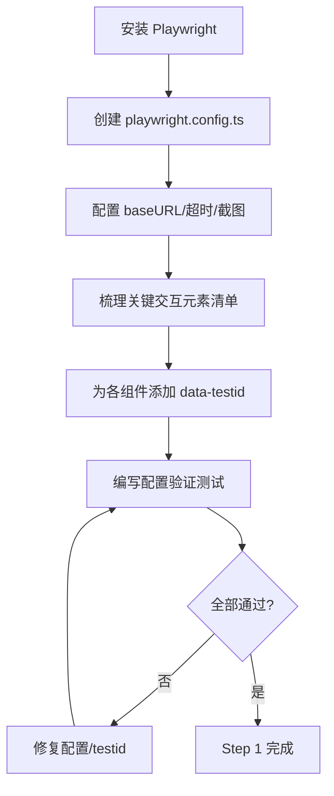
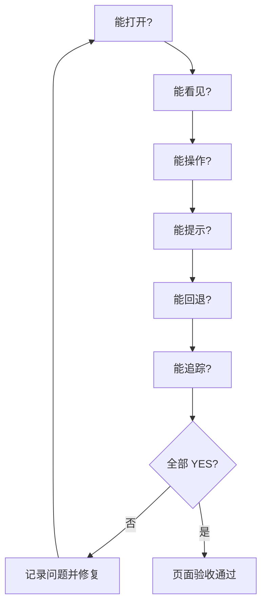
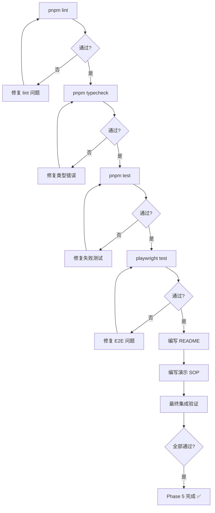

```mermaid
flowchart TD
  A[编写 5 条 E2E 用例] --> B[初始执行 - 全部 FAIL]
  B --> C{FAIL 原因是 testid 缺失?}
  C -- 是 --> D[补全 data-testid]
  D --> B
  C -- 否 --> E{FAIL 原因是功能缺陷?}
  E -- 是 --> F[修复功能]
  F --> B
  E -- 否 --> G[检查环境配置]
  G --> B
  B --> H{全部通过?}
  H -- 是 --> I[Step 2 完成]
```

# 前端层 TDD实施计划 - Phase 5: 质量与发布准备

## 概述

本阶段完成前端最终交付准备：配置 Playwright E2E 测试框架，编写覆盖关键业务流程的冒烟用例（≥5 条），为关键交互元素添加 `data-testid`，进行页面可用性走查与修复，补全启动/联调/验收文档，确保非开发人员可按文档完成端到端演示。本阶段是前端的收官质量门禁，完成后整个前端达到可交付状态。

**阶段目标**:
- 可回归 - E2E 冒烟用例覆盖核心业务流程，自动化可重复验证
- 可演示 - 演示流程一次走通，非开发人员可操作
- 可交付 - ESLint/Vitest/Playwright 全绿，文档齐全

**前置依赖**:
- Phase 1-4 全部交付物
- 后端服务完整可用（联调需全栈启动）
- `docs/dev_step/5.2零基础AI前端开发指南.md`（页面验收清单）
- `docs/dev_step/4.接口层_API联调用例.md`（联调流程基准）

## Phase 5 包含的步骤

| 步骤 | 名称 | 状态 | 测试 | 完成日期 |
|------|------|------|------|----------|
| Step 1 | Playwright 配置与 data-testid 补全 | ⏳ | -/- | - |
| Step 2 | E2E 冒烟用例编写（5 条核心流程） | ⏳ | -/- | - |
| Step 3 | 页面可用性走查与修复 | ⏳ | -/- | - |
| Step 4 | 全量质量扫描与文档交付 | ⏳ | -/- | - |

**步骤列表**:
- **Step 1**: Playwright 配置与 data-testid 补全
- **Step 2**: E2E 冒烟用例编写（5 条核心流程）
- **Step 3**: 页面可用性走查与修复
- **Step 4**: 全量质量扫描与文档交付

---

## Step 1: Playwright 配置与 data-testid 补全 (PlaywrightSetup) ⏳

**目标**: 配置 Playwright 测试框架，为所有 E2E 涉及的关键交互元素添加稳定的 `data-testid` 属性，建立 E2E 测试基础设施。

**上下文依赖**:
- Phase 1 工程骨架（pnpm 项目）
- Phase 2-4 所有交互组件
- Playwright 官方文档

**交付物**:
- ⏳ `frontend/playwright.config.ts` - Playwright 配置
- ⏳ `frontend/tests/e2e/` - E2E 测试目录
- ⏳ 各组件更新 - 添加 `data-testid` 属性

**验收标准**:
- [ ] `pnpm exec playwright test --list` 可列出测试文件
- [ ] 配置指向 `localhost:3000`
- [ ] 测试失败时自动截图
- [ ] 所有 E2E 涉及的按钮/输入/表格行具有稳定 `data-testid`
- [ ] `data-testid` 命名规范统一（`[module]-[component]-[action]` 格式）

**实现状态**: ⏳ 待开始
**测试结果**: 0/0 测试通过
**计划实现日期**: YYYY-MM-DD

---

### Red Phase - 失败的测试定义

**测试文件**: `frontend/tests/e2e/smoke.spec.ts`

**核心测试用例**:
- ❌ `test_playwright_config_valid` - Playwright 配置可加载
- ❌ `test_base_url_points_to_localhost_3000` - baseURL 正确
- ❌ `test_screenshot_on_failure_enabled` - 失败截图功能开启
- ❌ `test_key_elements_have_data_testid` - 关键元素有 testid
- ❌ `test_testid_naming_convention` - testid 命名规范一致

**关键验证点**:
- **选择器稳定性** - 基于 `data-testid` / `role` 等稳定属性，不依赖样式 class
- **截图策略** - 失败时自动截图保留现场
- **配置正确性** - 超时、重试、并行度合理

**验证流程图**:

---

### Green Phase - 实现最小化功能

**实现文件**:
- `frontend/playwright.config.ts` - E2E 配置
- 各组件文件 - 添加 `data-testid`

**核心组件**:
- `playwright.config.ts` - baseURL、timeout、retries、screenshot 配置
- `data-testid` 属性 - 覆盖导航/按钮/表单/表格等关键元素

**关键 data-testid 清单**:

| 模块 | 元素 | data-testid |
|------|------|-------------|
| 导航 | 侧栏导航项 | `nav-{module}` |
| 数据集 | 导入按钮 | `dataset-import-btn` |
| 数据集 | 冻结按钮 | `dataset-freeze-btn` |
| 任务 | 创建按钮 | `job-create-btn` |
| 任务 | 启动按钮 | `job-start-btn` |
| 产物 | Tab 项 | `artifact-tab-{type}` |
| 候选 | 创建任务按钮 | `candidate-create-btn` |
| 导出 | 创建按钮 | `export-create-btn` |
| 表单 | 提交按钮 | `form-submit-btn` |
| 表单 | 输入字段 | `input-{field}` |

---

### Refactor Phase - 优化和扩展

**重构目标**:
1. 建立 Page Object Model 基类（便于 E2E 维护）
2. 创建共享 fixtures（登录状态、测试数据）
3. 统一 testid 常量文件（前端组件与测试共用）

**验收标准**:
- [ ] POM 基类可用
- [ ] Fixture 模式建立
- [ ] 回归测试全部通过

---

## Step 2: E2E 冒烟用例编写（5 条核心流程） (E2ESmokeTests) ⏳

**目标**: 编写 5 条 Playwright E2E 冒烟用例，覆盖数据集导入/冻结、任务创建/查看、产物查看、Proposal 确认、导出创建五个核心业务流程。

**上下文依赖**:
- Step 1 完成的 Playwright 配置与 data-testid
- `docs/dev_step/4.接口层_API联调用例.md` 联调流程
- Phase 2-4 所有页面功能

**交付物**:
- ⏳ `frontend/tests/e2e/dataset-workflow.spec.ts` - 数据集流程
- ⏳ `frontend/tests/e2e/job-workflow.spec.ts` - 任务流程
- ⏳ `frontend/tests/e2e/artifact-view.spec.ts` - 产物查看
- ⏳ `frontend/tests/e2e/proposal-workflow.spec.ts` - Proposal 流程
- ⏳ `frontend/tests/e2e/export-workflow.spec.ts` - 导出流程

**验收标准**:
- [ ] 5 条 E2E 用例在全栈启动时全部通过
- [ ] 每条用例覆盖完整业务流程（非单个操作）
- [ ] 测试失败时自动截图，截图文件可定位问题
- [ ] 用例之间无顺序依赖，可独立运行

**实现状态**: ⏳ 待开始
**测试结果**: 0/0 测试通过
**计划实现日期**: YYYY-MM-DD

---

### Red Phase - 失败的测试定义

**测试文件**: `frontend/tests/e2e/*.spec.ts`

**核心测试用例**:

**dataset-workflow.spec.ts**:
- ❌ `test_dataset_import_and_freeze_flow` - 进入数据集页面 → 导入新版本 → 冻结版本 → 看见冻结标识

**job-workflow.spec.ts**:
- ❌ `test_job_create_and_view_flow` - 进入任务列表 → 打开创建表单 → 提交 → 看见新任务 → 进入详情页

**artifact-view.spec.ts**:
- ❌ `test_artifact_tab_navigation` - 进入任务详情 → 切换到 Eval Tab → 看见评估数据 → 切换到分析报告 Tab

**proposal-workflow.spec.ts**:
- ❌ `test_proposal_confirm_creates_job` - 查看候选实验 → 选择候选 A → 点击创建 → 确认弹窗 → 看见新任务

**export-workflow.spec.ts**:
- ❌ `test_export_create_and_status` - 创建导出任务 → 看见导出状态 → 查看基准数据

**关键验证点**:
- **流程完整性** - 每条用例覆盖端到端业务流程
- **状态一致性** - 操作后页面状态正确更新
- **可定位性** - 失败可通过截图快速定位问题

**验证流程图**:

---

### Green Phase - 实现最小化功能

**E2E 用例结构**:

| 用例文件 | 业务流程 | 关键断言 |
|----------|----------|----------|
| dataset-workflow | 导入 → 冻结 | 新版本可见、冻结标识 |
| job-workflow | 创建 → 详情 | 新任务可见、详情页渲染 |
| artifact-view | Tab 切换 | Eval 数据可见、报告可见 |
| proposal-workflow | 候选 → 确认 → 创建 | 弹窗可见、新任务创建 |
| export-workflow | 创建 → 状态 | 导出状态可见、基准数据 |

---

### Refactor Phase - 优化和扩展

**重构目标**:
1. 抽取 Page Object 类（DatasetPage、JobPage 等）
2. 共享测试数据 fixtures
3. 截图策略优化（按步骤截图 vs 仅失败截图）

**验收标准**:
- [ ] POM 类可复用
- [ ] 测试数据管理清晰
- [ ] 所有 E2E 稳定通过

---

## Step 3: 页面可用性走查与修复 (UsabilityFix) ⏳

**目标**: 按验收清单对所有页面进行走查（能打开/能看见/能操作/能提示/能回退/能追踪），修复白屏、未处理异常、导航状态不一致等问题。

**上下文依赖**:
- `docs/dev_step/5.2零基础AI前端开发指南.md` 验收清单
- Phase 1-4 全部页面
- E2E 测试执行中发现的问题

**交付物**:
- ⏳ 各页面修复补丁
- ⏳ 路由与 Query 缓存修复

**验收标准**:
- [ ] 每个页面过验收清单六项：能打开/能看见/能操作/能提示/能回退/能追踪
- [ ] 所有页面无白屏、无未处理异常
- [ ] 列表 → 详情 → 返回列表数据不丢失
- [ ] 创建后列表自动刷新
- [ ] 关键操作反馈时间 < 3s
- [ ] 移动端基本可访问（不崩溃、关键信息可见）
- [ ] 浏览器 console 无未处理错误

**实现状态**: ⏳ 待开始
**测试结果**: 0/0 测试通过
**计划实现日期**: YYYY-MM-DD

---

### Red Phase - 失败的测试定义

**验收清单（每个页面均需通过）**:

**需走查的页面清单**:
- `/projects` / `/projects/[id]/kpi-config`
- `/datasets` / `/datasets/[id]`
- `/jobs` / `/jobs/[id]`（含产物 Tab）
- `/proposals`
- `/exports`

**关键验证点**:
- **无白屏** - 每个页面任何状态下不白屏
- **异常处理** - 网络异常、后端错误均有用户可见反馈
- **导航一致** - 前进/后退/刷新行为符合预期
- **缓存一致** - 写操作后读取数据为最新

---

### Green Phase - 修复清单

**典型修复类型**:

| 问题类型 | 修复方式 | 验证手段 |
|----------|----------|----------|
| 白屏 | 添加 ErrorBoundary | 刷新页面不白屏 |
| 未处理异常 | 捕获异常 + 显示错误态 | console 无 unhandled error |
| 导航丢数据 | 调整 Query staleTime | 返回列表数据在 |
| 创建后列表不刷新 | invalidateQueries | 创建后列表有新数据 |
| 操作反馈慢 | 添加 loading 指示 | 操作后 < 3s 有反馈 |

---

### Refactor Phase - 优化和扩展

**重构目标**:
1. 添加全局 ErrorBoundary
2. 统一 Query 缓存策略（staleTime/cacheTime）
3. 修复移动端关键布局问题

**验收标准**:
- [ ] 全部页面过走查清单
- [ ] 无浏览器 console 错误
- [ ] E2E 回归全部通过

---

## Step 4: 全量质量扫描与文档交付 (QualityAndDocs) ⏳

**目标**: 执行 ESLint/TypeScript/Vitest 全量扫描确保零报错，编写前端 README（启动/联调/验收说明）与演示 SOP 文档，完成最终集成验证。

**上下文依赖**:
- Phase 1-4 全部代码
- Step 1-3 E2E 测试与修复

**交付物**:
- ⏳ `frontend/README.md` - 前端启动、联调、验收说明
- ⏳ 演示 SOP 文档
- ⏳ 零报错代码库

**验收标准**:
- [ ] `pnpm lint` 零报错
- [ ] `pnpm typecheck` 零报错
- [ ] `pnpm test` 单元测试全部通过
- [ ] Playwright E2E ≥ 5 条全部通过
- [ ] README 包含：环境要求、安装命令、启动命令、联调步骤、E2E 运行说明
- [ ] 演示 SOP 可指导非开发人员完成一次完整操作
- [ ] 浏览器 console 无未处理错误

**实现状态**: ⏳ 待开始
**测试结果**: 0/0 测试通过
**计划实现日期**: YYYY-MM-DD

---

### Red Phase - 失败的测试定义

**质量门禁检查**:
- ❌ `pnpm lint` - ESLint 全量扫描
- ❌ `pnpm typecheck` - TypeScript 类型检查
- ❌ `pnpm test` - Vitest 单元测试
- ❌ `pnpm exec playwright test` - E2E 冒烟测试
- ❌ README 完整性检查 - 包含必要章节
- ❌ 演示 SOP 检查 - 命令可复制执行

**关键验证点**:
- **代码质量** - lint + typecheck + unit test 全绿
- **E2E 稳定** - 冒烟用例可重复通过
- **文档可操作** - 假设读者非开发人员

**验证流程图**:

---

### Green Phase - 实现最小化功能

**README 章节结构**:

| 章节 | 内容 | 目标读者 |
|------|------|----------|
| 环境要求 | Node.js 20/pnpm 9+ | 全部 |
| 快速启动 | 安装/启动命令 | 开发者 |
| 环境配置 | `.env` 说明 | 开发者 |
| 联调步骤 | 后端启动 + 前端指向 | 开发者 |
| E2E 测试 | 运行/查看报告/截图 | QA |
| 验收清单 | 每页检查项 | PMO |

**演示 SOP 流程**:

---

### Refactor Phase - 优化和扩展

**重构目标**:
1. 自动化质量门禁（CI 配置 lint + test + e2e）
2. 文档版本化管理
3. 演示数据种子脚本

**验收标准**:
- [ ] 质量命令可一键执行
- [ ] 文档与代码同步
- [ ] 演示流程可重复

---

## Phase 5 完成总结

### 完成状态

| 步骤 | 名称 | 状态 | 测试 | 完成日期 |
|------|------|------|------|----------|
| Step 1 | Playwright 配置与 data-testid 补全 | ⏳ | -/- | - |
| Step 2 | E2E 冒烟用例编写（5 条核心流程） | ⏳ | -/- | - |
| Step 3 | 页面可用性走查与修复 | ⏳ | -/- | - |
| Step 4 | 全量质量扫描与文档交付 | ⏳ | -/- | - |

### 实现检查清单
- [ ] Red：E2E 测试先行，初始全部 fail
- [ ] Green：补全 data-testid 与功能修复，使 E2E 通过
- [ ] Refactor：统一 fixtures、POM、截图策略

### 质量标准
- [ ] `pnpm lint` 零报错
- [ ] `pnpm typecheck` 零报错
- [ ] `pnpm test` 单元测试全部通过
- [ ] ≥ 5 条 Playwright E2E 全部通过
- [ ] 演示流程一次走通
- [ ] 所有页面过验收清单
- [ ] 浏览器 console 无未处理错误
- [ ] 满足 Phase F5 交付要求：可演示、可回归、可交付
- [ ] 满足前端 DoD：MVP 页面与动作完整可用；ESLint/Vitest/Playwright 全绿
- [ ] 非开发人员可按文档完成一次端到端联调
