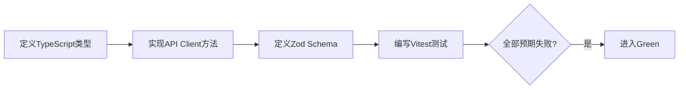
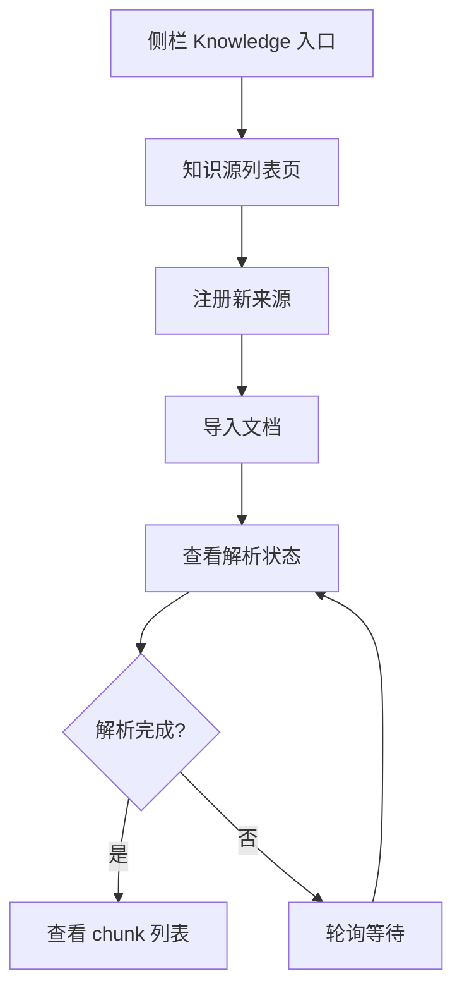
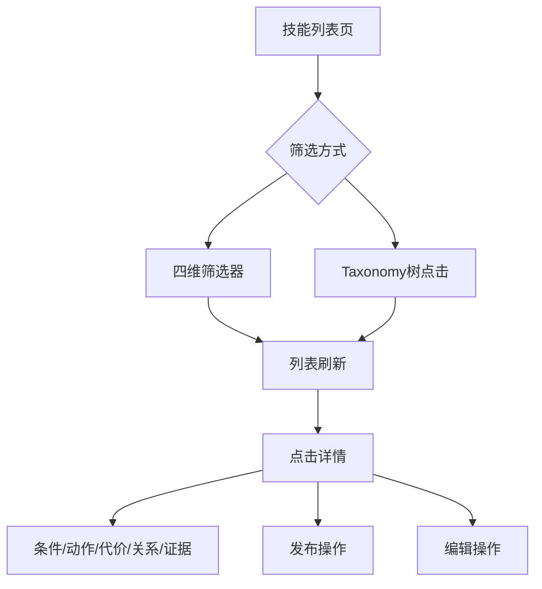
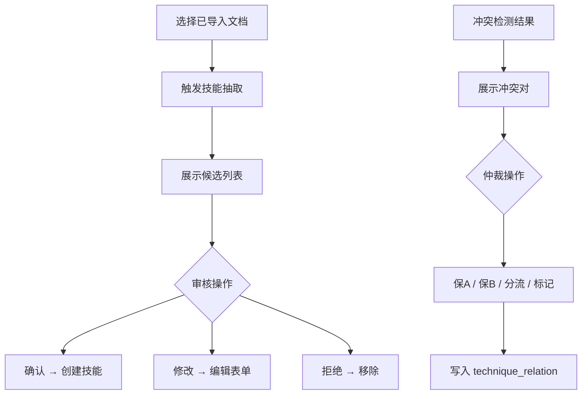

# 前端层 TDD实施计划 - Phase 6: 知识系统管理页面

## 概述

本阶段为知识库系统构建完整的前端管理界面：知识源注册与列表、文档导入与解析状态、技能卡片多维筛选浏览、技能详情（条件/动作/收益代价/关系图/证据）、技能抽取审核（确认/修改/拒绝）、冲突仲裁、Skill Taxonomy 树状浏览。

**阶段目标**:
- 知识管理完整 - 从 Source 注册到技能发布的完整前端流程
- 交互体验良好 - 三态完备（loading / empty / error），操作反馈明确
- 审核可追溯 - 技能抽取审核与冲突仲裁操作可见
- 类型安全 - TypeScript 类型完整，Zod schema 校验，无 `any` 逃逸

**前置依赖**:
- 前端 Phase 1-5 全部交付（工程骨架、通用组件、表单模式、E2E 基础）
- 后端知识系统 API 可用（知识库 TODO Phase 2 交付）
- `docs/TDD/5.前端层/TDD_PLAN_PHASE1.md` ~ `TDD_PLAN_PHASE5.md`

## Phase 6 包含的步骤

| 步骤 | 名称 | 状态 | 测试 | 完成日期 |
|------|------|------|------|----------|
| Step 1 | 知识系统 API Client + Zod Schema | ⏳ | -/- | - |
| Step 2 | 知识源管理与文档导入页面 | ⏳ | -/- | - |
| Step 3 | 技能卡片列表与详情页面 | ⏳ | -/- | - |
| Step 4 | 技能抽取审核与冲突仲裁页面 | ⏳ | -/- | - |

**步骤列表**:
- **Step 1**: 知识系统 API Client + Zod Schema（API 方法、类型定义、表单校验）
- **Step 2**: 知识源管理与文档导入页面（Source 列表/注册、Document 导入/状态/chunk 查看、侧栏导航）
- **Step 3**: 技能卡片列表与详情页面（多维筛选、Taxonomy 树状浏览、详情展示、发布操作、编辑表单）
- **Step 4**: 技能抽取审核与冲突仲裁页面（候选审核、冲突仲裁）

---

## Step 1: 知识系统 API Client + Zod Schema (KnowledgeClientGate) ✅

**目标**: 实现知识系统前端 API Client 和 Zod 表单校验 Schema，为所有知识系统页面提供数据层基础。

**上下文依赖**:
- 读取 `docs/dev_step/4.接口层_API路由清单.md` § 9 了解知识系统路由
- 读取 `docs/dev_step/4.接口层_API联调用例.md` 了解联调示例
- 读取 `frontend/src/lib/api/` 了解现有 API Client 模式
- 读取 `frontend/src/schemas/` 了解现有 Zod schema 模式

**交付物**:
- ✅ `frontend/src/lib/api/knowledge.ts` - 知识系统 API Client
- ✅ `frontend/src/schemas/knowledge.ts` - 知识系统 Zod Schemas
- ✅ `frontend/src/features/knowledge/types.ts` - 知识系统类型定义
- ✅ `frontend/__tests__/lib/api/knowledge.test.ts` - API Client 测试
- ✅ `frontend/__tests__/schemas/knowledge.test.ts` - Schema 测试

**验收标准**:
- [x] createSource / importDocument / listTechniques / getTechnique / extractSkills / publishTechnique 方法可用
- [x] 类型定义与后端响应对齐
- [x] source_type 枚举校验（local / web / official_doc / internal_experiment）
- [x] URL 格式校验
- [x] skill_code 格式校验（层级.类别.名称）
- [x] 非法值拒绝并返回可读错误

**实现状态**: ✅ 已完成
**测试结果**: 18/18 测试通过
**计划实现日期**: YYYY-MM-DD

---

### Red Phase - 失败的测试定义

**测试文件**: `frontend/__tests__/lib/api/knowledge.test.ts` + `frontend/__tests__/schemas/knowledge.test.ts`

**核心测试用例**:
- ❌ `test_createSource_returns_source_id` - createSource 成功返回 source_id
- ❌ `test_importDocument_returns_document_id` - importDocument 成功返回 document_id
- ❌ `test_listTechniques_supports_filters` - listTechniques 支持筛选
- ❌ `test_getTechnique_returns_full_detail` - getTechnique 返回完整详情
- ❌ `test_types_align_with_backend` - 类型与后端对齐
- ❌ `test_source_type_enum_validation` - source_type 枚举校验
- ❌ `test_url_format_validation` - URL 格式校验
- ❌ `test_skill_code_format_validation` - skill_code 格式校验
- ❌ `test_invalid_values_rejected` - 非法值被拒

**关键验证点**:
- **类型对齐** - 前端类型与后端响应 1:1 对应
- **校验完整** - 枚举 + 格式 + 必填全覆盖
- **错误可读** - 校验失败信息中文可读

---

### Green Phase - 实现最小化功能

**实现文件**:
- `frontend/src/lib/api/knowledge.ts`
- `frontend/src/schemas/knowledge.ts`
- `frontend/src/features/knowledge/types.ts`

**核心组件**:
- `knowledgeApi` - API Client 对象（sources / documents / techniques / retrieval / outcomes）
- `createSourceSchema` / `importDocumentSchema` / `createTechniqueSchema` - Zod schemas
- `KnowledgeSource` / `KnowledgeDocument` / `Technique` / `SkillCard` - TypeScript 类型

**实现要点**:
- API Client 复用现有 `request.ts` 基础方法
- Query key 遵循 `['knowledge', 'sources']` 命名规范
- Zod schema 与后端请求体字段对齐

---

### Refactor Phase - 优化和扩展

**重构目标**:
1. 提取 TanStack Query hooks 到 `features/knowledge/hooks/`
2. 统一错误处理与 toast 提示

**验收标准**:
- [ ] API Client 方法与 Zod schema 有 Vitest 测试
- [ ] 类型无 `any` 逃逸

---

## Step 2: 知识源管理与文档导入页面 (SourceManagementGate) ✅

**目标**: 实现知识源列表与注册页面、文档导入与解析状态页面、chunk 查看，更新侧栏导航。

**上下文依赖**:
- 读取 `docs/updates/20260323_知识库/1.知识库架构设计.md` § 7.1 了解导入流程
- 读取 `docs/dev_step/5.前端层.md` Phase F6 了解页面需求
- 依赖 Step 1 的 API Client 和 Zod Schema

**交付物**:
- ✅ `frontend/src/features/knowledge/components/SourceList.tsx` - 知识源列表
- ✅ `frontend/src/features/knowledge/components/CreateSourceForm.tsx` - 注册表单
- ✅ `frontend/src/features/knowledge/components/DocumentImportForm.tsx` - 导入表单
- ✅ `frontend/src/features/knowledge/components/DocumentList.tsx` - 文档列表
- ✅ `frontend/src/features/knowledge/components/ChunkViewer.tsx` - chunk 查看
- ✅ `frontend/src/app/(dashboard)/knowledge/page.tsx` - 知识源列表页
- ✅ `frontend/src/app/(dashboard)/knowledge/documents/page.tsx` - 文档导入页
- ✅ `frontend/__tests__/features/knowledge/source-management.test.tsx` - 测试

**验收标准**:
- [x] Knowledge 入口在侧栏可见（含 Sources / Skills / Review 子项）
- [x] 知识源列表展示名称/类型/状态/信任等级
- [x] 注册表单校验通过后创建成功；重复 (source_type, uri) 显示冲突错误
- [x] 导入表单支持选择 source_id / doc_type / 本地文件上传或 URL
- [x] 导入后显示 parse_status（pending → parsed / failed）
- [x] 轮询刷新解析状态
- [x] chunk 列表展示 section_path / token_count / 关键词标签
- [x] 所有页面三态（loading / empty / error）完备

**实现状态**: ✅ 已完成
**测试结果**: 14/14 测试通过
**计划实现日期**: YYYY-MM-DD

---

### Red Phase - 失败的测试定义

**测试文件**: `frontend/__tests__/features/knowledge/source-management.test.ts`

**核心测试用例**:
- ❌ `test_sidebar_knowledge_entry_visible` - 侧栏 Knowledge 入口可见
- ❌ `test_source_list_renders_columns` - 列表展示正确列
- ❌ `test_create_source_form_validation` - 注册表单校验
- ❌ `test_create_source_success` - 创建成功
- ❌ `test_create_source_duplicate_error` - 重复冲突错误
- ❌ `test_document_import_form_fields` - 导入表单字段完整
- ❌ `test_document_status_polling` - 解析状态轮询
- ❌ `test_chunk_viewer_fields` - chunk 查看字段展示
- ❌ `test_empty_state_renders` - 空状态展示
- ❌ `test_loading_state_renders` - 加载态展示
- ❌ `test_error_state_renders` - 错误态展示

---

### Green Phase - 实现最小化功能

**实现要点**:
- 使用 TanStack Query hooks 管理数据请求
- 筛选参数同步到 URL 查询参数
- 解析状态轮询使用 `refetchInterval`
- 三态组件复用 Phase 2 交付的通用组件

---

### Refactor Phase - 优化和扩展

**重构目标**:
1. 提取 `useKnowledgeSources` / `useDocumentStatus` 等 hooks
2. 统一列表分页组件

**验收标准**:
- [ ] 筛选条件变化无闪烁（keepPreviousData）
- [ ] 操作反馈明确（成功/失败 toast）

---

## Step 3: 技能卡片列表与详情页面 (SkillBrowseGate) ✅

**目标**: 实现技能卡片列表（四维筛选）、Taxonomy 树状浏览、详情展示（条件/动作/代价/关系/证据）、发布操作和编辑表单。

**上下文依赖**:
- 读取 `docs/updates/20260323_知识库/1.知识库架构设计.md` § 4.3.1 了解 Skill Taxonomy
- 读取 `docs/updates/20260323_知识库/1.知识库架构设计.md` § 4.3.2 了解卡片字段
- 依赖 Step 1 的 API Client

**交付物**:
- ✅ `frontend/src/features/knowledge/components/SkillList.tsx` - 技能列表
- ✅ `frontend/src/features/knowledge/components/SkillTaxonomy.tsx` - Taxonomy 树
- ✅ `frontend/src/features/knowledge/components/SkillDetail.tsx` - 详情页
- ✅ `frontend/src/features/knowledge/components/SkillEditForm.tsx` - 编辑表单
- ✅ `frontend/src/app/(dashboard)/knowledge/skills/page.tsx` - 技能列表页
- ✅ `frontend/src/app/(dashboard)/knowledge/skills/[id]/page.tsx` - 详情页
- ✅ `frontend/__tests__/features/knowledge/skill-browse.test.tsx` - 测试

**验收标准**:
- [x] 表格列含 skill_code / name / category / layer / task_type / maturity / status
- [x] 支持按 category / layer / task_type / maturity 四维筛选
- [x] 筛选参数同步到 URL 查询参数
- [x] Taxonomy 四大类展开为子分类；点击子分类筛选技能列表
- [x] 详情页展示条件/动作/收益代价/关系图/证据来源
- [x] 发布操作需确认弹窗；仅 draft/reviewed 可发布
- [x] 编辑表单预填现有数据，提交后刷新

**实现状态**: ✅ 已完成
**测试结果**: 17/17 测试通过
**计划实现日期**: YYYY-MM-DD

---

### Red Phase - 失败的测试定义

**测试文件**: `frontend/__tests__/features/knowledge/skill-browse.test.ts`

**核心测试用例**:
- ❌ `test_skill_list_table_columns` - 表格列正确
- ❌ `test_skill_filter_by_category` - 按 category 筛选
- ❌ `test_skill_filter_by_layer` - 按 layer 筛选
- ❌ `test_skill_filter_by_task_type` - 按 task_type 筛选
- ❌ `test_skill_filter_by_maturity` - 按 maturity 筛选
- ❌ `test_filter_syncs_to_url` - 筛选同步 URL
- ❌ `test_taxonomy_four_categories` - Taxonomy 四大类展示
- ❌ `test_taxonomy_click_filters_list` - 点击分类筛选列表
- ❌ `test_skill_detail_sections` - 详情页各区块展示
- ❌ `test_publish_button_draft_only` - 仅 draft/reviewed 可发布
- ❌ `test_publish_confirm_dialog` - 发布确认弹窗
- ❌ `test_edit_form_prefill` - 编辑预填数据
- ❌ `test_empty_filter_result_hint` - 空结果提示

**关键验证点**:
- **筛选正确** - 四维筛选组合可用且无闪烁
- **Taxonomy 联动** - 树点击与列表筛选联动
- **状态流转** - 非法发布被拦截

---

### Green Phase - 实现最小化功能

**实现要点**:
- 四维筛选使用 URL searchParams 管理状态
- Taxonomy 树使用递归组件渲染
- 详情页使用 Tab 或 Section 布局展示各区块
- 发布使用 mutation hook + 确认弹窗

---

### Refactor Phase - 优化和扩展

**重构目标**:
1. 提取 `useKnowledgeFilters` hook 复用筛选逻辑
2. 统一 `SkillCardView` 展示组件

**验收标准**:
- [ ] 筛选无闪烁（keepPreviousData）
- [ ] 详情页所有区块有数据或空态提示

---

## Step 4: 技能抽取审核与冲突仲裁页面 (ReviewArbitrationGate) ✅

**目标**: 实现技能抽取候选审核（确认/修改/拒绝）和冲突检测结果查看与人工仲裁。

**上下文依赖**:
- 读取 `docs/updates/20260323_知识库/1.知识库架构设计.md` § 7.4 了解冲突检测
- 依赖 Step 1 的 API Client
- 依赖 Step 3 的编辑表单

**交付物**:
- ✅ `frontend/src/features/knowledge/components/SkillExtractReview.tsx` - 抽取审核
- ✅ `frontend/src/features/knowledge/components/ConflictArbitration.tsx` - 冲突仲裁
- ✅ `frontend/src/app/(dashboard)/knowledge/review/page.tsx` - 审核页
- ✅ `frontend/__tests__/features/knowledge/review-arbitration.test.tsx` - 测试

**验收标准**:
- [x] 选择已导入文档触发抽取
- [x] 展示 LLM 候选技能列表（name / category / layer / condition / action / tradeoff）
- [x] 每条候选提供「确认」「修改」「拒绝」三个操作
- [x] 确认后调用 POST 创建技能
- [x] 修改后打开编辑表单预填数据
- [x] 冲突展示：两条技能摘要 + 冲突类型 + LLM 建议
- [x] 仲裁选项：保 A / 保 B / 按条件分流 / 标记需实验验证
- [x] 仲裁结果写入 technique_relation

**实现状态**: ✅ 已完成
**测试结果**: 9/9 测试通过
**计划实现日期**: YYYY-MM-DD

---

### Red Phase - 失败的测试定义

**测试文件**: `frontend/__tests__/features/knowledge/review-arbitration.test.ts`

**核心测试用例**:
- ❌ `test_trigger_extraction_from_document` - 选择文档触发抽取
- ❌ `test_candidate_list_renders` - 候选列表展示
- ❌ `test_confirm_action_creates_skill` - 确认创建技能
- ❌ `test_modify_action_opens_edit_form` - 修改打开编辑表单
- ❌ `test_reject_action_removes_candidate` - 拒绝移除候选
- ❌ `test_conflict_pair_display` - 冲突对展示
- ❌ `test_arbitration_options_available` - 仲裁选项可用
- ❌ `test_arbitration_writes_relation` - 仲裁写入关系

**关键验证点**:
- **审核流完整** - 触发 → 查看 → 操作 → 入库
- **仲裁可追溯** - 仲裁结果写入数据库

---

### Green Phase - 实现最小化功能

**实现要点**:
- 抽取触发使用 mutation hook
- 候选列表使用卡片式布局展示结构体
- 仲裁选项使用 RadioGroup 或 Select
- 操作后自动 invalidate 相关查询

---

### Refactor Phase - 优化和扩展

**重构目标**:
1. 审核操作添加批量模式
2. 冲突对比视图增强

**验收标准**:
- [ ] 触发到入库流程可走通
- [ ] 仲裁结果可追溯

---

## Phase 6 完成总结

> 💡 **AI提示：阶段完成后填写此章节**

### 完成状态

| 步骤 | 名称 | 状态 | 测试 | 完成日期 |
|------|------|------|------|----------|
| Step 1 | 知识系统 API Client + Zod Schema | ✅ | 18/18 | 2026-03-24 |
| Step 2 | 知识源管理与文档导入页面 | ✅ | 14/14 | 2026-03-24 |
| Step 3 | 技能卡片列表与详情页面 | ✅ | 17/17 | 2026-03-24 |
| Step 4 | 技能抽取审核与冲突仲裁页面 | ✅ | 9/9 | 2026-03-24 |

### 关键成果

1. **数据层完备**: API Client + Zod Schema + TypeScript 类型 ✅
2. **知识管理完整**: 从来源注册到技能发布的完整前端流程 ✅
3. **审核可追溯**: 技能抽取审核与冲突仲裁操作可见 ✅

### 下一阶段准备

- Phase 7 LLM Gateway 页面可独立开发
- E2E 冒烟用例可在 Phase 7 追加

---

## 实现检查清单

### Red Phase 检查项
- [x] API Client 方法和 Zod schema 有 Vitest 测试
- [x] 所有页面三态（loading / empty / error）有测试
- [x] 表单校验覆盖所有非法输入

### Green Phase 检查项
- [x] 所有页面使用 TanStack Query hooks
- [x] Query key 遵循命名规范
- [x] 筛选参数同步到 URL

### Refactor Phase 检查项
- [x] 抽取筛选 hook（useKnowledgeFilters）
- [x] 统一技能卡片展示组件（SkillCardView）
- [x] TypeScript 类型完整，无 `any`

---

## 质量标准

### 代码质量
- [x] TypeScript 类型完整，无 `any` 逃逸
- [x] `pnpm lint` 零报错；`pnpm typecheck` 零报错
- [x] API Client 与 Zod schema 有 Vitest 测试覆盖

### 交互质量
- [x] 所有页面三态完备
- [x] 表单校验完整，错误信息中文可读
- [x] 操作反馈明确（成功/失败 toast）
- [x] 筛选条件变化无闪烁

### 与里程碑对齐
- [x] 满足 Phase F6 交付要求
- [x] 非开发人员可按文档完成一次知识导入流程
