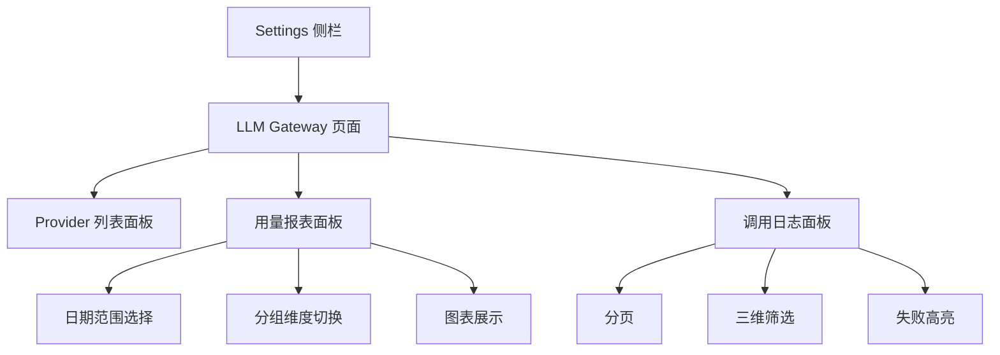
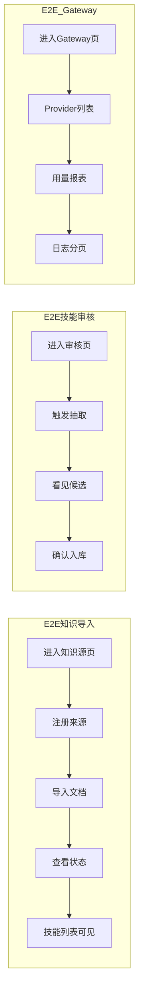

# 前端层 TDD实施计划 - Phase 7: LLM Gateway 设置与知识系统 E2E

## 概述

本阶段实现 LLM Gateway 管理页面（Provider 列表、用量报表、调用日志查看），并为知识系统新页面补充 Playwright E2E 冒烟测试，同时更新侧栏导航添加 Settings 入口。

**阶段目标**:
- Gateway 可视化 - Provider / 用量 / 调用日志可查看
- E2E 保障 - 知识系统关键流程 ≥ 3 条 E2E 冒烟用例通过
- 导航完整 - Settings 入口在侧栏可见

**前置依赖**:
- 前端 Phase 1-5 全部交付（工程骨架、通用组件、E2E 基础设施）
- Phase 6 知识系统页面交付
- 后端 LLM Gateway 管理 API 可用（知识库 Phase 3 交付）
- `docs/TDD/5.前端层/TDD_PLAN_PHASE6.md`


## Phase 7 包含的步骤

| 步骤 | 名称 | 状态 | 测试 | 完成日期 |
|------|------|------|------|----------|
| Step 1 | Gateway API Client + 页面 | ✅ | 17/17 | 2026-03-24 |
| Step 2 | 知识系统 E2E 冒烟测试 | ✅ | 4/4 | 2026-03-24 |
| Step 3 | 集成验证与 data-testid 补全 | ✅ | 4/4 + lint/typecheck | 2026-03-24 |

**步骤列表**:
- **Step 1**: Gateway API Client + 页面（API Client、侧栏导航、Provider 列表、用量报表、调用日志）
- **Step 2**: 知识系统 E2E 冒烟测试（知识导入流程、技能审核流程、Gateway 查看流程）
- **Step 3**: 集成验证与 data-testid 补全（Phase 6 组件 data-testid、最终集成验证）

---

## Step 1: Gateway API Client + 页面 (GatewayPageGate) ✅

**目标**: 实现 Gateway API Client，构建 Provider 列表、用量报表（含图表）、调用日志列表页面，更新侧栏添加 Settings 入口。

**上下文依赖**:
- 读取 `docs/dev_step/4.接口层_API路由清单.md` § 10 了解 Gateway 路由
- 读取 `docs/dev_step/4.接口层_API联调用例.md` 了解 Gateway 联调示例
- 读取 `docs/updates/20260323_知识库/1.知识库架构设计.md` § 12.1 了解 Gateway 设计
- 读取 `docs/init/5.附录.md` § I 了解 Gateway 配置示例

**交付物**:
- ✅ `frontend/src/lib/api/llm-gateway.ts` - Gateway API Client
- ✅ `frontend/src/features/settings/hooks/` - 数据请求 hooks
- ✅ `frontend/src/features/settings/components/ProviderList.tsx` - Provider 列表
- ✅ `frontend/src/features/settings/components/UsageReport.tsx` - 用量报表
- ✅ `frontend/src/features/settings/components/CallLogList.tsx` - 调用日志
- ✅ `frontend/src/app/(dashboard)/settings/llm-gateway/page.tsx` - Gateway 页面
- ✅ `frontend/__tests__/features/settings/gateway.test.tsx` - Vitest 测试

**验收标准**:
- [x] listProviders / getUsageReport / getCallLogs 三个 API 方法可用
- [x] Settings 入口在侧栏可见，LLM Gateway 子导航可点击
- [x] Provider 列表展示名称、支持模型、状态
- [x] 用量报表支持日期选择器、分组切换（provider / call_type / model）
- [x] 用量报表使用图表展示趋势（柱状图或折线图）
- [x] 调用日志表格含 call_type / provider / model / tokens / latency / cost / status / time
- [x] 调用日志支持分页 + 按 call_type / provider / status 筛选
- [x] 失败记录高亮
- [x] 所有页面三态（loading / empty / error）完备

**实现状态**: ✅ 已完成
**测试结果**: 17/17 Vitest 通过
**完成日期**: 2026-03-24

---

### Red Phase - 失败的测试定义

**测试文件**: `frontend/__tests__/features/settings/gateway.test.tsx`

**核心测试用例**:
- ❌ `test_listProviders_returns_array` - listProviders 返回 Provider 数组
- ❌ `test_getUsageReport_supports_params` - getUsageReport 支持 start_date / end_date / group_by
- ❌ `test_getCallLogs_pagination_and_filter` - getCallLogs 分页与筛选
- ❌ `test_sidebar_settings_entry_visible` - Settings 入口可见
- ❌ `test_provider_list_renders_columns` - Provider 列表展示列
- ❌ `test_usage_report_date_picker` - 日期选择器可用
- ❌ `test_usage_report_group_by_switch` - 分组切换可用
- ❌ `test_usage_report_chart_renders` - 图表渲染
- ❌ `test_call_log_table_columns` - 日志表格列
- ❌ `test_call_log_pagination` - 分页功能
- ❌ `test_call_log_filter_by_call_type` - 按 call_type 筛选
- ❌ `test_call_log_failed_highlight` - 失败记录高亮
- ❌ `test_empty_state_renders` - 空态展示

**关键验证点**:
- **API 方法完整** - 三个方法参数与返回值正确
- **图表渲染** - 不阻塞页面交互
- **日志分页** - 组件卸载时清除查询



---

### Green Phase - 实现最小化功能

**实现文件**:
- `frontend/src/lib/api/llm-gateway.ts`
- `frontend/src/features/settings/hooks/useGateway.ts`
- `frontend/src/features/settings/components/ProviderList.tsx`
- `frontend/src/features/settings/components/UsageReport.tsx`
- `frontend/src/features/settings/components/CallLogList.tsx`
- `frontend/src/app/(dashboard)/settings/llm-gateway/page.tsx`

**核心组件**:
- `gatewayApi` - Gateway API Client（listProviders / getUsageReport / getCallLogs）
- `ProviderList` - Provider 列表（只读展示）
- `UsageReport` - 用量报表（日期选择 + 分组 + 图表）
- `CallLogList` - 调用日志（分页 + 筛选 + 高亮）

**技术特性**:
- ✅ 只读管理（Provider 注册通过后端配置）
- ✅ 图表可视化（token 消耗与成本趋势）
- ✅ 三维筛选（call_type / provider / status）
- ✅ 分页不泄漏（组件卸载清除查询）

**实现要点**:
- 用量报表图表使用 recharts 或类似库
- 日期范围选择器复用 shadcn/ui 组件
- 调用日志分页使用 cursor 或 offset 模式

---

### Refactor Phase - 优化和扩展

**重构目标**:
1. 统一 Gateway 数据展示组件风格
2. 抽取日期范围选择器为复用组件
3. 图表主题与全局样式对齐

**验收标准**:
- [ ] 图表渲染不阻塞页面交互
- [ ] 日志分页组件卸载时清除查询

---

## Step 2: 知识系统 E2E 冒烟测试 (KnowledgeE2EGate) ✅

**目标**: 为知识系统关键流程编写 Playwright E2E 冒烟测试，确保关键路径可走通。

**上下文依赖**:
- 依赖 Phase 6 知识系统页面
- 依赖 Step 1 Gateway 页面
- 依赖 Phase 5 Playwright 基础设施

**交付物**:
- ✅ `frontend/tests/e2e/knowledge-workflow.spec.ts` - 知识导入流程 E2E
- ✅ `frontend/tests/e2e/knowledge-review.spec.ts` - 技能审核流程 E2E
- ✅ `frontend/tests/e2e/gateway-view.spec.ts` - Gateway 查看流程 E2E

**验收标准**:
- [x] 知识导入 E2E：进入知识源页面 → 注册来源 → 导入文档 → 查看状态 → 进入技能列表 → 看见数据
- [x] 技能审核 E2E：进入审核页面 → 触发抽取 → 看见候选列表 → 确认一条 → 技能列表可见
- [x] Gateway 查看 E2E：进入 Gateway 页 → Provider 列表可见 → 用量报表可选时间 → 日志分页翻页
- [x] 知识系统 E2E ≥ 3 条通过
- [x] Gateway E2E ≥ 1 条通过

**实现状态**: ✅ 已完成
**测试结果**: 4/4 Playwright E2E 通过（知识 3 条 + Gateway 1 条）
**完成日期**: 2026-03-24

---

### Red Phase - 失败的测试定义

**测试文件**: `frontend/tests/e2e/knowledge-workflow.spec.ts` + `knowledge-review.spec.ts` + `gateway-view.spec.ts`

**核心测试用例**:
- ❌ `test_e2e_knowledge_import_workflow` - 知识导入全流程
- ❌ `test_e2e_document_chunk_preview_workflow` - 文档切块预览流程
- ❌ `test_e2e_skill_review_workflow` - 技能审核全流程
- ❌ `test_e2e_gateway_view_workflow` - Gateway 查看全流程

**关键验证点**:
- **导入流程完整** - 从注册到查看技能数据
- **审核流程完整** - 从触发到入库
- **Gateway 可交互** - 时间选择 + 分页可操作



---

### Green Phase - 实现最小化功能

**实现要点**:
- E2E 使用 Playwright page 对象
- 所有交互元素需有稳定 data-testid（Step 3 补全）
- 测试数据通过 API seed 或 fixture 准备

---

### Refactor Phase - 优化和扩展

**重构目标**:
1. E2E 测试提取 Page Object Model
2. 测试数据 fixture 可复用

---

## Step 3: 集成验证与 data-testid 补全 (IntegrationVerifyGate) ✅

**目标**: 为 Phase 6 组件补充 E2E 所需的 data-testid 属性，完成最终集成验证。

**上下文依赖**:
- 依赖 Step 2 的 E2E 测试选择器需求
- 依赖 Phase 6 组件

**交付物**:
- ✅ Phase 6 组件 data-testid 更新补丁
- ✅ 集成验证记录

**验收标准**:
- [x] 所有 E2E 涉及的按钮/输入/表格行具有稳定 data-testid
- [x] 知识导入全流程页面走通
- [x] Gateway 页面数据正确展示
- [x] E2E 全部通过
- [x] 无 console error

**实现状态**: ✅ 已完成
**测试结果**: 4/4 Playwright E2E 通过，lint/typecheck 通过
**完成日期**: 2026-03-24

---

### Red Phase - 失败的测试定义

**核心验证点**:
- ❌ 所有 E2E 首次运行因缺少 data-testid 而失败
- ❌ 集成验证发现页面间跳转或数据传递问题

### Green Phase - 实现最小化功能

**实现要点**:
- 为 Phase 6 组件中 E2E 涉及的交互元素添加 `data-testid`
- 修复集成验证中发现的问题
- 确认无 console error

**本次补全的关键选择器**:
- `document-row-{document_id}`
- `skill-row-{technique_id}`
- `extract-skills-btn`
- `candidate-confirm-btn-{candidate_id}`
- `review-selected-doc`

### Refactor Phase - 优化和扩展

**验收标准**:
- [ ] data-testid 命名规范统一
- [ ] E2E 全部通过

---

## Phase 7 完成总结

> 💡 **AI提示：阶段完成后填写此章节**

### 完成状态

| 步骤 | 名称 | 状态 | 测试 | 完成日期 |
|------|------|------|------|----------|
| Step 1 | Gateway API Client + 页面 | ✅ | 17/17 | 2026-03-24 |
| Step 2 | 知识系统 E2E 冒烟测试 | ✅ | 4/4 | 2026-03-24 |
| Step 3 | 集成验证与 data-testid 补全 | ✅ | 4/4 + lint/typecheck | 2026-03-24 |

### 关键成果

1. **Gateway 可视化**: Provider / 用量 / 日志可查看和筛选
2. **E2E 保障**: 知识系统 ≥ 3 条 + Gateway ≥ 1 条冒烟用例通过
3. **前端完整**: 知识管理 + Gateway 设置全部前端页面交付

### 本次验收结果

- Vitest: 17/17 通过
- Playwright: 4/4 通过
- TypeScript: `pnpm typecheck` 通过
- ESLint: `pnpm lint` 通过

### Phase 7 验证命令

```bash
pnpm test:phase7:unit
pnpm test:phase7:e2e
pnpm verify:phase7
```

### 遗留问题

- [ ] 用量报表图表库选型最终确认 - 低优先级
- [ ] E2E 测试数据 seed 策略统一 - 中优先级

---

## 实现检查清单

### Red Phase 检查项
- [x] Gateway API Client 方法有 Vitest 测试
- [x] Playwright E2E 编写后初始状态 fail
- [x] 三态和交互均有测试覆盖

### Green Phase 检查项
- [x] API Client 方法实现完整
- [x] 页面组件渲染正确
- [x] data-testid 补全后 E2E 通过

### Refactor Phase 检查项
- [ ] Gateway 组件风格统一
- [ ] 日期范围选择器复用
- [ ] E2E Page Object Model 提取

---

## 质量标准

### 代码质量
- [x] TypeScript 类型完整，无 `any` 逃逸
- [x] `pnpm lint` 零报错；`pnpm typecheck` 零报错

### 交互质量
- [x] 所有页面三态完备
- [x] 图表渲染不阻塞页面交互
- [x] 日志分页不泄漏（组件卸载清除查询）

### E2E 质量
- [x] 知识系统 E2E ≥ 3 条通过
- [x] Gateway E2E ≥ 1 条通过
- [x] 无 console error

### 与里程碑对齐
- [x] 满足 Phase F7 交付要求：Gateway 状态查看与成本监控
- [x] 非开发人员可按文档完成一次完整知识导入流程
