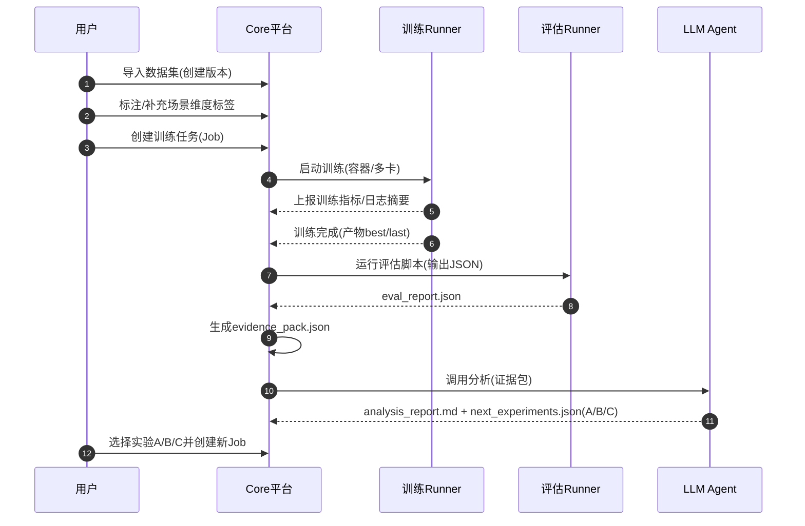

# 产品PRD.md

## 1. 背景与痛点
现有图像算法训练通常存在：
- 训练流程分散（脚本/环境/参数/数据版本不统一），复现困难
- 数据集质量与场景覆盖缺乏结构化统计，难以定位瓶颈
- 指标关注 mAP 等通用指标，业务 KPI 不易闭环
- 训练后分析依赖人工经验，迭代慢、容易遗漏问题
- HPO/并行实验管理缺少平台化支撑

## 2. 产品目标
1) 提供一个平台化训练工作流：数据集版本化、训练任务化、评估自动化、产物可追溯  
2) 引入 LLM Agent：对训练参数、数据统计、业务 KPI、按场景切片结果进行智能分析，输出候选实验 A/B/C 并支持一键发起

### 2.1 成功指标（示例）
- 训练复现成功率 ≥ 95%
- 平均迭代周期减少 ≥ 30%
- KPI 提升迭代次数减少（同等 KPI 达成所需实验次数降低）
- 训练失败可定位率（有明确失败原因与建议）≥ 90%

## 3. 用户与使用场景
### 3.1 用户角色
- 算法工程师：创建训练任务、对比实验、查看诊断建议
- 数据/标注人员：补充场景标签、修复数据问题、查看数据质量报告
- 项目负责人：配置项目 KPI 权重/阈值，查看 KPI 报告与趋势

### 3.2 典型流程

## 4. 功能需求
### 4.1 数据集管理（P0）

- 导入 YOLO 格式数据集（det/seg/cls）

- 数据集版本管理（version freeze）

- train/val/test 分割管理

- 数据统计与质量检查（空图比例、类别分布、目标尺寸分布、异常文件）

- 场景维度标签：下拉枚举 + “其它”文本输入

- 场景覆盖率统计与可视化（按维度/组合）

### 4.2 训练任务（P0）

- 支持 YOLO11：cls/det/seg

- 训练参数配置（模板 + 自定义）

- 单机多卡：支持多任务并行；支持单任务多卡（DDP）

- 断点续训（resume）

- AMP（混合精度）

- 训练过程指标展示（loss、mAP/acc 等）与日志查看

- 产物管理（权重、配置、曲线、样例）

### 4.3 评估与业务 KPI（P0）

- 训练后自动运行 Python 测试脚本

- 强制输出 JSON contract（overall、by_class、by_scene、error_slices、artifacts）

- 业务 KPI：多指标加权；权重按项目可配置；支持阈值约束（如时延上限）

- 按场景切片 KPI（昼夜/天气/室内外/相机位点等）

- 评估失败处理：stderr/stdout 收集 + 失败报告

### 4.4 LLM Agent 智能分析（P1）

- 基于 Evidence Pack 输出：

- 训练后诊断报告（可读 Markdown）

- 下一轮实验候选 A/B/C（可执行 JSON）

- 默认不自动创建任务，仅生成候选

- UI 支持一键选取 A/B/C 创建新任务

- 建议必须可回溯（引用证据字段）

- 支持“建议模板库”（规则 + LLM）混合输出（可选）

### 4.5 导出与部署评估（P1）

- 训练完成可选导出 TensorRT

- 生成部署基准（吞吐/时延/显存）并写入 JSON

- 将部署指标纳入业务 KPI（若项目配置包含时延）

## 5. 交互与页面（概要）

- 项目设置：KPI 权重/阈值、默认训练模板、导出设置

- 数据集详情：版本、统计、质量、场景覆盖、样例

- 训练任务列表：状态、资源、KPI、对比

- 训练详情：曲线、日志、产物、评估 JSON、LLM 报告、A/B/C 按钮

- 实验对比：多 run 指标对比 + 场景切片对比

## 6. 权限与审计（简化）

- 当前不做多租户，但需要：

- 项目维度的配置隔离（KPI 权重/阈值/模板）

- LLM 建议与实验创建记录（谁、何时、基于哪个证据）

## 7. 非功能需求

- 可复现：每个 run 必须保存 train_args、数据版本、代码版本（容器镜像tag）

- 可观测：任务状态、资源、日志、错误

- 可扩展：Runner 抽象；推理后端可扩展

- 性能：适配 4090 24GB/48GB，支持并行训练与评估

## 8. 里程碑

- M1（P0）：数据→训练→评估 JSON → UI 展示

- M2（P1）：Evidence Pack + LLM Agent 输出 A/B/C + 一键发起

- M3（P2）：TensorRT 导出 + 部署基准纳入 KPI