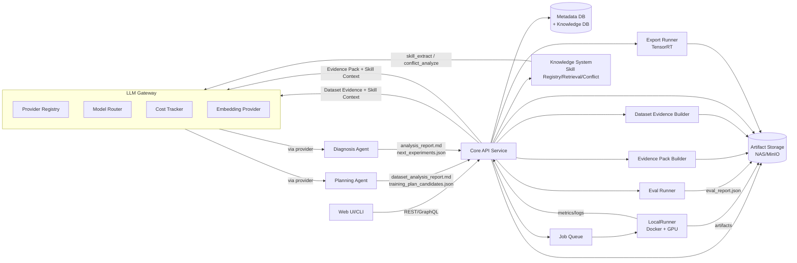
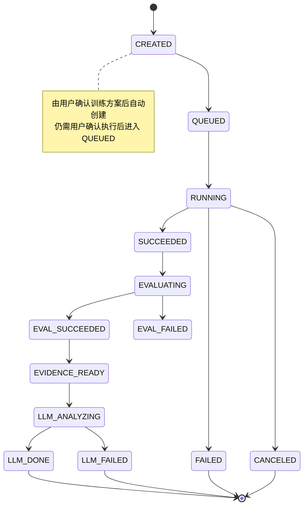
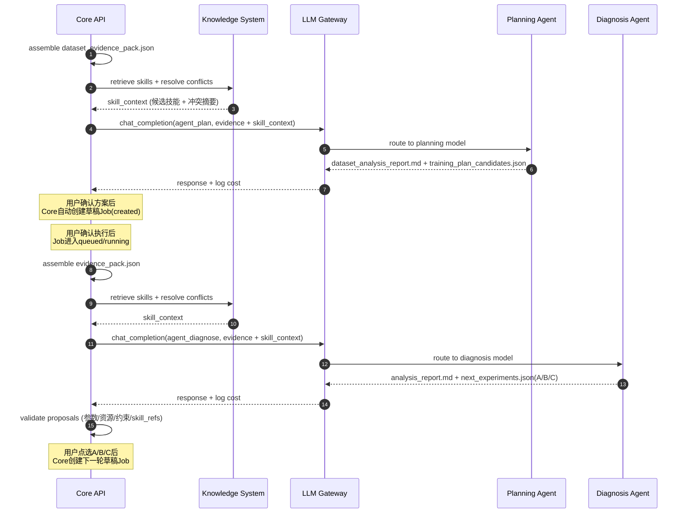
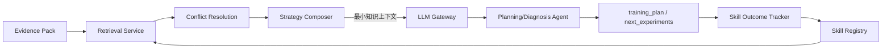

# 系统架构.md

## 1. 架构总览

## 2. 核心设计点

- Runner 抽象：LocalRunner（当前）与未来 K8sRunner 共用 JobSpec

- Artifact Storage 与 Metadata 分离：大文件走对象存储/共享存储；元数据走 DB

- Evidence Pack：平台统一生成结构化证据包，LLM 仅消费证据并输出建议/计划

- Agent 解耦：Agent 不直连 DB/文件系统，只能通过 Core API 调用受控函数

- **LLM Gateway**：所有 LLM 调用（Agent 推理、技能抽取、冲突分析、Embedding）统一经过 Gateway，支持 Provider 可切换（OpenAI/智谱/Ollama 等）、Model 可路由、成本可追踪

- **Knowledge System（知识系统）**：将外部训练技巧、模型改造经验结构化为技能卡片（Skill Card），按 Training / Model / Data / Eval & Deploy 四大类管理，在 Agent 推理前做知识检索+冲突消解+上下文裁剪，降低 token 成本并提高建议质量

## 3. 运行时状态机（训练任务）

## 4. 数据流与产物流
### 4.1 训练产物（run_dir）

- weights/best.pt, weights/last.pt

- train_args.json

- train_logs/*

- plots/*（loss 曲线、PR 曲线等）

- eval/eval_report.json

- evidence/evidence_pack.json

- llm/analysis_report.md

- llm/next_experiments.json

- export/tensorrt/*（可选）

### 4.2 KPI 配置

- ProjectKpiConfig：多指标权重 + 阈值约束

- 评估脚本输出分量 → 平台计算加权 KPI → 写入任务摘要与对比视图

## 5. LLM Gateway 与 Agent 交互

### 5.1 LLM Gateway 设计要点

- **Provider 抽象**：统一的 LLMProvider / EmbeddingProvider 接口，支持 OpenAI / 智谱 / Ollama 等
- **Model 路由**：不同任务（agent_plan / agent_diagnose / skill_extract / embedding）可配置不同 Provider+Model
- **成本追踪**：每次调用记录 input_tokens / output_tokens / latency / cost_estimate → llm_call_log 表
- **全局限流**：按 Provider 配置 RPM/TPM 限制
- **用户可配**：通过项目设置或管理后台选择 Provider 和模型

## 6. 知识系统架构

详见 `docs/updates/20260323_知识库/1.知识库架构设计.md`，核心要点：

- **技能卡片（Skill Card）**：将外部训练技巧、模型改造经验结构化为可索引、可约束的知识单元
- **四大分类**：Training Skills / Model Skills / Data Skills / Eval & Deploy Skills
- **离线重加工**：原始资料 → 文档切片 → LLM 半自动抽取 → 导入时冲突检测 → 人工审核 → 发布
- **在线轻推理**：Evidence Pack + 知识检索 + 冲突消解 → 最小上下文（5-12 条技能摘要）→ Agent 推理
- **内部经验闭环**：skill_outcome 表记录技能在真实实验中的表现，反哺检索排序

### 6.1 知识系统与 Agent 的关系

## 7. 可扩展性预留

- 多机训练：增加 K8sRunner/SlurmRunner，保持 JobSpec 不变

- 多推理后端：ExportSpec 增加 backend 枚举；新增对应 Export Runner

- HPO：后续引入 HpoJob（Ray Tune），与普通 Job 并行存在

- LLM Provider：通过 LLM Gateway 新增 Provider 实现即可接入新的模型服务

- 知识来源：新资料通过标准导入流程接入，不需要修改 Agent Prompt