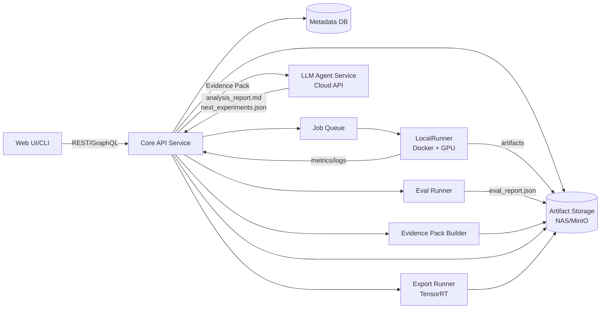
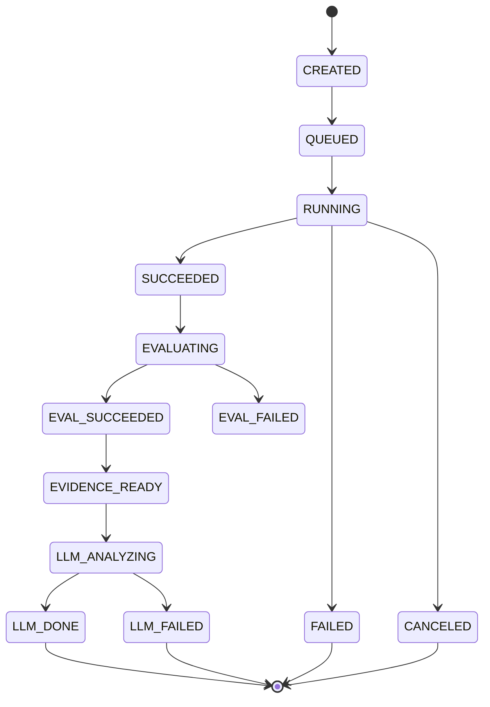
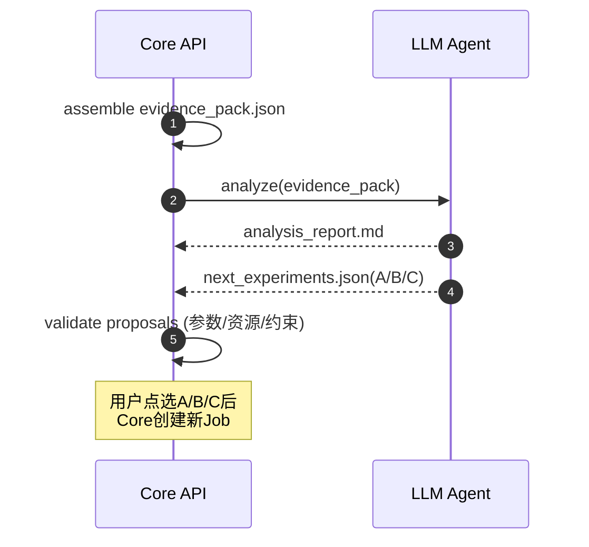

# 系统架构.md

## 1. 架构总览

## 2. 核心设计点

- Runner 抽象：LocalRunner（当前）与未来 K8sRunner 共用 JobSpec

- Artifact Storage 与 Metadata 分离：大文件走对象存储/共享存储；元数据走 DB

- Evidence Pack：平台统一生成结构化证据包，LLM 仅消费证据并输出建议/计划

- Agent 解耦：Agent 不直连 DB/文件系统，只能通过 Core API 调用受控函数

## 3. 运行时状态机（训练任务）

## 4. 数据流与产物流
### 4.1 训练产物（run_dir）

- weights/best.pt, weights/last.pt

- train_args.json

- train_logs/*

- plots/*（loss 曲线、PR 曲线等）

- eval/eval_report.json

- evidence/evidence_pack.json

- llm/analysis_report.md

- llm/next_experiments.json

- export/tensorrt/*（可选）

### 4.2 KPI 配置

- ProjectKpiConfig：多指标权重 + 阈值约束

- 评估脚本输出分量 → 平台计算加权 KPI → 写入任务摘要与对比视图

## 5. LLM Agent 交互（函数调用）

## 6. 可扩展性预留

- 多机训练：增加 K8sRunner/SlurmRunner，保持 JobSpec 不变

- 多推理后端：ExportSpec 增加 backend 枚举；新增对应 Export Runner

- HPO：后续引入 HpoJob（Ray Tune），与普通 Job 并行存在