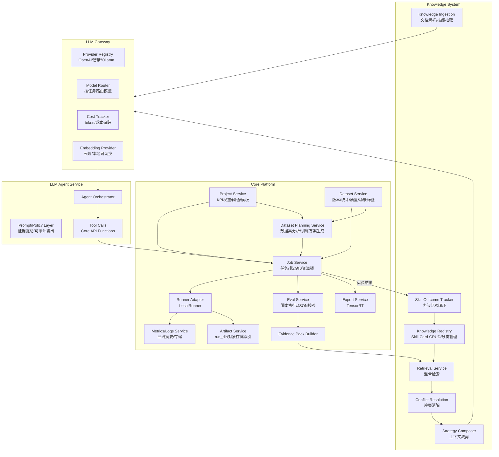

# 模块设计.md

## 1. 模块划分


2. Dataset Service
2.1 数据模型（建议字段）

Dataset: dataset_id, name, task_type, created_at

DatasetVersion: version_id, dataset_id, yolo_root_path, splits, classes, frozen, business_description, target_kpi, constraints

SceneTaxonomy: 维度定义（枚举表/配置表）

SceneLabel: image_id, time_of_day, weather, weather_other, indoor, camera_fixed, grayscale, camera_site, updated_by

2.2 统计与质量检查

类别分布、空图比例

bbox/mask 尺寸分布

每图目标数分布

场景覆盖率（单维度与组合）

异常列表：缺失标注/图片损坏/尺寸异常/重复图（可选）

2.3 数据集规划输出

dataset_analysis_report.md：总结数据风险、场景盲区、标签问题、业务目标匹配度

training_plan_candidates.json：输出多套训练方案，字段至少包含 model_scale、backbone、neck、imgsz、batch、epoch、optimizer、lr0、augment、freeze_layers、resource_profile

3. Job Service
3.1 JobSpec（统一训练任务描述）

job_id, project_id, task_type, model, dataset_version_id

train_args：对齐 Ultralytics

resources：gpus/cpus/mem + gpu_type（4090 24GB/48GB）

resume_from：断点续训路径

precision：amp/fp32

quant_pipeline：none/ptq/qat（当前以 ptq+TensorRT 为主）

3.2 资源锁与并行

GPU Lock：按 GPU index 分配与回收

并行策略：

多 job 并行：每 job 1~N 卡

单 job 多卡：DDP（可选开关）

3.3 Job 创建策略

人工创建任务：可直接创建并排队

方案生成任务：用户确认方案后自动创建草稿 Job（created），用户确认执行后再进入 queued/running

4. Runner Adapter（LocalRunner）

以容器方式启动训练（Docker）

注入：

数据路径挂载

输出 run_dir 挂载

环境变量（CUDA_VISIBLE_DEVICES）

采集：

训练日志

关键指标（按 epoch 汇总）

异常（OOM/NaN/退出码）

5. Eval Service
5.1 执行约束

Python 脚本统一入口

强制输出 JSON（schema 校验）

失败时捕获 stdout/stderr 并落盘

5.2 JSON Contract（必须）

overall.business_kpi 与 kpi_components

by_class[]

by_scene[]

error_slices[]

artifacts{plots, samples}

6. Evidence Pack Builder

输入：dataset report + job summary + eval report + project KPI config

输出：单一 evidence_pack.json

要求：

曲线/日志做摘要（降采样/统计）

产物索引用路径/ID，不直接塞大量图片

7. LLM Agent Service
7.1 Agent 输出

dataset_analysis_report.md（人读）

training_plan_candidates.json（机器可执行，多方案）

analysis_report.md（人读）

next_experiments.json（机器可执行 A/B/C）

7.2 默认策略（已确认）

数据集规划 Agent 生成训练方案；用户确认后平台自动创建草稿 Job

训练后分析 Agent 生成下一轮候选实验；用户确认后平台自动创建下一轮草稿 Job

7.3 可审计要求

每条建议/每个变更点必须引用 evidence 字段（如 "by_scene: night+rain KPI=…"）和 skill_refs（如 "train.augment.mosaic_scale"）

8. Export Service（TensorRT）

输入：best.pt（或导出 ONNX）

输出：TensorRT engine + 部署基准 deploy_benchmark.json

与业务 KPI 联动：若 KPI 包含时延/吞吐，纳入加权

9. LLM Gateway

统一管理平台中所有 LLM 调用的中心服务。

9.1 Provider 抽象

```python
class LLMProvider(Protocol):
    def chat(self, messages: list[dict], **kwargs) -> dict: ...
    def models(self) -> list[str]: ...

class EmbeddingProvider(Protocol):
    def embed(self, texts: list[str]) -> list[list[float]]: ...
```

支持 Provider：OpenAI / 智谱 / Ollama / 其他 OpenAI 兼容 API

9.2 Model Router

不同任务可配置不同 Provider + Model：

- agent_plan / agent_diagnose → 强模型（如 gpt-4o）
- skill_extract / conflict_analyze → 可用轻量模型（如 glm-4-flash）
- embedding → text-embedding-3-small 或本地 bge-m3

9.3 Cost Tracker

每次调用写入 llm_call_log（call_type / provider / model / tokens / cost / latency）

9.4 用户可配

通过项目设置或管理后台选择 Provider 和模型

10. Knowledge System（知识系统）

详细设计见 `docs/updates/20260323_知识库/1.知识库架构设计.md`。

10.1 Knowledge Ingestion

- 注册 source（本地/URL/内部实验）
- 导入 document（Markdown / HTML / PDF / Notebook / Code）
- 切块与清洗
- 经 LLM Gateway 半自动抽取候选技能（Skill Card）
- 导入时冲突检测（LLM + 人工）

10.2 Knowledge Registry（Skill Card 管理）

技能卡片按四大类分层管理：

- **Training Skills**：optimizer / schedule / augment / regularization / precision / freeze / hyperparameter / distributed
- **Model Skills**：backbone / neck / head / block / attention / conv / loss
- **Data Skills**：cleaning / balancing / scene_coverage / split / preprocessing
- **Eval & Deploy Skills**：metric / calibration / quantization / export / benchmark

每条 Skill Card 包含：名称、分类、适用条件（结构化表达式）、推荐动作、收益/代价/冲突关系、来源证据、内部验证状态

10.3 Retrieval Service

混合检索：结构过滤 → 规则召回 → 关键词检索 → 向量检索（Phase 3+）→ 内部经验加权

10.4 Conflict Resolution

冲突类型：结构冲突 / 资源冲突 / 目标冲突 / 版本冲突 / 生命周期冲突

冲突规则用 JSON DSL 描述，程序执行判定，LLM 辅助解释

10.5 Strategy Composer

组装送给 Agent 的最小知识上下文（5-12 条技能摘要 + 冲突摘要），控制 token 预算（8k-20k）

10.6 Skill Outcome Tracker

记录技能在真实实验中的表现（win / lose / neutral），反哺检索排序

11. 接口（Core API 给 Agent 的函数）

get_job_summary(job_id)

get_dataset_report(dataset_version_id)

get_dataset_business_context(dataset_version_id)

get_eval_report(job_id)

get_project_kpi_config(project_id)

validate_proposals(baseline_job_id, proposals_json)

create_training_job(job_spec)（由用户确认方案后触发，默认创建草稿 Job）

create_export_job(job_id, export_spec)（可选）

get_skill_context(query_signature)（返回候选技能 + 冲突消解结果）