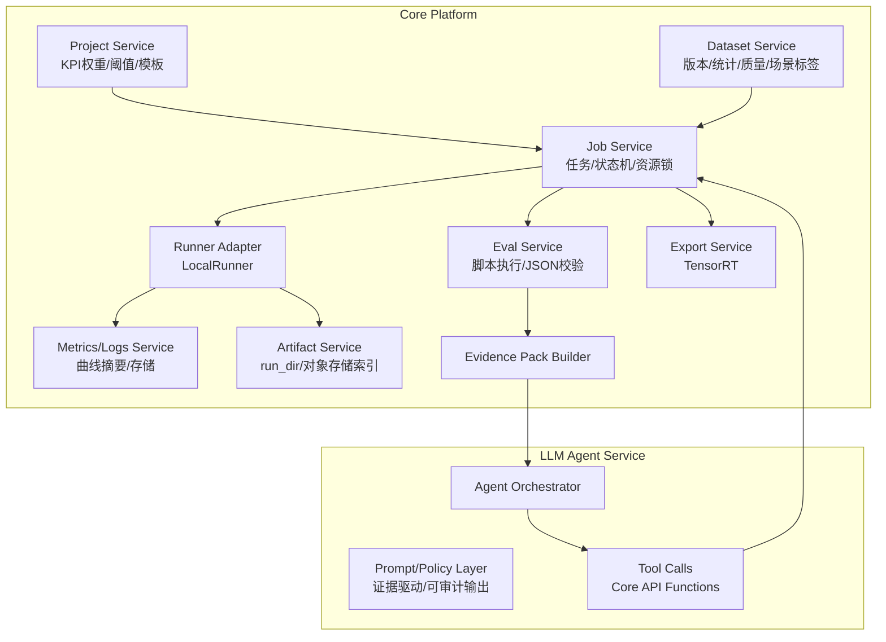

# 模块设计.md

## 1. 模块划分

2. Dataset Service
2.1 数据模型（建议字段）

Dataset: dataset_id, name, task_type, created_at

DatasetVersion: version_id, dataset_id, yolo_root_path, splits, classes, frozen

SceneTaxonomy: 维度定义（枚举表/配置表）

SceneLabel: image_id, time_of_day, weather, weather_other, indoor, camera_fixed, grayscale, camera_site, updated_by

2.2 统计与质量检查

类别分布、空图比例

bbox/mask 尺寸分布

每图目标数分布

场景覆盖率（单维度与组合）

异常列表：缺失标注/图片损坏/尺寸异常/重复图（可选）

3. Job Service
3.1 JobSpec（统一训练任务描述）

job_id, project_id, task_type, model, dataset_version_id

train_args：对齐 Ultralytics

resources：gpus/cpus/mem + gpu_type（4090 24GB/48GB）

resume_from：断点续训路径

precision：amp/fp32

quant_pipeline：none/ptq/qat（当前以 ptq+TensorRT 为主）

3.2 资源锁与并行

GPU Lock：按 GPU index 分配与回收

并行策略：

多 job 并行：每 job 1~N 卡

单 job 多卡：DDP（可选开关）

4. Runner Adapter（LocalRunner）

以容器方式启动训练（Docker）

注入：

数据路径挂载

输出 run_dir 挂载

环境变量（CUDA_VISIBLE_DEVICES）

采集：

训练日志

关键指标（按 epoch 汇总）

异常（OOM/NaN/退出码）

5. Eval Service
5.1 执行约束

Python 脚本统一入口

强制输出 JSON（schema 校验）

失败时捕获 stdout/stderr 并落盘

5.2 JSON Contract（必须）

overall.business_kpi 与 kpi_components

by_class[]

by_scene[]

error_slices[]

artifacts{plots, samples}

6. Evidence Pack Builder

输入：dataset report + job summary + eval report + project KPI config

输出：单一 evidence_pack.json

要求：

曲线/日志做摘要（降采样/统计）

产物索引用路径/ID，不直接塞大量图片

7. LLM Agent Service
7.1 Agent 输出

analysis_report.md（人读）

next_experiments.json（机器可执行 A/B/C）

7.2 默认策略（已确认）

Agent 只生成候选实验，不自动创建任务

7.3 可审计要求

每条建议/每个变更点必须引用 evidence 字段（如 “by_scene: night+rain KPI=…”）

8. Export Service（TensorRT）

输入：best.pt（或导出 ONNX）

输出：TensorRT engine + 部署基准 deploy_benchmark.json

与业务 KPI 联动：若 KPI 包含时延/吞吐，纳入加权

9. 接口（Core API 给 Agent 的函数）

get_job_summary(job_id)

get_dataset_report(dataset_version_id)

get_eval_report(job_id)

get_project_kpi_config(project_id)

validate_proposals(baseline_job_id, proposals_json)

create_training_job(job_spec)（由用户确认触发）

create_export_job(job_id, export_spec)（可选）