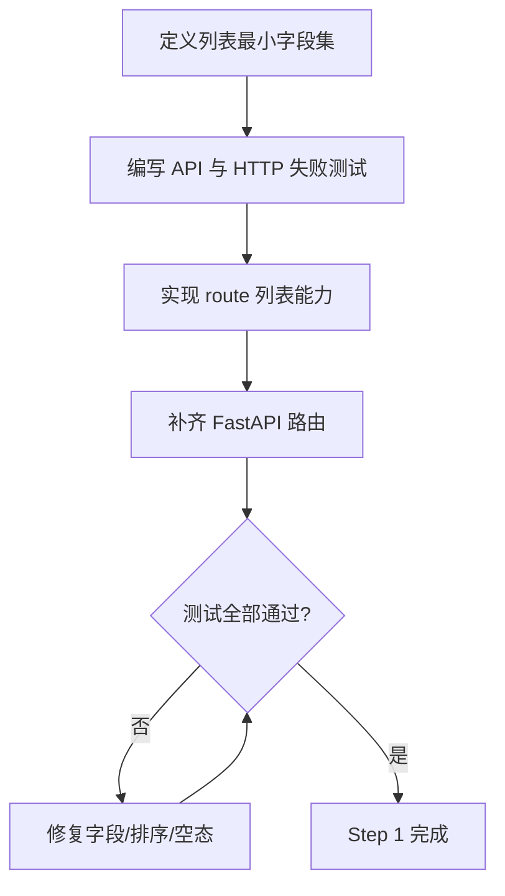
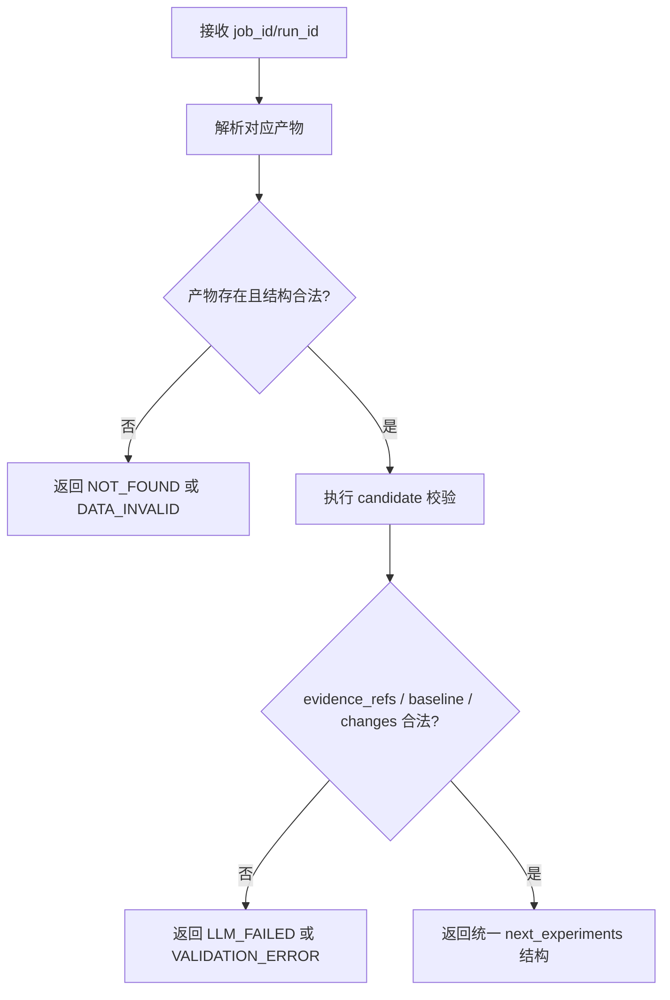
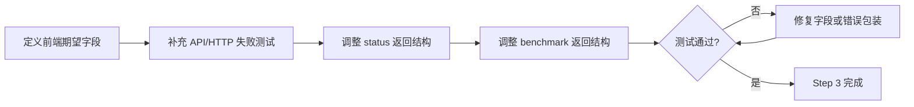

# 变更修复 TDD实施计划 - Phase 1: 后端接口补齐与契约统一

## 概述

本阶段聚焦当前主链路最关键的后端缺口：补齐前端依赖的列表查询接口，统一 Proposal 校验输入语义，并对齐导出与部署基准接口结构。测试计划以“先失败、再最小通过、再统一收敛”为主线，确保后续前端接线建立在稳定 API 基线上。

**阶段目标**:
- 列表接口可验证 - `GET /jobs` 与 `GET /datasets` 返回结构可被前端直接消费
- Proposal 契约可验证 - `validate_proposals(job_id, run_id)` 与产物校验链路一致
- 导出接口可验证 - 状态查询与 benchmark 返回结构与前端类型严格对齐

**前置依赖**:
- `docs/changes/20260311/TODO_PLAN_PHASE1.md`
- `docs/changes/20260311/未实现功能清单.md`
- `docs/init/1.产品PRD.md`
- `docs/init/2.系统架构.md`
- `docs/init/3.模块设计文档.md`
- `docs/init/5.附录.md`
- 当前 FastAPI 路由与 API routes 实现

## Phase 1 包含的步骤

| 步骤 | 名称 | 状态 | 测试 | 完成日期 |
|------|------|------|------|----------|
| Step 1 | 列表查询接口测试基线 | ⏳ | -/- | - |
| Step 2 | Proposal 校验契约统一门禁 | ⏳ | -/- | - |
| Step 3 | 导出状态与 benchmark 契约对齐门禁 | ⏳ | -/- | - |

**步骤列表**:
- **Step 1**: 列表查询接口测试基线
- **Step 2**: Proposal 校验契约统一门禁
- **Step 3**: 导出状态与 benchmark 契约对齐门禁

---

## Step 1: 列表查询接口测试基线 (ListApiBaseline) ⏳

**目标**: 建立 `GET /jobs` 与 `GET /datasets` 的测试门禁，确保前端列表页依赖的字段、空态语义与排序行为稳定。

**上下文依赖**:
- 读取 `docs/changes/20260311/TODO_PLAN_PHASE1.md` 了解接口补齐目标
- 读取 `docs/init/1.产品PRD.md` 了解任务列表、数据集列表页面信息需求
- 参考前端 hooks 了解最小字段需求：`useJobList`、`useDatasetList`

**交付物**:
- ⏳ `tests/api/test_job_api.py` - 任务列表接口测试扩展
- ⏳ `tests/api/test_dataset_api.py` - 数据集列表接口测试扩展
- ⏳ `tests/web/test_fastapi_app.py` - HTTP 列表流测试
- ⏳ `src/api/job_routes.py` - 列表能力实现
- ⏳ `src/api/dataset_routes.py` - 列表能力实现
- ⏳ `src/web/routes.py` - HTTP 路由补齐

**验收标准**:
- [ ] `GET /jobs` 返回前端列表页所需字段，不多层嵌套、不缺关键字段
- [ ] `GET /datasets` 返回 `dataset_id/name/latest_version/created_at` 等稳定字段
- [ ] 空列表返回空数组而非错误
- [ ] HTTP 层、route 层与前端 client 的字段口径一致

**实现状态**: ⏳ 待开始
**测试结果**: 0/0 测试通过
**计划实现日期**: 2026-03-11

---

### Red Phase - 失败的测试定义

**测试文件**: `tests/api/test_job_api.py`, `tests/api/test_dataset_api.py`, `tests/web/test_fastapi_app.py`

**核心测试用例**:
- ❌ `test_list_jobs_returns_empty_collection_when_no_jobs`
- ❌ `test_list_jobs_returns_required_fields_for_frontend_table`
- ❌ `test_list_jobs_preserves_stable_order`
- ❌ `test_list_datasets_returns_empty_collection_when_no_datasets`
- ❌ `test_list_datasets_returns_latest_version_projection`
- ❌ `test_jobs_http_endpoint_is_accessible`
- ❌ `test_datasets_http_endpoint_is_accessible`

**关键验证点**:
- **字段稳定性** - 前端展示所需字段固定存在
- **空态语义** - 无数据时为空集合，不抛异常
- **排序一致性** - 列表重复请求结果顺序可预测
- **HTTP 一致性** - API route 返回与 FastAPI 暴露结构一致

**流程图（列表接口门禁）**:

---

### Green Phase - 实现最小化功能

**实现文件**:
- `src/api/job_routes.py` - 任务列表查询能力
- `src/api/dataset_routes.py` - 数据集列表查询能力
- `src/web/routes.py` - `GET /jobs`、`GET /datasets`

**核心组件**:
- `list_jobs` - 返回任务列表视图模型
- `list_datasets` - 返回数据集列表视图模型
- `_to_http` - 复用统一响应结构

**主要API/功能**:

| 功能/端点 | 方法 | 功能描述 | 验收标准 |
|-----------|------|----------|----------|
| `/jobs` | GET | 返回任务列表 | 空列表返回空数组；字段满足表格展示 |
| `/datasets` | GET | 返回数据集列表 | 包含 latest_version；空列表返回空数组 |

**技术特性**:
- ✅ 统一 `{ok, data/error}` 响应结构
- ✅ 列表空态不抛错
- ✅ 可直接被前端 Query hooks 消费

**实现要点**:
- route 层做最小投影，不泄漏底层存储细节
- 保持与现有单项查询接口相同的错误语义与响应包装

---

### Refactor Phase - 优化和扩展

**重构目标**:
1. 抽取列表投影/序列化逻辑，避免 route 层重复拼装
2. 统一列表排序策略和空态语义
3. 为后续分页或筛选预留扩展点

**验收标准**:
- [ ] 列表序列化逻辑集中管理
- [ ] 回归测试覆盖空列表、单项、多项三类情形
- [ ] 扩展筛选/分页时无需破坏现有前端消费结构

---

## Step 2: Proposal 校验契约统一门禁 (ProposalContractGate) ⏳

**目标**: 建立 `validate_proposals` 的契约门禁，确保接口按 `job_id + run_id` 工作，并统一 `next_experiments` 为附录规定的 `baseline_job_id + candidates` 结构。

**上下文依赖**:
- 读取 `docs/init/2.系统架构.md` 了解 Proposal 校验所在流程位置
- 读取 `docs/init/3.模块设计文档.md` 了解 Core API 函数职责
- 读取 `docs/init/5.附录.md` 了解 `NextExperiments` 标准结构

**交付物**:
- ⏳ `tests/api/test_proposal_workflow_api.py` - Proposal 契约修复测试
- ⏳ `tests/web/test_fastapi_app.py` - Proposal HTTP 真实流测试
- ⏳ `src/api/proposal_routes.py` - 校验接口契约统一
- ⏳ 必要时 `src/api/analysis_routes.py` - 产物提取辅助能力

**验收标准**:
- [ ] `validate_proposals` 接口接收 `job_id`、`run_id` 并自行拉取产物
- [ ] 产物缺失时返回 `NOT_FOUND` 或 `DATA_INVALID`，语义稳定
- [ ] `next_experiments` 输出结构统一为 `baseline_job_id + candidates`
- [ ] 缺失 `evidence_refs`、非法变更、无效 baseline 仍能稳定拒绝

**实现状态**: ⏳ 待开始
**测试结果**: 0/0 测试通过
**计划实现日期**: 2026-03-11

---

### Red Phase - 失败的测试定义

**测试文件**: `tests/api/test_proposal_workflow_api.py`, `tests/web/test_fastapi_app.py`

**核心测试用例**:
- ❌ `test_validate_proposals_uses_job_id_and_run_id_to_resolve_artifacts`
- ❌ `test_validate_proposals_returns_not_found_when_artifact_missing`
- ❌ `test_validate_proposals_rejects_invalid_candidates_structure`
- ❌ `test_next_experiments_http_shape_matches_appendix_spec`
- ❌ `test_create_from_proposal_accepts_candidate_shape_from_validate_result`

**关键验证点**:
- **契约一致性** - 输入输出与前端页面、附录规范一致
- **证据驱动** - 校验过程基于真实产物，而非前端伪造完整 payload
- **错误可诊断** - 缺产物、非法字段、校验失败均返回稳定错误语义

**流程图（Proposal 契约统一）**:

---

### Green Phase - 实现最小化功能

**实现文件**:
- `src/api/proposal_routes.py` - Proposal validate/create 契约统一
- `src/api/analysis_routes.py` - 复用产物读取逻辑（如需要）

**核心组件**:
- `validate_proposals` - 基于 job_id/run_id 解析并校验候选实验
- `create_from_proposal` - 接受统一 candidate 结构后创建任务

**主要API/功能**:

| 功能/端点 | 方法 | 功能描述 | 验收标准 |
|-----------|------|----------|----------|
| `/proposals/validate` | POST | 基于 job_id/run_id 校验 proposals | 不再要求前端提交完整 agent_output |
| `/proposals/create-from-candidate` | POST | 基于统一 candidate 结构创建草稿任务 | 与 validate 返回结构兼容 |

**技术特性**:
- ✅ 与附录 E 对齐的 `baseline_job_id + candidates`
- ✅ 产物缺失与结构错误分开建模
- ✅ 与后续前端页面直接联调

**实现要点**:
- 校验逻辑复用已有 AgentService 能力，但 HTTP 契约不能泄漏内部旧结构
- create 与 validate 共用 candidate 结构，避免双协议并存

---

### Refactor Phase - 优化和扩展

**重构目标**:
1. 抽取产物解析与 proposal 正规化逻辑
2. 收敛 `experiments` 与 `candidates` 的内部兼容层，避免继续外溢
3. 统一 Proposal 错误码映射与审计字段准备

**验收标准**:
- [ ] HTTP 层只暴露一种标准结构
- [ ] 兼容层集中在单点，不在 route/service 多处散落
- [ ] 与 create_from_proposal 的输入模型完全对齐

---

## Step 3: 导出状态与 benchmark 契约对齐门禁 (ExportContractGate) ⏳

**目标**: 建立导出状态与 benchmark 返回结构的测试门禁，消除当前前后端字段不一致问题，保证导出页可以直接消费接口返回值。

**上下文依赖**:
- 读取 `docs/init/1.产品PRD.md` 了解导出与部署评估目标
- 读取 `docs/init/5.附录.md` 了解 `EXPORT_FAILED` 等错误语义
- 参考前端 `frontend/src/lib/api/export.ts` 的期望类型

**交付物**:
- ⏳ `tests/api/test_export_api.py` - 导出契约修复测试
- ⏳ `tests/web/test_fastapi_app.py` - 导出 HTTP 回归测试
- ⏳ `src/api/export_routes.py` - 导出状态与 benchmark 对齐

**验收标准**:
- [ ] 状态接口返回 `export_id/job_id/run_id/backend/status/created_at`
- [ ] benchmark 接口返回前端直接消费的指标字段
- [ ] 导出失败路径仍可提供诊断线索并保留统一错误结构
- [ ] 前端无需再针对 benchmark 包裹层做兼容

**实现状态**: ⏳ 待开始
**测试结果**: 0/0 测试通过
**计划实现日期**: 2026-03-11

---

### Red Phase - 失败的测试定义

**测试文件**: `tests/api/test_export_api.py`, `tests/web/test_fastapi_app.py`

**核心测试用例**:
- ❌ `test_export_status_shape_matches_frontend_contract`
- ❌ `test_export_status_contains_created_at`
- ❌ `test_deploy_benchmark_shape_matches_frontend_contract`
- ❌ `test_export_failure_preserves_diagnostic_result`
- ❌ `test_export_http_flow_returns_contract_aligned_payloads`

**关键验证点**:
- **字段对齐** - 前端类型与 HTTP 返回 1:1 对应
- **失败可诊断** - 失败时保留必要 stdout/stderr 线索
- **轮询友好** - 状态接口结构稳定，适合前端轮询

**流程图（导出契约对齐）**:

---

### Green Phase - 实现最小化功能

**实现文件**:
- `src/api/export_routes.py` - 导出契约对齐

**核心组件**:
- `create_export` - 保持创建逻辑不变，返回可追踪 export_id
- `get_export_status` - 返回前端期望的状态模型
- `get_deploy_benchmark` - 返回前端期望的 benchmark 模型

**主要API/功能**:

| 功能/端点 | 方法 | 功能描述 | 验收标准 |
|-----------|------|----------|----------|
| `/exports/{id}` | GET | 查询导出状态 | 结构稳定，适配轮询 |
| `/exports/{id}/deploy-benchmark` | GET | 查询部署基准 | 字段与前端类型一致 |

**技术特性**:
- ✅ 前后端字段完全对齐
- ✅ 保持失败路径诊断能力
- ✅ 与后续导出页轮询直接兼容

**实现要点**:
- status 与 result 视图解耦，前端只消费必要状态字段
- benchmark 输出不再额外嵌套一层不必要包装

---

### Refactor Phase - 优化和扩展

**重构目标**:
1. 抽取导出视图模型映射逻辑
2. 统一时间字段命名与导出状态枚举
3. 为未来多 backend 扩展保持兼容

**验收标准**:
- [ ] 导出 route 返回结构集中映射
- [ ] 多 backend 增加时不破坏现有前端消费结构
- [ ] 回归测试覆盖成功、失败、缺失资源三类路径

---

## Phase 1 完成总结

### 完成状态

| 步骤 | 名称 | 状态 | 测试 | 完成日期 |
|------|------|------|------|----------|
| Step 1 | 列表查询接口测试基线 | ⏳ | -/- | - |
| Step 2 | Proposal 校验契约统一门禁 | ⏳ | -/- | - |
| Step 3 | 导出状态与 benchmark 契约对齐门禁 | ⏳ | -/- | - |

### 实现检查清单
- [ ] Red：列表、Proposal、导出三类失败用例全部先行
- [ ] Green：接口最小修复即可驱动前端接线
- [ ] Refactor：视图模型与契约转换逻辑收敛到单点

### 质量标准
- [ ] API/HTTP 测试覆盖本阶段所有新增与修复接口
- [ ] 前端 API client 无需继续做特殊兼容
- [ ] 所有错误路径保持统一错误响应结构