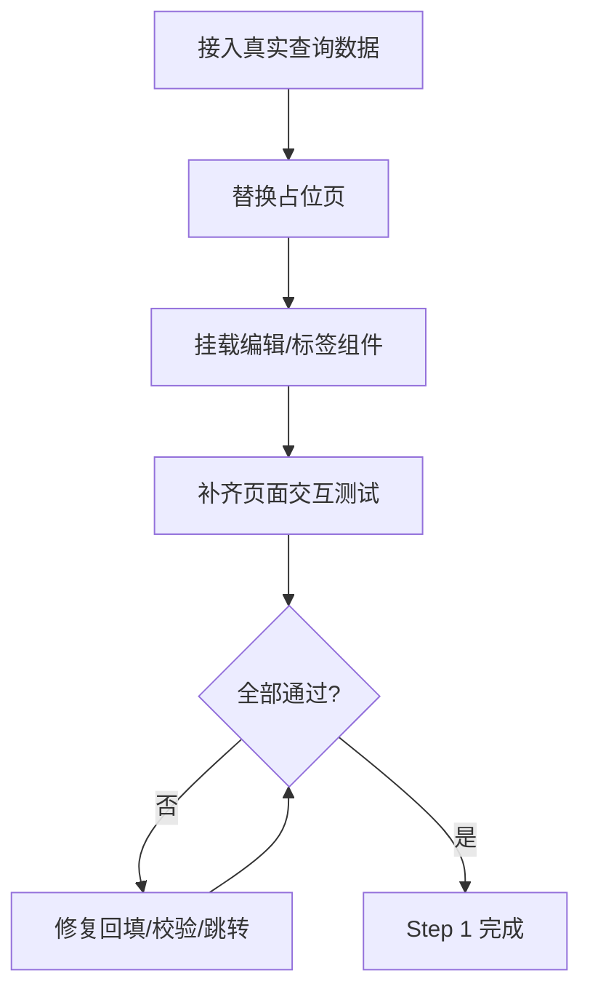
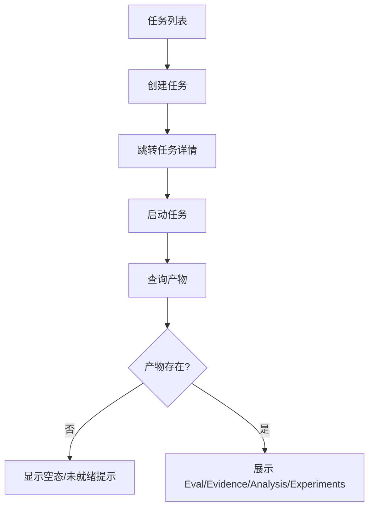
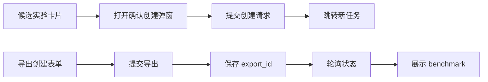
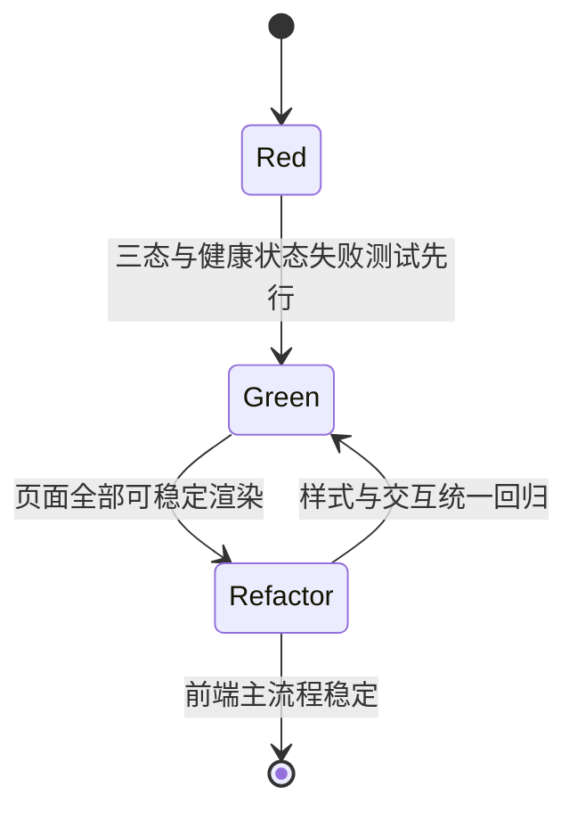

# 变更修复 TDD实施计划 - Phase 2: 前端页面接线与主流程闭环

## 概述

本阶段将 Phase 1 稳定后的后端接口真正接入前端页面，形成从查看、发起动作、查看结果到再次创建任务的完整操作闭环。测试计划聚焦页面三态、动作反馈、跨页面跳转以及真实数据流接线，而不是单独验证零散组件。

**阶段目标**:
- 页面闭环可验证 - KPI、数据集、任务、Proposal、导出页面形成真实可操作链路
- 主流程可验证 - 创建任务、启动任务、查看产物、确认创建下一轮任务都可回归
- 反馈一致可验证 - loading、empty、error、成功跳转与刷新行为稳定

**前置依赖**:
- `docs/changes/20260311/TODO_PLAN_PHASE2.md`
- `docs/changes/20260311/TDD_PLAN_PHASE1.md`
- `docs/init/1.产品PRD.md`
- `docs/init/2.系统架构.md`
- `docs/init/3.模块设计文档.md`
- `docs/init/5.附录.md`
- 当前前端页面、组件、hooks、Vitest 基础设施

## Phase 2 包含的步骤

| 步骤 | 名称 | 状态 | 测试 | 完成日期 |
|------|------|------|------|----------|
| Step 1 | KPI 与数据集页面闭环测试基线 | ⏳ | -/- | - |
| Step 2 | 任务创建、启动与产物展示闭环门禁 | ⏳ | -/- | - |
| Step 3 | Proposal 确认创建与导出展示门禁 | ⏳ | -/- | - |
| Step 4 | 全局状态与页面三态一致性回归 | ⏳ | -/- | - |

**步骤列表**:
- **Step 1**: KPI 与数据集页面闭环测试基线
- **Step 2**: 任务创建、启动与产物展示闭环门禁
- **Step 3**: Proposal 确认创建与导出展示门禁
- **Step 4**: 全局状态与页面三态一致性回归

---

## Step 1: KPI 与数据集页面闭环测试基线 (KpiDatasetPageGate) ⏳

**目标**: 验证 KPI 页面能从只读升级为“查看+编辑”，数据集页面能从占位升级为“列表+详情+覆盖率+标签编辑”的真实闭环。

**上下文依赖**:
- 读取 `docs/init/1.产品PRD.md` 了解项目设置与数据集详情信息需求
- 读取 `docs/init/5.附录.md` 了解场景维度规则与 `weather=other` 约束
- 依赖 Phase 1 列表与写操作接口契约已稳定

**交付物**:
- ⏳ `frontend/__tests__/features/project/KpiConfigForm.test.tsx` - 编辑闭环测试扩展
- ⏳ `frontend/__tests__/features/dataset/DatasetMutations.test.tsx` - 数据集写操作测试扩展
- ⏳ 必要时新增页面级测试：KPI/数据集页面
- ⏳ `frontend/src/app/(dashboard)/projects/[id]/kpi-config/page.tsx`
- ⏳ `frontend/src/app/(dashboard)/datasets/page.tsx`
- ⏳ `frontend/src/app/(dashboard)/datasets/[id]/page.tsx`
- ⏳ `frontend/src/features/dataset/components/SceneLabelEditor.tsx`

**验收标准**:
- [ ] KPI 页面支持默认值回填、编辑提交、成功后即时刷新
- [ ] 数据集列表展示真实数据并支持跳转详情
- [ ] 数据集详情展示版本、冻结状态与覆盖率
- [ ] `SceneLabelEditor` 满足 `weather=other -> weather_other_text 必填`

**实现状态**: ⏳ 待开始
**测试结果**: 0/0 测试通过
**计划实现日期**: 2026-03-11

---

### Red Phase - 失败的测试定义

**测试文件**: `frontend/__tests__/features/project/KpiConfigForm.test.tsx`, `frontend/__tests__/features/dataset/DatasetMutations.test.tsx`

**核心测试用例**:
- ❌ `test_kpi_page_prefills_existing_values`
- ❌ `test_kpi_page_updates_and_refetches`
- ❌ `test_dataset_list_renders_real_collection_and_empty_state`
- ❌ `test_dataset_detail_renders_versions_coverage_and_freeze_state`
- ❌ `test_scene_label_editor_requires_other_text_when_weather_is_other`
- ❌ `test_scene_label_editor_submits_valid_labels_successfully`

**关键验证点**:
- **编辑闭环** - 查询值、编辑值、提交结果在同页闭环
- **详情真实化** - 页面不再是占位内容，而是结构化数据视图
- **标签规则** - 前端校验与后端约束保持一致

**流程图（KPI 与数据集页面）**:

---

### Green Phase - 实现最小化功能

**实现文件**:
- `frontend/src/app/(dashboard)/projects/[id]/kpi-config/page.tsx`
- `frontend/src/app/(dashboard)/datasets/page.tsx`
- `frontend/src/app/(dashboard)/datasets/[id]/page.tsx`
- `frontend/src/features/dataset/components/SceneLabelEditor.tsx`

**核心组件**:
- `KpiConfigForm` - 查看与编辑闭环
- `DatasetList` - 真实列表展示
- `DatasetDetail` - 版本/覆盖率/冻结状态展示
- `SceneLabelEditor` - 场景标签编辑入口

**主要功能**:

| 功能 | 类型 | 功能描述 | 验收标准 |
|------|------|----------|----------|
| KPI 页面 | 页面 | 查看并更新项目 KPI 配置 | 默认值回填，保存成功后可见新值 |
| 数据集列表 | 页面 | 展示真实数据集集合 | 空态/列表态稳定 |
| 数据集详情 | 页面 | 展示版本、覆盖率、冻结状态 | 不再是占位页 |
| 标签编辑 | 写操作 | 编辑并提交场景标签 | `other_text` 规则成立 |

---

### Refactor Phase - 优化和扩展

**重构目标**:
1. 统一数据页三态展示布局
2. 抽取数据集详情中的版本卡片与覆盖率视图
3. 统一表单成功/失败反馈模式

**验收标准**:
- [ ] KPI 与数据集页面布局风格一致
- [ ] 标签与冻结操作共享统一反馈模式
- [ ] 回归测试覆盖编辑、空态、错误态三类场景

---

## Step 2: 任务创建、启动与产物展示闭环门禁 (JobFlowAndArtifactGate) ⏳

**目标**: 验证任务页面从“只能看列表/日志”升级为“创建任务、启动任务、查看产物”的完整闭环，重点覆盖产物 Tab 的真实查询与展示。

**上下文依赖**:
- 依赖 Phase 1 提供稳定 `GET /jobs` 与产物相关契约
- 读取 `docs/init/2.系统架构.md` 了解任务状态机与产物流
- 读取 `docs/init/5.附录.md` 了解 EvalReport 与 NextExperiments 结构

**交付物**:
- ⏳ `frontend/__tests__/features/job/JobMutations.test.tsx`
- ⏳ `frontend/__tests__/features/job/ArtifactTabs.test.tsx`
- ⏳ `frontend/src/app/(dashboard)/jobs/page.tsx`
- ⏳ `frontend/src/app/(dashboard)/jobs/[id]/page.tsx`

**验收标准**:
- [ ] 任务列表页具备创建任务入口
- [ ] 任务详情页支持启动任务
- [ ] 任务详情页产物 Tab 能展示 eval/evidence/analysis/next-experiments
- [ ] 缺产物时展示空态而不是空白或永久 loading

**实现状态**: ⏳ 待开始
**测试结果**: 0/0 测试通过
**计划实现日期**: 2026-03-11

---

### Red Phase - 失败的测试定义

**测试文件**: `frontend/__tests__/features/job/JobMutations.test.tsx`, `frontend/__tests__/features/job/ArtifactTabs.test.tsx`

**核心测试用例**:
- ❌ `test_jobs_page_opens_create_job_entry_and_submits_successfully`
- ❌ `test_job_detail_shows_start_button_for_created_or_queued_status`
- ❌ `test_job_detail_refreshes_after_start_success`
- ❌ `test_artifact_tabs_load_real_eval_evidence_analysis_and_candidates`
- ❌ `test_artifact_tabs_show_empty_state_when_payload_missing`
- ❌ `test_job_detail_never_passes_null_artifacts_after_query_success`

**关键验证点**:
- **状态机可操作性** - created/queued 状态存在明确启动入口
- **产物真实接线** - 页面使用真实 query，而非静态空值
- **空态与错误态** - 缺产物时给出明确提示，不误导用户

**流程图（任务闭环）**:

---

### Green Phase - 实现最小化功能

**实现文件**:
- `frontend/src/app/(dashboard)/jobs/page.tsx`
- `frontend/src/app/(dashboard)/jobs/[id]/page.tsx`

**核心组件**:
- `CreateJobForm` - 任务创建入口
- `StartJobButton` - 启动入口
- `ArtifactTabs` - 产物切换展示

**主要功能**:

| 功能 | 类型 | 功能描述 | 验收标准 |
|------|------|----------|----------|
| 任务创建 | 写操作 | 在列表页发起创建任务 | 成功后跳转详情 |
| 任务启动 | 写操作 | 在详情页启动任务 | 状态刷新可见 |
| 产物展示 | 展示 | 真实查询四类产物 | 无数据给出空态 |

---

### Refactor Phase - 优化和扩展

**重构目标**:
1. 收敛任务详情页面中的 query 组合逻辑
2. 抽取任务状态卡片与产物加载状态组件
3. 统一任务列表与详情页的错误反馈样式

**验收标准**:
- [ ] 页面逻辑复杂度下降，query 组织清晰
- [ ] 任务相关测试覆盖创建、启动、空态、错误态四类路径
- [ ] 后续加入更多产物类型时无需重写任务详情页框架

---

## Step 3: Proposal 确认创建与导出展示门禁 (ProposalAndExportGate) ⏳

**目标**: 验证从候选实验卡片打开确认创建弹窗、创建下一轮任务，以及创建导出后查看状态与 benchmark 的完整闭环。

**上下文依赖**:
- 依赖 Step 2 的产物查询和候选实验展示
- 依赖 Phase 1 Proposal 与导出契约已统一
- 读取 `docs/init/1.产品PRD.md` 了解 A/B/C 创建与导出展示目标

**交付物**:
- ⏳ `frontend/__tests__/features/proposal/ProposalMutations.test.tsx`
- ⏳ `frontend/__tests__/features/export/CreateExportForm.test.tsx`
- ⏳ `frontend/__tests__/features/export/ExportStatus.test.tsx`
- ⏳ `frontend/__tests__/features/export/DeployBenchmark.test.tsx`
- ⏳ `frontend/src/app/(dashboard)/proposals/page.tsx`
- ⏳ `frontend/src/app/(dashboard)/exports/page.tsx`

**验收标准**:
- [ ] 候选实验卡片可打开确认创建弹窗并预填 candidate 信息
- [ ] 确认后创建新任务并跳转
- [ ] 导出创建成功后页面可立即展示状态与 benchmark
- [ ] 导出状态轮询在完成后停止

**实现状态**: ⏳ 待开始
**测试结果**: 0/0 测试通过
**计划实现日期**: 2026-03-11

---

### Red Phase - 失败的测试定义

**测试文件**: `frontend/__tests__/features/proposal/ProposalMutations.test.tsx`, `frontend/__tests__/features/export/*.test.tsx`

**核心测试用例**:
- ❌ `test_candidate_create_button_opens_confirm_dialog`
- ❌ `test_confirm_dialog_submits_and_redirects_to_new_job`
- ❌ `test_export_page_stores_export_id_after_create_success`
- ❌ `test_export_status_component_renders_after_create`
- ❌ `test_deploy_benchmark_component_renders_after_export_ready`
- ❌ `test_export_polling_stops_on_terminal_status`

**关键验证点**:
- **候选可执行性** - A/B/C 不只是展示，还能进入下一轮任务创建流程
- **导出结果可见性** - create 之后能直接看到后续状态，而不是停在提交动作
- **轮询稳定性** - 轮询结束条件正确，不产生无限请求

**流程图（Proposal 与导出闭环）**:

---

### Green Phase - 实现最小化功能

**实现文件**:
- `frontend/src/app/(dashboard)/proposals/page.tsx`
- `frontend/src/app/(dashboard)/exports/page.tsx`

**核心组件**:
- `ConfirmCreateDialog` - 确认创建下一轮任务
- `CreateExportForm` - 创建导出
- `ExportStatus` - 状态轮询
- `DeployBenchmarkView` - benchmark 展示

**主要功能**:

| 功能 | 类型 | 功能描述 | 验收标准 |
|------|------|----------|----------|
| 候选创建 | 写操作 | 从候选实验进入确认并创建任务 | 成功后跳转新 job |
| 导出创建 | 写操作 | 提交导出任务 | 返回 export_id 并进入展示态 |
| 状态轮询 | Query | 查询导出状态直到终态 | 终态停止轮询 |
| benchmark 展示 | 展示 | 展示时延/吞吐/显存指标 | 无数据给出空态 |

---

### Refactor Phase - 优化和扩展

**重构目标**:
1. 抽取候选创建与导出结果页的状态管理逻辑
2. 统一成功跳转、错误反馈与终态提示
3. 为后续导出列表页和历史记录页预留扩展能力

**验收标准**:
- [ ] Proposal 与 Export 页面状态流清晰
- [ ] 轮询、跳转与错误提示逻辑可复用
- [ ] 回归测试覆盖成功、失败、取消三类路径

---

## Step 4: 全局状态与页面三态一致性回归 (GlobalStateAndQueryStateGate) ⏳

**目标**: 验证 dashboard 顶部健康状态、全局三态展示与关键页面的 loading/empty/error 一致性，确保修复后的前端不会出现白屏或永久 loading。

**上下文依赖**:
- Step 1-3 页面接线已完成
- 已有 `useHealthCheck` 与 `QueryState` 基础设施

**交付物**:
- ⏳ `frontend/__tests__/components/QueryState.test.tsx`
- ⏳ 必要时新增 dashboard layout 测试
- ⏳ `frontend/src/app/(dashboard)/layout.tsx`

**验收标准**:
- [ ] 顶部状态区在后端正常/异常两种状态下都可稳定展示
- [ ] 关键页面 loading/empty/error 行为一致
- [ ] 无页面因 query 未返回而白屏

**实现状态**: ⏳ 待开始
**测试结果**: 0/0 测试通过
**计划实现日期**: 2026-03-11

---

### Red / Green / Refactor 流程图

**关键验证点**:
- 后端离线时 UI 不崩溃
- loading 态可见且会收敛
- empty/error 态文案明确可诊断

---

## Phase 2 完成总结

### 完成状态

| 步骤 | 名称 | 状态 | 测试 | 完成日期 |
|------|------|------|------|----------|
| Step 1 | KPI 与数据集页面闭环测试基线 | ⏳ | -/- | - |
| Step 2 | 任务创建、启动与产物展示闭环门禁 | ⏳ | -/- | - |
| Step 3 | Proposal 确认创建与导出展示门禁 | ⏳ | -/- | - |
| Step 4 | 全局状态与页面三态一致性回归 | ⏳ | -/- | - |

### 实现检查清单
- [ ] Red：页面真实数据流、动作反馈、三态展示测试先行
- [ ] Green：以最小接线完成真实页面闭环
- [ ] Refactor：布局、反馈和状态管理模式统一

### 质量标准
- [ ] 页面与组件测试全部通过
- [ ] `pnpm test`、`pnpm typecheck`、`pnpm build`、`pnpm lint` 持续通过
- [ ] 页面无白屏、无永久 loading、无未处理错误态