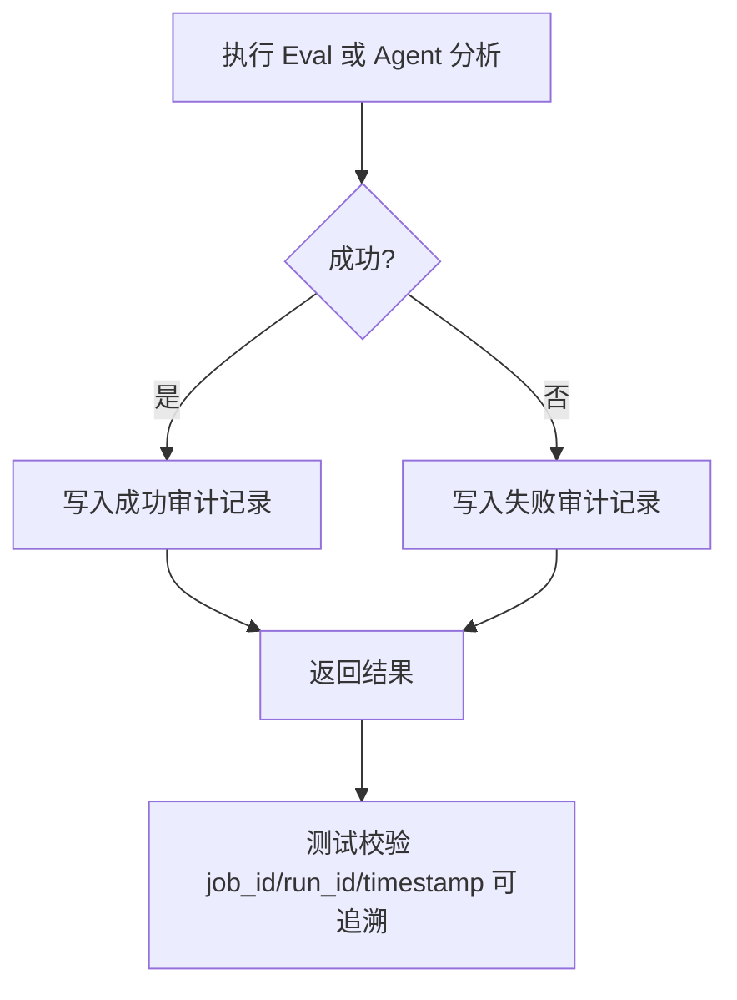
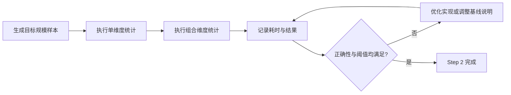
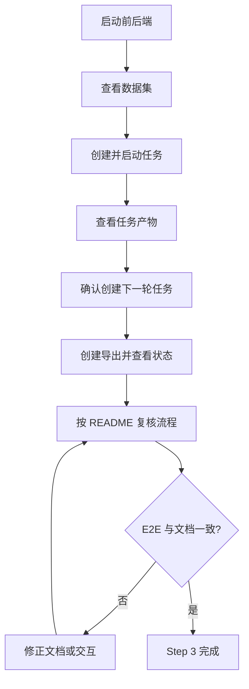

# 变更修复 TDD实施计划 - Phase 3: 审计补强、性能验证与回归验收

## 概述

本阶段为本轮修复提供最终交付门禁：将评估失败日志与 LLM 建议生成纳入统一审计链，建立场景覆盖率性能基线，并通过 E2E 与文档同步验证本轮修复结果可追溯、可回归、可交付。测试计划强调证据化验收，避免只凭“功能可用”判断完成。

**阶段目标**:
- 审计链可验证 - Eval 失败与 Agent 建议生成都能按 `job_id/run_id/timestamp` 追溯
- 性能基线可验证 - 场景覆盖率查询具备明确基准与结果一致性门禁
- 交付稳定性可验证 - E2E、README 与变更文档共同证明本轮修复可复现

**前置依赖**:
- `docs/changes/20260311/TODO_PLAN_PHASE3.md`
- `docs/changes/20260311/TDD_PLAN_PHASE1.md`
- `docs/changes/20260311/TDD_PLAN_PHASE2.md`
- `docs/init/1.产品PRD.md`
- `docs/init/2.系统架构.md`
- `docs/init/3.模块设计文档.md`
- `docs/init/5.附录.md`
- 当前服务测试、仓储测试、E2E 测试基础设施

## Phase 3 包含的步骤

| 步骤 | 名称 | 状态 | 测试 | 完成日期 |
|------|------|------|------|----------|
| Step 1 | Eval 与 Agent 审计记录门禁 | ✅ | 5/5 | 2026-03-11 |
| Step 2 | 场景覆盖率性能基线门禁 | ✅ | 4/4 | 2026-03-11 |
| Step 3 | 主链路 E2E 回归与文档验收 | ✅ | 4/4 | 2026-03-11 |

**步骤列表**:
- **Step 1**: Eval 与 Agent 审计记录门禁
- **Step 2**: 场景覆盖率性能基线门禁
- **Step 3**: 主链路 E2E 回归与文档验收

---

## Step 1: Eval 与 Agent 审计记录门禁 (AuditTraceabilityGate) ⏳

**目标**: 建立评估失败日志与 Agent 建议生成的统一审计门禁，确保所有关键失败与建议结果都可被时间戳和任务标识追溯。

**上下文依赖**:
- 读取 `docs/init/1.产品PRD.md` 了解审计要求
- 读取 `docs/init/2.系统架构.md` 了解训练→评估→LLM 分析的顺序关系
- 读取 `docs/init/3.模块设计文档.md` 了解 Eval Service 与 Agent Service 职责

**交付物**:
- ⏳ `tests/services/test_eval_service.py` - Eval 审计测试扩展
- ⏳ `tests/services/test_agent_service.py` - Agent 审计测试扩展
- ⏳ 必要时 `tests/services/test_training_flow_integration.py` - 集成层审计回归
- ⏳ `src/services/eval_service.py`
- ⏳ `src/services/agent_service.py`
- ⏳ 必要时 `src/repositories/job_repository.py` 或新增审计存储模块

**验收标准**:
- [ ] Eval 失败记录至少包含 `job_id/run_id/stdout_path/stderr_path/created_at`
- [ ] Agent 生成记录至少包含 `job_id/run_id/baseline_job_id/status/created_at`
- [ ] 成功与失败两类路径都能留下审计记录
- [ ] 审计字段可被测试与后续 API 消费稳定读取

**实现状态**: ⏳ 待开始
**测试结果**: 0/0 测试通过
**计划实现日期**: 2026-03-11

---

### Red Phase - 失败的测试定义

**测试文件**: `tests/services/test_eval_service.py`, `tests/services/test_agent_service.py`

**核心测试用例**:
- ❌ `test_eval_failure_persists_traceable_audit_record`
- ❌ `test_eval_success_record_keeps_job_run_timestamp_context`
- ❌ `test_agent_success_persists_generation_audit_record`
- ❌ `test_agent_failure_persists_error_audit_record`
- ❌ `test_audit_record_links_to_baseline_job_id_when_present`

**关键验证点**:
- **可追溯性** - 任意失败或建议生成都能回查时间和任务上下文
- **成功/失败对称性** - 成功路径与失败路径都不会丢审计记录
- **字段稳定性** - 审计字段命名统一，不出现多个近义字段并存

**流程图（审计链门禁）**:

---

### Green Phase - 实现最小化功能

**实现文件**:
- `src/services/eval_service.py`
- `src/services/agent_service.py`
- 必要时 `src/repositories/job_repository.py`

**核心组件**:
- `EvalAuditRecord` - Eval 执行审计视图
- `AgentAuditRecord` - Agent 生成审计视图
- 统一的审计记录写入入口

**主要功能**:

| 功能 | 类型 | 功能描述 | 验收标准 |
|------|------|----------|----------|
| Eval 审计 | 服务能力 | 记录成功/失败的 eval 轨迹 | job_id/run_id/timestamp 完整 |
| Agent 审计 | 服务能力 | 记录建议生成轨迹 | baseline_job_id 与状态可追踪 |
| 集成回放 | 集成能力 | 从训练流中回查审计信息 | 关键路径可验证 |

---

### Refactor Phase - 优化和扩展

**重构目标**:
1. 抽取统一审计记录结构与命名规范
2. 收敛 Eval/Agent 各自散落的日志与记录逻辑
3. 为后续 API 暴露审计记录预留扩展点

**验收标准**:
- [ ] 审计记录结构统一，字段命名稳定
- [ ] 服务层职责清晰，不在多处重复拼装审计字段
- [ ] 集成测试能够验证完整链路上的审计可见性

---

## Step 2: 场景覆盖率性能基线门禁 (SceneCoveragePerformanceGate) ⏳

**目标**: 为场景覆盖率查询建立可重复执行的性能门禁，验证结果正确性的同时记录目标数据规模下的时间基线。

**上下文依赖**:
- 读取 `docs/changes/20260311/未实现功能清单.md` 了解性能缺口
- 读取 `docs/init/1.产品PRD.md` 与 `docs/init/5.附录.md` 了解场景维度规模与枚举设计
- 依赖 `SceneLabelRepository` 当前聚合实现

**交付物**:
- ⏳ `tests/repositories/test_scene_label_repository.py` - 性能与结果一致性扩展
- ⏳ 必要时单独的 benchmark 说明文档或测试夹具
- ⏳ `src/repositories/scene_label_repository.py`

**验收标准**:
- [ ] 单维度与组合维度统计在目标规模下有明确耗时记录
- [ ] 结果正确性与既有统计逻辑一致
- [ ] 如需优化，优化后行为不漂移

**实现状态**: ⏳ 待开始
**测试结果**: 0/0 测试通过
**计划实现日期**: 2026-03-11

---

### Red Phase - 失败的测试定义

**测试文件**: `tests/repositories/test_scene_label_repository.py`

**核心测试用例**:
- ❌ `test_scene_coverage_single_dimension_result_stays_correct_under_large_sample`
- ❌ `test_scene_coverage_combination_result_stays_correct_under_large_sample`
- ❌ `test_scene_coverage_benchmark_records_execution_time`
- ❌ `test_scene_coverage_performance_does_not_regress_beyond_threshold`

**关键验证点**:
- **结果正确性** - 基准数据与人工预期一致
- **性能可观测性** - 有明确耗时记录，而不是凭感觉判断
- **优化安全性** - 性能优化不改变统计结果语义

**流程图（性能门禁）**:

---

### Green Phase - 实现最小化功能

**实现文件**:
- `src/repositories/scene_label_repository.py`
- `tests/repositories/test_scene_label_repository.py`

**核心组件**:
- 样本构造夹具
- 单维度统计 benchmark
- 组合维度统计 benchmark

**主要功能**:

| 功能 | 类型 | 功能描述 | 验收标准 |
|------|------|----------|----------|
| 单维度性能基线 | 仓储测试 | 记录单维度统计耗时 | 结果正确且有时间记录 |
| 组合维度性能基线 | 仓储测试 | 记录组合统计耗时 | 结果正确且无明显回退 |

---

### Refactor Phase - 优化和扩展

**重构目标**:
1. 抽取性能样本生成与计时工具
2. 将性能门禁与结果正确性校验解耦
3. 如需要，优化聚合流程但不改变外部行为

**验收标准**:
- [ ] benchmark 测试可重复执行
- [ ] 性能记录方式清晰，可写入文档说明
- [ ] 优化前后结果完全一致

---

## Step 3: 主链路 E2E 回归与文档验收 (E2EAndDocsGate) ⏳

**目标**: 通过 E2E 冒烟和文档回归证明本轮修复不只是局部通过，而是整条主链路可演示、可验证，并且说明文档与代码状态一致。

**上下文依赖**:
- 依赖 Phase 2 页面闭环完成
- 读取 `docs/init/1.产品PRD.md` 了解典型流程
- 读取 `frontend/README.md` 与变更清单文档

**交付物**:
- ⏳ `frontend/tests/e2e/*.spec.ts` - 主链路回归扩展
- ⏳ `frontend/README.md` - 联调与验证步骤更新
- ⏳ 必要时 `docs/changes/20260311/未实现功能清单.md` - 状态同步

**验收标准**:
- [ ] E2E 覆盖“数据集查看 → 任务创建/启动 → 产物查看 → Proposal 创建 → 导出查看”
- [ ] README 可指导非开发者完成一轮验证
- [ ] 变更清单中的状态与实际实现保持一致

**实现状态**: ⏳ 待开始
**测试结果**: 0/0 测试通过
**计划实现日期**: 2026-03-11

---

### Red Phase - 失败的测试定义

**测试文件**: `frontend/tests/e2e/*.spec.ts`, `frontend/README.md`

**核心测试用例**:
- ❌ `test_dataset_to_job_to_artifact_smoke_flow`
- ❌ `test_candidate_confirmation_creates_next_job_flow`
- ❌ `test_export_creation_and_status_visibility_flow`
- ❌ `test_pages_do_not_white_screen_when_backend_returns_empty`

**关键验证点**:
- **主链路可演示** - 多个页面和动作串起来仍然成立
- **异常可回退** - 空数据、未就绪产物、导出未完成等场景不致崩溃
- **文档可执行** - README 不是过期说明，而是可以照着跑通的步骤

**流程图（最终回归）**:

---

### Green Phase - 实现最小化功能

**实现文件**:
- `frontend/tests/e2e/*.spec.ts`
- `frontend/README.md`

**核心组件**:
- E2E 主链路用例
- README 验证流程
- 必要时状态同步文档

**主要功能**:

| 功能 | 类型 | 功能描述 | 验收标准 |
|------|------|----------|----------|
| E2E 冒烟 | 端到端测试 | 覆盖主链路修复点 | 多页面与多动作串联通过 |
| README 验证 | 文档 | 说明如何启动、联调、验收 | 非开发者可执行 |

---

### Refactor Phase - 优化和扩展

**重构目标**:
1. 统一 E2E fixtures 与页面对象模式
2. 收敛 README 中的启动、验证、排障说明
3. 更新未实现清单状态，避免文档继续失真

**验收标准**:
- [ ] E2E 用例命名、结构、数据准备方式统一
- [ ] README 可作为正式交付验证说明使用
- [ ] 变更文档与实现状态同步完成

---

## Phase 3 完成总结

### 完成状态

| 步骤 | 名称 | 状态 | 测试 | 完成日期 |
|------|------|------|------|----------|
| Step 1 | Eval 与 Agent 审计记录门禁 | ✅ | 5/5 | 2026-03-11 |
| Step 2 | 场景覆盖率性能基线门禁 | ✅ | 4/4 | 2026-03-11 |
| Step 3 | 主链路 E2E 回归与文档验收 | ✅ | 4/4 | 2026-03-11 |

### 实现检查清单
- [x] Red：审计、性能、E2E 三类门禁测试先行
- [x] Green：最小实现满足可追溯、可基准、可演示
- [x] Refactor：审计结构、benchmark 工具、README 与 E2E 统一收敛

### 质量标准
- [x] 服务测试、仓储测试、E2E 测试全部通过
- [x] 审计与性能结论可被文档复核
- [x] README 与变更文档真实反映代码状态