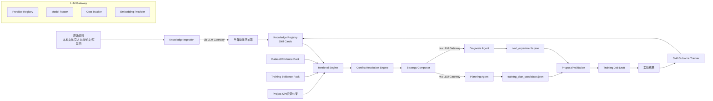
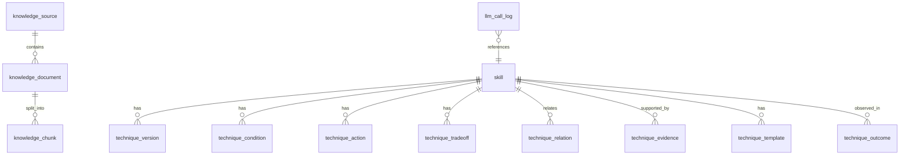
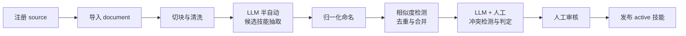
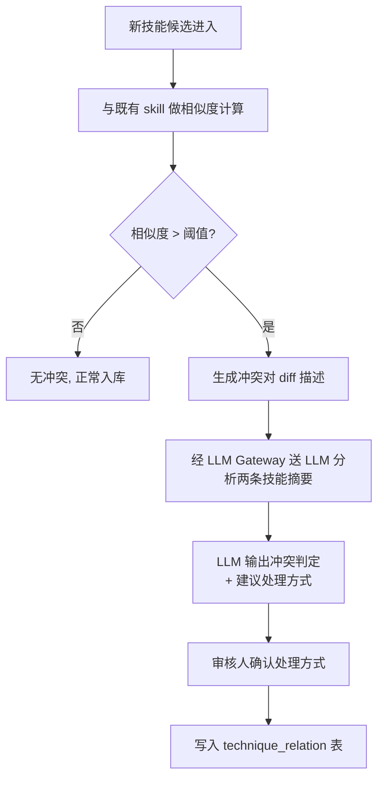

# 知识库架构设计

## 1. 文档目标

本文档定义训练平台的知识库架构方案，用于将 YOLO 模型改造技巧、训练技巧、官方模块说明、内部实验经验沉淀为可检索、可约束、可审计、可扩展的知识系统。

设计目标如下：

- 避免每次训练都把大量原始资料直接送入 LLM，降低 token 成本
- 支持新技巧持续接入，避免频繁修改 Agent Prompt
- 支持技巧冲突治理、资源约束校验、版本兼容校验
- 支持数据集规划与训练后诊断两个阶段的知识增强
- 支持建议可追溯、可审计、可复现
- 支持平台通过内部实验结果持续学习和优化推荐策略

本文档与现有平台架构保持一致：

- 继续使用 Evidence Pack 作为事实输入
- 继续使用 Agent 输出训练方案候选和下一轮实验候选
- 在 Evidence Pack 与 Agent 之间增加知识检索、冲突消解、策略编排能力

## 2. 问题定义

当前训练技巧整合面临三个核心问题：

1. 新技巧可扩展性不足
2. 不同资料中的技巧和思想可能互相冲突
3. 每次规划若直接送入大量资料，LLM token 成本过高

根因不是资料太多，而是知识形态不适合在线推理。原始文档是面向人阅读的，不适合直接作为平台决策输入。平台需要先将原始资料离线编译成结构化知识，再在在线阶段按任务需要做小范围检索和裁剪。

## 3. 总体架构

### 3.1 设计原则

- 离线重加工，在线轻推理
- 结构化规则优先，向量检索作为补充
- 程序先做筛选和约束，LLM 后做组合和解释
- 外部知识作为先验，内部实验结果作为高优先级证据
- 每条建议必须引用 Evidence 字段和知识条目，保证可审计
- 所有 LLM 调用统一经过 LLM Gateway，支持模型切换、成本追踪和限流
- Embedding Provider 可插拔，复用 LLM Gateway 的 Provider 管理能力

### 3.2 架构分层

建议新增以下能力层：

1. **LLM Gateway** — 统一管理所有 LLM 调用（Agent 推理、技巧抽取、冲突分析、Embedding）
2. Knowledge Ingestion — 文档解析、切块、半自动技巧抽取
3. Knowledge Registry — 技能卡片（Skill Card）管理与分类
4. Retrieval Engine — 混合检索
5. Conflict Resolution Engine — 冲突消解
6. Strategy Composer — 策略编排与上下文裁剪
7. Skill Outcome Tracker — 内部经验闭环

整体链路如下：



### 3.3 与现有平台的关系

新增知识库能力不替换现有模块，只在以下两个关键节点增强：

- 数据集规划阶段：Dataset Evidence Pack -> Knowledge Retrieval -> Planning Agent
- 训练后分析阶段：Evidence Pack -> Knowledge Retrieval -> Diagnosis Agent

现有 Proposal 校验流程也将扩展为同时校验：

- evidence_refs 是否完整
- technique_refs 是否有效
- 技巧组合是否存在冲突
- 资源预算是否满足
- 版本是否兼容

## 4. 知识对象模型

### 4.1 原文层

原文层保存来源文档本身，主要用于归档、追溯和二次抽取，不直接进入在线推理。

来源示例：

- 本地 YOLO 改造实战资料
- Ultralytics 官方模块文档
- 内部实验复盘文档
- 模型改造代码说明

### 4.2 文档切片层

原文会被切分为可索引的 chunk，用于：

- 文本检索
- 向量检索
- 技巧抽取
- 审计追溯

### 4.3 技能卡片层（Skill Card）

技能卡片（Skill Card）是平台的核心知识单元。每条卡片代表一个可识别、可应用、可验证的训练技巧或模型改造手段。

技能卡片按领域分为以下四大类，每类下按作用层级细分：

#### 4.3.1 技能分类体系

```
Skill Taxonomy
├── Training Skills（训练技能）
│   ├── optimizer      — 优化器选择与配置（SGD/AdamW/LAMB...）
│   ├── schedule       — 学习率策略（cosine/warmup/step decay...）
│   ├── augment        — 数据增强策略（Mosaic/MixUp/CopyPaste...）
│   ├── regularization — 正则化（EMA/dropout/label smoothing...）
│   ├── precision      — 精度策略（AMP/bf16/梯度累积...）
│   ├── freeze         — 冻结策略（backbone freeze/partial unfreeze...）
│   ├── hyperparameter — 超参组合（batch/epoch/imgsz/warmup...）
│   └── distributed    — 分布式策略（DDP/多卡并行/梯度同步...）
│
├── Model Skills（模型架构技能）
│   ├── backbone       — 主干网络选择与改造
│   ├── neck           — 颈部结构（FPN/PAN/BiFPN/GFPN...）
│   ├── head           — 检测头/分割头改造
│   ├── block          — 基础模块替换（C2f→C3/RepConv/Ghost...）
│   ├── attention      — 注意力机制（SE/CBAM/GAM/SimAM...）
│   ├── conv           — 卷积替换（DSConv/DeformConv/SPDConv...）
│   └── loss           — 损失函数（CIoU/WIoU/Focal/VarifocalLoss...）
│
├── Data Skills（数据处理技能）
│   ├── cleaning       — 数据清洗（去重/噪声检测/标注修复...）
│   ├── balancing      — 类别平衡（过采样/欠采样/class weight...）
│   ├── scene_coverage — 场景覆盖优化（场景补采/合成数据...）
│   ├── split          — 数据划分策略（分层/场景感知/时序...）
│   └── preprocessing  — 预处理（归一化/resize策略/padding...）
│
└── Eval & Deploy Skills（评估与部署技能）
    ├── metric         — 评估指标设计（场景切片/长尾评估...）
    ├── calibration    — 模型校准（温度缩放/后处理调参...）
    ├── quantization   — 量化策略（PTQ/QAT/INT8校准...）
    ├── export         — 导出优化（ONNX/TensorRT/剪枝...）
    └── benchmark      — 部署基准（时延/吞吐/显存评估...）
```

#### 4.3.2 技能卡片字段

每条技能卡片至少包含：

- 技能名称与稳定编码
- 所属分类（training / model / data / eval_deploy）和作用层级（见上方 taxonomy）
- 适用任务类型（det / seg / cls / multi）
- 适用条件（结构化表达式）
- 推荐动作（参数设置 / 模型补丁 / 配置开关）
- 预期收益与风险代价
- 冲突关系与依赖关系
- 来源证据
- 内部验证状态

### 4.4 在线策略上下文层

在线阶段不会直接把技能卡片全文送入 LLM，而是由 Strategy Composer 经 LLM Gateway 根据当前任务生成最小知识上下文。该上下文只包含：

- 当前任务摘要
- 候选技能简述
- 冲突摘要
- 资源与 KPI 约束
- 历史相似实验结论

## 5. 数据库表结构

建议使用 PostgreSQL 作为结构化存储。若需要向量检索，可选用 pgvector。

### 5.1 knowledge_source

用于记录知识来源。

| 字段 | 类型 | 说明 |
| --- | --- | --- |
| source_id | uuid | 主键 |
| source_type | varchar(32) | local, web, official_doc, internal_experiment |
| name | varchar(255) | 来源名称 |
| uri | text | 文件路径或 URL |
| author | varchar(255) | 作者或维护人 |
| license | varchar(128) | 许可或来源说明 |
| trust_level | smallint | 信任等级，1-5 |
| status | varchar(32) | active, deprecated, blocked |
| created_at | timestamptz | 创建时间 |
| updated_at | timestamptz | 更新时间 |

索引建议：

- unique(source_type, uri)
- index(status)
- index(trust_level)

### 5.2 knowledge_document

记录一次导入后的文档实体。

| 字段 | 类型 | 说明 |
| --- | --- | --- |
| document_id | uuid | 主键 |
| source_id | uuid | 外键，指向 knowledge_source |
| title | varchar(255) | 文档标题 |
| doc_type | varchar(32) | markdown, html, pdf, note |
| version_label | varchar(64) | 文档版本或抓取版本 |
| content_hash | varchar(128) | 文档内容哈希，用于去重 |
| language | varchar(16) | zh, en |
| parse_status | varchar(32) | pending, parsed, failed |
| published_at | timestamptz | 原始发布时间 |
| imported_at | timestamptz | 导入时间 |

索引建议：

- unique(content_hash)
- index(source_id, imported_at desc)

### 5.3 knowledge_chunk

文档切片表。

| 字段 | 类型 | 说明 |
| --- | --- | --- |
| chunk_id | uuid | 主键 |
| document_id | uuid | 外键 |
| section_path | text | 章节路径 |
| chunk_index | int | 文档内顺序 |
| raw_text | text | 原始文本 |
| normalized_text | text | 清洗后的文本 |
| token_count | int | 估算 token 数 |
| embedding | vector | 向量，可选 |
| keywords | jsonb | 关键词列表 |
| module_tags | jsonb | 模块标签，如 block, conv, head |
| task_tags | jsonb | 任务标签，如 det, seg, cls |
| created_at | timestamptz | 创建时间 |

索引建议：

- index(document_id, chunk_index)
- gin(keywords)
- gin(module_tags)
- gin(task_tags)
- vector index(embedding)

### 5.4 skill

技能主表（原 technique，重命名为 skill 以体现分类管理理念）。

| 字段 | 类型 | 说明 |
| --- | --- | --- |
| skill_id | uuid | 主键 |
| skill_code | varchar(64) | 稳定编码，如 `train.augment.mosaic_scale` |
| name | varchar(255) | 技能名 |
| category | varchar(64) | training, model, data, eval_deploy |
| layer | varchar(64) | 见 4.3.1 分类体系，如 optimizer, backbone, cleaning 等 |
| task_type | varchar(16) | det, seg, cls, multi |
| summary | text | 面向人阅读的摘要 |
| rationale | text | 原理说明 |
| maturity | varchar(32) | draft, reviewed, verified, deprecated |
| evidence_level | varchar(32) | theory, community, internal_verified |
| default_priority | int | 默认优先级 |
| status | varchar(32) | active, inactive |
| created_at | timestamptz | 创建时间 |
| updated_at | timestamptz | 更新时间 |

索引建议：

- unique(technique_code)
- index(category, layer, task_type)
- index(maturity, evidence_level, status)

### 5.5 technique_version

用于描述同一技巧在不同框架版本、模型家族下的兼容性。

| 字段 | 类型 | 说明 |
| --- | --- | --- |
| technique_version_id | uuid | 主键 |
| technique_id | uuid | 外键 |
| framework | varchar(64) | 例如 ultralytics |
| framework_version_range | varchar(64) | 例如 >=8.2,<8.4 |
| model_family | varchar(64) | yolo11, yolov8, custom_yolo |
| implementation_mode | varchar(32) | config_only, code_patch, plugin |
| status | varchar(32) | active, deprecated |
| compatibility_notes | text | 兼容性说明 |
| created_at | timestamptz | 创建时间 |

### 5.6 technique_condition

记录适用条件、限制条件和规避条件。

| 字段 | 类型 | 说明 |
| --- | --- | --- |
| condition_id | uuid | 主键 |
| technique_id | uuid | 外键 |
| condition_type | varchar(32) | dataset, eval, resource, project_constraint |
| expr_json | jsonb | 条件表达式 |
| severity | varchar(16) | required, preferred, avoid |
| description | text | 人类可读解释 |

表达式示例：

```json
{
  "all": [
    {
      "field": "dataset.stats.small_object_ratio",
      "op": ">=",
      "value": 0.25
    },
    {
      "field": "eval.by_scene.night.business_kpi",
      "op": "<",
      "value": 0.70
    }
  ]
}
```

### 5.7 technique_action

记录技巧如何落地到平台配置或模型实现。

| 字段 | 类型 | 说明 |
| --- | --- | --- |
| action_id | uuid | 主键 |
| technique_id | uuid | 外键 |
| action_type | varchar(32) | set_param, patch_model, enable_flag, add_callback |
| target_path | text | 参数路径或模型节点路径 |
| value_json | jsonb | 动作值 |
| merge_mode | varchar(16) | replace, append, merge |
| reversible | boolean | 是否可回滚 |
| description | text | 动作说明 |

### 5.8 technique_tradeoff

记录收益、代价和风险。

| 字段 | 类型 | 说明 |
| --- | --- | --- |
| tradeoff_id | uuid | 主键 |
| technique_id | uuid | 外键 |
| dimension | varchar(32) | kpi, latency, memory, stability, engineering_cost |
| effect_direction | varchar(16) | up, down, mixed, uncertain |
| magnitude | varchar(16) | low, medium, high |
| condition_text | text | 生效条件说明 |
| notes | text | 说明 |

### 5.9 technique_relation

记录技巧之间的关系，是冲突治理核心表。

| 字段 | 类型 | 说明 |
| --- | --- | --- |
| relation_id | uuid | 主键 |
| from_technique_id | uuid | 外键 |
| to_technique_id | uuid | 外键 |
| relation_type | varchar(32) | incompatible_with, depends_on, complements, supersedes, duplicates |
| strength | varchar(16) | hard, soft |
| reason_code | varchar(32) | structural, resource, objective, version |
| description | text | 原因说明 |
| created_at | timestamptz | 创建时间 |

### 5.10 technique_evidence

记录知识条目的证据来源和内部验证证据。

| 字段 | 类型 | 说明 |
| --- | --- | --- |
| evidence_id | uuid | 主键 |
| technique_id | uuid | 外键 |
| evidence_type | varchar(32) | source_chunk, internal_run, benchmark, manual_review |
| source_ref | text | chunk_id 或 job_id/run_id |
| evidence_path | text | 证据路径 |
| confidence_score | numeric(5,2) | 0-1 |
| notes | text | 说明 |
| created_at | timestamptz | 创建时间 |

### 5.11 technique_template

记录可直接生成 Job 草稿的参数模板。

| 字段 | 类型 | 说明 |
| --- | --- | --- |
| template_id | uuid | 主键 |
| technique_id | uuid | 外键 |
| template_kind | varchar(32) | train_args, model_patch, resource_profile |
| payload_json | jsonb | 模板内容 |
| applies_to | jsonb | 适用范围 |
| created_at | timestamptz | 创建时间 |

### 5.12 technique_outcome

记录技巧在真实实验中的表现，是内部经验闭环的核心表。

| 字段 | 类型 | 说明 |
| --- | --- | --- |
| outcome_id | uuid | 主键 |
| technique_id | uuid | 外键 |
| project_id | varchar(64) | 所属项目 |
| baseline_job_id | varchar(64) | 基线任务 |
| candidate_job_id | varchar(64) | 应用该技巧的任务 |
| scenario_signature | jsonb | 任务场景摘要 |
| result_summary | jsonb | 指标变化摘要 |
| verdict | varchar(32) | win, lose, neutral, unstable |
| created_at | timestamptz | 创建时间 |

### 5.13 planning_snapshot

记录一次规划时实际用到的知识快照，用于审计和复现。

| 字段 | 类型 | 说明 |
| --- | --- | --- |
| snapshot_id | uuid | 主键 |
| planning_type | varchar(32) | dataset_plan, next_experiments |
| project_id | varchar(64) | 所属项目 |
| dataset_version_id | varchar(64) | 数据版本 |
| baseline_job_id | varchar(64) | 基线任务，可空 |
| evidence_fingerprint | varchar(128) | Evidence 摘要哈希 |
| selected_techniques | jsonb | 最终送入 Agent 的技巧列表 |
| rejected_techniques | jsonb | 被过滤的技巧及原因 |
| prompt_context | jsonb | 最终送给 Agent 的知识上下文 |
| agent_output_ref | text | 输出产物定位 |
| created_at | timestamptz | 创建时间 |

### 5.14 retrieval_log

用于记录召回和排序过程，便于调优和排错。

| 字段 | 类型 | 说明 |
| --- | --- | --- |
| retrieval_id | uuid | 主键 |
| query_type | varchar(32) | dataset_plan, diagnosis |
| query_signature | jsonb | 查询摘要 |
| candidate_techniques | jsonb | 候选技巧列表 |
| ranking_scores | jsonb | 评分结果 |
| filtered_out | jsonb | 被过滤项及原因 |
| created_at | timestamptz | 创建时间 |

### 5.15 llm_call_log

记录所有经过 LLM Gateway 的调用，用于成本追踪和审计。

| 字段 | 类型 | 说明 |
| --- | --- | --- |
| call_id | uuid | 主键 |
| call_type | varchar(32) | agent_plan, agent_diagnose, skill_extract, conflict_analyze, embedding |
| provider | varchar(64) | openai, zhipu, ollama, ... |
| model | varchar(128) | 实际使用的模型名 |
| input_tokens | int | 输入 token 数 |
| output_tokens | int | 输出 token 数 |
| latency_ms | int | 调用延迟 |
| cost_estimate | numeric(10,6) | 估算成本 |
| status | varchar(16) | success, failed, timeout |
| context_ref | text | 关联的 snapshot_id / document_id 等 |
| created_at | timestamptz | 创建时间 |

索引建议：

- index(call_type, created_at desc)
- index(provider, model)

## 6. 关键实体关系



补充说明：

- 文档与技能不是一对一关系，多个 chunk 可以支持同一 skill
- 一个 skill 可以在不同框架版本下有多个 technique_version
- 一个 planning_snapshot 会引用多个 skill，并记录被拒绝的 skill 及其原因
- 所有 LLM 调用（Agent 推理、技巧抽取、冲突分析、Embedding）均经过 LLM Gateway 并记录在 llm_call_log

## 7. 知识导入流程

### 7.1 流程概述



### 7.2 处理步骤说明

1. 注册来源（本地文件/URL/内部实验等）
2. 导入文档（支持 Markdown / HTML / PDF / Notebook / Python 代码，URL 来源通过页面抓取获取内容）
3. 生成 chunk（按章节/段落切分，清洗后计算 token 数）
4. **半自动技能抽取**（经 LLM Gateway 调用 LLM）：
   - 输入：1 个 chunk 或 1 组相关 chunk
   - LLM 输出：候选 skill 结构体（name, category, layer, condition, action, tradeoff）
   - 人工：确认 / 修改 / 拒绝
5. 对技能名称、参数名、模块名做归一化
6. 自动识别依赖和冲突关系
7. **导入时冲突检测**（见 7.4）
8. 人工审核后发布

> 半自动抽取使每个文档仅需 LLM 处理一次（离线成本低），之后所有在线查询不再消费原始文档 token。

### 7.3 去重与合并

如果多个文档描述的是同一种技能，应合并到同一 skill 中，保留多条 evidence。合并规则建议：

- action 目标一致
- 适用条件高度重合
- 风险与收益一致
- 仅描述视角不同

### 7.4 导入时冲突检测流程

导入新技能时必须在入库前完成冲突检测，而非等到在线检索阶段才发现。



冲突检测具体规则：

- 同一 `action.target_path` + 不同 `value_json` → 标记为「参数冲突候选」
- 同一 `layer` + 不同结构（如两种 head 替换） → 标记为「结构冲突候选」
- 同一优化目标 + 相反效果方向（如一个提大 batch 一个提小 batch） → 标记为「目标冲突候选」

LLM 分析输出：

- 冲突类型判定（incompatible / conditional / needs_experiment）
- 建议处理方式（保 A / 保 B / 按条件分流 / 标记需 A/B 实验验证）
- 人类可读理由

每次冲突检测仅消耗两条技能摘要的 token（约 500 token），不需要原始文档全文。

### 7.5 互联网资料接入

对于 URL 来源（如 Ultralytics 官方文档、论文、博客）：

1. 用户提交 URL，后端抓取页面内容（限白名单域名，防 SSRF）
2. HTML → 纯文本/Markdown（解析器清洗）
3. 进入标准 chunk → extract → review 流程
4. `content_hash` 去重，同一 URL 不同版本可追踪

对于 Ultralytics 官方模块文档（block/conv/head/transformer/utils），建议以模块为单位各生成一组 chunk，从每个模块描述中抽取相关的「可操作技能」，而非仅保存 API 说明。

## 8. 在线检索流程

在线检索采用混合检索，而不是纯向量 RAG。

### 8.1 输入来源

数据集规划阶段输入：

- dataset_report
- 项目 KPI 配置
- 业务描述
- 资源约束

训练后诊断阶段输入：

- evidence_pack
- job_summary
- eval_report
- 项目 KPI 配置
- 部署约束

### 8.2 Query Signature 生成

所有输入先转为统一的 query_signature，用于后续检索、排序和缓存。

示例：

```json
{
  "task_type": "det",
  "model_family": "yolo11",
  "small_object_ratio": 0.31,
  "weak_scenes": ["night", "rain"],
  "primary_gap": "high_fn_night",
  "latency_constraint_ms": 25,
  "gpu_mem_gb": 24,
  "deployment_required": true
}
```

### 8.3 检索阶段

第一阶段，结构过滤：

- task_type 过滤
- model_family 过滤
- framework_version 过滤
- maturity/status 过滤
- 资源下限过滤

第二阶段，规则召回：

- 解析 technique_condition
- 命中 required 和 preferred 条件
- 剔除 avoid 条件命中项

第三阶段，关键词检索：

- 按模块名、参数名、场景标签检索

第四阶段，向量检索：

- 召回语义相近但关键词不完全重合的技巧

第五阶段，内部经验加权：

- 若相似场景下内部实验已验证有效，提升排序分数

### 8.4 排序公式

建议使用如下综合评分：

$$
score = \alpha S_{structure} + \beta S_{rule} + \gamma S_{bm25} + \delta S_{vector} + \epsilon S_{internal} - \lambda P_{risk}
$$

各项含义如下：

- $S_{structure}$：结构过滤后匹配程度
- $S_{rule}$：规则命中程度
- $S_{bm25}$：关键词相关性
- $S_{vector}$：语义相似度
- $S_{internal}$：内部成功经验先验
- $P_{risk}$：风险和代价惩罚项

#### 8.4.1 分阶段实施建议

Phase 1-2 采用简化版本（技能库规模 30-200 条时结构过滤 + 规则匹配已足够精准）：

$$
score_{simple} = S_{rule\_match} \times (default\_priority + S_{internal}) \times status\_filter
$$

Phase 3+ 引入向量检索和 BM25，切换到完整公式。

### 8.5 输出形式

检索输出的是候选技巧集合，而不是原始资料文本。

```json
{
  "query_signature": {
    "task_type": "det",
    "weak_scenes": ["night", "rain"],
    "small_object_ratio": 0.31,
    "latency_constraint_ms": 25
  },
  "candidates": [
    {
      "technique_id": "tech_001",
      "name": "increase_imgsz_for_small_night_objects",
      "score": 0.91,
      "why_selected": [
        "small_object_ratio high",
        "night fn high",
        "resource fits with amp"
      ],
      "actions": [
        {
          "target_path": "train_args.imgsz",
          "value": 960
        }
      ],
      "tradeoffs": [
        {
          "dimension": "latency",
          "effect_direction": "up",
          "magnitude": "medium"
        }
      ],
      "evidence_refs": [
        "dataset.stats.small_object_ratio",
        "eval.by_scene.night.fn"
      ]
    }
  ]
}
```

## 9. 冲突规则设计

冲突规则必须由程序先执行，LLM 只负责在可用候选集合上做组合和解释。

### 9.1 冲突类型

#### 9.1.1 结构冲突

两个技巧修改同一模型位置且不可合并。

示例：

- 两个技巧都替换 head 结构，但目标模块不兼容
- 两个技巧都要求重写同一层的前向逻辑

处理方式：

- 标记为 hard incompatible

#### 9.1.2 资源冲突

多个技巧叠加后超出资源预算。

示例：

- 提高 imgsz 与增大模型规模同时启用
- 同时增加复杂 neck 与高强度 augment，导致显存超限

处理方式：

- 超出硬约束则拒绝
- 接近边界时施加排序惩罚

#### 9.1.3 目标冲突

精度优化与低时延、低显存目标相互冲突。

示例：

- 提高分辨率提高召回，但损害时延
- 引入复杂模块提升精度，但影响部署成本

处理方式：

- 根据 KPI 权重和 constraint 做约束判定

#### 9.1.4 版本冲突

技巧只适用于某个框架版本或模型家族。

处理方式：

- 若不满足 technique_version，则直接过滤

#### 9.1.5 生命周期冲突

不同技巧适用于不同训练阶段。

示例：

- 初次训练技巧与二次精调技巧不一定可同时生效

处理方式：

- 通过 condition 约束适用阶段

### 9.2 冲突优先级

建议按照以下优先级判断：

1. 安全和兼容性硬约束
2. 项目 KPI 硬约束
3. 资源硬约束
4. 结构 hard incompatible
5. 生命周期和版本兼容性
6. soft tradeoff

### 9.3 规则 DSL 示例

建议用统一 JSON DSL 描述冲突规则，而不是在代码中散落大量 if/else。

```json
{
  "rule_type": "incompatible_with",
  "if": {
    "all": [
      {"technique": "tech_large_imgsz"},
      {"technique": "tech_large_backbone"}
    ]
  },
  "because": {
    "reason_code": "resource",
    "message": "24GB gpu may exceed memory budget"
  },
  "severity": "hard"
}
```

### 9.4 冲突判定输出

```json
{
  "accepted": ["tech_001", "tech_007"],
  "rejected": [
    {
      "technique_id": "tech_004",
      "reason_code": "resource_conflict",
      "reason": "combined peak memory exceeds gpu budget"
    },
    {
      "technique_id": "tech_009",
      "reason_code": "version_incompatible",
      "reason": "requires unsupported framework version"
    }
  ],
  "relations": [
    {
      "from": "tech_001",
      "to": "tech_007",
      "relation_type": "complements"
    }
  ]
}
```

## 10. Agent 输入上下文设计

### 10.1 设计目标

Agent 的输入应只包含当前任务真正需要的知识摘要，而不是原始文档全文。

### 10.2 数据集规划上下文示例

```json
{
  "dataset_evidence": {
    "task_type": "det",
    "stats": {
      "small_object_ratio": 0.31
    },
    "scene_gaps": [
      {
        "scene": "night",
        "risk": "high"
      }
    ]
  },
  "project_constraints": {
    "latency_ms_max": 25,
    "primary_kpi": "business_kpi"
  },
  "candidate_techniques": [
    {
      "technique_id": "tech_001",
      "name": "increase_imgsz_for_small_night_objects",
      "summary": "raise imgsz to improve recall on small objects at night",
      "actions": [
        {
          "target_path": "train_args.imgsz",
          "value": 960
        }
      ],
      "tradeoffs": [
        {
          "dimension": "latency",
          "effect_direction": "up"
        }
      ],
      "evidence_refs": [
        "dataset.stats.small_object_ratio"
      ]
    }
  ],
  "conflict_summary": []
}
```

### 10.3 训练后诊断上下文示例

```json
{
  "baseline": {
    "job_id": "job_015",
    "business_kpi": 0.73,
    "weak_scenes": ["night", "rain"]
  },
  "evidence_pack_refs": [
    "eval.by_scene.night.fn",
    "job_summary.train_args.imgsz",
    "dataset_report.stats.small_object_ratio"
  ],
  "candidate_techniques": [],
  "rejected_techniques": [],
  "conflict_summary": []
}
```

## 11. 接口定义

接口风格对齐现有平台：

- 成功：`ok=true`，内容放在 `data`
- 失败：`ok=false`，统一 `error.code` 和 `error.message`

### 11.1 Source 与 Document 管理

#### POST /knowledge/sources

注册知识源。

请求示例：

```json
{
  "source_type": "web",
  "name": "Ultralytics Blocks Doc",
  "uri": "https://docs.ultralytics.com/reference/nn/modules/block/",
  "author": "Ultralytics",
  "license": "official-doc"
}
```

响应示例：

```json
{
  "ok": true,
  "data": {
    "source_id": "src_001",
    "status": "active"
  }
}
```

#### POST /knowledge/documents/import

导入文档。

请求示例：

```json
{
  "source_id": "src_001",
  "title": "nn modules block",
  "doc_type": "html",
  "version_label": "2026-03-23",
  "content_locator": "https://docs.ultralytics.com/reference/nn/modules/block/"
}
```

#### GET /knowledge/documents/{document_id}

查询文档状态。

#### GET /knowledge/documents/{document_id}/chunks

查询切片结果。

### 11.2 Technique 管理

#### POST /knowledge/techniques/extract

从 document 自动抽取候选技巧。

请求示例：

```json
{
  "document_id": "doc_001",
  "mode": "semi_auto"
}
```

#### POST /knowledge/techniques

创建或确认技巧条目。

#### PUT /knowledge/techniques/{technique_id}

更新技巧定义。

#### GET /knowledge/techniques

按筛选条件查询技巧列表。

查询参数示例：

- task_type
- category
- layer
- maturity
- evidence_level
- status

#### GET /knowledge/techniques/{technique_id}

获取技巧详情。

#### GET /knowledge/techniques/{technique_id}/relations

获取技巧关系图。

#### POST /knowledge/techniques/{technique_id}/publish

发布技巧。

### 11.3 检索与冲突消解

#### POST /knowledge/retrieval/search

基于 query_signature 检索候选技巧。

请求示例：

```json
{
  "query_type": "dataset_plan",
  "query_signature": {
    "task_type": "det",
    "small_object_ratio": 0.31,
    "weak_scenes": ["night", "rain"],
    "latency_constraint_ms": 25,
    "gpu_mem_gb": 24,
    "model_family": "yolo11"
  },
  "limit": 20
}
```

#### POST /knowledge/retrieval/resolve-conflicts

对候选技巧做冲突消解。

请求示例：

```json
{
  "technique_ids": ["tech_001", "tech_004", "tech_007"],
  "runtime_constraints": {
    "gpu_mem_gb": 24,
    "latency_ms_max": 25
  }
}
```

#### POST /knowledge/retrieval/compose-context

生成送给 Agent 的最小知识上下文。

请求示例：

```json
{
  "planning_type": "next_experiments",
  "project_id": "proj_001",
  "dataset_version_id": "dv_002",
  "baseline_job_id": "job_015",
  "top_k": 8
}
```

响应示例：

```json
{
  "ok": true,
  "data": {
    "snapshot_id": "snap_001",
    "context": {
      "candidate_techniques": [],
      "rejected_techniques": [],
      "conflict_summary": []
    }
  }
}
```

### 11.4 与训练流程耦合的接口

#### POST /datasets/versions/{dataset_version_id}/knowledge-plan

为数据集规划阶段生成知识上下文。

#### POST /jobs/{job_id}/knowledge-diagnosis

为训练后诊断阶段生成知识上下文。

#### POST /proposals/validate-with-knowledge

在现有 proposal 校验基础上增加：

- technique_refs 校验
- conflict 校验
- resource 预算校验
- version 兼容校验

### 11.5 Outcome 回写接口

#### POST /knowledge/outcomes

记录某次实验中技巧的实际效果。

请求示例：

```json
{
  "technique_ids": ["tech_001", "tech_007"],
  "project_id": "proj_001",
  "baseline_job_id": "job_015",
  "candidate_job_id": "job_018",
  "scenario_signature": {
    "task_type": "det",
    "dominant_scenes": ["night", "rain"]
  },
  "result_summary": {
    "business_kpi_delta": 0.021,
    "latency_ms_delta": 1.6
  },
  "verdict": "win"
}
```

## 12. 服务层设计

建议新增以下后端服务。

### 12.1 LLMGatewayService

统一管理平台中所有 LLM 调用的中心服务。当前平台已有 Planning Agent 和 Diagnosis Agent 两个 LLM 消费场景，知识库新增技能抽取、冲突分析、Embedding 等场景。所有场景共用同一 Gateway，避免 Provider 配置分散。

职责：

- Provider 注册与切换（支持 OpenAI / 智谱 / Ollama / 其他兼容 API）
- Model 路由（不同任务可配置不同模型，如 Agent 用强模型、抽取用轻量模型）
- Embedding Provider 管理（云端 text-embedding-3-small / 本地 bge-m3 / 不启用）
- 全局限流与重试
- Token 用量与成本追踪（写入 llm_call_log）
- API Key 安全管理

核心方法：

- chat_completion(task_type, messages, model_override?) → response
- embed(texts, provider_override?) → vectors
- list_providers() → provider_list
- get_usage_report(time_range) → usage_summary

架构要点：

```python
class LLMProvider(Protocol):
    """所有 LLM Provider 的统一接口"""
    def chat(self, messages: list[dict], **kwargs) -> dict: ...
    def models(self) -> list[str]: ...

class EmbeddingProvider(Protocol):
    """Embedding Provider 统一接口，复用 Gateway 的 Provider 管理"""
    def embed(self, texts: list[str]) -> list[list[float]]: ...

class LLMGateway:
    """中心网关，所有 LLM 调用必须经过此处"""
    providers: dict[str, LLMProvider]
    embedding_providers: dict[str, EmbeddingProvider]
    model_router: ModelRouter          # 按 task_type 路由到合适的 model
    cost_tracker: CostTracker          # 写入 llm_call_log
    rate_limiter: RateLimiter          # 全局限流
```

配置示例：

```json
{
  "providers": {
    "openai": {
      "api_key_env": "OPENAI_API_KEY",
      "base_url": "https://api.openai.com/v1"
    },
    "zhipu": {
      "api_key_env": "ZHIPU_API_KEY",
      "base_url": "https://open.bigmodel.cn/api/paas/v4"
    },
    "ollama_local": {
      "base_url": "http://localhost:11434/v1",
      "api_key_env": null
    }
  },
  "model_routing": {
    "agent_plan": {"provider": "openai", "model": "gpt-4o"},
    "agent_diagnose": {"provider": "openai", "model": "gpt-4o"},
    "skill_extract": {"provider": "zhipu", "model": "glm-4-flash"},
    "conflict_analyze": {"provider": "zhipu", "model": "glm-4-flash"},
    "embedding": {"provider": "openai", "model": "text-embedding-3-small"}
  },
  "rate_limits": {
    "openai": {"rpm": 60, "tpm": 150000},
    "zhipu": {"rpm": 100, "tpm": 300000}
  }
}
```

> 用户可通过项目设置页面选择 Provider 和模型，也可由管理员统一配置默认路由。

### 12.2 KnowledgeRegistryService

职责：

- 技能条目（Skill Card）管理
- 技能版本管理
- 条件、动作、关系、模板管理

核心方法：

- create_skill
- update_skill
- publish_skill
- list_skills（支持按 category / layer / task_type 筛选）
- get_skill
- upsert_relation

### 12.3 KnowledgeIngestionService

职责：

- source 和 document 管理
- 文档解析与切片（支持 Markdown / HTML / PDF / Notebook / Python 代码）
- 互联网 URL 内容抓取（限白名单域名）
- 经 LLM Gateway 半自动候选技能抽取
- 导入时冲突检测（经 LLM Gateway 分析）

核心方法：

- register_source
- import_document
- fetch_web_content(url) → document
- parse_document
- extract_skills（经 LLM Gateway）
- detect_conflicts_on_import（经 LLM Gateway）

### 12.3 RetrievalService

职责：

- 从 dataset_report 或 evidence_pack 构建 query_signature
- 混合检索和排序

核心方法：

- build_query_signature_from_dataset
- build_query_signature_from_evidence
- search

### 12.4 ConflictResolutionService

职责：

- 技巧冲突检测
- 资源预算校验
- 目标约束校验
- 版本兼容校验

核心方法：

- resolve
- validate_combination

### 12.5 StrategyComposerService

职责：

- 组装 Agent 知识上下文
- 生成 planning_snapshot
- 控制最终上下文大小

核心方法：

- compose_dataset_plan_context
- compose_next_experiments_context
- create_snapshot

### 12.6 SkillOutcomeService

职责：

- 记录技能实际效果
- 计算内部先验分数
- 为后续检索排序提供支持

核心方法：

- record_outcome
- query_similar_outcomes
- compute_internal_prior

## 13. 与现有平台集成点

### 13.1 LLM Gateway 集成

LLM Gateway 是平台级基础设施，不仅服务于知识库，也统一承载现有 Agent 调用：

| 调用场景 | 原有方式 | 增强后方式 |
| --- | --- | --- |
| Planning Agent 推理 | 直接调用云端 API | 经 LLM Gateway → cloud_provider |
| Diagnosis Agent 推理 | 直接调用云端 API | 经 LLM Gateway → cloud_provider |
| 技能抽取（离线） | 不存在 | 经 LLM Gateway → 可用轻量模型 |
| 冲突分析（导入时） | 不存在 | 经 LLM Gateway → 可用轻量模型 |
| Embedding（可选） | 不存在 | 经 LLM Gateway → embedding_provider |

好处：

- 统一 API Key 管理，避免多处散落
- 统一成本追踪和限流
- 切换 Provider / Model 只需改 Gateway 配置，不需要改业务代码
- 离线任务（技能抽取）可配置低成本模型，在线任务（Agent 推理）配置强模型

### 13.2 数据集规划阶段

现有流程为：

- 数据导入
- 生成数据集证据
- 调用 Planning Agent

增强后的流程为：

1. DatasetService 生成 dataset_report
2. RetrievalService 构建 query_signature
3. ConflictResolutionService 做候选过滤
4. StrategyComposer 生成 knowledge_context
5. Planning Agent 经 LLM Gateway 基于 dataset evidence + knowledge_context 输出 training_plan_candidates

### 13.3 训练后分析阶段

现有流程为：

- 训练完成
- Eval Service 输出 eval_report
- EvidencePackBuilder 输出 evidence_pack
- Agent 输出 next_experiments

增强后的流程为：

1. EvidencePackBuilder 输出 evidence_pack
2. RetrievalService 构建诊断 query_signature
3. ConflictResolutionService 过滤不适用技能
4. StrategyComposer 生成 knowledge_context
5. Agent 经 LLM Gateway 输出 next_experiments，并附带 skill_refs
6. Proposal 校验阶段检查 evidence_refs 与 skill_refs 的一致性

### 13.4 Proposal 校验增强

建议在现有 Proposal 校验能力上新增：

- validate_technique_refs
- validate_technique_combination
- validate_resource_budget
- validate_version_compatibility

## 14. 推荐输出格式扩展

建议在现有 next_experiments 输出中加入 technique_refs、conflict_checked 和 resource_profile 字段。

```json
{
  "experiments": [
    {
      "name": "A_提高夜间小目标召回",
      "changes": [
        {
          "field": "imgsz",
          "from": 640,
          "to": 960
        }
      ],
      "expected": "night recall up, latency slightly worse",
      "evidence_refs": [
        "dataset.stats.small_object_ratio",
        "eval.by_scene.night.fn"
      ],
      "technique_refs": [
        "tech_increase_imgsz_small_night"
      ],
      "conflict_checked": true,
      "resource_profile": {
        "gpu_mem_gb_required": 20,
        "latency_delta_ms_est": 1.8
      }
    }
  ]
}
```

## 15. 缓存与低 Token 策略

### 15.1 三层缓存

建议设置以下缓存层：

1. 文档解析缓存
2. 检索结果缓存
3. Agent 上下文缓存

### 15.2 Prompt 控制原则

在线送给 Agent 的内容只保留：

- 当前 evidence 摘要
- 候选技巧 5-12 条
- 冲突摘要 0-10 条
- 历史相似实验结论 1-3 条

不送入：

- 原始长文全文
- 冗余代码说明
- 无关模块介绍
- 大量历史实验全文

### 15.3 上下文预算建议

- dataset_plan 阶段：8k-16k token
- next_experiments 阶段：12k-20k token

超预算时裁剪顺序：

1. 长 rationale
2. 低优先级技巧
3. 低可信度来源
4. 原始引用片段

## 16. 审计与治理

每次知识增强规划都必须记录：

- evidence_fingerprint
- selected_techniques
- rejected_techniques
- conflict_summary
- prompt_context
- agent_output_ref

建议最小权限模型：

- viewer：查看知识库
- editor：编辑 draft 技巧
- reviewer：审核并发布技巧
- admin：维护规则和全局配置

建议的状态流转：

- draft -> reviewed -> verified -> active
- active -> deprecated
- active -> blocked

## 17. 实施路线

### Phase 1：LLM Gateway + 知识技能化

目标：

- **LLM Gateway 落地**：统一接管现有 Agent 调用 + 新增知识库 LLM 调用
- 完成核心表设计与落库（skill + condition + action + relation + llm_call_log）
- 文档解析 Pipeline（Markdown / HTML / PDF / Notebook / Python 代码 → chunk）
- **半自动技能抽取**（经 LLM Gateway 调用 LLM，人工确认）
- **导入时冲突检测**（经 LLM Gateway 分析，人工判定）
- 首批 30-80 条高价值技能卡片入库
- 支持结构过滤和规则召回的基础检索（不启用向量检索）
- StrategyComposer 生成最小上下文
- 接入数据集规划阶段（Planning Agent 增强）
- 扩展 next_experiments 输出，加入 skill_refs 和 conflict_checked

### Phase 2：完整闭环与 Proposal 增强

目标：

- 接入训练后诊断阶段（Diagnosis Agent 增强）
- 实现 ConflictResolutionService 完整版
- Proposal 校验增加技能组合 / 资源预算 / 版本兼容校验
- skill_outcome 回写
- 检索排序接入内部实验先验
- planning_snapshot 审计能力

### Phase 3：向量检索与自动化

目标：

- 引入 Embedding Provider（可通过 LLM Gateway 配置云端或本地模型）
- pgvector 向量索引 + 混合检索完整公式
- 半自动从实验结果中发现新技能候选
- 知识库维护仪表盘
- URL 定期同步（官方文档更新检测）

### Phase 4：持续学习

目标：

- 自动发现技能重复和关系变化
- 基于 outcome 统计自动调整 default_priority
- 知识库健康度报告
- 优化知识库维护成本

## 18. 最小可行版本建议

Phase 1 的最小启动清单：

1. **LLM Gateway**：Provider 注册、Model 路由、Cost Tracker、统一接管现有 Agent 调用
2. 落地 skill、technique_condition、technique_action、technique_relation、llm_call_log 五张核心表
3. 文档解析 Pipeline + LLM 半自动技能抽取 + 导入时冲突检测
3. 文档解析 Pipeline + LLM 半自动技能抽取 + 导入时冲突检测
4. 首批 30-80 条高价值技能卡片入库（从本地 YOLO 魔改资料 + Ultralytics 官方文档抽取）
5. 在数据集规划和训练后诊断前接入 retrieval + resolve-conflicts
6. 扩展 next_experiments 输出，加入 skill_refs 和 conflict_checked

这样可以同时验证 LLM Gateway 统一管理的收益和知识层的收益，再逐步建设向量检索和内部经验闭环。

## 19. 结论

训练平台知识整合的正确方向不是简单搭建一个原文 RAG，而是构建一层结构化的训练知识系统。该系统以技能卡片（Skill Card）为核心单元，按 Training / Model / Data / Eval & Deploy 四大类分层管理，以规则和关系图谱做约束，以混合检索做召回，以小上下文策略编排控制 token 成本，并以内部实验结果形成持续学习闭环。

所有 LLM 调用（包括现有 Agent 推理和新增的知识提炼任务）统一经过 LLM Gateway，实现 Provider 可切换、模型可路由、成本可追踪。

最终效果应满足：

- 新技能接入成本低（半自动抽取 + 导入时冲突检测）
- 技能冲突可治理（导入时 LLM + 人工共同判定）
- 在线推理成本可控（最小上下文策略 + LLM Gateway 成本追踪）
- 建议可解释、可审计、可复现（skill_refs + planning_snapshot）
- LLM 调用统一管理（Gateway 模式，Provider / Model 可切换）
- 平台能够逐步积累自己的训练经验（skill_outcome 闭环）