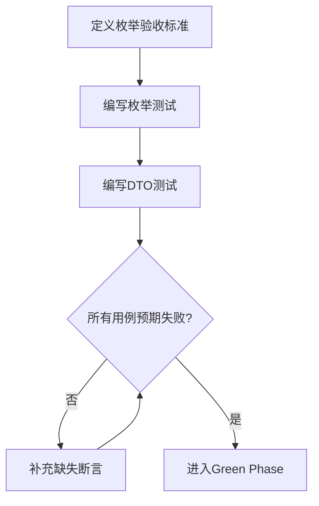
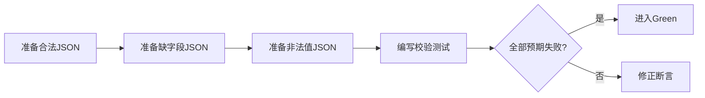
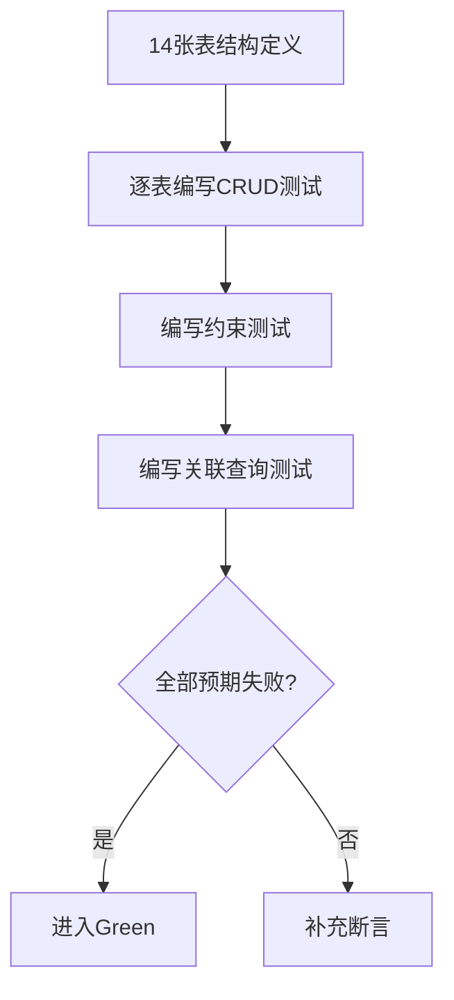
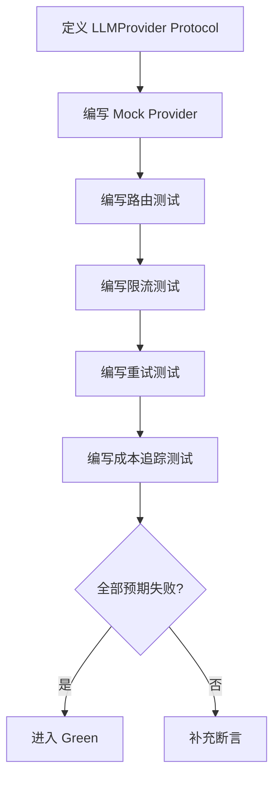

# 知识库 TDD实施计划 - Phase 1: LLM Gateway + 知识基础设施

## 概述

本阶段在 Common 层新增知识系统与 Gateway 领域类型、契约对象，在数据层落地知识库表群仓储与 LLM 调用日志仓储，在业务层实现 LLM Gateway 统一网关服务。Gateway 同时接管现有 Agent 调用，实现 Provider 可切换、模型可路由、成本可追踪。

**阶段目标**:
- 领域枚举完备 - 知识系统与 Gateway 枚举覆盖架构设计 § 4.3.1
- 契约 DTO 稳固 - SkillCardSummary / QuerySignature / LLMCallRecord 等可序列化、可校验
- 仓储能力就绪 - 知识库 14 张表 CRUD 完整，LLM 调用日志多维查询可用
- Gateway 统一收口 - Provider 注册、Model 路由、限流重试、成本追踪全闭环

**前置依赖**:
- `docs/TODO/1.Common库/1.TODO_PHASE1.md`（基础领域类型与错误码）
- `docs/TODO/1.Common库/4.TODO_PHASE4.md`（跨服务 DTO）
- `docs/updates/20260323_知识库/1.知识库架构设计.md`（§ 4-6, § 12.1, § 17）

## Phase 1 包含的步骤

| 步骤 | 名称 | 状态 | 测试 | 完成日期 |
|------|------|------|------|----------|
| Step 1 | 知识系统领域枚举与契约 DTO | ✅ | 16/16 | 2026-03-23 |
| Step 2 | SkillCard / QuerySignature Schema 校验 | ✅ | 5/5 | 2026-03-23 |
| Step 3 | 知识库表群仓储 | ✅ | 14/14 | 2026-03-23 |
| Step 4 | LLM 调用日志仓储 | ✅ | 5/5 | 2026-03-23 |
| Step 5 | LLM Gateway 核心服务 | ✅ | 11/11 | 2026-03-23 |

**步骤列表**:
- **Step 1**: 知识系统领域枚举与契约 DTO
- **Step 2**: SkillCard / QuerySignature Schema 校验
- **Step 3**: 知识库表群仓储
- **Step 4**: LLM 调用日志仓储
- **Step 5**: LLM Gateway 核心服务（Provider 注册、Model 路由、限流重试、Cost Tracker）

---

## Step 1: 知识系统领域枚举与契约 DTO (KnowledgeDomainFoundation) ✅

**目标**: 在 Common 层新增知识系统与 Gateway 领域枚举及契约对象，为上层仓储和服务提供类型安全的数据基础。

**上下文依赖**:
- 读取 `docs/updates/20260323_知识库/1.知识库架构设计.md` § 4.3.1 了解 Skill Taxonomy 分类体系
- 读取 `docs/updates/20260323_知识库/1.知识库架构设计.md` § 4.3.2 了解技能卡片字段
- 读取 `docs/init/5.附录.md` § G 了解错误码、§ J 了解 Skill Card 示例
- 读取 `src/common/domain_types.py` 了解现有枚举扩展方式

**交付物**:
- ⏳ `src/common/domain_types.py` - 新增知识系统枚举 + 错误码
- ⏳ `src/common/contracts.py` - 新增知识系统契约 DTO
- ⏳ `tests/common/test_knowledge_domain_types.py` - 枚举行为测试
- ⏳ `tests/common/test_knowledge_contracts.py` - 契约对象测试

**验收标准**:
- [ ] SkillCategory / SkillLayer / SkillMaturity / LLMCallType / RelationType 枚举值完整
- [ ] 新增错误码 LLM_GATEWAY_ERROR / KNOWLEDGE_IMPORT_FAILED 可用
- [ ] SkillCardSummary / QuerySignature / ConflictReport / SkillContext / LLMCallRecord / SkillRef 构造与序列化正确
- [ ] 必填字段缺失时校验失败

**实现状态**: ✅ 已完成
**测试结果**: 16/16 测试通过
**完成日期**: 2026-03-23

---

### Red Phase - 失败的测试定义

**测试文件**: `tests/common/test_knowledge_domain_types.py` + `tests/common/test_knowledge_contracts.py`

**核心测试用例**:
- ❌ `test_skill_category_covers_four_domains` - 验证 training / model / data / eval_deploy 四大分类
- ❌ `test_skill_layer_covers_taxonomy` - 验证 optimizer / backbone / cleaning 等所有 layer 枚举值
- ❌ `test_skill_maturity_lifecycle` - 验证 draft / reviewed / verified / deprecated 生命周期
- ❌ `test_llm_call_type_variants` - 验证 agent_plan / agent_diagnose / skill_extract / conflict_analyze / embedding
- ❌ `test_relation_type_variants` - 验证 incompatible_with / depends_on / complements / supersedes / duplicates
- ❌ `test_new_error_codes_available` - 验证 LLM_GATEWAY_ERROR / KNOWLEDGE_IMPORT_FAILED
- ❌ `test_skill_card_summary_serialization` - SkillCardSummary 序列化/反序列化正确
- ❌ `test_query_signature_construction` - QuerySignature 构造与字段完整性
- ❌ `test_contract_missing_required_field_fails` - 必填字段缺失时构造失败

**关键验证点**:
- **枚举完整性** - 枚举值与架构设计 § 4.3.1 分类体系完全对齐
- **序列化稳定性** - DTO 序列化后的 JSON 字段名稳定，可用于跨服务传递
- **向后兼容** - 新增枚举不破坏现有 domain_types.py 导出边界

---

### Green Phase - 实现最小化功能

**实现文件**:
- `src/common/domain_types.py` - 新增枚举
- `src/common/contracts.py` - 新增 DTO

**核心组件**:
- `SkillCategory` - 技能大类枚举（training / model / data / eval_deploy）
- `SkillLayer` - 技能作用层级枚举（optimizer / backbone / cleaning 等 25+ 值）
- `SkillMaturity` - 成熟度状态枚举
- `LLMCallType` - LLM 调用类型枚举
- `RelationType` - 技能关系类型枚举
- `SkillCardSummary` - 技能摘要 DTO
- `QuerySignature` - 查询签名 DTO
- `ConflictReport` - 冲突报告 DTO
- `SkillContext` - 知识上下文 DTO
- `LLMCallRecord` - LLM 调用记录 DTO
- `SkillRef` - 技能引用 DTO

**实现要点**:
- 枚举继承现有 `str, Enum` 模式，保持序列化一致
- DTO 使用 `dataclass` 或 `TypedDict`，与现有 contracts.py 风格对齐
- 新增错误码追加到现有 ErrorCode 集合

---

### Refactor Phase - 优化和扩展

**重构目标**:
1. 确保 `__all__` 导出边界包含所有新增符号
2. 验证枚举值与架构设计文档命名完全一致
3. 提炼可复用的枚举断言辅助函数

**验收标准**:
- [ ] 枚举命名无歧义、无重复
- [ ] 新增符号在 `__all__` 中导出
- [ ] 现有导入不受影响（回归测试通过）

---

## Step 2: SkillCard / QuerySignature Schema 校验 (SchemaValidationGate) ✅

**目标**: 为 SkillCard JSON 和 QuerySignature 增加 Schema 校验器，确保非法数据在入口处被拦截。

**上下文依赖**:
- 读取 `docs/init/5.附录.md` § J 了解 Skill Card 示例 JSON
- 读取 `docs/updates/20260323_知识库/1.知识库架构设计.md` § 8.2 了解 QuerySignature 字段
- 依赖 Step 1 的枚举与 DTO 定义

**交付物**:
- ⏳ `src/common/schema_validators.py` - 新增校验器
- ⏳ `tests/common/test_knowledge_contracts.py` - Schema 校验测试

**验收标准**:
- [ ] 合法 SkillCard JSON 通过校验
- [ ] 缺失 skill_code / category 时被拦截
- [ ] QuerySignature 的 task_type 非法时拒绝

**实现状态**: ✅ 已完成
**测试结果**: 5/5 测试通过
**完成日期**: 2026-03-23

---

### Red Phase - 失败的测试定义

**测试文件**: `tests/common/test_knowledge_contracts.py`

**核心测试用例**:
- ❌ `test_valid_skill_card_json_passes` - 合法 JSON 校验通过
- ❌ `test_skill_card_missing_skill_code_rejected` - 缺失 skill_code 被拒
- ❌ `test_skill_card_invalid_category_rejected` - 非法 category 被拒
- ❌ `test_query_signature_invalid_task_type_rejected` - 非法 task_type 被拒
- ❌ `test_query_signature_valid_passes` - 合法 QuerySignature 通过

**关键验证点**:
- **校验覆盖** - 必填字段 + 枚举范围 + 类型约束
- **错误信息** - 校验失败返回可诊断的错误描述

---

### Green Phase - 实现最小化功能

**实现文件**:
- `src/common/schema_validators.py` - 新增 `validate_skill_card` / `validate_query_signature`

**实现要点**:
- 复用现有 schema_validators.py 校验模式
- 校验函数返回统一错误结构

---

### Refactor Phase - 优化和扩展

**重构目标**:
1. 校验错误信息国际化与分类
2. 校验规则可由配置驱动

**验收标准**:
- [ ] 校验器可被仓储和服务层复用
- [ ] 现有 schema_validators.py 风格一致

---

## Step 3: 知识库表群仓储 (KnowledgeRepositoryGate) ✅

**目标**: 实现知识库 14 张表的 CRUD 仓储，具备 content_hash 去重与 skill_code 唯一约束能力。

**上下文依赖**:
- 读取 `docs/updates/20260323_知识库/1.知识库架构设计.md` § 5 全部表结构（5.1-5.14）
- 读取 `docs/updates/20260323_知识库/1.知识库架构设计.md` § 6 实体关系
- 读取 `src/repositories/project_repository.py` 了解现有仓储实现模式

**交付物**:
- ⏳ `src/repositories/knowledge_repository.py` - 知识库表群仓储
- ⏳ `tests/repositories/test_knowledge_repository.py` - 完整测试套件

**验收标准**:
- [ ] KnowledgeSource CRUD 正确（注册/查询/去重）
- [ ] KnowledgeDocument 导入与状态查询正确
- [ ] KnowledgeChunk 分块存储与按 document 查询正确
- [ ] Skill CRUD 与 skill_code 唯一约束生效
- [ ] TechniqueVersion / Condition / Action / Tradeoff / Relation / Evidence / Template / Outcome 关联读写正确
- [ ] PlanningSnapshot 记录与查询正确
- [ ] RetrievalLog 写入正确

**实现状态**: ✅ 已完成
**测试结果**: 14/14 测试通过
**完成日期**: 2026-03-23

---

### Red Phase - 失败的测试定义

**测试文件**: `tests/repositories/test_knowledge_repository.py`

**核心测试用例**:
- ❌ `test_source_crud_and_dedup` - Source 创建/查询；重复 (source_type, uri) 拒绝
- ❌ `test_document_import_and_hash_dedup` - Document 导入；content_hash 去重
- ❌ `test_chunk_storage_and_query_by_document` - Chunk 分块存储与按 document_id 查询
- ❌ `test_skill_crud_and_unique_code` - Skill CRUD；skill_code 唯一约束
- ❌ `test_technique_version_crud` - 版本兼容信息读写
- ❌ `test_technique_condition_crud` - 适用条件读写
- ❌ `test_technique_action_crud` - 动作配置读写
- ❌ `test_technique_tradeoff_crud` - 收益代价读写
- ❌ `test_technique_relation_crud` - 技能关系读写（双向）
- ❌ `test_technique_evidence_crud` - 证据来源读写
- ❌ `test_technique_template_crud` - 模板配置读写
- ❌ `test_technique_outcome_crud` - 实验结果读写
- ❌ `test_planning_snapshot_record` - 规划快照记录与查询
- ❌ `test_retrieval_log_write` - 检索日志写入

**关键验证点**:
- **唯一约束** - (source_type, uri) / content_hash / skill_code 约束生效
- **关联完整性** - 外键关联正确，级联查询可用
- **空值处理** - 可选字段为空时不报错

---

### Green Phase - 实现最小化功能

**实现文件**:
- `src/repositories/knowledge_repository.py` - 全部仓储方法

**核心组件**:
- `KnowledgeRepository` - 知识库统一仓储类

**主要API/功能**:

| 功能 | 方法 | 功能描述 | 验收标准 |
|------|------|----------|----------|
| Source 管理 | `register_source` / `get_source` / `list_sources` | 知识来源注册与查询 | 去重生效 |
| Document 管理 | `import_document` / `get_document` / `list_documents` | 文档导入与状态查询 | content_hash 去重 |
| Chunk 管理 | `save_chunks` / `get_chunks_by_document` | 分块存储与按文档查询 | 顺序与字段完整 |
| Skill 管理 | `create_skill` / `update_skill` / `get_skill` / `list_skills` | 技能 CRUD | skill_code 唯一 |
| 关联表管理 | `upsert_version` / `upsert_condition` / ... | 各关联表读写 | 外键引用有效 |
| 审计记录 | `create_snapshot` / `write_retrieval_log` | 规划快照与检索日志 | 字段完整 |

**实现要点**:
- 复用现有仓储的 SQLite/JSON 存储模式
- 事务边界包裹多表写入操作

---

### Refactor Phase - 优化和扩展

**重构目标**:
1. 索引优化（按架构设计 § 5 建议建索引）
2. 批量操作方法（batch_save_chunks / batch_save_conditions）
3. 查询方法添加分页支持

**验收标准**:
- [ ] 基础查询响应 < 50ms
- [ ] 唯一约束与索引与架构设计 § 5 对齐
- [ ] 所有测试通过

---

## Step 4: LLM 调用日志仓储 (LLMCallLogRepositoryGate) ✅

**目标**: 实现 LLM 调用日志的写入与多维查询，支撑 Gateway 成本追踪和审计。

**上下文依赖**:
- 读取 `docs/updates/20260323_知识库/1.知识库架构设计.md` § 5.15 了解 llm_call_log 表结构
- 依赖 Step 1 的 LLMCallType 枚举

**交付物**:
- ⏳ `src/repositories/llm_call_log_repository.py` - LLM 调用日志仓储
- ⏳ `tests/repositories/test_llm_call_log_repository.py` - 完整测试套件

**验收标准**:
- [ ] 写入 LLMCallLog 成功
- [ ] 按 call_type + 时间范围查询正确
- [ ] 按 provider + model 聚合统计正确
- [ ] batch 查询用于 cost dashboard 可用

**实现状态**: ✅ 已完成
**测试结果**: 5/5 测试通过
**完成日期**: 2026-03-23

---

### Red Phase - 失败的测试定义

**测试文件**: `tests/repositories/test_llm_call_log_repository.py`

**核心测试用例**:
- ❌ `test_write_call_log_success` - 写入日志记录成功
- ❌ `test_query_by_call_type_and_time_range` - 按 call_type + 时间范围查询
- ❌ `test_aggregate_by_provider_model` - 按 provider + model 聚合统计
- ❌ `test_batch_query_for_dashboard` - 批量查询满足 dashboard 需求
- ❌ `test_empty_time_range_returns_zero` - 空时间范围返回零值

**关键验证点**:
- **写入完整性** - 所有表字段（call_type / provider / model / tokens / cost / latency / status）均正确持久化
- **查询灵活性** - 支持多维度组合查询
- **聚合准确性** - token / cost 聚合计算正确

---

### Green Phase - 实现最小化功能

**实现文件**:
- `src/repositories/llm_call_log_repository.py`

**核心组件**:
- `LLMCallLogRepository` - 日志仓储类

**主要API/功能**:

| 功能 | 方法 | 功能描述 | 验收标准 |
|------|------|----------|----------|
| 写入 | `write_log` | 写入单条调用日志 | 字段完整 |
| 查询 | `query_logs` | 按 call_type / time_range / provider 查询 | 多维组合可用 |
| 聚合 | `aggregate_usage` | 按时间范围聚合 token / cost | 计算正确 |
| 批量 | `batch_query` | 批量查询用于 dashboard | 分页可用 |

**实现要点**:
- 写入使用追加模式，保证审计链不可篡改
- 聚合查询支持 group_by 维度切换

---

### Refactor Phase - 优化和扩展

**重构目标**:
1. 添加索引 (call_type, created_at desc) 和 (provider, model)
2. 聚合查询添加缓存层

**验收标准**:
- [ ] 查询响应 < 50ms
- [ ] 聚合结果一致性验证通过

---

## Step 5: LLM Gateway 核心服务 (LLMGatewayServiceGate) ✅

**目标**: 实现 LLMGatewayService，统一收口所有 LLM 调用，支持 Provider 注册、Model 路由、限流重试、成本追踪。

**上下文依赖**:
- 读取 `docs/updates/20260323_知识库/1.知识库架构设计.md` § 12.1 了解 Gateway 设计
- 读取 `docs/init/2.系统架构.md` § 5 了解 LLM Gateway 设计要点
- 读取 `docs/init/5.附录.md` § I 了解 Gateway 配置示例
- 依赖 Step 4 的 LLMCallLogRepository
- 依赖 Step 1 的 LLMCallType / LLMCallRecord

**交付物**:
- ⏳ `src/services/llm_gateway_service.py` - LLM Gateway 服务
- ⏳ `tests/services/test_llm_gateway_service.py` - 完整测试套件

**验收标准**:
- [ ] LLMProvider / EmbeddingProvider Protocol 可被 Mock 实现
- [ ] chat_completion 经 model_routing 路由到正确 Provider
- [ ] embed 调用 EmbeddingProvider 正确
- [ ] 调用完成后自动写入 llm_call_log
- [ ] 无效 task_type 返回 LLM_GATEWAY_ERROR
- [ ] list_providers 返回已注册 Provider
- [ ] RPM 超限时触发限流等待
- [ ] Provider 暂时不可用时重试后成功
- [ ] API Key 从环境变量安全读取
- [ ] 按时间范围聚合 token / 成本正确

**实现状态**: ✅ 已完成
**测试结果**: 11/11 测试通过
**完成日期**: 2026-03-23

---

### Red Phase - 失败的测试定义

**测试文件**: `tests/services/test_llm_gateway_service.py`

**核心测试用例**:
- ❌ `test_provider_protocol_mockable` - Protocol 可被 Mock 实现
- ❌ `test_chat_completion_routes_to_correct_provider` - Model 路由正确
- ❌ `test_embed_calls_embedding_provider` - Embedding 调用正确
- ❌ `test_call_log_auto_written_after_completion` - 调用后自动写日志
- ❌ `test_invalid_task_type_returns_gateway_error` - 非法 task_type 返回错误
- ❌ `test_list_providers_returns_registered` - 列出已注册 Provider
- ❌ `test_rate_limit_triggers_wait` - RPM 超限触发限流
- ❌ `test_retry_on_transient_failure` - 瞬时失败后重试成功
- ❌ `test_api_key_from_env_variable` - API Key 从环境变量读取
- ❌ `test_usage_report_aggregation` - 用量报表聚合正确
- ❌ `test_empty_time_range_returns_zero` - 空时间范围返回零值

**关键验证点**:
- **路由正确性** - task_type → provider + model 映射准确
- **日志完整性** - 每次调用产生完整的 LLMCallLog 记录
- **限流安全** - RPM 超限不穿透到下游 Provider
- **重试鲁棒性** - 瞬时错误可恢复，持久错误快速失败
- **密钥安全** - API Key 不出现在日志或响应中

---

### Green Phase - 实现最小化功能

**实现文件**:
- `src/services/llm_gateway_service.py`

**核心组件**:
- `LLMProvider` - LLM 提供者 Protocol（chat / models 接口）
- `EmbeddingProvider` - Embedding 提供者 Protocol（embed 接口）
- `LLMGatewayService` - 网关服务主类

**主要API/功能**:

| 功能 | 方法 | 功能描述 | 验收标准 |
|------|------|----------|----------|
| Provider 管理 | `register_provider` / `list_providers` | Provider 注册与查询 | 注册后可路由 |
| 模型路由 | `chat_completion` | 根据 task_type/model 路由并调用 | 路由准确 |
| Embedding | `embed` | 文本向量化 | 正确委托 |
| 限流 | 内部限流器 | RPM 控制 | 超限等待 |
| 重试 | 内部重试器 | 瞬时失败重试 | 可恢复 |
| 成本追踪 | `get_usage_report` | 按维度聚合用量 | 计算正确 |

**技术特性**:
- ✅ Provider 注册与热插拔
- ✅ Model 路由配置化
- ✅ RPM 限流保护
- ✅ 超时与重试机制
- ✅ 完整调用日志记录
- ✅ 环境变量安全读取 API Key
- ✅ Mock Provider 支持独立测试

**实现要点**:
- Provider 注册使用字典，按 provider_name 索引
- 路由策略：task_type → (provider, model) 映射表，支持配置文件
- 限流：滑动窗口计数器
- 重试：指数退避，最大重试次数可配置

---

### Refactor Phase - 优化和扩展

**重构目标**:
1. 路由策略从硬编码迁移到配置文件
2. Provider 健康检查机制
3. 调用指标 Prometheus 埋点预留

**性能指标目标**:
- **Gateway 额外开销（路由 + 日志写入）** - < 10ms
- **限流判定延迟** - < 1ms

**验收标准**:
- [ ] Mock Provider 覆盖正常返回、异常、超时三类场景
- [ ] 路由配置可独立于代码变更
- [ ] 所有测试通过，覆盖率 > 90%

---

## Phase 1 完成总结

> 💡 **AI提示：阶段完成后填写此章节**

### 完成状态

| 步骤 | 名称 | 状态 | 测试 | 完成日期 |
|------|------|------|------|----------|
| Step 1 | 知识系统领域枚举与契约 DTO | ✅ | 16/16 | 2026-03-23 |
| Step 2 | SkillCard / QuerySignature Schema 校验 | ✅ | 5/5 | 2026-03-23 |
| Step 3 | 知识库表群仓储 | ✅ | 14/14 | 2026-03-23 |
| Step 4 | LLM 调用日志仓储 | ✅ | 5/5 | 2026-03-23 |
| Step 5 | LLM Gateway 核心服务 | ✅ | 11/11 | 2026-03-23 |

### 关键成果

1. **领域类型完备**: 知识系统与 Gateway 枚举、DTO 可供上层使用
2. **仓储能力就绪**: 14 张表 CRUD + LLM 调用日志多维查询
3. **Gateway 统一收口**: 所有 LLM 调用经过 Gateway，Provider 可切换、成本可追踪

### 下一阶段准备

- Phase 2 依赖本阶段仓储与 Gateway 能力
- 确认 Gateway 可正常路由 Mock Provider 后方可进入 Phase 2

---

## 实现检查清单

### Red Phase 检查项
- [ ] 编写失败的测试用例，确保每个验收标准都有对应测试
- [ ] 验证测试能够失败并产生有意义的错误信息
- [ ] 确认测试覆盖所有核心功能路径
- [ ] 检查测试独立性和可重复性

### Green Phase 检查项
- [ ] 实现最小化功能，让所有测试通过
- [ ] 确保代码符合项目编码规范
- [ ] 实现必要的安全机制（API Key 不泄露）
- [ ] 添加基础错误处理和日志记录

### Refactor Phase 检查项
- [ ] 重构代码，提升可读性和可维护性
- [ ] 优化性能，达到目标指标
- [ ] 完善错误处理和边界情况
- [ ] 进行集成测试验证

---

## 质量标准

### 代码质量
- [ ] 代码覆盖率 > 90%
- [ ] 模块间依赖关系清晰（Common → 仓储 → 服务）
- [ ] 无循环依赖

### 性能标准
- [ ] Gateway 单次调用额外开销 < 10ms
- [ ] 基础查询响应 < 50ms

### 安全标准
- [ ] API Key 从环境变量安全读取
- [ ] 错误信息不泄露敏感信息
- [ ] Provider Protocol 可独立 Mock 测试
