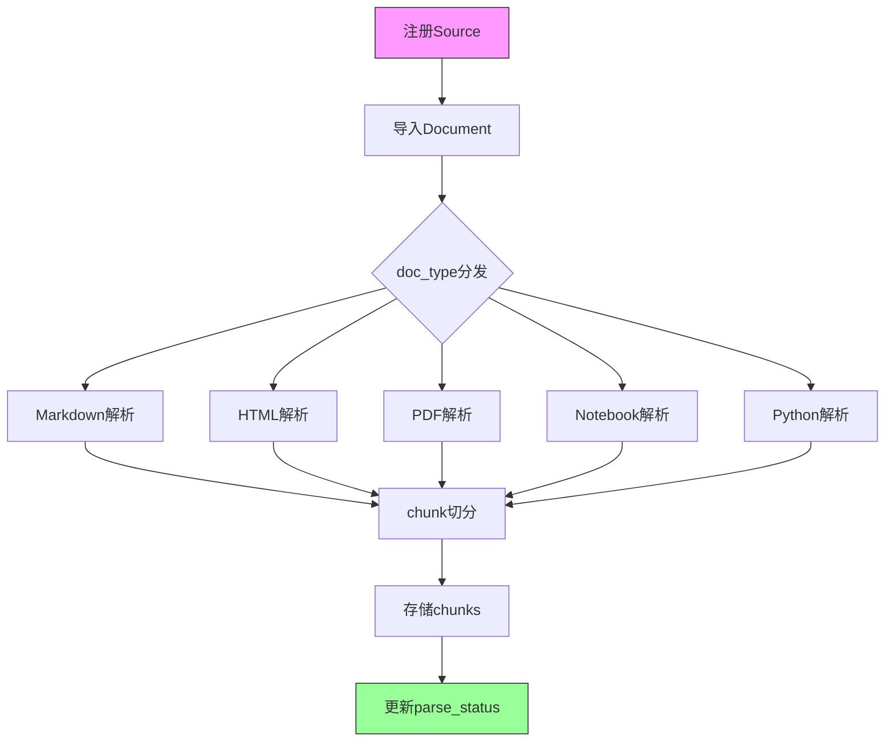
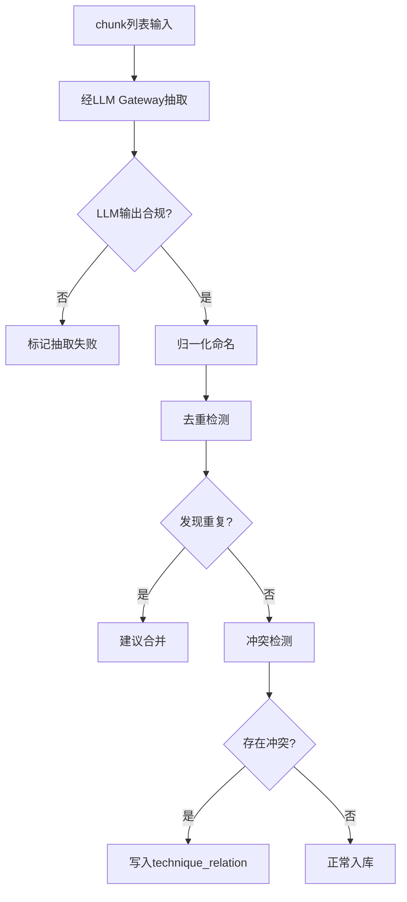
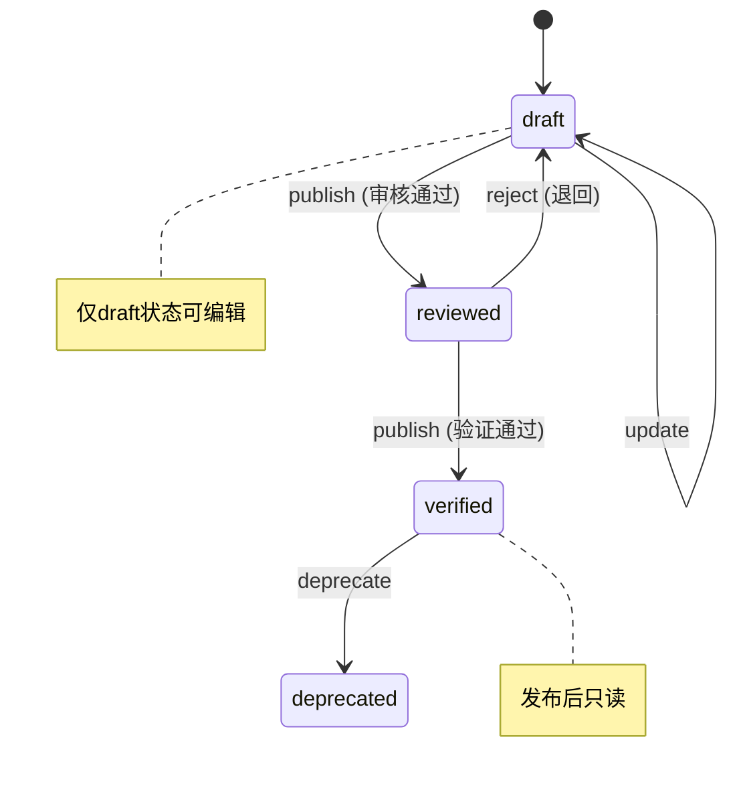
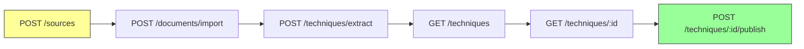

# 知识库 TDD实施计划 - Phase 2: 知识导入 + 技能卡片管理

## 概述

本阶段实现知识沉淀能力：文档解析 Pipeline（Markdown / HTML / PDF / Notebook / Python → chunk）、经 LLM Gateway 半自动技能抽取、导入时冲突检测、技能卡片 CRUD 与发布管理。同时提供知识系统基础 API（Source / Document / Technique CRUD）。

**阶段目标**:
- 导入链路打通 - 注册来源 → 导入文档 → chunk 切分 → 技能抽取完整闭环
- 冲突检测前置 - 新技能入库前必须完成冲突检测
- 发布管理严格 - 技能卡片状态流转 draft → reviewed → verified 受控
- 基础 API 可用 - Source / Document / Technique 端点可供前端或脚本调用

**前置依赖**:
- Phase 1 全部交付（知识库仓储 + LLM Gateway + 领域类型）
- `docs/updates/20260323_知识库/TDD/TDD_PLAN_PHASE1.md`

## Phase 2 包含的步骤

| 步骤 | 名称 | 状态 | 测试 | 完成日期 |
|------|------|------|------|----------|
| Step 1 | 文档导入与解析 Pipeline | ⏳ | -/- | - |
| Step 2 | 半自动技能抽取与冲突检测 | ⏳ | -/- | - |
| Step 3 | 技能卡片管理服务 | ⏳ | -/- | - |
| Step 4 | 知识系统基础 API | ⏳ | -/- | - |

**步骤列表**:
- **Step 1**: 文档导入与解析 Pipeline（Source 注册、Document 导入、多格式解析、chunk 切分、URL 抓取）
- **Step 2**: 半自动技能抽取与冲突检测（LLM 候选抽取、归一化去重、导入时冲突检测）
- **Step 3**: 技能卡片管理服务（Skill CRUD、发布状态流转、关系与模板管理）
- **Step 4**: 知识系统基础 API（Source / Document / Technique 端点）

---

## Step 1: 文档导入与解析 Pipeline (IngestionPipeline) ✅

**目标**: 实现知识导入全流程 — 从 Source 注册到 Document 导入、多格式解析、chunk 切分和 URL 内容安全抓取。

**上下文依赖**:
- 读取 `docs/updates/20260323_知识库/1.知识库架构设计.md` § 7.1-7.3 了解导入流程
- 读取 `docs/updates/20260323_知识库/1.知识库架构设计.md` § 7.5 了解 URL 接入（含 SSRF 防护）
- 读取 `docs/updates/20260323_知识库/1.知识库架构设计.md` § 5.1-5.3 了解 source / document / chunk 表结构
- 依赖 Phase 1 Step 3 的 KnowledgeRepository（Source / Document / Chunk CRUD）

**交付物**:
- ✅ `src/services/knowledge_ingestion_service.py` - 知识导入服务
- ✅ `tests/services/test_knowledge_ingestion_service.py` - 完整测试套件

**验收标准**:
- [x] Source 注册成功；重复 (source_type, uri) 拒绝
- [x] Markdown 文档导入并设置 parse_status=pending；content_hash 去重
- [x] Markdown 按章节切分 chunk 数量正确，section_path / chunk_index / token_count 完整
- [x] HTML 去标签后纯文本正确；PDF 基本文本提取可用
- [x] Notebook code+markdown cell 分别处理；Python 按函数/类切分
- [x] URL 白名单域名抓取成功；非白名单拒绝（防 SSRF）；超时返回错误
- [x] 空文档产出零 chunk

**实现状态**: ✅ 已完成
**测试结果**: 15/15 测试通过
**完成日期**: 2026-03-23

---

### Red Phase - 失败的测试定义

**测试文件**: `tests/services/test_knowledge_ingestion_service.py`

**核心测试用例**:
- ✅ `test_register_source_success` - Source 创建成功
- ✅ `test_register_source_duplicate_rejected` - 重复 (source_type, uri) 拒绝
- ✅ `test_import_document_sets_pending_status` - 导入后 parse_status=pending
- ✅ `test_import_document_content_hash_dedup` - content_hash 去重
- ✅ `test_import_document_invalid_doc_type_error` - 非法 doc_type 返回错误
- ✅ `test_parse_markdown_chapter_split` - Markdown 按章节切分
- ✅ `test_chunk_fields_complete` - chunk 的 section_path / chunk_index / token_count 完整
- ✅ `test_parse_empty_document_zero_chunks` - 空文档零 chunk
- ✅ `test_parse_html_strips_tags` - HTML 去标签
- ✅ `test_parse_pdf_basic_text` - PDF 文本提取
- ✅ `test_parse_notebook_cells` - Notebook code+markdown 分别处理
- ✅ `test_parse_python_by_function_class` - Python 按函数/类切分
- ✅ `test_fetch_url_whitelist_pass` - 白名单 URL 抓取成功
- ✅ `test_fetch_url_non_whitelist_rejected` - 非白名单拒绝（SSRF 防护）
- ✅ `test_fetch_url_timeout_returns_error` - 抓取超时返回错误

**关键验证点**:
- **安全性** - URL 抓取白名单防 SSRF
- **去重** - content_hash 去重，重复文档拒绝
- **切分完整性** - 每个 chunk 字段齐全
- **多格式覆盖** - 5 种格式解析器均可工作

---

### Green Phase - 实现最小化功能

**实现文件**:
- `src/services/knowledge_ingestion_service.py`

**核心组件**:
- `KnowledgeIngestionService` - 知识导入服务主类
- 内部解析器：`MarkdownParser` / `HTMLParser` / `PDFParser` / `NotebookParser` / `PythonParser`
- `URLFetcher` - URL 内容安全抓取（白名单校验）

**主要API/功能**:

| 功能 | 方法 | 功能描述 | 验收标准 |
|------|------|----------|----------|
| 来源注册 | `register_source` | 注册知识来源 | 去重校验 |
| 文档导入 | `import_document` | 导入文档并设置状态 | hash 去重 |
| 文档解析 | `parse_document` | 分发到对应解析器并切分 | 多格式支持 |
| URL 抓取 | `fetch_web_content` | 安全抓取 URL 内容 | SSRF 防护 |

**技术特性**:
- ✅ 5 种文档格式解析
- ✅ 按章节/段落切分，token 数可控
- ✅ content_hash 去重
- ✅ URL 白名单防 SSRF
- ✅ 解析器可扩展（策略模式）

---

### Refactor Phase - 优化和扩展

**重构目标**:
1. chunk 切分策略可配置（按章节 / 按段落 / 按 token 数上限）
2. 解析器注册为可扩展插件
3. 异步解析支持（大文档不阻塞）

**性能指标目标**:
- **单篇 Markdown（< 50KB）解析 + 切分** - < 2s

**验收标准**:
- [ ] chunk 切分策略参数化
- [ ] 解析器可独立测试
- [ ] 错误信息可诊断

---

## Step 2: 半自动技能抽取与冲突检测 (SkillExtractionGate) ✅

**目标**: 经 LLM Gateway 调用 LLM 实现候选技能抽取，并在入库前完成归一化、去重合并与冲突检测。

**上下文依赖**:
- 读取 `docs/updates/20260323_知识库/1.知识库架构设计.md` § 7.2 步骤 4 了解抽取流程
- 读取 `docs/updates/20260323_知识库/1.知识库架构设计.md` § 7.3 了解去重合并
- 读取 `docs/updates/20260323_知识库/1.知识库架构设计.md` § 7.4 了解导入时冲突检测
- 依赖 Phase 1 的 LLMGatewayService（chat_completion）
- 依赖 Step 1 的 chunk 产出

**交付物**:
- ✅ `src/services/knowledge_ingestion_service.py` - 抽取与冲突检测逻辑
- ✅ `tests/services/test_knowledge_ingestion_service.py` - 抽取与冲突测试

**验收标准**:
- [x] 调用 LLM Gateway 生成候选 Skill 结构体（name / category / layer / condition / action / tradeoff）
- [x] LLM 返回不合规时标记为抽取失败
- [x] 同名技能检测到重复并建议合并
- [x] 模块名/参数名归一化后一致
- [x] 同一 action.target_path + 不同 value_json → 标记为参数冲突候选
- [x] 同一 layer + 不同结构 → 标记为结构冲突候选
- [x] LLM 分析输出冲突类型判定写入 technique_relation
- [x] 无冲突时正常入库

**实现状态**: ✅ 已完成
**测试结果**: 9/9 测试通过
**完成日期**: 2026-03-23

---

### Red Phase - 失败的测试定义

**测试文件**: `tests/services/test_knowledge_ingestion_service.py`

**核心测试用例**:
- ✅ `test_extract_skills_produces_candidate_structs` - LLM 生成候选结构体
- ✅ `test_extract_skills_noncompliant_llm_marks_failed` - LLM 不合规标记失败
- ✅ `test_normalize_skill_names_consistent` - 模块名/参数名归一化
- ✅ `test_dedup_same_name_suggests_merge` - 同名技能建议合并
- ✅ `test_multi_evidence_links_single_skill` - 多证据关联同一 skill
- ✅ `test_conflict_detect_param_conflict` - 同 target_path 不同 value → 参数冲突
- ✅ `test_conflict_detect_structural_conflict` - 同 layer 不同结构 → 结构冲突
- ✅ `test_conflict_detect_writes_relation` - 冲突判定写入 technique_relation
- ✅ `test_no_conflict_normal_import` - 无冲突正常入库

**关键验证点**:
- **LLM 输出合规性** - 候选结构体字段完整
- **归一化一致性** - 同义词归一后去重
- **冲突检测覆盖** - 参数 / 结构 / 目标三类冲突

---

### Green Phase - 实现最小化功能

**核心组件**:
- `extract_skills(document_id)` - 调用 Gateway 抽取候选
- `normalize_skill_names(skills)` - 名称归一化
- `detect_duplicates(skill)` - 去重检测
- `detect_conflicts_on_import(new_skill)` - 导入时冲突检测

**实现要点**:
- 抽取 prompt 模板化，输入 chunk 文本 + 输出格式约束
- 冲突检测仅消耗两条技能摘要的 token（约 500 token）
- Mock LLM Gateway 支持测试

---

### Refactor Phase - 优化和扩展

**重构目标**:
1. 抽取 prompt 可配置（支持不同格式的来源文档）
2. 冲突检测规则可扩展
3. 批量抽取优化（多 chunk 合并请求）

**验收标准**:
- [ ] LLM Gateway Mock 覆盖正常返回与异常场景
- [ ] 冲突检测结果可审计

---

## Step 3: 技能卡片管理服务 (KnowledgeRegistryGate) ✅

**目标**: 实现技能卡片 CRUD、发布状态流转和关系/模板管理，确保发布流程严格受控。

**上下文依赖**:
- 读取 `docs/updates/20260323_知识库/1.知识库架构设计.md` § 12.2 了解 RegistryService 设计
- 读取 `docs/dev_step/3.业务逻辑层.md` Step 3.10 了解技能管理
- 依赖 Phase 1 Step 3 的 KnowledgeRepository（Skill 相关 CRUD）

**交付物**:
- ✅ `src/services/knowledge_registry_service.py` - 技能卡片管理服务
- ✅ `tests/services/test_knowledge_registry_service.py` - 完整测试套件

**验收标准**:
- [x] create_skill 成功且 skill_code 唯一
- [x] update_skill 更新字段正确
- [x] publish_skill 状态从 draft → reviewed → verified 流转正确
- [x] 非法流转被拒（如 draft 直接 → verified）
- [x] list_skills 按 category / layer / task_type / maturity 筛选正确
- [x] upsert_relation 关系写入 technique_relation 正确
- [x] 关系图查询可返回双向关系
- [x] template payload_json 存取完整

**实现状态**: ✅ 已完成
**测试结果**: 13/13 测试通过
**完成日期**: 2026-03-23

---

### Red Phase - 失败的测试定义

**测试文件**: `tests/services/test_knowledge_registry_service.py`

**核心测试用例**:
- ✅ `test_create_skill_unique_code` - 创建成功且 code 唯一
- ✅ `test_create_skill_duplicate_code_rejected` - 重复 code 拒绝
- ✅ `test_update_skill_fields_correct` - 更新字段正确
- ✅ `test_publish_draft_to_reviewed` - draft → reviewed 成功
- ✅ `test_publish_reviewed_to_verified` - reviewed → verified 成功
- ✅ `test_publish_invalid_transition_rejected` - 非法流转拒绝
- ✅ `test_list_skills_filter_by_category` - 按 category 筛选
- ✅ `test_list_skills_filter_by_layer` - 按 layer 筛选
- ✅ `test_list_skills_filter_by_task_type` - 按 task_type 筛选
- ✅ `test_list_skills_filter_by_maturity` - 按 maturity 筛选
- ✅ `test_upsert_relation_correct` - 关系写入正确
- ✅ `test_relation_graph_bidirectional` - 双向关系查询
- ✅ `test_template_payload_roundtrip` - 模板 JSON 存取完整

**关键验证点**:
- **状态机严格** - 非法状态流转被拒
- **筛选正确** - 多维筛选组合可用
- **关系双向** - A→B 和 B→A 均可查询

---

### Green Phase - 实现最小化功能

**实现文件**:
- `src/services/knowledge_registry_service.py`

**核心组件**:
- `KnowledgeRegistryService` - 技能卡片管理服务主类

**主要API/功能**:

| 功能 | 方法 | 功能描述 | 验收标准 |
|------|------|----------|----------|
| 创建 | `create_skill` | 创建技能卡片 | code 唯一 |
| 更新 | `update_skill` | 更新卡片字段 | 仅 draft 可编辑 |
| 发布 | `publish_skill` | 状态流转 | 严格受控 |
| 查询 | `list_skills` | 多维筛选 | 四维过滤 |
| 关系 | `upsert_relation` / `get_relations` | 关系管理 | 双向查询 |
| 模板 | `upsert_template` / `get_templates` | 模板管理 | JSON 完整 |

**实现要点**:
- 状态流转使用白名单映射：{draft: [reviewed], reviewed: [verified, draft], verified: [deprecated]}
- 筛选查询支持多条件 AND 组合

---

### Refactor Phase - 优化和扩展

**重构目标**:
1. 发布流转添加审计日志
2. 批量操作支持
3. 查询结果分页

**验收标准**:
- [ ] 状态流转白名单严格限制
- [ ] 筛选查询性能 < 50ms

---

## Step 4: 知识系统基础 API (KnowledgeBaseAPIGate) ✅

**目标**: 实现知识系统 REST API（Source / Document / Technique 端点），使前端和脚本可调用。

**上下文依赖**:
- 读取 `docs/updates/20260323_知识库/1.知识库架构设计.md` § 11.1-11.2 了解接口定义
- 读取 `docs/dev_step/4.接口层.md` Step 4.7 了解知识系统 API 路由
- 依赖 Step 1-3 的 IngestionService 和 RegistryService

**交付物**:
- ✅ `src/api/knowledge_routes.py` - 知识系统 API（Source / Document / Technique 部分）
- ✅ `tests/api/test_knowledge_api.py` - API 测试

**验收标准**:
- [x] POST /knowledge/sources 注册成功
- [x] POST /knowledge/documents/import 触发导入
- [x] POST /knowledge/techniques/extract 触发抽取
- [x] GET /knowledge/techniques 支持筛选参数
- [x] GET /knowledge/techniques/{id} 返回完整详情
- [x] POST /knowledge/techniques/{id}/publish 发布成功
- [x] 响应结构与现有 API 一致（ok / data / error）

**实现状态**: ✅ 已完成
**测试结果**: 9/9 测试通过
**完成日期**: 2026-03-23

---

### Red Phase - 失败的测试定义

**测试文件**: `tests/api/test_knowledge_api.py`

**核心测试用例**:
- ✅ `test_post_sources_register_success` - POST /knowledge/sources 成功
- ✅ `test_post_sources_duplicate_conflict` - 重复来源返回冲突错误
- ✅ `test_post_documents_import_success` - POST /knowledge/documents/import 成功
- ✅ `test_post_techniques_extract_trigger` - POST /knowledge/techniques/extract 触发
- ✅ `test_get_techniques_with_filters` - GET /knowledge/techniques 筛选
- ✅ `test_get_technique_detail` - GET /knowledge/techniques/{id} 详情
- ✅ `test_post_technique_publish_success` - POST publish 成功
- ✅ `test_post_technique_publish_invalid_transition` - 非法发布被拒
- ✅ `test_response_structure_consistent` - 响应结构一致性

**关键验证点**:
- **路由正确** - 端点路径与设计一致
- **响应格式** - ok / data / error 三字段结构
- **错误码** - 业务错误返回正确错误码

---

### Green Phase - 实现最小化功能

**实现文件**:
- `src/api/knowledge_routes.py`

**主要API/功能**:

| 端点 | 方法 | 功能描述 | 验收标准 |
|------|------|----------|----------|
| /knowledge/sources | POST | 注册知识来源 | 去重 + 响应结构 |
| /knowledge/documents/import | POST | 触发文档导入 | 返回 document_id |
| /knowledge/techniques/extract | POST | 触发技能抽取 | 返回候选列表 |
| /knowledge/techniques | GET | 技能列表（筛选） | 多维过滤 |
| /knowledge/techniques/{id} | GET | 技能详情 | 完整字段 |
| /knowledge/techniques/{id}/publish | POST | 发布技能 | 状态流转 |

**实现要点**:
- 路由注册到现有 FastAPI app
- 响应格式复用 `_response.py` 的 ok / error 模式
- 请求体校验复用 Step 2 的 Schema 校验器

---

### Refactor Phase - 优化和扩展

**重构目标**:
1. 分页参数标准化
2. 批量操作端点
3. OpenAPI 文档自动生成

**验收标准**:
- [ ] 所有端点 OpenAPI schema 完整
- [ ] 错误码与 Common 对齐

---

## Phase 2 完成总结

> 💡 **AI提示：阶段完成后填写此章节**

### 完成状态

| 步骤 | 名称 | 状态 | 测试 | 完成日期 |
|------|------|------|------|----------|
| Step 1 | 文档导入与解析 Pipeline | ⏳ | -/- | - |
| Step 2 | 半自动技能抽取与冲突检测 | ⏳ | -/- | - |
| Step 3 | 技能卡片管理服务 | ⏳ | -/- | - |
| Step 4 | 知识系统基础 API | ⏳ | -/- | - |

### 关键成果

1. **导入链路闭环**: 文档导入 → 解析 → chunk 切分 → 技能抽取链路完整
2. **冲突检测前置**: 新技能入库前自动检测三类冲突
3. **发布管理严格**: 技能卡片状态流转受控
4. **API 可用**: 前端或脚本可调用知识系统基础端点

### 下一阶段准备

- Phase 3 需要本阶段入库的技能卡片（≥ 30 条）作为检索目标
- 确认导入链路端到端可走通后方可进入 Phase 3

---

## 实现检查清单

### Red Phase 检查项
- [ ] 编写失败的测试用例，确保导入/抽取/注册/API 全覆盖
- [ ] 安全测试覆盖 SSRF 防护场景
- [ ] 冲突检测覆盖三类冲突候选

### Green Phase 检查项
- [ ] 实现最小化功能通过所有测试
- [ ] URL 抓取白名单严格限制
- [ ] 响应格式与现有 API 一致

### Refactor Phase 检查项
- [ ] chunk 切分策略可配置
- [ ] 解析器可扩展
- [ ] Taxonomy 枚举与架构设计 § 4.3.1 保持一致

---

## 质量标准

### 代码质量
- [ ] 代码覆盖率 > 90%
- [ ] 解析器间无重复逻辑

### 性能标准
- [ ] 单篇 Markdown（< 50KB）解析 + 切分 < 2s
- [ ] 半自动抽取平台侧额外开销 < 100ms

### 安全标准
- [ ] URL 来源仅允许白名单域名（防 SSRF）
- [ ] content_hash 去重与 skill_code 唯一约束稳定生效
- [ ] LLM 调用经 Gateway 统一收口
