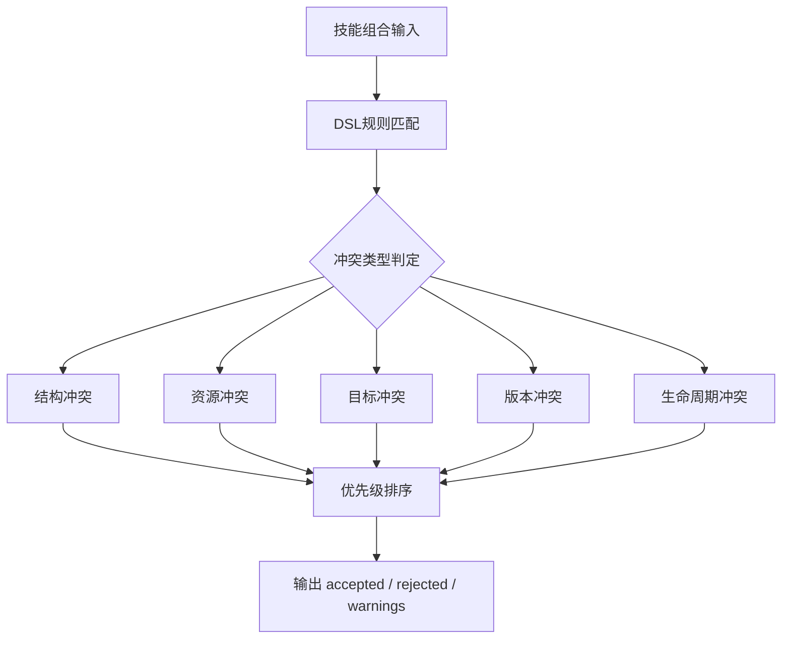
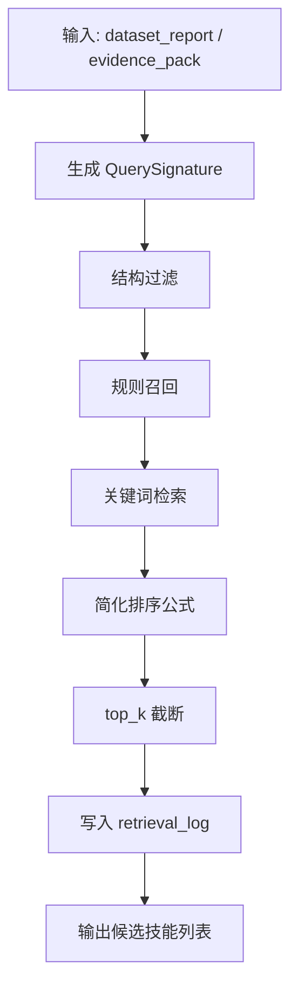
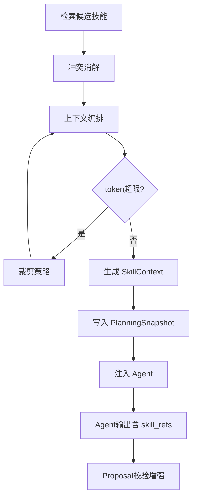
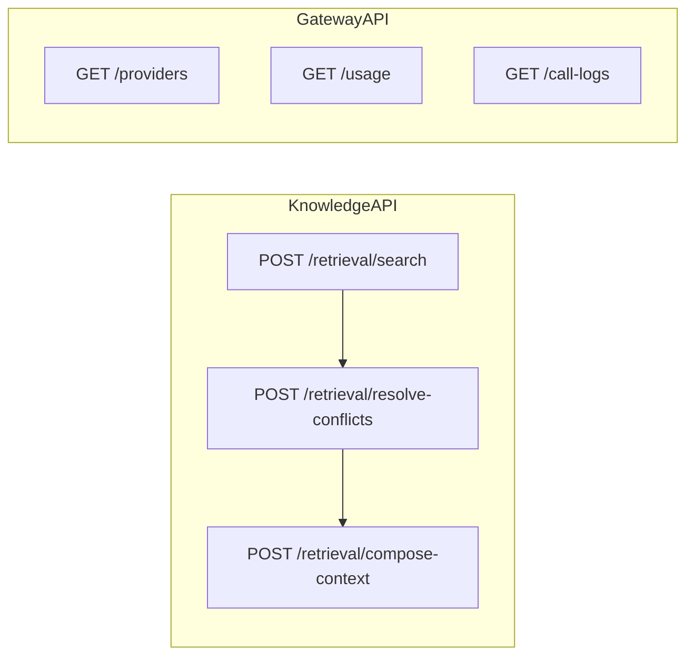

# 知识库 TDD实施计划 - Phase 3: 在线检索 + 冲突消解 + Agent 集成

## 概述

本阶段实现知识增强在线推理能力：ConflictResolutionService 完整版冲突消解、KnowledgeRetrievalService 混合检索、StrategyComposerService 最小知识上下文编排，并将知识上下文注入 AgentService，使 Planning Agent 与 Diagnosis Agent 输出携带 `skill_refs` 和 `conflict_checked`。同时提供检索/消解/上下文组装 API 和 LLM Gateway 管理 API。

**阶段目标**:
- 冲突消解完整 - 五类冲突（参数/结构/目标/版本/生命周期）全覆盖
- 检索链路打通 - 结构过滤 → 规则召回 → 关键词检索 → 内部经验加权
- 上下文精炼 - 最小知识上下文控制 5-12 条候选，token 预算可控
- Agent 增强 - 数据集规划与训练后诊断两阶段均注入 SkillContext

**前置依赖**:
- Phase 1（Gateway + 仓储）、Phase 2（已入库技能卡片 ≥ 30 条）
- 现有 AgentService 已可输出 next_experiments
- `docs/updates/20260323_知识库/TDD/TDD_PLAN_PHASE1.md`
- `docs/updates/20260323_知识库/TDD/TDD_PLAN_PHASE2.md`

## Phase 3 包含的步骤

| 步骤 | 名称 | 状态 | 测试 | 完成日期 |
|------|------|------|------|----------|
| Step 1 | 冲突消解服务 | ✅ | 12/12 | 2026-03-23 |
| Step 2 | 知识检索服务 | ✅ | 11/11 | 2026-03-23 |
| Step 3 | 策略编排与 Agent 集成 | ✅ | 15/15 | 2026-03-23 |
| Step 4 | 检索/消解/Gateway API | ✅ | 9/9 | 2026-03-23 |

**步骤列表**:
- **Step 1**: 冲突消解服务（DSL 引擎、五类冲突判定、优先级排序、资源预算校验）
- **Step 2**: 知识检索服务（QuerySignature、结构过滤 + 规则召回 + 关键词检索 + 简化排序）
- **Step 3**: 策略编排与 Agent 集成（SkillContext 编排、PlanningSnapshot、Agent 增强、Proposal 校验增强）
- **Step 4**: 检索/消解/Gateway API（检索端点、消解端点、上下文组装端点、LLM Gateway 管理端点）

---

## Step 1: 冲突消解服务 (ConflictResolutionGate) ⏳

**目标**: 实现 ConflictResolutionService — 基于 JSON DSL 的冲突规则引擎，覆盖五类冲突判定，输出 accepted / rejected / warnings。

**上下文依赖**:
- 读取 `docs/updates/20260323_知识库/1.知识库架构设计.md` § 9.1 了解五类冲突
- 读取 `docs/updates/20260323_知识库/1.知识库架构设计.md` § 9.2 了解冲突优先级
- 读取 `docs/updates/20260323_知识库/1.知识库架构设计.md` § 9.3 了解冲突规则 DSL
- 读取 `docs/updates/20260323_知识库/1.知识库架构设计.md` § 13.4 了解资源预算校验

**交付物**:
- ⏳ `src/services/conflict_resolution_service.py` - 冲突消解服务
- ⏳ `tests/services/test_conflict_resolution_service.py` - 完整测试套件

**验收标准**:
- [ ] JSON DSL 规则解析正确
- [ ] 结构冲突（同一位置不可合并）→ rejected
- [ ] 资源冲突（叠加超预算）→ rejected
- [ ] 目标冲突（KPI 权重判定）→ 按约束决策
- [ ] 版本冲突（framework_version 不满足）→ 直接过滤
- [ ] 生命周期冲突（condition 阶段约束）→ 按条件分流
- [ ] 优先级排序：安全硬约束 > KPI 硬约束 > 资源硬约束 > 结构 hard > 版本 > soft tradeoff
- [ ] validate_combination 多技能叠加后显存超 gpu_mem_gb → 拒绝

**实现状态**: ✅ 已完成
**测试结果**: 12/12 测试通过
**完成日期**: 2026-03-23

---

### Red Phase - 失败的测试定义

**测试文件**: `tests/services/test_conflict_resolution_service.py`

**核心测试用例**:
- ❌ `test_dsl_rule_parse_valid` - JSON DSL 规则解析正确
- ❌ `test_dsl_incompatible_with_matches` - incompatible_with 匹配标记 hard 冲突
- ❌ `test_structural_conflict_rejected` - 同位置不可合并 → rejected
- ❌ `test_resource_conflict_over_budget_rejected` - 叠加超预算 → rejected
- ❌ `test_objective_conflict_kpi_weight_decision` - KPI 权重判定
- ❌ `test_version_conflict_filtered` - framework_version 不满足 → 过滤
- ❌ `test_lifecycle_conflict_condition_branch` - 阶段约束 → 按条件分流
- ❌ `test_severity_affects_judgment` - severity 字段影响判定
- ❌ `test_priority_ordering_correct` - 优先级排序正确
- ❌ `test_validate_combination_gpu_mem_exceed` - 显存超限 → 拒绝
- ❌ `test_validate_combination_near_boundary_warning` - 接近边界 → warning
- ❌ `test_validate_combination_within_budget_pass` - 满足预算 → 通过

**关键验证点**:
- **五类冲突覆盖** - 每类冲突有独立测试
- **优先级严格** - 排序顺序不可逆
- **资源预算精确** - 数值计算正确

---

### Green Phase - 实现最小化功能

**实现文件**:
- `src/services/conflict_resolution_service.py`

**核心组件**:
- `ConflictResolutionService` - 冲突消解主类
- `DSLRuleEngine` - JSON DSL 规则解析与匹配
- `validate_combination` - 资源预算校验

**主要API/功能**:

| 功能 | 方法 | 功能描述 | 验收标准 |
|------|------|----------|----------|
| 冲突消解 | `resolve` | 五类冲突判定 + 优先级排序 | accepted/rejected/warnings |
| 规则引擎 | `evaluate_rules` | DSL 规则解析与匹配 | 规则可扩展 |
| 资源校验 | `validate_combination` | 多技能资源预算叠加 | 精确计算 |

**技术特性**:
- ✅ JSON DSL 规则描述（避免硬编码）
- ✅ 五类冲突全覆盖
- ✅ 优先级严格排序
- ✅ 资源预算精确计算

**实现要点**:
- DSL 规则存储在配置文件中，运行时加载
- 冲突优先级使用有序列表定义
- 资源叠加支持多维度（GPU 显存 / CPU / 存储）

---

### Refactor Phase - 优化和扩展

**重构目标**:
1. DSL 规则热加载（不重启服务即可更新）
2. 冲突判定结果缓存（相同技能组合不重复计算）

**性能指标目标**:
- **DSL 规则引擎单次评估** - < 10ms

**验收标准**:
- [ ] DSL 规则可在不修改代码的情况下扩展
- [ ] 所有测试通过

---

## Step 2: 知识检索服务 (RetrievalServiceGate) ⏳

**目标**: 实现混合检索 — QuerySignature 生成、结构过滤、规则召回、关键词检索、简化排序，以及检索日志记录。

**上下文依赖**:
- 读取 `docs/updates/20260323_知识库/1.知识库架构设计.md` § 8.2 了解 QuerySignature
- 读取 `docs/updates/20260323_知识库/1.知识库架构设计.md` § 8.3 了解检索阶段
- 读取 `docs/updates/20260323_知识库/1.知识库架构设计.md` § 8.4.1 了解简化排序公式
- 依赖 Phase 1 Step 1 的 QuerySignature DTO
- 依赖 Phase 2 的已入库技能

**交付物**:
- ⏳ `src/services/knowledge_retrieval_service.py` - 知识检索服务
- ⏳ `tests/services/test_knowledge_retrieval_service.py` - 完整测试套件

**验收标准**:
- [ ] 从 dataset_report 正确提取 QuerySignature 字段
- [ ] 从 evidence_pack 正确提取 baseline 信息
- [ ] task_type 过滤正确排除不匹配技能
- [ ] maturity=deprecated 被过滤
- [ ] required 条件命中的技能排在前列
- [ ] avoid 条件命中的技能被剔除
- [ ] 关键词命中模块名/参数名的技能获更高分数
- [ ] 简化公式 score = rule_match × (default_priority + internal_prior) × status_filter 计算正确
- [ ] top_k 截断正确
- [ ] retrieval_log 写入正确

**实现状态**: ✅ 已完成
**测试结果**: 11/11 测试通过
**完成日期**: 2026-03-23

---

### Red Phase - 失败的测试定义

**测试文件**: `tests/services/test_knowledge_retrieval_service.py`

**核心测试用例**:
- ❌ `test_build_query_signature_from_dataset` - 从 dataset_report 构建 QuerySignature
- ❌ `test_build_query_signature_from_evidence` - 从 evidence_pack 构建 QuerySignature
- ❌ `test_build_query_signature_missing_field_defaults` - 缺失字段使用默认值
- ❌ `test_structure_filter_task_type` - task_type 过滤
- ❌ `test_structure_filter_deprecated_excluded` - deprecated 被排除
- ❌ `test_rule_recall_required_condition_top` - required 条件命中排前
- ❌ `test_rule_recall_avoid_condition_excluded` - avoid 条件被剔除
- ❌ `test_keyword_search_module_name_boost` - 模块名命中加分
- ❌ `test_simplified_score_formula_correct` - 简化排序公式计算正确
- ❌ `test_top_k_truncation` - top_k 截断
- ❌ `test_retrieval_log_written` - 检索日志写入

**关键验证点**:
- **QuerySignature 完整** - 从不同来源构建的 signature 字段齐全
- **过滤逻辑准确** - 多阶段过滤结果正确
- **排序稳定** - 相同条件下排序结果一致
- **日志可审计** - retrieval_log 包含完整检索过程

---

### Green Phase - 实现最小化功能

**实现文件**:
- `src/services/knowledge_retrieval_service.py`

**核心组件**:
- `KnowledgeRetrievalService` - 检索服务主类
- `build_query_signature_from_dataset` - 从 dataset_report 构建签名
- `build_query_signature_from_evidence` - 从 evidence_pack 构建签名
- `search` - 混合检索主方法

**主要API/功能**:

| 功能 | 方法 | 功能描述 | 验收标准 |
|------|------|----------|----------|
| 签名构建 | `build_query_signature_*` | 从不同来源构建查询签名 | 字段完整 |
| 混合检索 | `search` | 多阶段检索 + 排序 | 排序正确 |
| 日志记录 | 内部自动写入 | 检索过程日志 | 可审计 |

**实现要点**:
- 简化排序公式：$score_{simple} = S_{rule\_match} \times (default\_priority + S_{internal}) \times status\_filter$
- 检索结果为候选技能集合，非原始文本
- 为 Phase 4 引入向量检索预留接口

---

### Refactor Phase - 优化和扩展

**重构目标**:
1. 排序公式参数可配置
2. 向量检索接口预留（可选插件）
3. 检索结果缓存

**验收标准**:
- [ ] 排序公式参数可在配置中调整
- [ ] 接口设计支持后续扩展完整排序公式

---

## Step 3: 策略编排与 Agent 集成 (StrategyComposerGate) ⏳

**目标**: 实现 StrategyComposerService 最小知识上下文编排，注入 AgentService 使输出含 skill_refs，增强 Proposal 校验。

**上下文依赖**:
- 读取 `docs/updates/20260323_知识库/1.知识库架构设计.md` § 10 了解 Agent 输入上下文设计
- 读取 `docs/updates/20260323_知识库/1.知识库架构设计.md` § 15.2 了解 token 预算策略
- 读取 `docs/updates/20260323_知识库/1.知识库架构设计.md` § 13.2-13.3 了解 Agent 集成
- 读取 `docs/updates/20260323_知识库/1.知识库架构设计.md` § 13.4 了解 Proposal 校验增强
- 依赖 Step 1 的 ConflictResolutionService 和 Step 2 的 RetrievalService

**交付物**:
- ✅ `src/services/strategy_composer_service.py` - 策略编排服务
- ✅ `src/services/agent_service.py` - AgentService 增强
- ✅ `src/api/proposal_routes.py` - Proposal 校验增强（通过 ProposalKnowledgeValidator）
- ✅ `tests/services/test_strategy_composer_service.py` - 策略编排+Agent增强测试
- ✅ `tests/api/test_retrieval_api.py` - 新增检索/消解/Gateway端点测试

**验收标准**:
- [ ] SkillContext 输出包含 candidate_techniques / rejected_techniques / conflict_summary
- [ ] 候选数量控制在 5-12 条
- [ ] token 预算超限时按裁剪顺序执行（长 rationale → 低优先级 → 低可信度）
- [ ] PlanningSnapshot 写入成功含 selected / rejected / prompt_context / evidence_fingerprint
- [ ] 数据集规划阶段注入 SkillContext → Planning Agent 输出含 skill_refs
- [ ] 训练后诊断阶段注入 SkillContext → Diagnosis Agent 输出含 skill_refs + conflict_checked
- [ ] validate_technique_refs 校验 skill_refs 引用有效
- [ ] validate_technique_combination 调用冲突消解校验
- [ ] validate_resource_budget 校验资源预算
- [ ] validate_version_compatibility 校验版本兼容

**实现状态**: ⏳ 待开始
**测试结果**: 0/0 测试通过
**计划实现日期**: YYYY-MM-DD

---

### Red Phase - 失败的测试定义

**测试文件**: `tests/services/test_agent_service.py`（增强） + `tests/api/test_knowledge_api.py`（新增端点）

**核心测试用例**:
- ❌ `test_compose_context_output_structure` - SkillContext 字段完整
- ❌ `test_compose_context_candidate_count_5_12` - 候选数量 5-12 范围
- ❌ `test_compose_context_token_budget_trim` - 超限时裁剪策略生效
- ❌ `test_planning_snapshot_written` - PlanningSnapshot 写入完整
- ❌ `test_snapshot_evidence_fingerprint_reproducible` - fingerprint 可复现
- ❌ `test_retrieval_log_written_on_search` - 每次检索写日志
- ❌ `test_agent_planning_with_skill_context` - 规划阶段注入 SkillContext
- ❌ `test_agent_diagnosis_with_skill_context` - 诊断阶段注入 SkillContext
- ❌ `test_agent_output_contains_skill_refs` - Agent 输出含 skill_refs
- ❌ `test_agent_output_contains_conflict_checked` - Agent 输出含 conflict_checked
- ❌ `test_validate_technique_refs_valid` - skill_refs 引用有效
- ❌ `test_validate_technique_refs_invalid_rejected` - 无效引用被拒
- ❌ `test_validate_combination_conflict_detected` - 冲突组合被检测
- ❌ `test_validate_resource_budget_exceeded` - 资源超限被拒
- ❌ `test_validate_version_compatibility_failed` - 版本不兼容被拒

**关键验证点**:
- **上下文精炼** - 候选数量可控，token 预算可控
- **Agent 集成** - 两个阶段均可注入知识上下文
- **Proposal 增强** - 四项校验全覆盖
- **可审计** - snapshot 和 retrieval_log 完整

---

### Green Phase - 实现最小化功能

**实现文件**:
- `src/services/strategy_composer_service.py`
- `src/services/agent_service.py`（增强）
- `src/api/proposal_routes.py`（增强）

**核心组件**:
- `StrategyComposerService` - 策略编排服务
- `compose_planning_context` - 数据集规划上下文
- `compose_diagnosis_context` - 训练后诊断上下文
- `AgentService.analyze`（增强） - 注入 SkillContext
- Proposal 校验增强四项

**技术特性**:
- ✅ 候选 5-12 条范围控制
- ✅ token 预算裁剪策略（长 rationale → 低优先级 → 低可信度）
- ✅ PlanningSnapshot 审计记录
- ✅ 四项 Proposal 校验增强

---

### Refactor Phase - 优化和扩展

**重构目标**:
1. token 预算参数可配置（dataset_plan 8k-16k / next_experiments 12k-20k）
2. 裁剪策略可扩展
3. Agent prompt 模板与知识上下文拼接优化

**性能指标目标**:
- **检索 + 冲突消解 + 上下文编排全链路** - < 500ms（不含 LLM 调用时间）

**验收标准**:
- [ ] 全链路性能达标
- [ ] Proposal 校验增强与现有校验流程兼容

---

## Step 4: 检索/消解/Gateway API (KnowledgeOnlineAPIGate) ⏳

**目标**: 实现检索、消解、上下文组装 API 端点和 LLM Gateway 管理 API。

**上下文依赖**:
- 读取 `docs/updates/20260323_知识库/1.知识库架构设计.md` § 11.3 了解检索接口
- 读取 `docs/dev_step/4.接口层.md` Step 4.7 了解知识系统 API
- 读取 `docs/dev_step/4.接口层.md` Step 4.8 了解 LLM Gateway 管理 API

**交付物**:
- ✅ `src/api/knowledge_routes.py` - 新增检索/消解/上下文端点
- ✅ `src/api/llm_gateway_routes.py` - Gateway 管理 API
- ✅ `tests/api/test_retrieval_api.py` - 检索+Gateway端点测试

**验收标准**:
- [ ] POST /knowledge/retrieval/search 返回候选技能列表
- [ ] POST /knowledge/retrieval/resolve-conflicts 返回 accepted / rejected
- [ ] POST /knowledge/retrieval/compose-context 返回 SkillContext + snapshot_id
- [ ] GET /llm-gateway/providers 返回已注册 Provider 列表
- [ ] GET /llm-gateway/usage 返回按时间范围聚合用量报表
- [ ] GET /llm-gateway/call-logs 支持分页 + 时间范围 + call_type 过滤
- [ ] 响应结构与现有 API 一致

**实现状态**: ⏳ 待开始
**测试结果**: 0/0 测试通过
**计划实现日期**: YYYY-MM-DD

---

### Red Phase - 失败的测试定义

**测试文件**: `tests/api/test_knowledge_api.py` + `tests/api/test_llm_gateway_api.py`

**核心测试用例**:
- ❌ `test_post_retrieval_search_returns_candidates` - 检索返回候选
- ❌ `test_post_resolve_conflicts_returns_verdict` - 消解返回判定
- ❌ `test_post_compose_context_returns_skill_context` - 上下文返回 SkillContext + snapshot_id
- ❌ `test_get_providers_list` - Provider 列表
- ❌ `test_get_usage_report_with_time_range` - 用量报表时间范围查询
- ❌ `test_get_usage_report_group_by` - 用量报表分组
- ❌ `test_get_call_logs_pagination` - 调用日志分页
- ❌ `test_get_call_logs_filter_by_call_type` - 按 call_type 过滤
- ❌ `test_response_structure_consistent` - 响应结构一致性

---

### Green Phase - 实现最小化功能

**实现文件**:
- `src/api/knowledge_routes.py`（新增端点）
- `src/api/llm_gateway_routes.py`

**主要API/功能**:

| 端点 | 方法 | 功能描述 | 验收标准 |
|------|------|----------|----------|
| /knowledge/retrieval/search | POST | 混合检索 | 候选列表 |
| /knowledge/retrieval/resolve-conflicts | POST | 冲突消解 | accepted/rejected |
| /knowledge/retrieval/compose-context | POST | 上下文编排 | SkillContext + snapshot_id |
| /llm-gateway/providers | GET | Provider 列表 | 返回注册列表 |
| /llm-gateway/usage | GET | 用量报表 | 时间范围 + 分组 |
| /llm-gateway/call-logs | GET | 调用日志 | 分页 + 过滤 |

---

### Refactor Phase - 优化和扩展

**重构目标**:
1. 检索 API 添加缓存（相同 QuerySignature 短期内不重复检索）
2. Gateway API 添加导出 CSV 功能

**验收标准**:
- [ ] 所有端点 OpenAPI schema 完整
- [ ] 响应格式与现有 API 一致

---

## Phase 3 完成总结

> 💡 **AI提示：阶段完成后填写此章节**

### 完成状态

| 步骤 | 名称 | 状态 | 测试 | 完成日期 |
|------|------|------|------|----------|
| Step 1 | 冲突消解服务 | ✅ | 12/12 | 2026-03-23 |
| Step 2 | 知识检索服务 | ✅ | 11/11 | 2026-03-23 |
| Step 3 | 策略编排与 Agent 集成 | ✅ | 15/15 | 2026-03-23 |
| Step 4 | 检索/消解/Gateway API | ✅ | 9/9 | 2026-03-23 |

### 关键成果

1. **冲突消解完整**: 五类冲突全覆盖，DSL 规则可扩展
2. **检索链路打通**: 多阶段混合检索 + 简化排序公式
3. **Agent 知识增强**: 两阶段均注入 SkillContext
4. **审计链完整**: planning_snapshot + retrieval_log 全记录

### 下一阶段准备

- Phase 4 需要本阶段检索排序框架作为基座
- 确认 Agent 输出含 skill_refs + conflict_checked 后方可进入 Phase 4

---

## 实现检查清单

### Red Phase 检查项
- [ ] 五类冲突各有独立测试用例
- [ ] 检索各阶段均有测试覆盖
- [ ] Agent 集成测试覆盖两个阶段
- [ ] Proposal 校验增强四项均有测试

### Green Phase 检查项
- [ ] DSL 规则可在不修改代码的情况下扩展
- [ ] 简化排序公式正确实现
- [ ] Agent 输出含 skill_refs + conflict_checked

### Refactor Phase 检查项
- [ ] 冲突规则 DSL 避免硬编码
- [ ] 排序公式参数可配置
- [ ] 向量检索为可选插件预留接口

---

## 质量标准

### 代码质量
- [ ] 代码覆盖率 > 90%
- [ ] 冲突消解 / 检索 / 编排三服务间依赖清晰

### 性能标准
- [ ] 检索 + 冲突消解 + 上下文编排全链路 < 500ms（不含 LLM）
- [ ] DSL 规则引擎单次评估 < 10ms

### 安全标准
- [ ] Proposal 校验增强不放过无效 skill_refs
- [ ] 资源预算校验不允许超限组合通过
