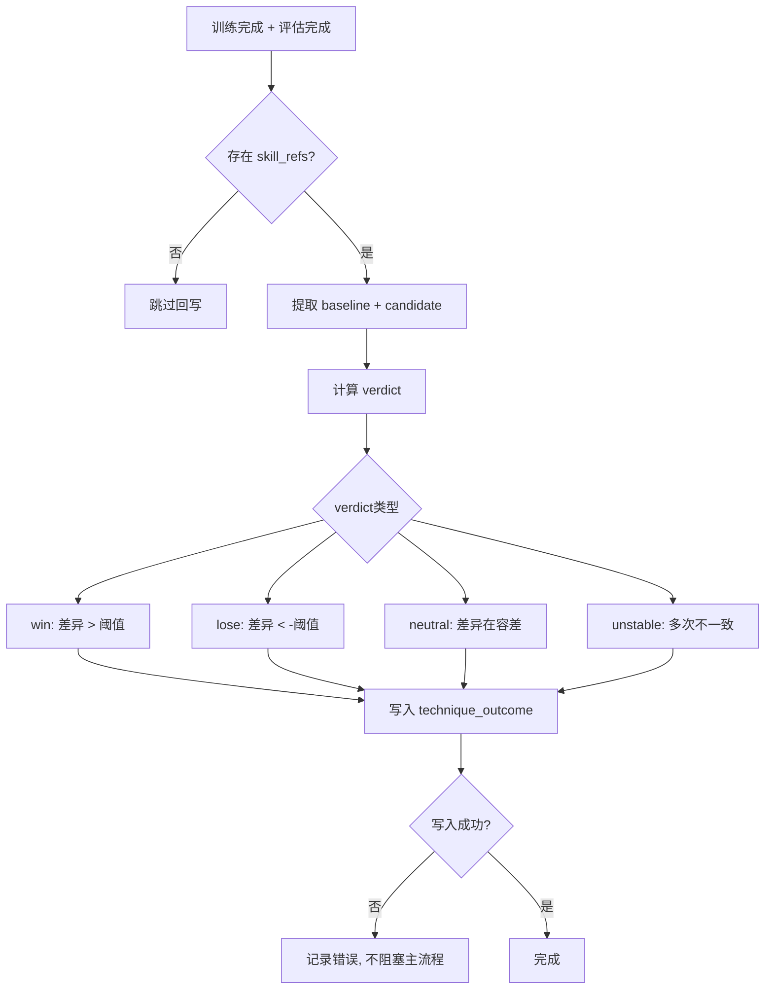
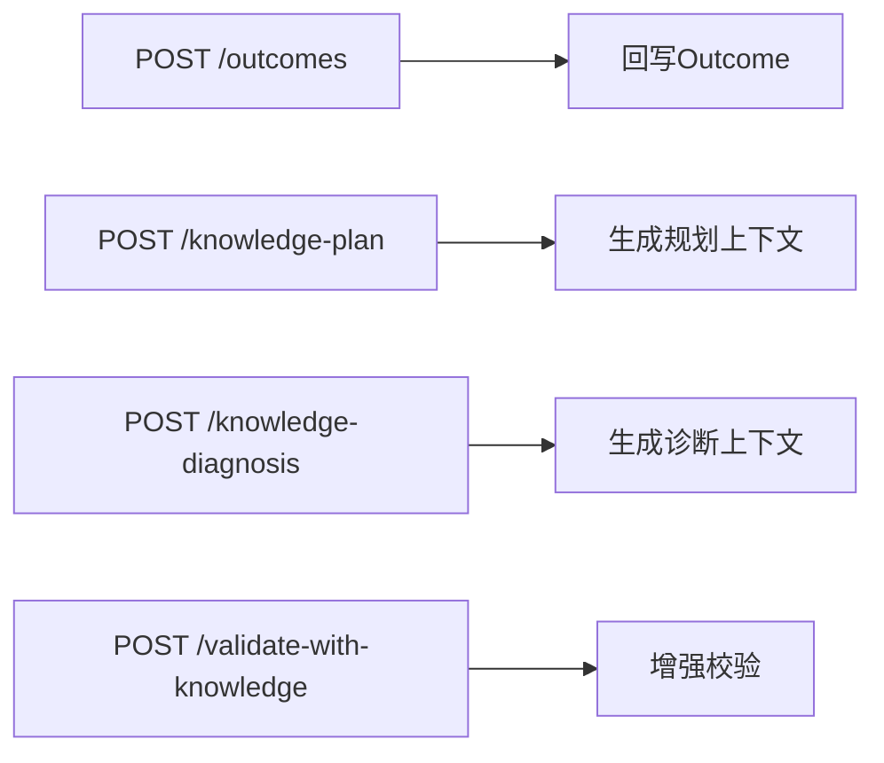
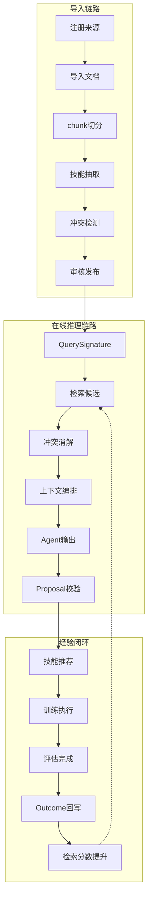

# 知识库 TDD实施计划 - Phase 4: 内部经验闭环 + Proposal 增强 + 端到端验收

## 概述

本阶段完成知识系统最后一环：SkillOutcomeTrackerService 实现内部经验闭环（训练完成后自动回写技能效果，反哺检索排序），完善 Proposal 校验流程，补齐 Outcome 回写 API 和训练流程耦合接口，通过端到端集成测试验证完整闭环。

**阶段目标**:
- 经验闭环完成 - 训练结果自动回写，反哺检索排序
- Proposal 增强落地 - skill_refs / 冲突 / 资源 / 版本四项校验全部落地
- 审计链完整 - planning_snapshot + retrieval_log + skill_outcome + llm_call_log 四表联合
- 端到端验收 - 导入 → 检索 → Agent 增强 → 实验 → Outcome 回写 → 检索优化 完整闭环

**前置依赖**:
- Phase 1-3 全部交付（Gateway + 仓储 + 导入 + 检索 + 冲突消解 + Agent 集成）
- 现有 EvalService 可输出评估结果
- `docs/updates/20260323_知识库/TDD/TDD_PLAN_PHASE1.md` ~ `TDD_PLAN_PHASE3.md`

## Phase 4 包含的步骤

| 步骤 | 名称 | 状态 | 测试 | 完成日期 |
|------|------|------|------|----------|
| Step 1 | 技能效果追踪服务 | ⏳ | -/- | - |
| Step 2 | 内部经验加权集成 | ⏳ | -/- | - |
| Step 3 | Outcome / 训练流程耦合 API | ⏳ | -/- | - |
| Step 4 | 端到端集成测试与审计链验证 | ⏳ | -/- | - |

**步骤列表**:
- **Step 1**: 技能效果追踪服务（verdict 判定、Outcome 回写、内部先验计算、训练后自动回写）
- **Step 2**: 内部经验加权集成（检索排序增强，win 提升 / lose 降低 / unstable 不变）
- **Step 3**: Outcome / 训练流程耦合 API（Outcome 回写端点、knowledge-plan / knowledge-diagnosis 端点）
- **Step 4**: 端到端集成测试与审计链验证（导入链路 / 在线推理 / 经验闭环 / 审计链）

---

## Step 1: 技能效果追踪服务 (SkillOutcomeTrackerGate) ⏳

**目标**: 实现 SkillOutcomeTrackerService — verdict 判定、Outcome 回写与查询、内部先验计算、训练完成后自动触发回写。

**上下文依赖**:
- 读取 `docs/updates/20260323_知识库/1.知识库架构设计.md` § 5.12 了解 technique_outcome 表结构
- 读取 `docs/updates/20260323_知识库/1.知识库架构设计.md` § 12.6 了解 SkillOutcomeService 设计
- 读取 `docs/dev_step/3.业务逻辑层.md` Step 3.13 了解服务设计
- 依赖 Phase 1 的 KnowledgeRepository + JobRepository

**交付物**:
- ⏳ `src/services/skill_outcome_tracker_service.py` - 技能效果追踪服务
- ⏳ `tests/services/test_skill_outcome_tracker_service.py` - 完整测试套件

**验收标准**:
- [ ] baseline 与 candidate 的 business_kpi 差异 > 阈值 → win
- [ ] 差异 < 负阈值 → lose
- [ ] 差异在容差范围 → neutral
- [ ] 多次实验结果不一致 → unstable
- [ ] 阈值可配置
- [ ] 单条 outcome 写入 technique_outcome 成功
- [ ] 多条技能批量回写正确
- [ ] scenario_signature / result_summary 字段完整
- [ ] 重复回写（同 baseline + candidate）幂等处理
- [ ] 按场景签名查询历史 outcome 正确
- [ ] compute_internal_prior 返回 win_rate 正确
- [ ] 无历史 outcome 时返回默认先验
- [ ] 训练完成后自动 Outcome 回写（post-eval hook）
- [ ] 无 skill_refs 的任务跳过回写
- [ ] 回写失败不影响主流程

**实现状态**: ⏳ 待开始
**测试结果**: 0/0 测试通过
**计划实现日期**: YYYY-MM-DD

---

### Red Phase - 失败的测试定义

**测试文件**: `tests/services/test_skill_outcome_tracker_service.py`

**核心测试用例**:
- ❌ `test_verdict_win_above_threshold` - 差异超阈值 → win
- ❌ `test_verdict_lose_below_negative_threshold` - 差异低于负阈值 → lose
- ❌ `test_verdict_neutral_within_tolerance` - 差异在容差范围 → neutral
- ❌ `test_verdict_unstable_inconsistent` - 多次不一致 → unstable
- ❌ `test_verdict_threshold_configurable` - 阈值可配置
- ❌ `test_record_outcome_single_success` - 单条写入成功
- ❌ `test_record_outcome_batch_correct` - 多条批量回写
- ❌ `test_outcome_fields_complete` - scenario_signature / result_summary 完整
- ❌ `test_record_outcome_idempotent` - 重复回写幂等
- ❌ `test_query_outcomes_by_scenario` - 按场景签名查询
- ❌ `test_compute_internal_prior_win_rate` - win_rate 计算正确
- ❌ `test_internal_prior_no_history_default` - 无历史返回默认值
- ❌ `test_post_eval_auto_outcome_write` - 训练后自动回写
- ❌ `test_no_skill_refs_skips_outcome` - 无 skill_refs 跳过
- ❌ `test_outcome_write_failure_not_block` - 回写失败不阻塞

**关键验证点**:
- **verdict 准确** - 四种判定逻辑正确
- **幂等安全** - 重复回写不产生重复记录
- **容错健壮** - 回写失败不影响训练主流程
- **先验计算** - win_rate 统计正确

---

### Green Phase - 实现最小化功能

**实现文件**:
- `src/services/skill_outcome_tracker_service.py`

**核心组件**:
- `SkillOutcomeTrackerService` - 追踪服务主类
- `compute_verdict` - verdict 计算器
- `record_outcome` - Outcome 回写
- `query_similar_outcomes` - 场景签名查询
- `compute_internal_prior` - 内部先验计算

**主要API/功能**:

| 功能 | 方法 | 功能描述 | 验收标准 |
|------|------|----------|----------|
| 判定 | `compute_verdict` | 四种 verdict 计算 | 阈值可配 |
| 回写 | `record_outcome` | 写入 technique_outcome | 幂等 |
| 查询 | `query_similar_outcomes` | 按场景签名查询 | 匹配正确 |
| 先验 | `compute_internal_prior` | win_rate 计算 | 统计正确 |
| 钩子 | `on_eval_complete` | 训练后自动触发 | 不阻塞 |

**技术特性**:
- ✅ win / lose / neutral / unstable 四种 verdict
- ✅ 阈值可配置
- ✅ 幂等回写（同 baseline + candidate 不重复）
- ✅ Post-eval hook 异步/后置执行
- ✅ 失败不影响主流程

---

### Refactor Phase - 优化和扩展

**重构目标**:
1. verdict 判定逻辑可配置阈值（支持不同项目不同阈值）
2. Outcome 回写异步化
3. 场景签名匹配算法优化

**验收标准**:
- [ ] 阈值参数可通过配置文件调整
- [ ] 回写失败有告警日志

---

## Step 2: 内部经验加权集成 (InternalPriorIntegrationGate) ⏳

**目标**: 将内部经验先验集成到 RetrievalService 检索排序中，使 win 记录提升分数、lose 降低分数。

**上下文依赖**:
- 读取 `docs/updates/20260323_知识库/1.知识库架构设计.md` § 8.3 阶段 5 了解内部经验加权
- 读取 `docs/updates/20260323_知识库/1.知识库架构设计.md` § 8.4.1 了解简化排序公式
- 依赖 Step 1 的 compute_internal_prior
- 依赖 Phase 3 Step 2 的 RetrievalService

**交付物**:
- ⏳ `src/services/knowledge_retrieval_service.py` - 排序增强
- ⏳ `tests/services/test_knowledge_retrieval_service.py` - 新增排序测试

**验收标准**:
- [ ] 有 win 记录的技能排序分数提升
- [ ] 有 lose 记录的技能排序分数降低
- [ ] unstable 技能不调整分数
- [ ] 简化公式中 S_internal 项正确生效

**实现状态**: ⏳ 待开始
**测试结果**: 0/0 测试通过
**计划实现日期**: YYYY-MM-DD

---

### Red Phase - 失败的测试定义

**测试文件**: `tests/services/test_knowledge_retrieval_service.py`（新增用例）

**核心测试用例**:
- ❌ `test_win_record_boosts_score` - win 记录提升排序分数
- ❌ `test_lose_record_lowers_score` - lose 记录降低排序分数
- ❌ `test_unstable_record_no_change` - unstable 不调整
- ❌ `test_internal_prior_in_simplified_formula` - S_internal 在公式中正确生效
- ❌ `test_no_outcome_uses_default_prior` - 无 outcome 使用默认先验

**关键验证点**:
- **排序变化** - 有 outcome 的技能排序确实改变
- **公式正确** - $score_{simple} = S_{rule\_match} \times (default\_priority + S_{internal}) \times status\_filter$

---

### Green Phase - 实现最小化功能

**实现要点**:
- 在 RetrievalService.search 的排序步骤中增加 S_internal 计算
- 无 outcome 时 S_internal = 0（默认先验）
- win_rate > 0.5 → 正向加权；win_rate < 0.5 → 负向加权

---

### Refactor Phase - 优化和扩展

**重构目标**:
1. 内部先验计算结果缓存
2. 加权系数可配置

---

## Step 3: Outcome / 训练流程耦合 API (OutcomeAPIGate) ⏳

**目标**: 实现 Outcome 回写 API 和训练流程耦合接口（knowledge-plan / knowledge-diagnosis / validate-with-knowledge）。

**上下文依赖**:
- 读取 `docs/updates/20260323_知识库/1.知识库架构设计.md` § 11.4-11.5 了解接口定义
- 依赖 Step 1 的 SkillOutcomeTrackerService
- 依赖 Phase 3 的 StrategyComposerService

**交付物**:
- ⏳ `src/api/knowledge_routes.py` - 新增 Outcome + 训练流程端点
- ⏳ `tests/api/test_knowledge_api.py` - API 测试

**验收标准**:
- [ ] POST /knowledge/outcomes 回写成功
- [ ] 请求缺必填字段被拒
- [ ] technique_id 不存在返回错误
- [ ] POST /datasets/versions/{id}/knowledge-plan 触发规划上下文生成
- [ ] POST /jobs/{id}/knowledge-diagnosis 触发诊断上下文生成
- [ ] POST /proposals/validate-with-knowledge 增强校验通过

**实现状态**: ⏳ 待开始
**测试结果**: 0/0 测试通过
**计划实现日期**: YYYY-MM-DD

---

### Red Phase - 失败的测试定义

**测试文件**: `tests/api/test_knowledge_api.py`（新增用例）

**核心测试用例**:
- ❌ `test_post_outcomes_success` - Outcome 回写成功
- ❌ `test_post_outcomes_missing_field_rejected` - 缺字段拒绝
- ❌ `test_post_outcomes_invalid_technique_error` - 不存在 technique 报错
- ❌ `test_post_knowledge_plan_trigger` - knowledge-plan 端点触发
- ❌ `test_post_knowledge_diagnosis_trigger` - knowledge-diagnosis 端点触发
- ❌ `test_post_validate_with_knowledge_pass` - 增强校验通过
- ❌ `test_post_validate_with_knowledge_conflict_fail` - 冲突校验失败

---

### Green Phase - 实现最小化功能

**实现文件**:
- `src/api/knowledge_routes.py`（新增端点）

**主要API/功能**:

| 端点 | 方法 | 功能描述 | 验收标准 |
|------|------|----------|----------|
| /knowledge/outcomes | POST | Outcome 回写 | 幂等 |
| /datasets/versions/{id}/knowledge-plan | POST | 规划上下文生成 | SkillContext |
| /jobs/{id}/knowledge-diagnosis | POST | 诊断上下文生成 | SkillContext |
| /proposals/validate-with-knowledge | POST | 增强校验 | 四项检查 |

---

### Refactor Phase - 优化和扩展

**验收标准**:
- [ ] 端点与现有路由风格一致
- [ ] 错误码与 Common 对齐

---

## Step 4: 端到端集成测试与审计链验证 (E2EValidationGate) ⏳

**目标**: 通过端到端集成测试验证三条关键链路和完整审计链。

**上下文依赖**:
- 读取 `docs/updates/20260323_知识库/1.知识库架构设计.md` § 16 了解审计与治理
- 依赖 Phase 1-4 全部交付

**交付物**:
- ⏳ `tests/integration/test_knowledge_e2e.py` - 端到端集成测试
- ⏳ 审计与治理验证报告

**验收标准**:
- [ ] 导入链路：注册来源 → 导入文档 → chunk → 抽取 → 冲突检测 → 审核发布 → 技能可查询
- [ ] 在线推理链路：QuerySignature → 检索 → 冲突消解 → 上下文编排 → Agent 输出含 skill_refs → Proposal 通过
- [ ] 经验闭环链路：技能入库 → 检索排序 → Agent 推荐 → 训练 → Outcome win → 再次检索分数提升
- [ ] planning_snapshot 可回溯规划上下文
- [ ] retrieval_log 可回溯检索过程
- [ ] llm_call_log 可追踪所有 LLM 调用成本
- [ ] skill_outcome 可追溯技能在实验中的表现

**实现状态**: ⏳ 待开始
**测试结果**: 0/0 测试通过
**计划实现日期**: YYYY-MM-DD

---

### Red Phase - 失败的测试定义

**测试文件**: `tests/integration/test_knowledge_e2e.py`

**核心测试用例**:
- ❌ `test_e2e_import_pipeline` - 导入链路端到端
- ❌ `test_e2e_online_reasoning` - 在线推理端到端
- ❌ `test_e2e_experience_loop` - 经验闭环端到端
- ❌ `test_audit_planning_snapshot_traceable` - planning_snapshot 可追溯
- ❌ `test_audit_retrieval_log_traceable` - retrieval_log 可追溯
- ❌ `test_audit_llm_call_log_traceable` - llm_call_log 可追溯
- ❌ `test_audit_skill_outcome_traceable` - skill_outcome 可追溯

**关键验证点**:
- **链路完整** - 三条关键链路端到端走通
- **审计完整** - 四表联合可构成完整审计链
- **无回归** - 知识系统与现有训练流程集成无回归

---

### Green Phase - 实现最小化功能

**实现要点**:
- 集成测试使用 Mock Provider 模拟 LLM 调用
- 测试数据准备：预装 30+ 技能卡片
- 审计验证：断言四表均有对应记录

---

### Refactor Phase - 优化和扩展

**重构目标**:
1. 集成测试 fixture 可复用
2. 审计查询工具函数

**验收标准**:
- [ ] 三条链路端到端稳定通过
- [ ] 审计链完整性验证通过

---

## Phase 4 完成总结

> 💡 **AI提示：阶段完成后填写此章节**

### 完成状态

| 步骤 | 名称 | 状态 | 测试 | 完成日期 |
|------|------|------|------|----------|
| Step 1 | 技能效果追踪服务 | ⏳ | -/- | - |
| Step 2 | 内部经验加权集成 | ⏳ | -/- | - |
| Step 3 | Outcome / 训练流程耦合 API | ⏳ | -/- | - |
| Step 4 | 端到端集成测试与审计链验证 | ⏳ | -/- | - |

### 关键成果

1. **经验闭环完成**: 训练结果自动回写，反哺检索排序
2. **审计链完整**: 四表联合支撑完整审计
3. **端到端验收**: 三条关键链路全部通过
4. **生产就绪**: 知识系统可投入生产使用

### 下一阶段准备

- Phase 5+（向量检索 / 自动化 / 持续学习）作为增量优化
- 前端 Phase 6/7 可在本阶段完成后启动

---

## 实现检查清单

### Red Phase 检查项
- [ ] verdict 四种判定逻辑各有独立测试
- [ ] 内部经验加权对排序的影响有测试验证
- [ ] 端到端集成测试覆盖三条关键链路
- [ ] 审计链验证覆盖四表

### Green Phase 检查项
- [ ] verdict 阈值可配置
- [ ] Outcome 回写幂等
- [ ] 训练流程耦合接口与现有路由兼容
- [ ] 集成测试使用 Mock Provider

### Refactor Phase 检查项
- [ ] Outcome 回写异步化
- [ ] 审计字段一致性验证
- [ ] 集成测试 fixture 可复用

---

## 质量标准

### 代码质量
- [ ] 代码覆盖率 > 90%
- [ ] 端到端测试稳定通过

### 审计完整性
- [ ] planning_snapshot 记录 selected / rejected / prompt_context
- [ ] retrieval_log 记录 candidates / scores / filtered_out
- [ ] llm_call_log 记录 provider / model / tokens / cost / latency
- [ ] skill_outcome 记录 verdict / result_summary / scenario_signature

### 性能标准
- [ ] Outcome 回写不影响训练主流程执行时间
- [ ] 内部先验查询 < 50ms
